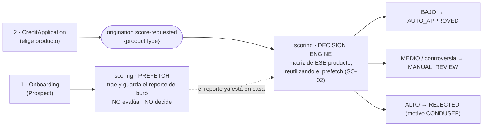
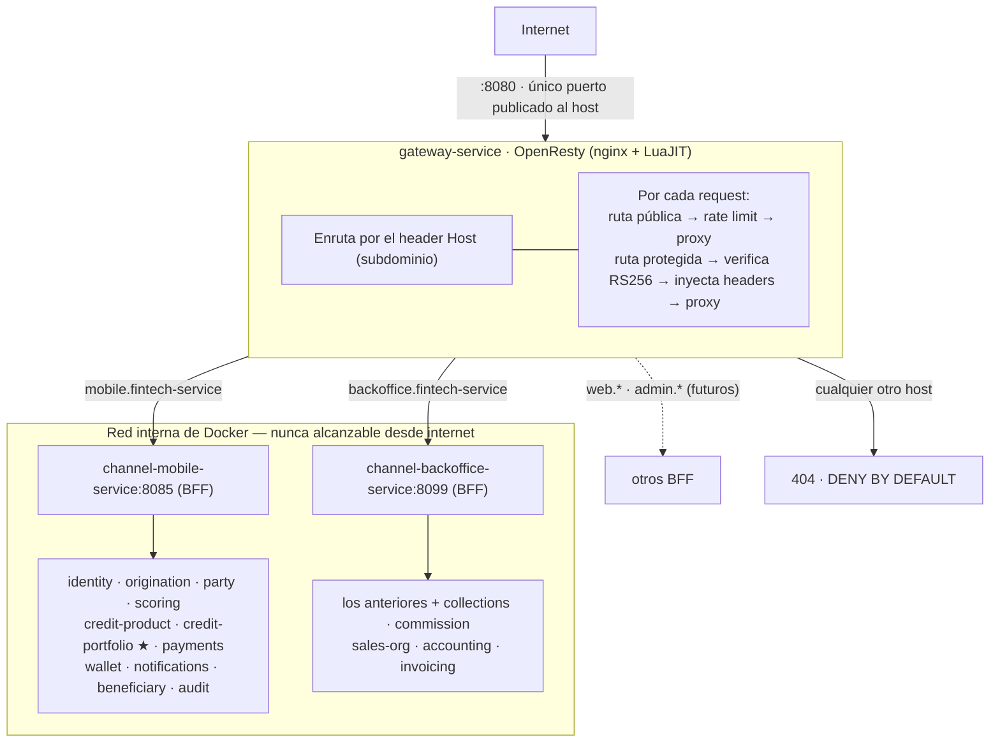
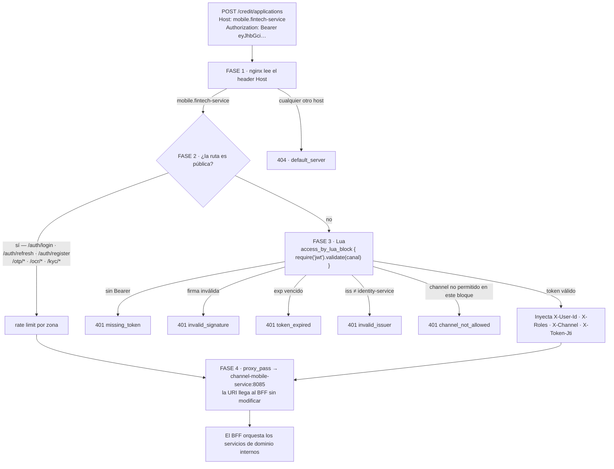
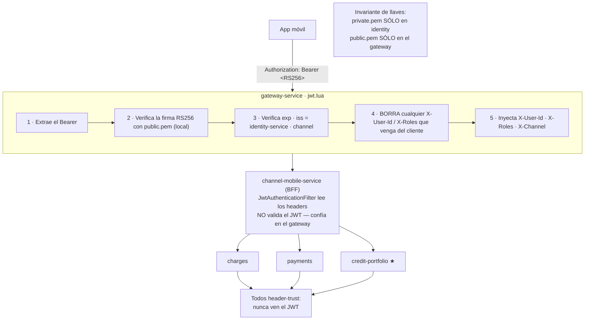
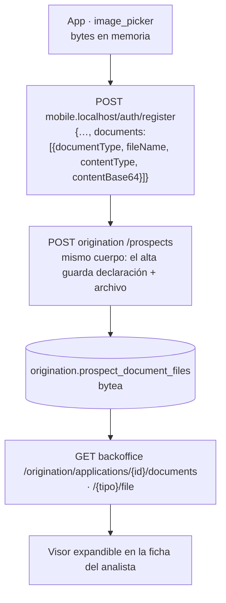
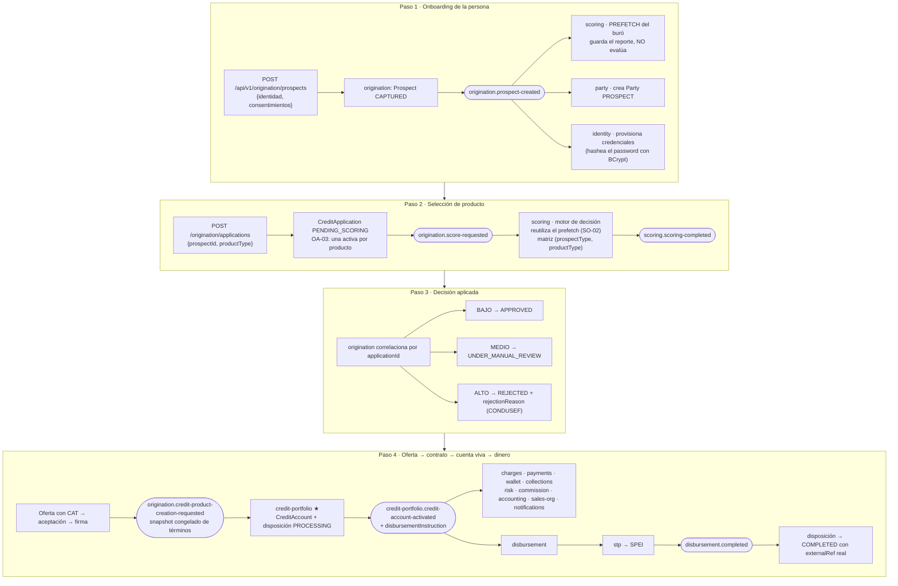
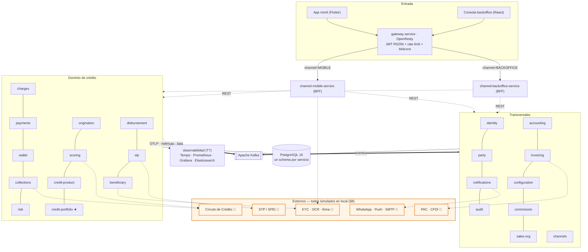
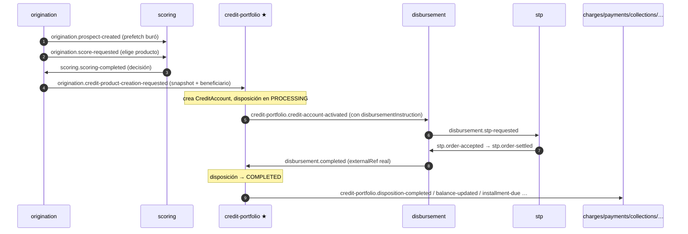
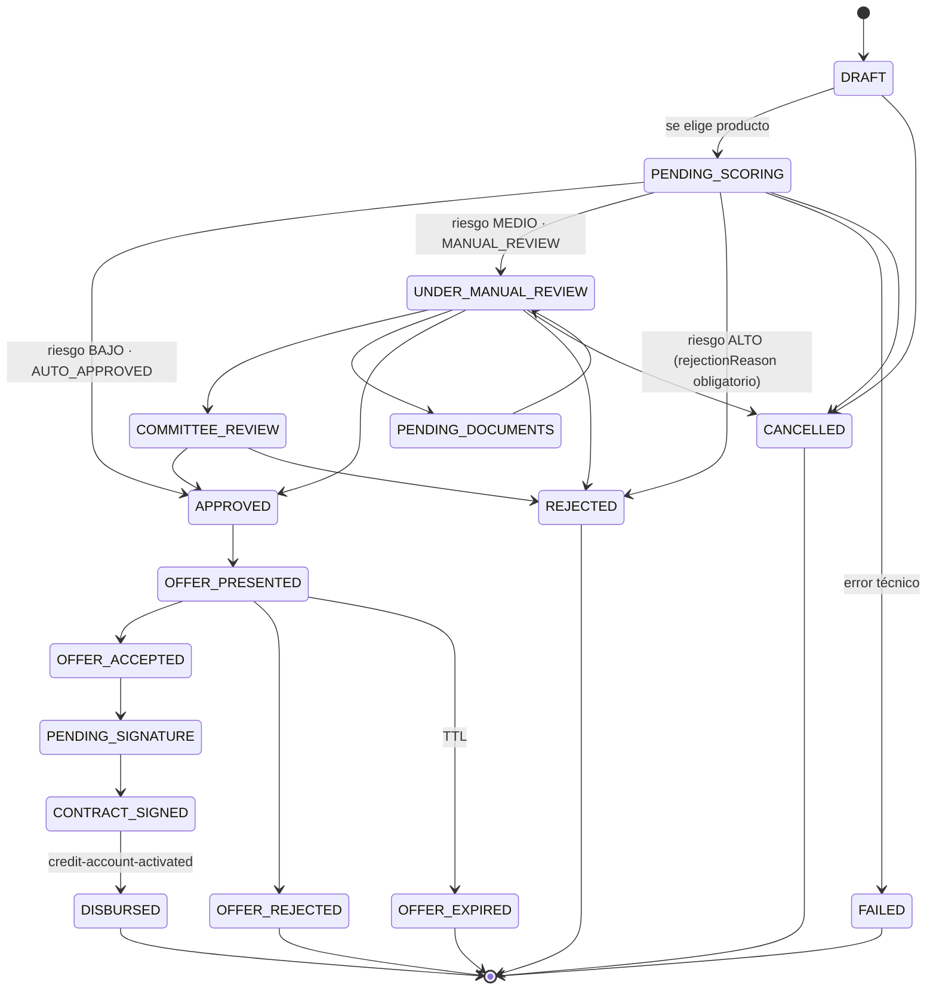

# fintech-services

Core crediticio **B2B2C** que gestiona el ciclo de vida completo del crédito: onboarding de la persona, evaluación de riesgo, selección de producto, originación, catálogo de productos, administración de la cuenta, devengamiento, pagos y cobranza.

**Arquitectura: microservicios totalmente desacoplados** en un monorepo. Cada servicio tiene su propio schema PostgreSQL aislado, su API REST y despliegue independiente; se comunican por Kafka (async) o REST (solo para validar token con identity).

Este README es el **documento único de arquitectura y proceso** (incluye la decisión de arquitectura y el flujo end-to-end). Las especificaciones profundas por dominio viven en [docs/dominios/](docs/dominios/); el checklist de avance en [docs/IMPLEMENTATION_TRACKER.md](docs/IMPLEMENTATION_TRACKER.md).

---

## Índice

1. [Decisión de arquitectura](#1-decisión-de-arquitectura)
2. [API Gateway — capa de entrada](#2-api-gateway--capa-de-entrada)
3. [Servicios (26 + gateway + observabilidad) — estado](#3-servicios-26--gateway--observabilidad--estado)
4. [El proceso de adquisición end-to-end](#4-el-proceso-de-adquisición-end-to-end)
5. [Comunicación entre servicios](#5-comunicación-entre-servicios)
6. [Máquina de estados — CreditApplication](#6-máquina-de-estados--creditapplication)
7. [Base de datos](#7-base-de-datos)
8. [Servicios externos y sus simuladores locales](#8-servicios-externos-y-sus-simuladores-locales)
9. [Estado de implementación](#9-estado-de-implementación)
10. [Tech stack](#10-tech-stack)
11. [Levantar localmente](#11-levantar-localmente)
12. [Tests](#12-tests)
13. [Estructura del monorepo](#13-estructura-del-monorepo)
14. [Convenciones](#14-convenciones)

---

## 1. Decisión de arquitectura

> Consolida la decisión de arquitectura del proyecto (microservicios desacoplados · split del core de crédito · re-orientación de originación). **Aceptada — 2026-06-04.**

### Contexto

El proyecto se concibió como **monolito modular** (Spring Modulith) pero evolucionó a **microservicios independientes**: cada dominio vive en su propio `*-service` con build, schema y despliegue propios. Al refinar el dominio de crédito surgieron dos conflaciones que esta arquitectura resuelve:

1. **Originación mezclaba persona y crédito** — el `Prospect` cargaba `productTypeIntent` y su creación disparaba el scoring (mezclaba "te conozco" con "evalúo si te presto para este producto").
2. **"Credit Product" mezclaba dos bounded contexts** — el *catálogo de productos* (configuración, casi estático) y el *motor de cuentas vivas / saldos* (operacional, alto volumen).

### Decisión 1 — Microservicios totalmente desacoplados

| Principio | Regla concreta |
|---|---|
| **Database-per-service** | Cada servicio dueño de su schema. Cero queries cross-schema, cero FK cross-context. Madurez física futura: instancia de BD por servicio. |
| **Async event-driven** | Kafka es la columna vertebral. La comunicación entre dominios es por eventos. Única excepción síncrona: validar token contra identity. |
| **Event-carried state transfer** | El evento lleva los datos que el consumidor necesita; no hay callback síncrono de vuelta. |
| **Read models locales** | Ningún servicio lee la BD de otro; cada uno proyecta lo que necesita desde los eventos ajenos. |
| **Snapshot inmutable al originar** | La cuenta congela los términos del producto al nacer; no depende del catálogo en runtime (inmutabilidad regulatoria). |
| **Solo se comparte el contrato de eventos** | El módulo `shared` aporta `DomainEvent` base + payloads. Nunca modelos de dominio compartidos. |
| **Coreografía, no orquestación central** | El flujo fluye por eventos encadenados; no hay un orquestador dios. |

**Límite de consistencia:** se desacopla *entre* contextos, **nunca *dentro*** de un límite de consistencia. El motor de saldos vive en un solo servicio (credit-portfolio), internamente modular con Spring Modulith.

### Decisión 2 — Originación: persona ≠ crédito

Dos agregados en un mismo bounded context (`origination-service`):

- **`Prospect` (subdominio application-intake)** — onboarding de **persona + identidad** + consentimientos (privacidad + Círculo/Buró). **No carga producto. No dispara la evaluación de scoring.**
- **`CreditApplication` (subdominio underwriting)** — el cliente ya onboardeado **elige qué producto quiere** (`productType`, monto, plazo). *Esto* dispara la decisión de scoring.

Una persona se onboardea **una vez** y puede crear **N** aplicaciones de crédito. La política de riesgo es **por producto** → sin producto seleccionado no hay matriz que aplicar.

**Split del trigger de scoring (prefetch ↔ evaluación):**


El prefetch (que solo necesita identidad) ocurre en onboarding; la evaluación se difiere a la aplicación.

### Decisión 3 — Split de "Credit Product" en dos servicios

| | **credit-product** (catálogo / fábrica) | **credit-portfolio** ★ (el corazón) |
|---|---|---|
| Responsabilidad | Define *qué productos existen* y *cómo se comportan* | Administra *cuentas de crédito vivas* |
| Naturaleza | Configuración — casi estático, lectura intensa | Operacional — escritura intensa, transaccional |
| Fuente de verdad de | Definiciones, rate cards, plazos, reglas por producto | **Todos los saldos** |
| Agregado raíz | `ProductDefinition` (capacidades, versionado) | `CreditAccount` (saldos, disposiciones, amortización) |
| Schema DB | `credit_product` | `credit_portfolio` |

El catálogo emite definiciones; al firmar contrato, Originación resuelve los términos contra el catálogo y los manda como **snapshot** en `CreditProductCreationRequested`; credit-portfolio crea la `CreditAccount` con esos términos **congelados** y nunca vuelve a llamar al catálogo en runtime.

> **Naming:** lo que antes se llamaba "CreditProduct = fuente de verdad de saldos / el corazón ★" es ahora **`credit-portfolio`** y su agregado **`CreditAccount`**. El nombre "credit-product" queda reservado para el **catálogo**.

### Qué cambió (resumen)

| Cambio | Detalle |
|---|---|
| ➕ **Nuevo:** `credit-portfolio` ★ | El corazón: cuentas vivas, motor de saldos, disposición, amortización, statements. |
| 🔄 **Redefinido:** `credit-product` | De "motor de cuenta" a **catálogo de productos** (definiciones + capacidades + rate cards + versionado). |
| 🔄 **Re-orientado:** `origination` | `Prospect` = onboarding puro; nuevo agregado `CreditApplication` = selección de producto + ciclo de decisión. |
| 🔄 **Re-orientado:** `scoring` | `prospect-created` se degrada a **solo prefetch**; nuevo trigger `score-requested` corre la evaluación y emite la decisión con `applicationId`. |
| 📝 **Narrativa** | de "monolito modular" → "microservicios desacoplados" (formaliza la realidad del repo). |
| ❌ **Eliminado** | nada — ningún servicio desaparece. |

Total: **15 → 16 servicios** (el split product/portfolio suma uno).

### Alternativas descartadas

| Alternativa | Por qué se descartó |
|---|---|
| Mantener "monolito modular" | El repo ya es microservicios; la narrativa estaba desalineada. |
| Catálogo dentro de configuration (T5) | T5 es key-value genérico; el catálogo es un dominio rico (capacidades, rate cards, versionado). |
| Mantener product+portfolio en un servicio | Acopla lectura intensa (catálogo) con escritura intensa (saldos); viola Single Responsibility. |
| Partir el balance-engine en varios servicios | Los saldos exigen consistencia fuerte; partir el límite de consistencia es un anti-patrón. |
| `CreditApplication` como servicio aparte | Mismo bounded context que el Prospect (lenguaje, políticas, expediente); separarlo sería un corte artificial. |

---

## 2. API Gateway — capa de entrada

El **gateway-service** es el único punto de entrada de la plataforma. Los microservicios no exponen puertos al host; solo el gateway lo hace (puerto `8080`).

### Modelo BFF — routing por subdominio

El tráfico externo nunca llega directamente a un domain service. Siempre pasa por un **BFF (Backend for Frontend)** que agrega lógica de presentación y orquesta las llamadas internas:



Los domain services son accesibles **solo internamente** — no tienen upstreams en nginx, no hay rutas `/api/v1/*` expuestas al exterior.

### Cómo pasa el tráfico (fases dentro del gateway)



### Tabla de routing

| Subdominio | BFF upstream | Estado |
|---|---|---|
| `mobile.fintech-service` | channel-mobile-service:8085 | ✅ activo |
| `backoffice.fintech-service` | channel-backoffice-service:8099 | ✅ activo — solo tokens con `channel=BACKOFFICE` |
| `web.fintech-service` | web-bff-service:808X | 🔜 futuro |
| `admin.fintech-service` | admin-bff-service:808X | 🔜 futuro |

Agregar un nuevo canal = un `server { server_name <subdomain>; }` en `nginx.conf`. Los domain services no requieren ningún cambio.

### Rutas del BFF móvil (`mobile.fintech-service`)

### Arquitectura de seguridad — modelo header-trust



**Invariante de seguridad:** solo `identity-service` tiene `private.pem`. Solo el gateway tiene `public.pem`. Los microservicios internos nunca ven el JWT — solo los headers firmados por el gateway.

**Logs de auditoría:** cada request genera una línea JSON con `request_id`, `source_ip`, `user_id`, `auth_required`, `user_agent`, `bytes_sent`. Ver [services/gateway-service/README.md](services/gateway-service/README.md#logs-de-auditoría).

**Públicas — rate limit, sin JWT:**

| Método | Path | Rate | Burst |
|---|---|---|---|
| `POST` | `/auth/login` | 5/min | 2 |
| `POST` | `/auth/refresh` | 10/min | 5 |
| `POST` | `/auth/register` | 3/min | 1 |
| `POST` | `/otp/send` | 3/min | 1 |
| `POST` | `/otp/verify` | 10/min | 3 |
| `POST` | `/otp/resend` | 3/min | 1 |

**Protegidas — JWT RS256 requerido:**
`/auth/logout`, `/ocr/extract`, `/kyc/submit`, `/credit/products`, `/credit/applications`, `/credit/applications/{id}`

Al exceder el rate limit: `429 Too Many Requests` + `Retry-After: 60`.

### Formato requerido del token JWT

El gateway **valida localmente** con la llave pública RSA. El token debe cumplir:

| Campo | Valor requerido | Error si falla |
|---|---|---|
| Algoritmo (`alg`) | `RS256` | `invalid_signature` |
| `iss` | `"identity-service"` | `invalid_issuer` |
| `exp` | timestamp futuro | `token_expired` |
| `sub` | UUID del party | — (propagado como `X-User-Id`) |

```json
{
  "alg": "RS256",
  "typ": "JWT"
}
{
  "sub":   "00000000-0000-0000-0000-000000000001",
  "iss":   "identity-service",
  "exp":   1750000000,
  "iat":   1749996400,
  "jti":   "a1b2c3d4-e5f6-7890-abcd-ef1234567890",
  "roles": ["CUSTOMER"]
}
```

> **Estado actual (2026-06-29):** identity-service emite RS256 ✅. Gateway valida localmente. Login operativo end-to-end.

Doc completa: [services/gateway-service/README.md](services/gateway-service/README.md)

---

## 3. Servicios (26 + gateway + observabilidad) — estado

> **Puertos:** en Docker **todos los servicios de dominio corren en `:8080` internos** y se direccionan por nombre (`http://<servicio>:8080`); sólo el gateway (`:8080→host`), `channel-mobile` (`:8085`) y `channel-backoffice` (`:8099`) difieren. Los puertos distintos (8081–8101) de la columna son los **defaults de `bootRun`** para desarrollo local sin Docker.

| # | Servicio | Puerto (bootRun) | Schema | Estado | Doc |
|---|---|---|---|---|---|
| GW | **gateway-service** | **:80 → host :8080** | — | ✅ | [README](services/gateway-service/README.md) — OpenResty JWT RS256 + rate limit + audit log |
| — | shared | — | — | ✅ | [shared/](shared/) — `DomainEvent`, `DomainException`, handler RFC 7807 |
| T1 | identity-service | 8080 | `identity` | ✅ | [README](services/identity-service/README.md) — auth, JWT RS256 (PKCS#8), credenciales |
| T3 | **audit-service** | 8090 | `audit` | ✅ | [README](services/audit-service/README.md) — suscriptor global Kafka, log regulatorio append-only, CNBV/CONDUSEF/UIF |
| T5 | configuration-service | 8080 | `configuration` | ✅ | [README](services/configuration-service/README.md) — parámetros maker-checker |
| D1 | channel-mobile-service | **8085** | — (Redis) | 🔄 | [README](services/channel-mobile-service/README.md) — BFF móvil (OTP/OCR/KYC) |
| BO | **channel-backoffice-service** | **8099** | — (Redis) | 🔄 | [README](services/channel-backoffice-service/README.md) — BFF de la consola operativa — exige `channel=BACKOFFICE`. Sesión de staff, personal, **cartera con plan de pagos**, **tablero**, **bandeja y mesa de análisis**, estructura comercial, permisos y auditoría |
| D1b | channels-service | 8091 | `channels` | ✅ | [README](services/channels-service/README.md) — captura de intención/lead; emite `channels.application-started` |
| D2 | scoring-service | 8082 | `scoring` | ✅ | [README](services/scoring-service/README.md) — prefetch buró + motor de decisión + políticas de riesgo |
| D3 | origination-service | 8081 | `origination` | ✅ | [README](services/origination-service/README.md) — onboarding + credit application + oferta/contrato/firma |
| D0 | party-service | 8083 | `party` | ✅ | [README](services/party-service/README.md) — sujeto del crédito + roles (I-03) |
| D4 | credit-product-service | 8084 | `credit_product` | ✅ | [README](services/credit-product-service/README.md) — catálogo de productos + versionado |
| D4★ | **credit-portfolio-service** | 8087 | `credit_portfolio` | ✅ | [README](services/credit-portfolio-service/README.md) — el **corazón** — cuentas vivas, motor de saldos, disposiciones, amortización ([dominio](docs/dominios/04b_credit_portfolio_domain.md)) |
| D5 | charges-service | 8088 | `charges` | ✅ | [README](services/charges-service/README.md) — devengamiento; header-trust auth |
| D6 | payments-service | 8089 | `payments` | ✅ | [README](services/payments-service/README.md) — pagos, reversas, sobrepago; header-trust auth |
| D7 | wallet-service | 8092 | `wallet` | ✅ | [README](services/wallet-service/README.md) — proyección de saldo + disposiciones (SELF_USE / THIRD_PARTY) |
| D8 | collections-service | 8093 | `collections` | ✅ | [README](services/collections-service/README.md) — cobranza, mora, convenios y quebranto |
| D9 | risk-service | 8094 | `risk` | ✅ | [README](services/risk-service/README.md) — perfil de riesgo IFRS-9 por cuenta; consume actividad de cartera |
| D10 | **sales-org-service** | 8100 | `sales_org` | ✅ | [README](services/sales-org-service/README.md) — estructura comercial: niveles configurables (NACIONAL→…→DISTRIBUIDOR) y alcance por subárbol LTREE |
| D13 | **beneficiary-service** | 8102 | `beneficiary` | 🔄 | [README](services/beneficiary-service/README.md) — colocación B2B2C: agregado `Placement` (11 estados, 16 aristas), liga de KYC, buró **sin filtrar por score** y disposición THIRD_PARTY_CREDIT. Mesa de KYC con **dictamen manual de identidad** y bandera `MANUAL`/`AUTOMATIC` que degrada a revisión humana si el proveedor falla. **Falta la evidencia que mirar** (OCR, prueba de vida, RENAPO) ([dominio](docs/dominios/13_beneficiary_domain.md) · [plan](docs/BENEFICIARY_SERVICE_PLAN.md)) |
| D11 | **disbursement-service** | 8080/8100 | `disbursement` | ✅ | [README](services/disbursement-service/README.md) — payouts multi-rail y multi-empresa; **interno, no publicado en el gateway**; backoff+DLT ([dominio](docs/dominios/10_disbursement_domain.md)) |
| D12 | **stp-service** | 8101 | `stp` | ✅ | [README](services/stp-service/README.md) — conector SPEI: cadena original, firma, poller de conciliación; **sin internet, sin webhooks**; backoff+DLT ([dominio](docs/dominios/11_stp_connector_domain.md)) |
| D14 | **closing-service** | 8103 | `closing` | ✅ | [README](services/closing-service/README.md) — motor de **cierres y cortes**: seis fases por cuenta, reparto entre pods con candado Redis y **sello** del día. Saca el barrido nocturno del pool de cartera ([dominio](docs/dominios/14_closing_domain.md)) |
| D15 | **banking-service** | 8104 | `banking` | 🔄 | [README](services/banking-service/README.md) — **tesorería**: cuentas propias, **de cuál sale cada pago**, conciliación bancaria y la cadena del dinero consultable en ambos sentidos. No conoce el dominio de crédito ([dominio](docs/dominios/15_banking_domain.md)) |
| T2 | notifications-service | 8098 | `notifications` | ✅ | [README](services/notifications-service/README.md) — comunicaciones multicanal disparadas por eventos (sin `@Scheduled` que revise cuentas) |
| T4 | accounting-service | 8095 | `accounting` | ✅ | [README](services/accounting-service/README.md) — libro mayor / partida doble; consume balance, comisión, riesgo, wallet |
| T4b | invoicing-service | 8096 | `invoicing` | ✅ | [README](services/invoicing-service/README.md) — facturación (CFDI); consume `accounting.invoice-requested` y `party.fiscal-profile-updated` |
| T6 | commission-service | 8097 | `commission` | ✅ | [README](services/commission-service/README.md) — comisiones de red comercial (devengo/liquidación/reversa) |

| T7 | observability-service | — | — | ✅ | [README](services/observability-service/README.md) — stack OTel: Collector, Tempo (trazas), Prometheus (métricas), Grafana, Fluent-bit + Elasticsearch (logs) |

**Leyenda:** ⬜ Pendiente · 🔄 En progreso · ✅ Completo · 🔒 Bloqueado. 🧪 marca, en los README
de cada servicio, los adaptadores simulados — el inventario completo está en
[§8](#8-servicios-externos-y-sus-simuladores-locales). Solo el gateway expone `:8080` al host (`GATEWAY_PORT` lo cambia; donde el 8080 esté ocupado se usa `:8090`). En Docker el resto corre en `:8080` interno (salvo `channel-mobile:8085` y `channel-backoffice:8099`) y se direcciona por nombre de servicio.

### Quién sirve a cada consumidor

Los dos canales entran por el gateway y **nunca** llaman a un servicio de dominio
directo. El gateway inyecta `X-User-Id`, `X-Roles` y `X-Channel`; los BFF los
reenvían y el dominio confía en esa decisión.

| Consumidor | BFF | Qué compone |
|---|---|---|
| App móvil (Flutter) | channel-mobile-service | alta y KYC, precalificación, solicitud, oferta, contrato y firma, cuenta con **avance del plan de pagos**, pagos, avisos |
| Consola de backoffice (React) | channel-backoffice-service | sesión de staff, bandeja y **mesa de análisis**, cartera y seguimiento periodo a periodo, tablero, estructura comercial, permisos, auditoría |

### Endpoints de soporte (dev-only)

Tres servicios exponen `/internal/test-support/*` para hacer alcanzables estados
que de otro modo exigen esperar días o adivinar reglas. Van apagados salvo que
el entorno los encienda (`TEST_SUPPORT_ENABLED=true`), y el gateway no enruta
`/internal/*` — no son alcanzables desde fuera.

| Servicio | Para qué |
|---|---|
| charges-service | correr el devengo diario |
| credit-portfolio-service | disparar el corte, marcar vencidas, recalcular mora, mover la fecha de una mensualidad |
| origination-service | llevar una solicitud a revisión manual o a comité sin depender del score |

### El expediente: de la cámara al analista

Las fotos que la app capturaba se quedaban en el teléfono. `prospect_documents`
guardaba una *referencia* a un archivo que no existía en ningún lado, así que la
ficha de análisis decía «INE_FRONT · CAPTURED» y no había nada que abrir.

El camino completo hoy:



Los archivos viajan **dentro del alta** y no en llamadas sueltas después. Es el
único momento en que existen a la vez las dos cosas que hacen falta: los
archivos, que hasta entonces sólo vivían en el teléfono, y la autorización para
asociarlos —el alta de prospecto es pública porque cualquiera puede darse de
alta—. Subirlos aparte obligaría a abrir un endpoint público que acepta el UUID
de un prospecto ajeno. Para completar o reemplazar un documento después existe
`PUT mobile/kyc/documents/{tipo}`, que resuelve el prospecto **desde la sesión**
y no lo recibe por parámetro.

Un documento que no entra no tumba el alta: queda pendiente, que es un estado
que el dominio ya sabe manejar (`PENDING_DOCUMENTS`).

### Scripts de siembra (`scripts/`)

Un backoffice contra una base vacía no se puede ni revisar: el árbol comercial
tenía una sola unidad, el expediente no tenía archivos y el alcance por unidad
no se podía probar porque todo el personal era transversal. Estos scripts
llenan esos huecos. Son **idempotentes** y hablan por el gateway, igual que la
consola: si un endpoint no acepta lo que le mandan aquí, tampoco lo aceptará
desde la UI.

| Script | Qué siembra |
|---|---|
| `seed-sales-org.py` | La jerarquía comercial completa: 4 regiones, 8 zonas, 22 sucursales y 52 ejecutivos, cada uno con su empleado y su asignación |
| `seed-commercial-staff.py` | Un responsable por nivel (`nacional@`, `region@`, `zona@`, `sucursal@`, `ejecutivo.cul@`) para **validar el alcance entrando con cada uno**: ve 57, 19, 10, 4 y 2 personas respectivamente |
| `seed-demo-staff.py` | Los cuatro puestos **funcionales** del acceso rápido de la consola (`analista@`, `ejecutivo@`, `comite@`, `producto@`). Sin ellos la mitad de los botones daba 401 y sólo entraba el admin — y con puros roles comerciales la matriz de capacidades no se puede ejercitar: el analista estudia pero no decide, el comité decide, el product manager toca el catálogo y nadie más |
| `seed-expedientes.py` | Documentos del expediente —INE, comprobantes— de prospectos que ya tienen solicitud |
| `seed-portfolio.py` | **Clientes, solicitudes y cartera** recorriendo el journey real: OTP → KYC → alta con expediente → solicitud → scoring → oferta → contrato → firma. Reparte los clientes entre los 52 ejecutivos, deja solicitudes vivas en cada estado y atrasa una parte de la cartera para que existan los tres tramos de IFRS-9 |
| `verifica-identidad-auditoria.py` | **Comprueba la bitácora**: que un rol no-ADMIN deje nombre, CURP y correo; que abrir un expediente registre sobre *quién* se actuó; que el canal móvil se identifique y se atribuya a sí mismo; y que con identity-service caído la consola siga navegando y la entrada se escriba igual |
| `_identidad.py` | CURP de demostración, derivada del correo para que los seeds sigan siendo idempotentes. No es un seed: lo importan los dos anteriores |

```bash
python3 scripts/seed-sales-org.py
python3 scripts/seed-commercial-staff.py   # todo el personal sembrado: Backoffice#2026
python3 scripts/seed-demo-staff.py
python3 scripts/seed-expedientes.py --limit 12
python3 scripts/seed-portfolio.py --clientes 45     # ~15 min: es el journey completo
python3 scripts/verifica-identidad-auditoria.py   # tumba identity un momento: ver --sin-corte-de-identity
```

`seed-portfolio.py` **no inserta filas**: cada cliente entra por el canal móvil
como lo haría desde el teléfono, así que lo que no acepte un endpoint aquí
tampoco lo aceptaría la app. Tres cosas que aprendió a hacer bien y conviene
saber al leerlo:

- **Respeta el rate limit** en vez de pedir que lo aflojen. El gateway limita
  alta, OTP y KYC a ráfaga de uno —son endpoints que en producción recibe una
  persona con un teléfono, no un script abriendo cuarenta cuentas—; el que cede
  es el script, con reintento y espera creciente.
- **Lee el catálogo** para los montos y plazos. Escribirlos a mano generaba
  solicitudes fuera de los límites del producto y el rechazo llegaba tres pasos
  después, al presentar la oferta.
- **Manda solicitudes a la mesa** por la red de Docker, no por el gateway:
  `/internal/*` no se enruta desde fuera. Llamarlo por el gateway devolvía 404 en
  silencio y la bandeja se quedaba sin un solo caso «por decidir».

---

## 4. El proceso de adquisición end-to-end



Este paso está **implementado** end-to-end (originación → cartera → desembolso → STP → cierre de ciclo). Ver §5.2 para el diagrama de secuencia.

### Responsabilidad por servicio en el proceso

| Servicio | Rol | Estado |
|---|---|---|
| **origination** | Onboarding (`Prospect`) + selección de producto (`CreditApplication`) + aplica la decisión | ✅ Fases A–D |
| **scoring** | Prefetch del buró (onboarding) + motor de decisión (al elegir producto) | ✅ re-orientado |
| **party** | Crea el `Party` (PROSPECT) desde el onboarding | 🔄 |
| **identity** | Provisiona credenciales (hashea el password con BCrypt) | ✅ |
| **credit-product** | Catálogo de definiciones de producto (consultado por la oferta) | ✅ catálogo |
| **credit-portfolio** ★ | Cuenta viva / motor de saldos (Paso 4) | ✅ |
| **disbursement + stp** | Payout del desembolso vía SPEI y cierre del ciclo | ✅ |

---

## 5. Comunicación entre servicios

Dos mecanismos, con una regla clara de cuándo usar cada uno:

- **Kafka (asíncrono)** — la **columna vertebral**. Todo cruce de dominio es un evento (hecho, no comando). *Event-carried state transfer*: el evento lleva lo que el consumidor necesita, sin callback de vuelta.
- **REST (síncrono)** — sólo dos casos legítimos: (1) el gateway y cada servicio validan el JWT/headers **localmente** (identity firma; nadie llama a identity por request); (2) los **BFF** (`channel-*`) componen pantallas llamando a los servicios de dominio, reenviando la identidad (`X-User-Id`/`X-Roles`/`X-Channel`). Un servicio de dominio **nunca** llama a otro por REST para leer su estado — proyecta lo que necesita desde los eventos.

### 5.1 Diagrama de contexto



### 5.2 Flujo del ciclo de crédito (camino feliz)



### 5.3 Catálogo de eventos Kafka (productor → consumidores verificados)

Consumidores tomados de los `@KafkaListener` reales del código; los tópicos sin consumidor hoy se listan aparte.

| Tópico | Productor | Consumidores |
|---|---|---|
| `channels.application-started` | channels | origination |
| `origination.prospect-created` | origination | scoring, party, identity, notifications, audit |
| `origination.score-requested` | origination | scoring, audit |
| `origination.offer-presented` | origination | notifications |
| `origination.contract-signed` | origination | audit |
| `origination.credit-product-creation-requested` | origination | credit-portfolio |
| `origination.application-approved` / `application-rejected` / `documents-requested` | origination | audit |
| `beneficiary.placement-invited` · `.kyc-started` · `.kyc-completed` · `.bureau-consent-granted` · `.bureau-ready` · `.placement-approved` · `.placement-rejected` · `.placement-disbursing` · `.placement-disbursed` · `.placement-paid-off` · `.placement-expired` · `.placement-cancelled` · `.placement-failed` | beneficiary | *ninguno* — audit **no** los suscribe todavía (ver [audit §2](services/audit-service/README.md#2-tópicos-consumidos-20)) |
| `notifications.notification-requested` | **cualquier servicio** (hoy **ninguno** lo publica) | notifications |
| `scoring.scoring-completed` | scoring | origination, audit |
| `scoring.scoring-approved` | scoring | audit |
| `product-catalog.product-activated` / `product-retired` | credit-product | credit-portfolio, audit |
| `credit-portfolio.credit-account-activated` | credit-portfolio | accounting, audit, charges, collections, commission, notifications, origination, payments, risk, sales-org, wallet, **disbursement** (vía `disbursementInstruction`) |
| `credit-portfolio.balance-updated` | credit-portfolio | accounting, audit, charges, collections, commission, notifications, payments, risk, wallet |
| `credit-portfolio.delinquency-status-updated` | credit-portfolio | collections, risk |
| `credit-portfolio.installment-due` | credit-portfolio | notifications, wallet |
| `credit-portfolio.installment-upcoming` | credit-portfolio | collections |
| `credit-portfolio.disposition-completed` | credit-portfolio | beneficiary, notifications, wallet |
| `credit-portfolio.disposition-rejected` | credit-portfolio | *ninguno* — wallet lo maneja hoy por `balance-updated` |
| `credit-portfolio.payment-rejected` | credit-portfolio | payments, audit |
| `credit-portfolio.charge-rejected` | credit-portfolio | charges, audit |
| `charges.charge-applied` / `charge-reversed` | charges | credit-portfolio, audit |
| `payments.payment-applied` | payments | credit-portfolio, collections, notifications, audit |
| `payments.payment-returned` | payments | credit-portfolio, audit |
| `collections.agreement-executed` | collections | credit-portfolio, risk |
| `collections.write-off-executed` | collections | credit-portfolio |
| `collections.pre-due-reminder-triggered` | collections | notifications |
| `collections.recovery-payment-applied` | collections | accounting |
| `collections.dunning-requested` | collections | notifications |
| `collections.payment-thanks` | collections | notifications |
| `notifications.notification-sent` | notifications | collections |
| `notifications.notification-failed` | notifications | collections |
| `commission.commission-accrued` / `commission-liquidated` / `commission-reversed` | commission | accounting |
| `risk.assessment-updated` | risk | accounting |
| `wallet.disposition-requested` | wallet | credit-portfolio |
| `wallet.withdrawal-completed` | wallet | accounting, disbursement |
| `party.fiscal-profile-updated` | party | invoicing |
| `accounting.invoice-requested` | accounting | invoicing |
| `identity.login-attempted` | identity | audit |
| `configuration.configuration-updated` | configuration | audit (+ invalidación de caché en suscriptores) |
| `disbursement.stp-requested` | disbursement | stp |
| `disbursement.completed` / `disbursement.failed` | disbursement | credit-portfolio |
| `stp.order-accepted` / `order-settled` / `order-rejected` / `order-returned` | stp | disbursement |

**Emitidos sin consumidor en el código actual** (traza de auditoría, analítica o pendientes de cablear): `channels.{intent-captured,intent-routed,intent-abandoned,lead-created,lead-converted,session-started,session-expired}`, `collections.{case-created,case-escalated,contact-attempt-registered,payment-promise-made,payment-promise-broken,agreement-proposed,bureau-report-submitted,write-off-requested}`, `party.{party-blacklisted,role-granted,role-revoked}`, `wallet.{payment-instruction-created,snapshot-updated}`, `accounting.{journal-entry-created,reconciliation-alert}`, `invoicing.invoice-generated`, `disbursement.{accepted,returned}`, `credit-portfolio.disposition-rejected`, **los 13 de `beneficiary.*`**.

> `notifications.{notification-sent,notification-failed}` salieron de esta lista: collections los
> consume para dejar en el expediente del caso constancia de cada mensaje que se envió. Es lo que
> hace que la bitácora de gestión incluya lo automático y no sólo lo que un agente capturó a mano.

> **Cerrado (BK-14).** `credit-portfolio.disposition-authorized` ya tiene emisor: cartera lo publica al autorizar la disposición y `disbursement` lo consume. Antes el hecho se escuchaba sin que nadie lo emitiera, y el pago lo simulaba un stub que devolvía `SPEI-STUB-…` — con lo que contabilidad asentaba una salida de caja de dinero que nunca salió.

### 5.4 Política de reintentos y DLT (Kafka)

Dos regímenes, deliberados:

| Régimen | Aplica a | Comportamiento |
|---|---|---|
| **Por defecto de la plataforma** | Todos los servicios **salvo** disbursement y stp | Usan el `DefaultErrorHandler` de Spring Kafka: reintento inmediato acotado y, agotado, se registra y se hace *seek-past* (commit del offset). **No hay DLT.** Suficiente para consumidores idempotentes cuyo fallo es transitorio. |
| **Backoff exponencial + DLT** | **disbursement-service**, **stp-service** | Mueven dinero: cada mensaje que no se puede procesar es un pago en riesgo y **debe** quedar visible, no perderse. |

Detalle del régimen con DLT (idéntico en ambos, `KafkaConfig`):

- **Backoff exponencial no bloqueante**: `initialInterval=1s`, `multiplier=2.0`, `maxInterval=30s`, **`maxElapsedTime=15s`** → ~4 intentos (1s, 2s, 4s, 8s) antes de rendirse.
- **Dead-Letter Topic**: al agotar, el `DeadLetterPublishingRecoverer` publica a **`<topic>.dlt`** (misma partición) para inspección operativa.
- **Errores deterministas van directo al DLT, sin gastar reintentos** (`addNotRetryableExceptions`): p.ej. empresa sin mapeo (`UnresolvedCompanyException`), CLABE inválida (`InvalidBeneficiaryAccountException`), orden inexistente. Reintentar un error determinista sólo retrasa el diagnóstico.
- **Idempotencia** aguas abajo: la clave `(sourceSystem, sourceType, sourceEventId)` es única; un evento reentregado se detecta y se ignora.

Deserialización tolerante en todos los consumidores: `JsonDeserializer` con `USE_TYPE_INFO_HEADERS=false` (cada consumidor fija el tipo local, así un cambio de paquete del emisor no rompe al consumidor) y `TRUSTED_PACKAGES=com.fintech.*`.

---

## 6. Máquina de estados — CreditApplication



> `APPROVED` **no** es terminal: el flujo sigue a oferta, contrato y desembolso. Los terminales son
> `DISBURSED`, `REJECTED`, `OFFER_REJECTED`, `OFFER_EXPIRED`, `FAILED` y `CANCELLED`.

Invariantes vivas: **OA-01** (estado terminal inmutable) · **OA-03** (una sola aplicación activa por `prospectId+productType`, índice único parcial) · **UW-05** (REJECTED exige motivo, CONDUSEF).

---

## 7. Base de datos

Cada servicio es dueño de su schema PostgreSQL en la misma instancia. **Sin joins cross-schema ni FK cross-context** — las referencias entre servicios son por UUID. Liquibase gestiona las migraciones por servicio (master YAML + SQL; nunca XML).

---

## 8. Servicios externos y sus simuladores locales

La plataforma toca **nueve integraciones externas**. Ninguna está conectada de verdad en local: cada
una tiene un puerto de salida con un adaptador simulado detrás, y por eso el ciclo completo
—alta, buró, aprobación, contrato, desembolso SPEI, conciliación, factura, aviso— corre en una
laptop **sin internet y sin credenciales de nadie**.

```mermaid
flowchart TB
    subgraph plat["Plataforma"]
        SCO["scoring"]
        COL["collections"]
        STP["stp"]
        CP["credit-portfolio ★"]
        WAL["wallet"]
        INV["invoicing"]
        NOT["notifications"]
        IDN["identity"]
        BEN["beneficiary"]
        CM["channel-mobile"]
        ORI["origination"]
    end

    SCO --> P1{{"CirculoGateway"}}
    COL --> P2{{"BureauReportingPort"}}
    STP --> P3{{"StpGatewayPort"}}
    CP  --> P4{{"SpeiDispatchPort"}}
    WAL --> P5{{"WalletDispatchPort"}}
    INV --> P6{{"PacStampingPort"}}
    NOT --> P7{{"Email · WhatsApp · Push"}}
    IDN --> P8{{"GeoLocationPort"}}
    BEN --> P9{{"Verificación de identidad"}}
    CM  --> P10{{"OCR · SMS del OTP"}}
    ORI --> P11{{"Firma · CLABE"}}

    P1 --> M1["MockCirculoAdapter 🧪"]
    P2 --> M2["NoopBureauReportingAdapter 🧪"]
    P3 --> M3["StubStpGateway 🧪"]
    P4 --> M4["NoopSpeiDispatchAdapter 🧪"]
    P5 --> M5["NoopWalletDispatchAdapter 🧪"]
    P6 --> M6["NoopPacAdapter 🧪"]
    P7 --> M7["NoopEmail · NoopWhatsApp · NoopPush 🧪<br/>(SmtpEmailAdapter es real, opt-in)"]
    P8 --> M8["StubGeoLocationAdapter 🧪"]
    P9 --> M9["modo MANUAL — no llama a nadie"]
    P10 --> M10["Stub OCR · OTP fijo 🧪"]
    P11 --> M11["NoopSignatureValidator · NoopClabeValidator 🧪"]

    classDef mock fill:#fff4e5,stroke:#d98324,stroke-width:2px;
    class M1,M2,M3,M4,M5,M6,M7,M8,M9,M10,M11 mock
```



### El inventario completo

| # | Externo real | Servicio | Puerto de salida | Adaptador local | Cómo se enciende el simulador |
|---|---|---|---|---|---|
| 1 | **Círculo de Crédito** — consulta (`POST /v2/rccficoscore`) | scoring | `CirculoGateway` | `MockCirculoAdapter` | `SCORING_CIRCULO_MOCK_ENABLED=true` (así está en `docker-compose.yml`) |
| 2 | **Círculo de Crédito** — reporte de cartera | collections | `BureauReportingPort` | `NoopBureauReportingAdapter` | Siempre — no hay adaptador real todavía |
| 3 | **STP / SPEI** — registro y conciliación | stp | `StpGatewayPort` | `StubStpGateway` | `STP_GATEWAY_MODE=stub` (default) |
| 4 | **SPEI / BANXICO** — camino heredado del desembolso | credit-portfolio | `SpeiDispatchPort` | `NoopSpeiDispatchAdapter` | Siempre |
| 5 | **SPEI / CoDi** — retiro de saldo a favor | wallet | `WalletDispatchPort` | `NoopWalletDispatchAdapter` | Siempre |
| 6 | **PAC** — timbrado CFDI ante el SAT | invoicing | `PacStampingPort` | `NoopPacAdapter` | Siempre |
| 7 | **WhatsApp Cloud API · FCM/APNs · SMTP** | notifications | `WhatsAppAdapter` · `PushAdapter` · `EmailAdapter` | `NoopWhatsAppAdapter` · `NoopPushAdapter` · `NoopEmailAdapter` | Noop por default; **el correo sí tiene adaptador real**: `fintech.notifications.email.smtp-enabled=true` + credenciales `SMTP_*` |
| 8 | **Geolocalización por IP** (MaxMind, IPinfo…) | identity | `GeoLocationPort` | `StubGeoLocationAdapter` | Siempre — devuelve `unknown` |
| 9 | **Proveedor de KYC / biometría** | beneficiary · channel-mobile | *(sin puerto todavía)* | Modo `MANUAL` + `KycSimulationController` + stub de OCR | `fintech.beneficiary.identity-verification.mode=MANUAL` · `BENEFICIARY_KYC_SIMULATION_ENABLED=true` |
| 10 | **Proveedor de firma** (NIP, biometría, e.firma) | origination | `SignatureValidator` | `NoopSignatureValidator` | Siempre — aprueba todo |
| 11 | **Validación de CLABE** (SPEI) | origination | `ClabeValidator` | `NoopClabeValidator` | Siempre — sólo valida los 18 dígitos |
| 12 | **Pasarela de SMS** (código OTP) | channel-mobile | `OtpService` | Código fijo de desarrollo | `OTP_CODE_VALIDATION=false` + `OTP_DEV_CODE` |

### El único simulador que no miente

Los `Noop*` devuelven éxito y ya. **`StubStpGateway` no**: devuelve lo que se le envió, más lo único
que sólo el banco puede saber (`estado`, `tsLiquidacion`, `urlCEP`, `nombreCep`, `sello`), y **firma
de verdad** con su propio par de llaves. Así la orden saliente ejercita `CadenaOriginalBuilder`
completo y la observación entrante ejercita la verificación del sello: si alguien rompe la firma,
revienta en local y no en producción. Tiene **once escenarios deterministas por los centavos del
monto** (`.00` liquida, `.02` rechazo PLD, `.06` nunca aparece, `.08` sello alterado…). Detalle en
[stp-service](services/stp-service/README.md#stub-para-ambientes-bajos).

### Las guardas que impiden que un simulador llegue a producción

| Guarda | Dónde | Qué hace |
|---|---|---|
| **Lista blanca de perfiles** | `StubStpGateway` | Sólo arranca con `local`, `dev`, `test`, `ci`, `docker`, `qa`, `staging`. Cualquier otro perfil —o ninguno— **impide el arranque**. Es lista blanca y no lista negra a propósito: el compose de este repo levanta con perfil `docker`, así que una lista negra de «prod» no habría protegido de promover ese mismo compose |
| **`@ConditionalOnProperty`** | `MockCirculoAdapter`, `NoopEmailAdapter`/`SmtpEmailAdapter` | El bean simplemente no existe si la bandera no está puesta |
| **`WARN` en cada llamada** | `MockCirculoAdapter`, `NoopPacAdapter`, `NoopSpeiDispatchAdapter`… | Ningún log queda limpio mientras haya un simulador activo |
| **Bandera de simulación de KYC** | `KycSimulationController` | Responde error explícito cuando `BENEFICIARY_KYC_SIMULATION_ENABLED=false` |
| **`TEST_SUPPORT_ENABLED`** | charges · credit-portfolio · origination · risk | Los `/internal/test-support/*` van apagados por default, y **el gateway no enruta `/internal/*`** |

> **Un stub de pagos silenciosamente activo en producción es la peor clase de incidente:** todo se ve
> verde y no sale un peso. Por eso la protección es de arranque y no de configuración.

### Simuladores en pruebas, que son otra cosa

`CirculoCreditoAdapterIT` usa **WireMock** para probar el adaptador **real** de buró contra
respuestas HTTP controladas (`SUCCESS`, `204` → `NO_HIT`, `500` → `ERROR`, conexión rechazada). Es
complementario al `MockCirculoAdapter`, que sustituye el adaptador entero en runtime: uno prueba el
código que hablará con el buró, el otro permite correr el journey sin él.

---

## 9. Estado de implementación

> El checklist vivo está en [docs/IMPLEMENTATION_TRACKER.md](docs/IMPLEMENTATION_TRACKER.md), que
> se actualiza por entregable. Esta sección resume **dónde está el proyecto**, no su historia.

### El ciclo completo está implementado

Onboarding → scoring → originación → cuenta viva → devengo / pagos / cobranza → desembolso →
contabilidad, comisiones y auditoría. Los 26 servicios levantan, la siembra de demo corre de punta
a punta y el backoffice consume el BFF.

### Las tres piezas que están a medias, y en qué exactamente

| Pieza | Qué falta | Dónde está el detalle |
|---|---|---|
| **D13 · beneficiary-service** | La **evidencia de identidad** —OCR de INE, prueba de vida, cotejo RENAPO— y con ella la web pública de KYC. El analista ya tiene **dónde firmar** (dictamen manual, con la bandera lista para pasar a semiautomático); lo que falta es **qué mirar**. | [dominio](docs/dominios/13_beneficiary_domain.md) §7b |
| **Notificaciones por evento** | El carril genérico existe; faltan los **emisores**. Ningún servicio publica todavía `notifications.notification-requested`, así que la campana del backoffice funciona y está vacía. Y los 13 eventos de la colocación B2B2C no producen ningún aviso. | [plan](docs/NOTIFICATIONS_EVENT_PLAN.md) §3 y §6 |
| **Backoffice** | Contratos y Configuración se cerraron como **decisión de no hacerse**; Comisiones va por otra vía. | [plan](docs/BACKOFFICE_COMPLETION_PLAN.md) |

### Notificaciones: cuánto de lo construido llega a salir

El carril funciona y el catálogo de eventos está definido. Lo que falta son **emisores y filas**, y
conviene tenerlo medido en vez de descrito:

| | |
|---|---|
| Tópicos que notifications consume | **12** |
| Emisores del carril genérico | **1** — `party.executive-assigned` |
| `EventType` que llegan a salir | **4 de 15** |
| Claves de backoffice con emisor | **1 de 3** |
| Pruebas de contrato de los pares que consume | **1 de 11** |

Un aviso necesita tres piezas: que alguien consuma el hecho, que haya **política** y que haya
**plantilla**. Los ocho `COLLECTION_*` no tienen ninguna de las dos, así que la ruta de cobranza
entera se consume y muere en un `WARN`; y `DISBURSEMENT_COMPLETED`, `INSTALLMENT_PAID` y
`LOAN_SETTLED` tienen política **sin** plantilla, que es el peor de los tres estados: el aviso llega
al último paso y se cae al buscar qué decir, en un sitio donde todo lo demás parece bien.

Las dos ausencias son deliberadas —el sistema no inventa canal ni texto— pero el efecto no lo es.
Cerrarlo es sembrar filas, no escribir código. Detalle por tópico y por clave en el
[README de notifications](services/notifications-service/README.md).

### Deuda conocida, con su razón

1. ~~**Camino wallet `THIRD_PARTY` de desembolso (2B.2)**~~ — **cerrada (BK-11…BK-14).** Cartera
   emite `disposition-authorized`, el `NoopSpeiDispatchAdapter` desapareció y el dinero sale por
   `banking → disbursement → conector`. Ninguna disposición se marca completada sin evidencia del
   proveedor.
2. ~~**Reversa del principal en `disbursement.failed`**~~ — **cerrada (BK-16).** Cartera revierte
   saldo y cupo al fallar el pago y al recibir `disbursement.returned`, que se publicaba y no
   escuchaba nadie: el cliente quedaba debiendo un dinero que el banco ya había devuelto.
3. ~~**`scoring-service:compileTestJava` está roto**~~ — **ya no.** Compila y sus 53 pruebas pasan.
   La deuda se quedó escrita después de arreglarse, que es la forma más barata de que una lista de
   pendientes deje de merecer confianza.
4. **`NotificationFlowIT` era sensible a la carga** — **corregido**, y la descripción de esta
   deuda estaba mal. Decía que las dos pruebas esperaban con `await().atMost(20s)` sobre Kafka;
   `CollectionsQueueIT` **no tiene un solo `await`**, así que la explicación era de una sola y se
   extendió a las dos sin comprobarlo.

   Lo que pasaba de verdad en `NotificationFlowIT`: publicaba recién arrancado el contexto, cuando
   los consumidores todavía no se habían unido al grupo, y los veinte segundos contaban desde ahí.
   No se perdía ningún mensaje —el servicio lee `earliest`— pero el presupuesto se lo comía el
   rebalanceo. Ahora espera la asignación de particiones **antes** de publicar: subir el número
   habría tapado el síntoma con otro número arbitrario, y lo que hacía falta era sacar de la
   medición lo que no se está midiendo. Corre en ~1 s.

   `CollectionsQueueIT` pasa aislada (8/8) y ya está diseñada contra la interferencia: filtra por
   gestores únicos por corrida y no afirma sobre totales globales. Si vuelve a fallar acompañada,
   la causa es otra y hay que verla con el fallo delante, no suponerla.
5. ~~**Los $8 250 de interés duplicado siguen en el mayor**~~ — **ya no existen.** La base se
   recreó desde cero y los cargos duplicados eran datos, no código. Lo que impedía que volvieran
   —el índice único de idempotencia del devengo— sí es código y sigue puesto: sobre base limpia
   nunca llegaron a producirse. Se deja tachado y no borrado porque la lección es del catálogo de
   defectos, no de esta base: un devengo protegido sólo por `last_accrual_date` —leer, comparar y
   escribir en pasos separados— cobra dos veces en cuanto dos corridas se cruzan.
6. **`origin_unit_code` guarda ejecutivo, no sucursal.** Funciona —el subárbol incluye los códigos
   de ejecutivo y suman hacia arriba— pero el nombre de la columna y el comentario del changeset
   013 dicen «sucursal». Renombrar una columna sellada es una migración aparte.
7. **No hay contrato con proveedor de KYC.** Toda revisión de identidad y de documentos es
   manual. El cambio a semiautomático es una línea de configuración
   (`identity-verification.mode: AUTOMATIC`) más registrar el adaptador del proveedor; la ruta de
   degradación ya se ejerce hoy porque el adaptador vigente reporta indisponibilidad.
8. **Dos caminos de notificación conviven:** los diez `@KafkaListener` de dominio y el carril
   genérico. Es una migración en curso (fase 5 del plan), no un diseño.
9. **`republish` sólo se alcanza desde dentro de la red.** `POST /api/v1/credit-products/{code}/republish`
   reemite la configuración vigente de un producto. Existe porque una configuración cambiada fuera
   de la API —un `UPDATE` del JSONB en una migración— no emite `product-activated` y los
   consumidores conservan la copia con la que el producto se activó. Ningún BFF lo expone, y a
   propósito: darle botón en el backoffice legitima el cambio fuera de la API, que es el problema
   real. La reparación se hace desde la red interna hasta que la configuración deje de tocarse por
   fuera.

10. ~~**El backoffice puede arrancar con media política**~~ — **cerrada.** Dejó de ser molestia
   para ser bloqueo: sobre instalación limpia el analista de riesgo recibía 403 sobre una facultad
   que la base sí le concede, y con eso no se podía sembrar el programa de apoyo. La matriz ahora
   se relee cada cinco minutos, así que cualquier desfase se cierra solo. El respaldo en código
   cubría «identity no contesta»; no cubría «identity contesta a medias», que es peor porque una
   foto parcial se parece a una completa.

### Cómo se verifica

En macOS `./gradlew` falla por `readlink -e`; se invoca el wrapper a mano:

```bash
java -classpath gradle/wrapper/gradle-wrapper.jar org.gradle.wrapper.GradleWrapperMain :<svc>:test

# Tests con Testcontainers (evita el cuelgue por docker.host obsoleto)
DOCKER_HOST=unix:///Users/$USER/.docker/run/docker.sock \
TESTCONTAINERS_DOCKER_SOCKET_OVERRIDE=/var/run/docker.sock \
java -classpath gradle/wrapper/gradle-wrapper.jar org.gradle.wrapper.GradleWrapperMain \
  :<svc>:cleanTest :<svc>:test
```

---

## 10. Tech stack

| Componente | Versión |
|---|---|
| Java | 21 LTS |
| Spring Boot | 3.4.x |
| Spring Modulith | 1.3.x (disciplina de fronteras intra-servicio) |
| PostgreSQL | 16-alpine (una instancia, schema por servicio) |
| Redis | 7-alpine (identity, channel-mobile, channel-backoffice) |
| Apache Kafka | Confluent cp-kafka 7.7 (+ Zookeeper) |
| Liquibase | 4.x (YAML/XML master + SQL) |
| Gateway | OpenResty (nginx + LuaJIT) — JWT RS256 |
| Observabilidad | OpenTelemetry Collector · Tempo (trazas) · Prometheus (métricas) · Grafana · Fluent-bit + Elasticsearch (logs) |
| JJWT | 0.12.x · Springdoc OpenAPI 2.x |
| Build/test | Gradle 8.12 · `eclipse-temurin:21-jre-alpine` · Testcontainers 1.20.x |

---

## 11. Levantar localmente

**Paso 0 — Subdominio del gateway**

El gateway enruta por subdominio. Por defecto funciona sin configuración usando `*.localhost`:

| Subdominio | Funciona sin config | Comando de prueba |
|---|---|---|
| `mobile.localhost` | ✅ automático (macOS + Linux) | `curl http://mobile.localhost:8080/health` |

`*.localhost` es resuelto a `127.0.0.1` por el sistema operativo sin tocar nada. **Es la opción recomendada para desarrollo.**

**Opcional — renombrar a un dominio más descriptivo (`mobile.fintech-service`)**

Si se prefiere un hostname que refleje el nombre del proyecto:

```bash
# Agregar una sola vez
sudo sh -c 'echo "127.0.0.1  mobile.fintech-service" >> /etc/hosts'

# Verificar
grep fintech-service /etc/hosts
# 127.0.0.1  mobile.fintech-service
```

> Al agregar nuevos BFFs repetir según la opción elegida: `web.localhost` o `web.fintech-service`.

---

```bash
cp .env.example .env          # completar variables de entorno

# Paso previo (una sola vez): generar par de llaves RSA para el gateway
# PKCS#8 requerido por JwtAdapter.java — NO usar openssl genrsa (produce PKCS#1)
openssl genpkey -algorithm RSA -pkeyopt rsa_keygen_bits:2048 \
  -out services/identity-service/src/main/resources/keys/private.pem
openssl rsa -in services/identity-service/src/main/resources/keys/private.pem \
            -pubout -out services/gateway-service/keys/public.pem
# private.pem ya está en .gitignore con la entrada **/keys/private.pem

# Infraestructura
docker compose up postgres redis kafka zookeeper -d

# Stack completo (gateway en :8080, microservicios solo red interna)
docker compose up -d

# Verificar gateway
curl http://localhost:8080/health
# {"status":"ok","service":"fintech-gateway"}

# Verificar BFF móvil (requiere /etc/hosts o usar mobile.localhost)
curl -s http://mobile.fintech-service:8080/auth/login \
     -H "Content-Type: application/json" \
     -d '{"phone":"+525511223344","pin":"1234"}'

# Un servicio en desarrollo sin Docker (acceso directo, sin pasar por gateway)
./gradlew :origination-service:bootRun        # http://localhost:8081 (local, sin JWT)
```

> Con el gateway activo los microservicios **no tienen puertos expuestos al host**. Para desarrollo local de un servicio específico, correrlo con `bootRun` directamente (sin Docker) y acceder en su puerto nativo.

---

## 12. Tests

| Tipo | Herramienta | Verifica |
|---|---|---|
| Unit | Mockito | Lógica de dominio y de aplicación |
| Integración (intra-servicio) | Testcontainers + PostgreSQL | API + BD real + migraciones Liquibase |
| Contrato (inter-servicio) | Testcontainers + EmbeddedKafka | Formato de eventos Kafka end-to-end |

```bash
./gradlew test                          # toda la suite (IT se omiten sin Docker)
./gradlew :origination-service:test     # un servicio
```

Los tests de integración requieren Docker; en este entorno se usa `systemProperty("api.version","1.44")` (Docker Desktop) y `TESTCONTAINERS_RYUK_DISABLED=true`.

### Determinismo de Testcontainers (importante)

El `tasks.withType<Test>` de cada servicio fija el socket de Docker explícitamente:

```kotlin
environment("DOCKER_HOST", "unix:///var/run/docker.sock")
environment("TESTCONTAINERS_DOCKER_SOCKET_OVERRIDE", "/var/run/docker.sock")
```

**Por qué:** un `docker.host` obsoleto en `~/.testcontainers.properties` (apuntando al `docker.raw.sock` legacy de Docker Desktop, un socket muerto) hacía que Testcontainers **colgara de forma intermitente** en el init del cliente Docker, sin levantar contenedor. Fijar el `DOCKER_HOST` al socket vivo (`/var/run/docker.sock` → `~/.docker/run/docker.sock`) hace el arranque determinista (~5-10s). Si los IT vuelven a colgar, revisar que `~/.testcontainers.properties` apunte al socket correcto y que `docker context show` sea `desktop-linux`.

---

## 13. Estructura del monorepo

```
fintech-services/
├── gateway-service/      🔒    ← único punto de entrada   :8080 (host)
│   ├── nginx.conf              ← upstreams, rate limit, locations
│   ├── conf.d/jwt.lua          ← validación JWT RS256 (Lua)
│   └── keys/public.pem         ← llave pública RSA (NO commitear private.pem)
├── shared/                     ← kernel compartido (eventos, excepciones)
├── identity-service/      ✅   ← auth & JWT (firmante de tokens)
├── origination-service/  🔄    ← onboarding + credit application
├── scoring-service/      🔄    ← prefetch buró + motor de decisión
├── party-service/        🔄    ← sujeto del crédito
├── credit-product-service/ 🔄  ← catálogo de productos
├── channel-mobile-service/ 🔄  ← BFF móvil (interno :8085)
├── configuration-service/ ✅   ← parámetros de negocio
├── credit-portfolio-service/ 🔄← ★ cuentas vivas / motor de saldos
├── charges-service/      🔄    ← devengamiento
├── payments/             🔄    ← pagos
├── wallet/ collections/ notifications/ accounting/ commission/ ⬜
├── docs/
│   ├── dominios/               ← especificaciones por dominio (detalle profundo)
│   ├── IMPLEMENTATION_TRACKER.md  ← checklist de avance
│   ├── PROJECT_ANALYSIS.md     ← análisis de dominio
│   └── core_crediticio_dominios.md ← mapa de dominios
├── Dockerfile                  ← build parametrizado (ARG SERVICE)
└── docker-compose.yml          ← infra + gateway + microservicios (red interna)
```

Cada microservicio sigue **arquitectura hexagonal**: `domain/` → `application/` → `infrastructure/`.  
Los puertos listados son **internos** (dentro de la red Docker `fintech-network`). Solo el gateway expone el puerto `8080` al host.

---

## 14. Convenciones

- **Database-per-service**, referencias por UUID, sin joins cross-schema.
- **Comunicación por eventos** (Kafka); REST entre dominios solo para token (identity) y catálogo (credit-product).
- **Liquibase** YAML master + SQL por migración; nunca XML; sin `ALTER` en desarrollo (modificar el changeset base si aún no se desplegó).
- **Snapshot inmutable** de términos del producto al originar — la cuenta no depende del catálogo en runtime.
- **Tipificación explícita** — `partyType`, `productType`, `dispositionType` gobiernan la lógica; nunca se infiere por comparación de atributos.
