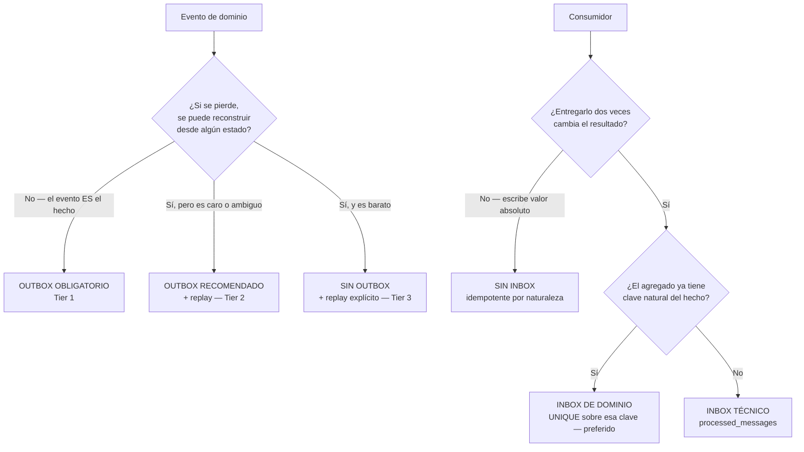
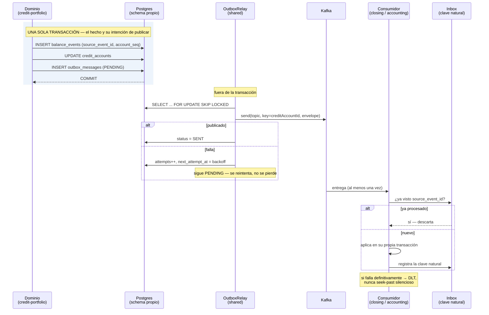
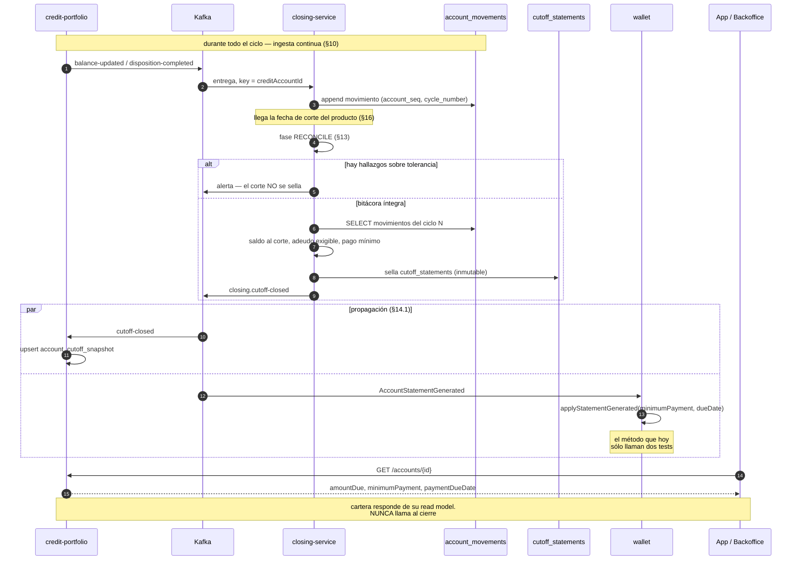
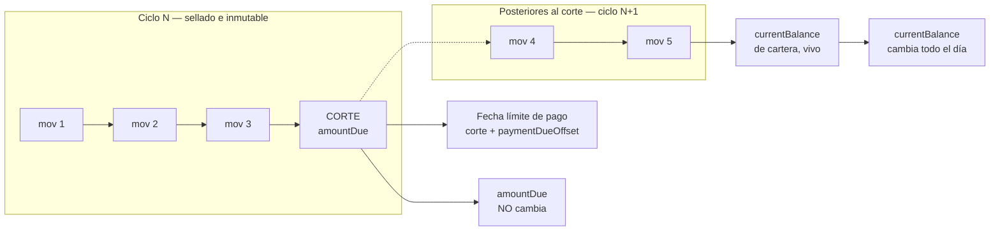
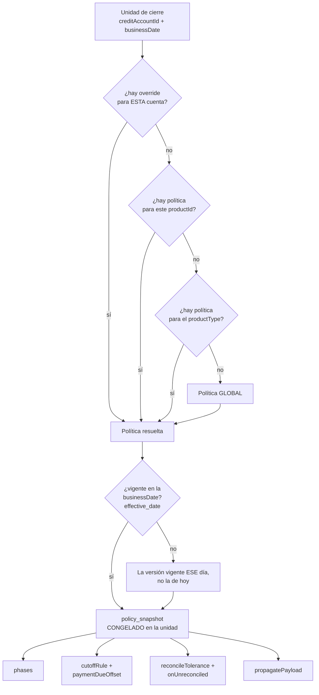
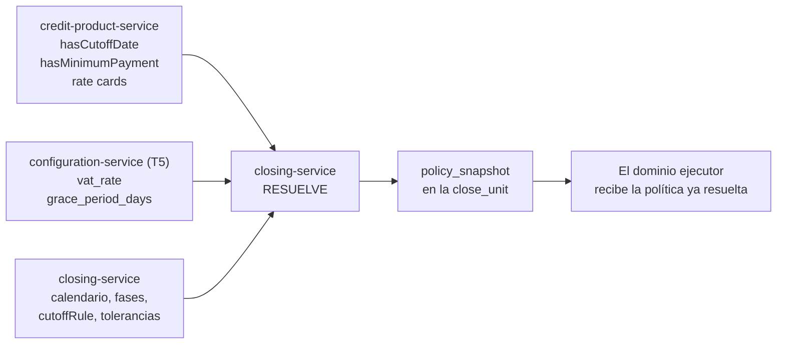
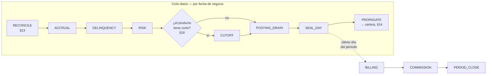
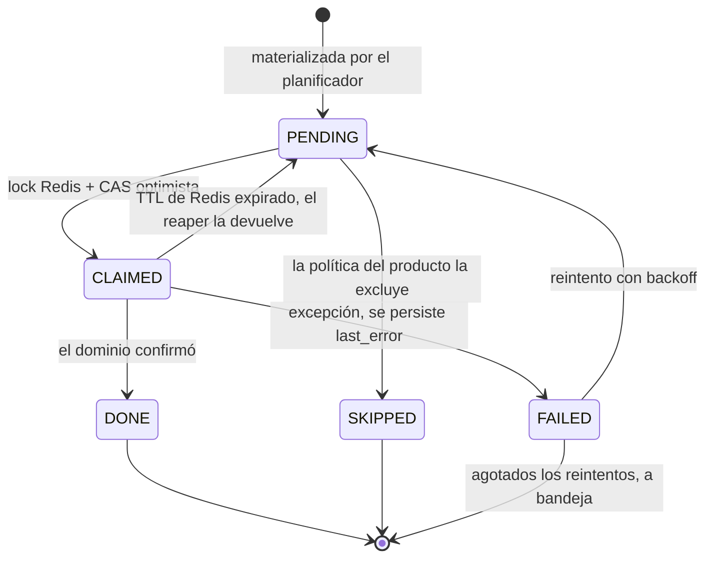
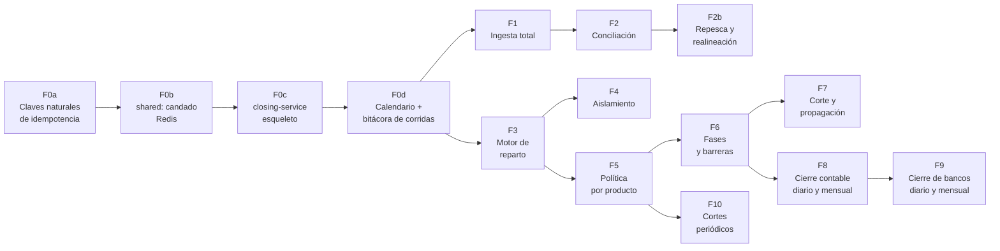

# Cierres y cortes — análisis del as-is y diseño de la capacidad distribuida

**Fecha:** 2026-08-23 · **Alcance:** cierre diario de cartera, cierre contable, cierre de bancos y cortes periódicos
**Método:** lectura del código, no de la documentación. Cada afirmación de la Parte I está respaldada en el [Apéndice A](#apéndice-a--afirmaciones-verificadas-contra-el-código).

**Lo que se pide construir:**

| Requisito | Estado hoy |
|---|---|
| Cierres configurados **por producto** | ✗ No existe. Los 14 jobs tienen el cron constante en el código |
| **Cortes** por producto | ✗ No existe. `hasCutoffDate` está declarado y **nunca se lee** |
| Ejecutar **cuenta/producto por cuenta/producto** | ~ Parcial: se itera por cuenta, pero sin unidad de trabajo persistida |
| **Distribuir en varios pods** | ✗ Ningún job de cierre es seguro con más de una réplica |
| **Desacoplado de portfolio** | ✗ 3 de los jobs viven dentro de `credit-portfolio-service` |
| Información **alineada** con proyección **eventual** | ~ El mecanismo existe (`balance_version`, `effectiveDate`), no la disciplina de cierre |

---

# Índice

**Parte I — As-is**

1. [Resumen ejecutivo — los 8 hallazgos](#1-resumen-ejecutivo--los-8-hallazgos)
2. [Inventario real: los 14 jobs](#2-inventario-real-los-14-jobs)
3. [Los tres cierres, uno por uno](#3-los-tres-cierres-uno-por-uno)
4. [Los cortes periódicos](#4-los-cortes-periódicos)
5. [Por qué el as-is no sobrevive a un segundo pod](#5-por-qué-el-as-is-no-sobrevive-a-un-segundo-pod)
6. [Lo que ya está bien y hay que conservar](#6-lo-que-ya-está-bien-y-hay-que-conservar)

**Parte II — Diseño de la capacidad**

7. [La decisión de fondo: `closing-service`](#7-la-decisión-de-fondo-closing-service)
8. [Modelo de dominio](#8-modelo-de-dominio)
9. [El reparto entre pods](#9-el-reparto-entre-pods)
10. [Ingesta total de movimientos de cartera](#10-ingesta-total-de-movimientos-de-cartera) — *el cierre consume **todo** evento de cartera*
11. [Aislamiento: el cierre no entorpece a nadie](#11-aislamiento-el-cierre-no-entorpece-a-nadie)
12. [Outbox e inbox a nivel de dominio](#12-outbox-e-inbox-a-nivel-de-dominio) — **§12.2: las 19 tablas muertas · §12.4: el árbol de decisión**
13. [Conciliación de movimientos: huecos, deriva y realineación](#13-conciliación-de-movimientos-huecos-deriva-y-realineación)
14. [Propagación de vuelta a cartera: el adeudo desde el corte](#14-propagación-de-vuelta-a-cartera-el-adeudo-desde-el-corte)
15. [Contrato: el cierre abre la ventana, los dominios ejecutan](#15-contrato-el-cierre-abre-la-ventana-los-dominios-ejecutan)
16. [Configuración por producto y por cuenta](#16-configuración-por-producto-y-por-cuenta) — *con diagrama de resolución*
17. [Fases y barreras: orden sin depender del reloj](#17-fases-y-barreras-orden-sin-depender-del-reloj) — *con diagramas del flujo de cierre*
18. [Cierre de bancos — lo que hay que construir desde cero](#18-cierre-de-bancos--lo-que-hay-que-construir-desde-cero)
19. [Esquema propuesto](#19-esquema-propuesto)

**Parte III — Ejecución**

20. [Plan por fases](#20-plan-por-fases)
21. [Estrategia de pruebas](#21-estrategia-de-pruebas)
22. [Riesgos y decisiones abiertas](#22-riesgos-y-decisiones-abiertas)
23. [Modelo de capacidad: qué cuesta un cierre y cómo se acorta](#23-modelo-de-capacidad-qué-cuesta-un-cierre-y-cómo-se-acorta)
24. [Apéndice A — afirmaciones verificadas contra el código](#apéndice-a--afirmaciones-verificadas-contra-el-código)

---

# Parte I — As-is

## 1. Resumen ejecutivo — los 8 hallazgos

**① No existe «el cierre» como concepto.** Existen **14 jobs `@Scheduled`** repartidos en **8 servicios**, coordinados únicamente por la hora del cron. Ninguna entidad representa «el día D quedó cerrado». Lo único parecido es `accounting.accounting_periods`, que es **mensual y se abre/cierra a mano** por endpoint.

**② El cierre de bancos no existe.** No hay conciliación de la cuenta `1101 BANCOS` contra ningún estado de cuenta. El puerto `AccountingEventPublisher.publishReconciliationAlert(...)` está declarado y su adaptador Kafka implementado — y **ninguna línea del servicio lo invoca**. El único «conciliar» real es el polling de STP, que confirma *nuestras* órdenes salientes: es confirmación de instrucción, no conciliación de saldo.

**③ Ningún job de cierre es seguro con más de una réplica.** No hay ShedLock, ni Quartz cluster, ni lock de fila, ni lease. El patrón `FOR UPDATE SKIP LOCKED` **sí existe y está probado en el monorepo** (`stp-service` outbox relay y `disbursement-service` dispatch), pero ningún job de cierre lo usa. Con 2 pods, los 14 jobs corren 2 veces. El daño concreto por job está en la [§5](#5-por-qué-el-as-is-no-sobrevive-a-un-segundo-pod).

**④ La fecha del cierre es el reloj del pod.** `LocalDate.now()` / `YearMonth.now()` dentro del job. No hay fecha de negocio declarada, no hay calendario de días hábiles, no hay festivos. La única excepción es `accounting`, que sí resuelve el período en la zona contable configurada.

**⑤ Todos los barridos son full-scan traídos a memoria.** `findAllByStatus(ACTIVE)` devuelve la lista completa y se filtra en Java (`findScheduleIdsForAccrual`, `reassessAll`, `DelinquencyCalculationJob`). Sin paginación, sin claim, sin particionamiento. Con 500 mil cuentas activas esto no es una degradación: es un `OutOfMemoryError`.

**⑥ No hay estado de corrida.** Ninguna tabla registra qué job corrió, sobre cuántas unidades, cuáles fallaron y por qué. El resultado vive en una línea de log (`success=N errors=M`). No existe reintento parcial, ni «re-corre sólo lo que falló», ni backfill controlado, ni forma de contestar «¿ya cerró cartera del día 22?».

**⑦ Configurabilidad por producto: cero.** Los 14 crones son constantes en el código. `Capabilities.hasCutoffDate` y `hasMinimumPayment` existen en el catálogo de producto, se propagan hasta `credit-portfolio`, están sembrados en `true` para `REVOLVING_LINE`, `CREDIT_CARD`, `DISTRIBUTOR_LINE` y `BUSINESS_REVOLVING_LINE` — y **no hay una sola línea de producción que los lea**. El ciclo de corte de revolventes está declarado y no implementado.

**⑧ El calendario del cierre está adentro de cada dominio.** Charges sabe que devenga a las 23:00; portfolio, que califica mora a las 23:59; risk, que provisiona a la 01:00; accounting, que factura el día 1 a las 03:00. La secuencia es real —hay dependencia de datos entre ellas— pero está expresada como **offsets de reloj**, no como dependencias. Si el devengo tarda más de 59 minutos, la mora se calcula sobre datos viejos y **nada lo detecta**.

---

## 2. Inventario real: los 14 jobs

| # | Servicio | Job | Cron | Qué hace | Alcance | Idempotente | ¿N pods? |
|---|---|---|---|---|---|---|---|
| 1 | charges | `DailyAccrualJob` | `0 0 23 * * *` | Devengo de interés ordinario + IVA | Todos los `AccrualSchedule` ACTIVE con `needsAccrual` | Por `last_accrual_date`, **sin lock** | ✗ |
| 2 | charges | `MoratoriumAccrualJob` | `0 30 23 * * *` | Devengo moratorio + IVA | Todos los ACTIVE con `moratorium_active` | **No** — no marca fecha | ✗✗ |
| 3 | credit-portfolio | `DelinquencyCalculationJob` | `0 59 23 * * *` | Recalcula DPD y publica `delinquency-status-updated` | Todas las cuentas ACTIVE | Recalculo puro, evento duplicable | ✗ |
| 4 | credit-portfolio | `UpcomingInstallmentJob` | `0 0 0 * * *` | Publica `installment-upcoming` | Cuotas que vencen en `reminderLeadDays` | Evento duplicable | ✗ |
| 5 | credit-portfolio | `InstallmentDueJob` | `0 1 0 * * *` | Publica `installment-due` | Cuotas vencidas o del día | Evento duplicable | ✗ |
| 6 | risk | `RiskAssessmentJob` | `0 0 1 * * *` | Recalcula bucket / etapa IFRS-9 / provisión | Todos los `RiskProfile` ACTIVE | Delta contra `provision_ledger`, con carrera | ✗ |
| 7 | collections | `BureauReportingJob` | `0 0 2 * * *` | Envía reportes al buró | Reportes pendientes | Reintento indefinido | ✗ |
| 8 | collections | `PromiseBrokenCheckJob` | `0 0 8 * * *` | Marca promesas rotas | Promesas vencidas | Transición de estado | ~ |
| 9 | collections | `AgreementExpirationJob` | `0 15 8 * * *` | Expira convenios propuestos | `PROPOSED` fuera de ventana | Transición de estado | ~ |
| 10 | collections | `DunningScheduleJob` | `0 0 10 * * *` | Agenda gestiones de cobranza | Casos abiertos | Genera gestiones | ✗ |
| 11 | collections | `WriteOffCandidatesJob` | `0 0 6 * * MON` | Propone quebrantos | Casos ≥ umbral de días | Solicitud, con aprobación aparte | ✗ |
| 12 | accounting | `BillingRunJob` | `0 0 3 1 * *` | Consolida CFDI del período anterior | Ítems `PENDING` del período | **No** — sin lock, doble CFDI | ✗✗ |
| 13 | commission | `CommissionLiquidationJob` | `0 30 3 5 * *` | Liquida comisiones del período | Registros `ACCRUED` | **No** — sin unique (beneficiario, período) | ✗✗ |
| 14 | channel-mobile | `KycSessionService` / `OtpService` | `fixedDelay` | Limpieza de sesiones y OTP | Memoria local | Local al pod | n/a |

**Contraste — los tres jobs que sí escalan.** No son de cierre, pero demuestran que el patrón ya está resuelto en el repo:

| Servicio | Job | Mecanismo |
|---|---|---|
| stp | `StpOutboxRelayJob` (`PT5S`) | `FOR UPDATE SKIP LOCKED` — *«Sin ShedLock: el SKIP LOCKED del repositorio ya garantiza que dos réplicas…»* |
| stp | `StpSettlementPollingJob` (`PT3M`) | HTTP fuera de transacción, una observación por transacción corta |
| disbursement | `DisbursementDispatchJob` (`PT5S`) | `lockDueForDispatch` con `PESSIMISTIC_WRITE` + `lock.timeout = -2` |

> **La conclusión operativa:** el monorepo ya sabe repartir trabajo entre réplicas. Lo que no hizo nunca fue aplicarlo a los cierres.

### La cadena nocturna implícita

```
23:00  charges     DailyAccrualJob        ── devenga interés del día
23:30  charges     MoratoriumAccrualJob   ── devenga moratorios
23:59  portfolio   DelinquencyCalculation ── DPD  (¿ya terminó el devengo?)
00:00  portfolio   UpcomingInstallment    ── recordatorios
00:01  portfolio   InstallmentDue         ── vencimientos
01:00  risk        RiskAssessment         ── bucket + provisión (¿ya está el DPD?)
02:00  collections BureauReporting
06:00  collections WriteOffCandidates (lunes)
08:00  collections PromiseBrokenCheck
08:15  collections AgreementExpiration
10:00  collections DunningSchedule
día 1, 03:00   accounting  BillingRun     ── CFDI del mes anterior
día 5, 03:30   commission  Liquidation    ── comisiones del mes anterior
```

Las flechas de dependencia son reales; el mecanismo que las hace cumplir es **la esperanza de que 59 minutos alcancen**.

---

## 3. Los tres cierres, uno por uno

### 3.1 Cierre diario de cartera

**Lo que hay:** tres jobs (`DelinquencyCalculationJob`, `UpcomingInstallmentJob`, `InstallmentDueJob`) que recalculan y publican eventos.

**Lo que no hay, y es lo que define un cierre:**

| Pieza faltante | Consecuencia hoy |
|---|---|
| **Saldo al cierre del día** | `credit_accounts` es estado mutable con `balance_version`. `balance_events` es bitácora de deltas. No hay forma de contestar «¿cuál era el saldo de esta cuenta el 15 de agosto?» sin reproducir la bitácora completa |
| **Estado «día cerrado»** | Un pago aplicado a las 23:59:59 puede caer del lado equivocado sin que nada lo señale; un movimiento retroactivo cambia en silencio un día ya reportado |
| **Sello con cifras de control** | No existe «cartera del día D: N cuentas, $X de saldo, hash». Sin eso no hay contra qué conciliar contabilidad |
| **Barrera de orden** | El DPD se calcula 59 min después de arrancar el devengo, sin verificar que haya terminado |
| **Registro de la corrida** | Si el pod muere a media corrida, la mitad de las cuentas queda sin recalcular y **nadie se entera** |

### 3.2 Cierre contable

Es **la pieza mejor construida del repositorio**, y es el modelo a generalizar — no a reemplazar.

**Lo que hay, y está bien:**

- `accounting_periods (period YYYYMM, status OPEN|CLOSED, closed_at)` con `POST /periods/{period}/close` y `/reopen`.
- `VoucherPostingService` resuelve el período **del hecho, no del reloj**: `occurredAt` → zona contable → `YYYYMM`. El comentario del código lo dice: *«Antes era `YearMonth.now()` al postear: el devengo del 31 procesado a las 00:03 del día 1 caía en el mes siguiente.»*
- Si el período del hecho está cerrado, el asiento **no se rechaza**: va al primer período abierto, marcado `is_late_posting = true` con `original_period` conservado. *«Perder el hecho es peor que asentarlo un mes tarde con la etiqueta puesta.»*
- Si el período no existe, se abre. El primer movimiento del mes es lo que lo crea.
- Póliza idempotente por `uq_vouchers_source (source_event_id)`, cuadre garantizado en la base por `chk_vouchers_balanced (total_debit = total_credit)`, folio consecutivo por `(tipo, sucursal, período)`.

**Lo que falta:**

| Pieza faltante | Consecuencia |
|---|---|
| **Cierre diario** | Sólo hay período mensual. No hay balanza diaria congelada |
| **Saldos de cierre almacenados** | `trialBalance` agrega con un `UNION ALL` sobre `journal_entries` completo del período, en vivo. El costo crece con el volumen y no hay balanza inmutable que publicar |
| **Checklist de cierre** | Nada verifica antes de cerrar que (a) los dominios upstream terminaron, (b) cartera cuadra contra el mayor, (c) no quedan hechos sin asentar |
| **Conciliación GL ↔ cartera (GL-04)** | Existe como **contrato de evento y nada más**: `publishReconciliationAlert` nunca se llama |

### 3.3 Cierre de bancos

**No existe.** Ni parcialmente.

- `AccountCodes.BANCOS = "1101"` se mueve siempre como contrapartida de un hecho interno —disposición, pago, retiro de wallet, recuperación— y **nunca contra una fuente bancaria**.
- `SettlementPollingService` (stp) consulta `V2/conciliacion` filtrando `tipoOrden = "E"` (enviadas) y produce `SettlementObservation`. Confirma el desenlace de *nuestras* órdenes. **No lee el saldo de la cuenta, no procesa abonos entrantes no ligados a una orden, no produce una diferencia banco-vs-mayor.**
- `payments-service` registra `PaymentOrder` y lo confirma por evento. No hay matching contra estado de cuenta, no hay partidas en conciliación, no hay cuenta puente de depósitos por identificar.

**Traducción:** hoy la plataforma no puede contestar *«¿el saldo que dice el banco coincide con el que dice mi mayor, y si no, por qué?»* — que es la pregunta que un cierre de bancos existe para contestar.

---

## 4. Los cortes periódicos

### 4.1 Facturación — `BillingRunJob`, día 1 a las 03:00

Consolida los `invoiceable_items` en `PENDING` del período anterior, **un CFDI por party**, y los marca `BILLED`.

- La acumulación **sí** es idempotente: `invoiceable_items.source_event_id` es `UNIQUE`.
- La corrida **no**: `runBilling` lee los `PENDING`, publica `invoice-requested` con un `invoiceRequestId` recién generado y luego marca. Dos pods leen el mismo conjunto y **emiten dos CFDI del mismo consumo**. No hay lock ni unique de (party, período).

### 4.2 Comisiones — `CommissionLiquidationJob`, día 5 a las 03:30

Agrupa `CommissionRecord` en `ACCRUED` por beneficiario y crea un `LiquidationBatch`. `commission.liquidation_batches` **no tiene unique sobre (beneficiary_party_id, period)** — hay un índice, no una restricción. Doble corrida = doble lote = doble pago al distribuidor.

### 4.3 Corte de revolventes — **no implementado**

Este es el hueco más relevante para lo que se quiere construir.

```
credit-product  Capabilities.hasCutoffDate    ──► sembrado true en 4 productos
                Capabilities.hasMinimumPayment      (REVOLVING_LINE, CREDIT_CARD,
                                                     DISTRIBUTOR_LINE, BUSINESS_REVOLVING_LINE)
                       │
                       ▼  se propaga
credit-portfolio  domain/config/Capabilities  ──► ningún consumidor
                       │
                       ▼  debería producir
                 AccountStatementGenerated    ──► NADIE LO PUBLICA
                       │
                       ▼
wallet   WalletView.applyStatementGenerated(minimumPayment, paymentDueDate)
         └── método sin invocador en producción; sólo lo llaman dos tests
         └── no existe listener del evento en el paquete de messaging de wallet
```

**Una tarjeta de crédito en esta plataforma nunca recibe fecha de corte, ni estado de cuenta, ni pago mínimo.** El campo `minimumPayment` viaja por el BFF, la app y el backoffice, y su origen es una columna que nadie escribe.

---

## 5. Por qué el as-is no sobrevive a un segundo pod

El detalle importa porque determina el orden de migración: no todos los jobs fallan igual de feo.

| Job | Qué se duplica | Qué debería impedirlo hoy | Resultado real |
|---|---|---|---|
| `DailyAccrualJob` | Cargo de interés + IVA por cuenta | `needsAccrual` / `markAccruedFor` sobre `last_accrual_date` | **Check-then-act sin atomicidad.** Sin `SELECT FOR UPDATE` y con `charge_records` **sin unique sobre (cuenta, tipo, fecha)**, dos transacciones concurrentes en READ COMMITTED pasan ambas la guarda. Se generan dos `ChargeRecord` con `chargeId` distinto → dos `charge-applied` con `sourceEventId` distinto → la guarda de idempotencia de portfolio **no aplica** → saldo duplicado → cuenta 4101 duplicada |
| `MoratoriumAccrualJob` | Ídem, moratorios | Nada | `accrueMoratoriumForSchedule` **nunca llama `markAccruedFor`** y `findMoratoriumScheduleIds` no filtra por fecha. Se duplica incluso en un solo pod si se re-dispara (endpoint de test-support, reinicio, redelivery) |
| `BillingRunJob` | CFDI | Nada | Dos facturas fiscales del mismo consumo. Corrección = nota de crédito y explicación al SAT |
| `CommissionLiquidationJob` | Lote de liquidación | Índice sin unique | Doble pago al distribuidor |
| `RiskAssessmentJob` | Póliza de provisión | Delta contra `provision_ledger.last_booked_provision` | El `sourceEventId` es `"PROV-" + accountId + epochMilli` → dos pods generan ids distintos. Si ambos leen el mismo `last_booked_provision` antes de que cualquiera confirme, **ambos asientan el mismo delta**: gasto por estimación duplicado |
| `DelinquencyCalculationJob` | `delinquency-status-updated` | Los consumidores (collections, risk) tienen sus propias guardas | El daño depende de la guarda de cada consumidor; el desperdicio de cómputo es 2× seguro |

Y transversal a todos: **si el pod muere a media corrida no hay nada que lo detecte ni que reanude**. El `for` con `try/catch` cuenta éxitos y errores en un log y se acaba.

---

## 6. Lo que ya está bien y hay que conservar

El diseño de la Parte II no parte de cero: cuatro piezas del as-is son exactamente los cimientos correctos.

**① El período del hecho, no el del reloj** (`VoucherPostingService`). La distinción entre *cuándo ocurrió* y *cuándo se procesó* ya está resuelta en contabilidad, con la etiqueta de extemporaneidad incluida. **Ese es el modelo de cierre correcto y se generaliza a las demás fases.**

**② El importe se mide en el dueño, no se deduce en el consumidor** (`BalanceReconciliationService`). El desglose capital/interés/moratorio se calcula entre el antes y el después de la mutación, en el único punto donde se conoce con certeza, y viaja en el evento. Los comentarios del código documentan qué pasó cuando se deducía restando saldos: *«de 17 pagos reales sólo se asentaron 5»*. **Este principio es precisamente lo que hace posible desacoplar el cierre de portfolio sin mentir.**

**③ El reparto entre réplicas ya está resuelto en el repo** — `disbursement` y `stp` lo hacen con `FOR UPDATE SKIP LOCKED` y funcionan. *Para el cierre se decidió otra vía (§9): candado distribuido en Redis, sin candados de base de datos.* Lo que se conserva del precedente es la conclusión de fondo: **no hace falta un coordinador externo** — ni ShedLock ni Quartz cluster.

**④ `effectiveDate` propagándose** charges → portfolio → accounting. Ya existe una noción de fecha de negocio recorriendo la cadena — hoy es un parámetro opcional que sólo usa la siembra; es el cimiento sobre el que se declara la fecha de negocio formal.

---

# Parte II — Diseño de la capacidad

## 7. La decisión de fondo: `closing-service`

**Servicio nuevo, no un módulo dentro de `credit-portfolio`.**

| Razón | Detalle |
|---|---|
| **Razón de cambio distinta** | Portfolio cambia cuando cambia el producto crediticio. El cierre cambia cuando cambia el calendario contable, la regulación, la política de corte o la topología de ejecución. Son ejes independientes |
| **Es transversal** | El mismo motor cierra cartera, contabilidad, comisiones y bancos. Alojarlo en portfolio lo volvería dueño de dominios que no son suyos |
| **Precedente del repo** | El mismo criterio que separó `credit-product` de `credit-portfolio` (ADR-001) y `risk` de `collections` |
| **Es la causa del problema** | Que portfolio tenga un scheduler que barra todas sus cuentas es exactamente lo que hoy le impide escalar. Sacarlo es el arreglo |

**Qué no es.** No calcula intereses, no decide mora, no asienta pólizas, no emite CFDI. **Orquesta y reparte.** Los dominios siguen siendo dueños de su cálculo.

**Puerto sugerido:** `8103`. *(Nota lateral: hoy `disbursement-service` y `sales-org-service` declaran ambos el `8100` — colisión existente, ajena a este análisis pero conviene corregirla.)*

---

## 8. Modelo de dominio

| Agregado | Qué resuelve del as-is |
|---|---|
| **`BusinessCalendar` / `CalendarDay`** | Sustituye `LocalDate.now()`. Zona horaria de negocio, festivos, regla de día hábil, corrimiento. Una plataforma multi-país necesita varios calendarios |
| **`CloseCyclePolicy`** (versionada, con `effective_date`) | **La configuración por producto.** Qué fases aplican, con qué frecuencia, con qué regla de corte, qué tolerancias y qué ventana. Resolución por alcance: `productId` › `productType` › global |
| **`AccountCloseProfile`** | **La proyección eventual por cuenta.** `creditAccountId`, `productId`, `productType`, `cycleDay`, `nextCutoffDate`, `nextCloseDate`, `orgUnitCode`, `status`, `lastSeenBalanceVersion`. Alimentada por eventos, nunca por REST. **Es el desacople de portfolio** |
| **`CloseRun`** | Una corrida: `(businessDate, phase, scopeKey)`. `PLANNED → CLAIMING → RUNNING → SEALED \| FAILED`. Su clave única **es** el lock del planificador |
| **`CloseUnit`** | **La unidad de trabajo: una cuenta/producto.** Es la fila que los pods se reparten. `PENDING → CLAIMED → DONE \| FAILED \| SKIPPED`, con `leaseOwner`, `leaseExpiresAt`, `attempts`, `lastError`, `policySnapshot` |
| **`CutoffSchedule`** | El corte por cuenta: número de ciclo, fecha de corte, fecha límite de pago. **Es lo que hoy no existe en ninguna parte** |
| **`CloseSeal`** | El sello: «cartera del 2026-08-22, alcance X: N unidades, $Y de saldo, hash». El hecho auditable que hoy falta y contra el que concilia contabilidad |
| **`AccountMovement`** (§10) | **La bitácora append-only de todo hecho de cartera.** Es lo que permite contestar «¿qué pasó entre el corte de agosto y el de septiembre?» — que una proyección de estado no puede |
| **`ObservedCause`** (§13) | El hecho origen (cargo, pago) visto en su topic. Se cruza contra el movimiento para detectar el efecto que nunca llegó |
| **`ReconciliationFinding`** (§13) | Hueco, deriva o inconsistencia detectada, con su importe en riesgo y su resolución. Lo que bloquea —o no— el sello |
| **`CutoffStatement`** (§14) | El corte sellado e **inmutable**: saldo, adeudo exigible, pago mínimo, fecha límite. Lo que se propaga de vuelta a cartera |

---

## 9. El reparto entre pods

> **Decisión de arquitectura (2026-08-24):** el reparto se coordina con un **lock distribuido en Redis**, no con `FOR UPDATE SKIP LOCKED`. **No se usa ningún candado de base de datos.** Redis ya está en el stack (`docker-compose.yml`) y lo usan `identity`, `configuration`, `channel-mobile`, `channel-backoffice` y `beneficiary`.

### 9.1 Un solo componente de candado, para todo el sistema

El candado es **un mecanismo genérico** que vive en `shared` y sirve a cualquier servicio que necesite exclusión distribuida — no sólo al cierre. Su identidad es una **llave de unicidad** compuesta:

```
fintech:lock:<dominio>:<propósito>:<discriminador>
```

| Uso | Llave |
|---|---|
| Planificación de una corrida | `fintech:lock:closing:run:2026-08-24:ACCRUAL:ALL` |
| Unidad de trabajo | `fintech:lock:closing:unit:<runId>:<creditAccountId>` |
| Sellado de una fase | `fintech:lock:closing:seal:2026-08-24:ACCRUAL` |
| Cierre de período contable | `fintech:lock:accounting:period-close:202608` |
| Corte de una cuenta | `fintech:lock:closing:cutoff:<creditAccountId>:<ciclo>` |

**Contrato:**

```java
public interface DistributedLock {
    Optional<LockHandle> tryAcquire(LockKey key, Duration ttl);
    boolean             extend(LockHandle handle, Duration ttl);
    void                release(LockHandle handle);
    <T> Optional<T>     withLock(LockKey key, Duration ttl, Supplier<T> work);
}
```

**Implementación (`RedisDistributedLock`):**

| Operación | Mecanismo | Por qué |
|---|---|---|
| Adquirir | `SET key token NX PX ttl` | Atómico. `NX` es la exclusión; `PX` garantiza que un pod muerto suelte el candado solo |
| Token de propiedad | UUID por adquisición | Sin él, un pod puede liberar el candado de otro |
| Liberar | **`WATCH`/`MULTI`/`EXEC`**: vigila la llave, compara el token y sólo entonces `DEL` | `GET` + `DEL` por separado permiten liberar un candado que ya expiró y otro tomó. Todo con la API de Spring Data Redis (`SessionCallback`) — **sin scripts** |
| Extender | `WATCH`/`MULTI`/`EXEC` + `EXPIRE` | Renovación segura para trabajos largos |
| **Fencing token** | `INCR fintech:fence:<key>` | Contador monótono que viaja con el handle. Si el candado expiró a mitad del trabajo, el escritor viejo se detecta y **su escritura se rechaza** |

**El fencing token no es opcional en un sistema financiero.** Un candado con TTL puede expirar mientras el trabajo sigue vivo (pausa de GC, red lenta): sin token, dos pods escriben creyendo cada uno que es el dueño. Con token, la escritura lleva el número y el que llega con uno menor al último visto se rechaza.

### 9.2 Cómo se reparte el trabajo, sin candados de base de datos

**1 — Planificación.** Cualquier pod intenta `tryAcquire(closing:run:<fecha>:<fase>:<alcance>)`. El que lo obtiene materializa las `close_units` con un `INSERT … SELECT`; los demás reciben vacío y pasan directo a trabajar. El `UNIQUE (business_date, phase, scope_key)` de `close_runs` queda como **segunda red**, no como el mecanismo de coordinación.

**2 — Toma de unidades.** Cada pod lee una página de unidades `PENDING` con un `SELECT` normal —sin `FOR UPDATE`, sin `SKIP LOCKED`— y por cada una:

```java
lock.tryAcquire(unitKey(runId, unitKey), leaseTtl).ifPresent(handle -> {
    // CAS optimista en la base: 0 filas = otro pod se adelantó
    int claimed = units.claim(unitId, podId, handle.fencingToken(), handle.expiresAt());
    if (claimed == 0) { lock.release(handle); return; }
    try   { process(unitId, handle); units.markDone(unitId, handle.fencingToken()); }
    catch (Exception e) { units.markFailed(unitId, e.getMessage()); }
    finally { lock.release(handle); }
});
```

El `UPDATE … WHERE status = 'PENDING'` es un **CAS optimista**: si devuelve 0 filas, otro pod ganó y este sigue con la siguiente. La base nunca bloquea una fila.

**3 — Dispersión.** Para que los pods no compitan siempre por las mismas filas, cada uno arranca su página en un desplazamiento distinto (`ORDER BY unit_id OFFSET`, derivado del hash del `podId`). La colisión deja de ser la norma y pasa a ser el caso raro que el candado resuelve.

**4 — Lease y reaper.** El TTL de Redis suelta el candado solo cuando un pod muere. El reaper devuelve a `PENDING` las unidades `CLAIMED` cuyo `lease_expires_at` ya pasó **y** cuya llave ya no existe en Redis. Las dos condiciones: el TTL es la verdad, la columna es lo consultable.

**5 — Sellado.** Bajo `closing:seal:<fecha>:<fase>`, para que dos pods no sellen a la vez.

### 9.3 Qué se gana y qué hay que cuidar

| Ventaja | Detalle |
|---|---|
| La base no bloquea nada | Ni una transacción larga reteniendo filas. El pool se usa para trabajo, no para esperar |
| Un solo mecanismo | El mismo candado sirve al cierre, al período contable y a cualquier job futuro |
| El TTL libera solo | Un pod muerto no deja el sistema atascado |

| Riesgo | Mitigación |
|---|---|
| **Redis caído** | El cierre **no arranca** y alerta. Nunca corre sin candado: correr sin exclusión es peor que no correr |
| **Candado expirado a mitad del trabajo** | Fencing token + renovación con watchdog. La escritura tardía se rechaza |
| **Redis no es un lock perfecto** | Es exclusión *best-effort*. Por eso **toda escritura sigue siendo idempotente por clave natural** — el candado evita el trabajo duplicado, la clave natural evita el *dato* duplicado. Nunca se depende sólo del candado |
| Reloj entre pods | Sólo se compara contra el TTL de Redis, no entre relojes de pods |

> **La regla que lo hace seguro:** el candado es una **optimización de exclusión**, no la garantía de corrección. La corrección la da la idempotencia por clave natural en la base. Si el candado falla, se duplica trabajo, no datos.

---

## 10. Ingesta total de movimientos de cartera

**Cambio respecto del diseño inicial.** La primera versión de este documento proponía una proyección de **estado** alimentada por tres topics. No alcanza. Una proyección de estado contesta *«¿cuánto debe hoy?»*; un cierre necesita contestar *«¿qué pasó entre el corte de agosto y el de septiembre?»* — y eso sólo lo contesta una **bitácora de movimientos**.

Además es el requisito del que dependen las otras dos capacidades: sin la bitácora completa no hay conciliación de faltantes (§13) ni estado de cuenta que propagar (§14).

### 10.1 El stream completo de cartera

`CreditPortfolioEventPublisher` publica **9 eventos**. El cierre los consume **todos**:

| Topic | ¿Es movimiento? | Qué aporta al cierre |
|---|---|---|
| `credit-account-activated` | Alta | Perfil: producto, sucursal, fecha de origen del ciclo de corte |
| `balance-updated` | **Sí — el principal** | Importe con signo, desglose capital/interés/moratorio, saldo resultante, `balanceVersion`, `occurredOn` |
| `disposition-completed` | **Sí** | Disposición de revolvente: es un renglón del estado de cuenta por derecho propio |
| `disposition-rejected` | No — intento | Trazabilidad y conciliación de causa |
| `installment-due` | Calendario | Exigibilidad de la cuota |
| `installment-upcoming` | Calendario | — |
| `delinquency-status-updated` | Estado | Bucket para las fases de riesgo y provisión |
| `payment-rejected` | No — intento | **Conciliación**: hubo una causa que no produjo efecto, y hay que saber que fue rechazo y no pérdida |
| `charge-rejected` | No — intento | Ídem |

Todos llegan **con clave `creditAccountId`** (verificado en `KafkaCreditPortfolioPublisher`), así que el orden por cuenta dentro de una partición ya está garantizado. Eso es lo que hace viable una bitácora ordenada por cuenta sin coordinación adicional.

### 10.2 Y el stream de las causas

El cierre consume también los eventos que **originan** el movimiento, aunque no los use para calcular:

`charges.charge-applied` · `charges.charge-reversed` · `payments.payment-applied` · `payments.payment-returned` · `collections.write-off-executed` · `collections.agreement-executed` · `commission.commission-accrued`

**Por qué consumir la causa si el efecto ya trae todo:** porque *«todo hecho que debió producir un `balance-updated` y no lo produjo es un faltante detectable»*. Ésa es la base del mecanismo de conciliación de §13.2(b) — y es el único que **funciona hoy, sin cambiar una línea en los productores**.

Regla estricta: **la causa nunca se usa para calcular saldo.** El saldo sale del efecto, que es el que mide el dueño del dato (§6②). La causa se guarda sólo para cruzarla.

### 10.3 `account_movements` — la bitácora

Append-only, una fila por hecho, nunca se actualiza:

| Campo | Para qué |
|---|---|
| `account_seq` | Número de secuencia contiguo por cuenta. **La pieza que hoy no existe** (§13.2a) |
| `source_event_id` | `UNIQUE` — la idempotencia de la ingesta |
| `effective_date` | La fecha del hecho, del `occurredOn` del evento |
| `business_date` | La fecha de negocio a la que el cierre lo asigna, resuelta por calendario |
| `event_amount`, `principal_delta`, `interest_delta`, `penalty_delta` | El importe y su desglose, tal como los midió cartera |
| `balance_after_*` | Saldo resultante — permite verificar la bitácora contra sí misma |
| `balance_version` | La versión que traía el evento |
| `cycle_number` | El ciclo de corte al que pertenece — **lo que hace posible el estado de cuenta** |

**Qué se deriva de ella, sin consultar cartera nunca:**

- El saldo a cualquier fecha pasada — lo que el as-is no puede contestar (§3.1).
- El estado de cuenta de un ciclo: los movimientos entre el corte *N-1* y el corte *N*.
- Las cifras de control del sello.
- La verificación cruzada: `Σ deltas` debe reproducir `balance_after`. Si no, la bitácora se contradice a sí misma y hay un faltante, aunque no haya hueco de secuencia.

---

## 11. Aislamiento: el cierre no entorpece a nadie

Requisito explícito, y hoy se incumple de la peor manera posible.

### 11.1 El problema actual, dicho con precisión

**`DelinquencyCalculationJob` corre dentro del mismo JVM que sirve la API de cartera.** A las 23:59, un barrido que trae *todas* las cuentas ACTIVE a memoria compite por heap, CPU y pool de conexiones con las consultas del backoffice y de la app. Lo mismo `UpcomingInstallmentJob`, `InstallmentDueJob` y los dos de `charges`.

Y el modo de falla es peor que la lentitud: **si el barrido revienta por memoria, se lleva la API de cartera con él.** No hay separación de destinos entre el proceso batch y el proceso transaccional.

### 11.2 Las seis fronteras del aislamiento

| Frontera | Regla | Qué la hace cumplir |
|---|---|---|
| **Proceso** | Los pods de cierre son un *Deployment* aparte, con su propio escalado | Servicio distinto. Un OOM del cierre no toca la API de cartera |
| **Datos** | Schema `closing` propio, pool propio, dimensionado aparte | El barrido pesado sale de la base de portfolio y pasa a la del cierre. *(El proyecto ya topó con `max_connections`: el pool del cierre se dimensiona explícitamente, no se hereda.)* |
| **Consumo** | Consumer group propio en cada topic | Si el cierre se atrasa, el lag es suyo. Ningún consumidor operativo se ve afectado |
| **Escritura** | **Cero escrituras cruzadas.** El cierre no escribe en tablas de otro dominio | Sin datasource compartido. Es una restricción verificable con un test de arquitectura |
| **Lectura síncrona** | **Cero REST durante la ventana de cierre.** La única llamada síncrona permitida es la repesca de §13.3, y ocurre en la fase `RECONCILE`, *antes* de la ventana | La proyección de §10 existe precisamente para esto |
| **Ritmo** | `batchSize` y `workers` configurables por fase | El cierre puede correr despacio en horario hábil y a fondo en ventana nocturna, sin recompilar |

### 11.3 La dirección del backpressure

Si el cierre no alcanza, **el que se atrasa es el cierre**. Nunca la operación. Eso se sostiene porque:

- el claim toma lotes acotados, no la tabla entera;
- cada unidad es una transacción corta — no hay transacciones largas reteniendo conexiones;
- los ejecutores (charges, portfolio) reaccionan a la ventana **por Kafka**, absorbiendo el pico en el lag del consumidor en vez de en la latencia de la API;
- lo que el cierre emite va a topics propios.

> El corolario que importa: **hoy el cierre y la operación comparten destino; con esto, no.**

---

## 12. Outbox e inbox a nivel de dominio — **FUERA DE ALCANCE**

> **Decisión (2026-08-24): no se implementa en esta entrega.** El análisis se conserva completo porque es el insumo para decidir *dónde* conviene outbox, pero queda como **alcance aparte**, y **no se usará Spring Modulith**: cada servicio resolverá lo suyo de forma independiente cuando se aborde.
>
> Lo que **sí** entra en esta entrega de los hallazgos de abajo: las **claves naturales de idempotencia** (`uq_charge_daily` y equivalentes). No son outbox — son la garantía de que un hecho no exista dos veces, y son lo que hace seguro el candado de §9.

> Es un sistema financiero: **ningún hecho monetario puede depender de que un broker esté vivo en el instante exacto del commit.** Esta sección define dónde se pone outbox, dónde inbox, dónde ninguno de los dos, y por qué.

### 12.1 El principio que decide: reconstruibilidad

No todo componente necesita outbox. La pregunta correcta no es *«¿es importante?»* sino:

> **Si este evento se pierde, ¿puede reconstruirse desde el estado de algún componente?**

- **Sí, y es barato** → no hace falta outbox. Basta un mecanismo de *replay* explícito.
- **Sí, pero es caro o ambiguo** → outbox recomendado; replay como red de seguridad.
- **No** → **outbox obligatorio.** El evento *es* el hecho; perderlo es perder dinero.

El mismo criterio, del lado del consumidor:

> **Si este mensaje se entrega dos veces, ¿el resultado cambia?**

- **No cambia** (escribe un valor absoluto) → no hace falta inbox. Es idempotente por naturaleza.
- **Sí cambia** (acumula, deriva un delta, crea una entidad, dispara un efecto externo) → **inbox obligatorio.**

### 12.2 El as-is: la infraestructura está sembrada y desconectada

**① Las 19 tablas `event_publication` de Spring Modulith están muertas.**

Diecinueve servicios crean la tabla por changeset. `DomainEvent` documenta la intención en su javadoc:

> *«Spring Modulith externaliza los eventos anotados con `@Externalized` al tópico Kafka correspondiente.»*

**No existe una sola anotación `@Externalized`, `@ApplicationModuleListener` ni `@TransactionalEventListener` en todo el repositorio.** La tabla nunca se escribe ni se lee. El outbox estaba previsto en el diseño, se sembró la infraestructura, y el cableado nunca se hizo — y como la tabla existe, la ausencia no se nota.

**② Un solo outbox real, y no está donde más se necesita.**

| Servicio | Outbox | Comentario |
|---|---|---|
| `stp-service` | ✅ `stp.outbox_messages` con relay `SKIP LOCKED` | Ejemplar. Es el modelo a replicar |
| `disbursement-service` | ✅ de facto — `disbursement_orders` funciona como outbox con `lockDueForDispatch` | Correcto |
| **`credit-portfolio`, `charges`, `payments`, `collections`** | ❌ | **Los cuatro que mueven el saldo del cliente** |

**③ Inbox: sólo 4 de 21 servicios tienen guarda de idempotencia.**

| Servicio | Guarda | Tipo |
|---|---|---|
| `accounting` | `uq_vouchers_source`, `invoiceable_items.source_event_id` | Clave natural del agregado |
| `credit-portfolio` | `balance_events.source_event_id` | Clave natural del agregado |
| `commission` | `existsBySourceEventId` (CR-04) | Clave natural del agregado |
| `notifications` | `existsBySourceEventIdAndChannel` | Clave natural del agregado |
| **Los otros 17** | ❌ | Reprocesan sin guarda |

**④ Y el régimen de reintentos descarta el mensaje.** Salvo `disbursement` y `stp`, todos usan el `DefaultErrorHandler`: agotados los reintentos, *seek-past* — **se hace commit del offset y el mensaje se pierde**. Sin DLT.

> **Los tres huecos se componen:** el productor puede perder el evento al publicar (sin outbox), el consumidor puede perderlo al fallar (sin DLT) y puede duplicarlo al reintentar (sin inbox). Hoy nada de eso deja rastro.

### 12.3 La decisión de arquitectura: contrato arriba, mecanismo abajo

El outbox y el inbox son **decisión de dominio** y **mecanismo de infraestructura**. Separarlos es lo que evita 21 implementaciones distintas del mismo patrón.

| Nivel | Qué vive ahí | Por qué |
|---|---|---|
| **Dominio** (cada servicio) | *Qué* eventos van por outbox · *cuál* es la clave de idempotencia · *qué* tolerancia tiene · su tabla en **su propio schema** | La garantía es una propiedad del negocio, no de la plataforma. La tabla vive en el schema del dominio para que el `INSERT` del outbox entre en **la misma transacción** que el hecho — que es todo el punto del patrón |
| **`shared`** (kernel) | El relay con `SKIP LOCKED`, el reintento con backoff, el registro de procesados, las métricas, la autoconfiguración | Es mecánica pura. Escribirla 21 veces garantiza 21 sutilezas distintas — y el as-is ya demuestra que sin un mecanismo común, simplemente no se pone |

**Regla dura:** la tabla de outbox **nunca** es compartida entre servicios. Un outbox central sería una base de datos compartida disfrazada, y rompería el aislamiento de §11 y la propiedad transaccional que lo hace funcionar.

Lo que se baja a `shared` (hoy tiene 4 clases: `DomainEvent`, `DomainException`, `GlobalExceptionHandler`, `package-info`):

```
shared/
├── event/
│   ├── DomainEvent.java              (ya existe)
│   └── EventEnvelope.java            ← NUEVO: sobre común, §12.6
├── outbox/
│   ├── OutboxMessage.java            ← entidad @MappedSuperclass; el schema lo fija el servicio
│   ├── OutboxRepository.java         ← puerto, con claimBatch(FOR UPDATE SKIP LOCKED)
│   ├── OutboxRelay.java              ← relay genérico: backoff, attempts, last_error, DLQ
│   ├── OutboxPublisher.java          ← API de dominio: publish(topic, key, event) dentro de la tx
│   └── OutboxAutoConfiguration.java  ← @ConditionalOnProperty(fintech.outbox.enabled)
└── inbox/
    ├── ProcessedMessage.java         ← inbox técnico (fallback), §12.5
    ├── IdempotentConsumer.java       ← helper: ejecuta el handler una sola vez
    └── InboxAutoConfiguration.java
```

**Sobre Spring Modulith:** la alternativa sería cablear lo que ya está sembrado (`@Externalized` + `spring-modulith-events-kafka`). Se descarta por dos razones: acopla la garantía transaccional a la versión del framework, y el repo ya tiene un patrón propio probado en producción (`stp`, `disbursement`) que el equipo conoce. **Las 19 tablas muertas se eliminan o se reutilizan como la tabla de outbox** — no se dejan ahí sugiriendo una garantía que no existe.

### 12.4 El árbol de decisión, aplicado servicio por servicio



**Clasificación completa:**

| Servicio | Evento crítico que emite | Outbox | Por qué | Inbox | Por qué |
|---|---|---|---|---|---|
| **credit-portfolio** | `balance-updated` | **T1 ✅ obligatorio** | El evento **es** el movimiento. Perderlo desalinea cartera, contabilidad, cobranza y cierre a la vez, y no hay de dónde regenerarlo con su desglose | ✅ ya lo tiene | `balance_events.source_event_id` |
| **charges** | `charge-applied` | **T1 ✅ obligatorio** | El devengo del día se pierde y **nadie lo vuelve a calcular**: `markAccruedFor` ya movió el reloj. Es dinero que no se cobra | ⚠️ **falta** | `updateBalanceFromEvent` es upsert (idempotente), pero `chargeOpeningFee` **crea** un cargo. Requiere clave natural: `uq_charge_daily` |
| **payments** | `payment-applied`, `payment-returned` | **T1 ✅ obligatorio** | El pago del cliente ya entró al banco. Perder el evento es cobrar y no acreditar | ⚠️ **falta** | Crea `PaymentOrder`: no es idempotente |
| **collections** | `write-off-executed`, `agreement-executed` | **T1 ✅ obligatorio** | Un quebranto no aplicado deja el crédito vivo en cartera y castigado en el mayor | ⚠️ **falta** | Abre casos y gestiones: crea entidades |
| **disbursement** | `disbursement-*` | ✅ **ya lo tiene** | — | ✅ ya lo tiene | `(sourceSystem, sourceType, sourceEventId)` |
| **stp** | `stp-*` | ✅ **ya lo tiene** | — | ✅ ya lo tiene | — |
| **accounting** | `journal-entry-created`, `invoice-requested` | **T2** | El mayor **es** la fuente: los asientos están persistidos y el evento se regenera desde `journal_entries`. `invoice-requested` sí conviene outbox — dispara un CFDI | ✅ ya lo tiene | `uq_vouchers_source` |
| **risk** | `assessment-updated` | **T3** | Reconstruible: se vuelve a correr la evaluación y se recalcula el mismo número. **Ejemplo canónico de «no hace falta»** | ✅ efectivo | Delta contra `provision_ledger` |
| **commission** | `commission-accrued`, `-liquidated` | **T2** | Reconstruible del shadow, pero `-liquidated` mueve un pago a un tercero | ✅ ya lo tiene | CR-04 |
| **wallet** | `withdrawal-completed` | **T1** para el retiro · T3 para la proyección | El retiro mueve dinero real; la proyección se regenera del siguiente `balance-updated` | ⚠️ falta en el retiro | Proyección: idempotente por naturaleza |
| **invoicing** | CFDI timbrado | **T1 ✅ obligatorio** | Un CFDI timbrado y no registrado es un problema fiscal, no de software | ⚠️ **falta** | Debe ser `UNIQUE (invoiceRequestId)` |
| **origination, scoring, party, channels, sales-org, credit-product, configuration, identity, audit, notifications, beneficiary** | — | **T3 — no hace falta** | Su estado es consultable y el evento se regenera desde él. `audit` y `notifications` además toleran pérdida por diseño | Mixto | `notifications` ya lo tiene; el resto son proyecciones idempotentes |

> **La respuesta directa a la pregunta:** de 21 servicios, **7 necesitan outbox** (5 de ellos no lo tienen) y **6 necesitan inbox nuevo**. En los 14 restantes, la reconstrucción desde otro componente es la respuesta correcta — y hay que **diseñarla explícitamente**, no darla por supuesta (§12.7).

### 12.5 Inbox de dominio antes que inbox técnico

Hay dos formas de no procesar dos veces, y **no son equivalentes**:

| | Inbox de dominio | Inbox técnico |
|---|---|---|
| Dónde vive | `UNIQUE` sobre la clave natural del agregado | Tabla `processed_messages (consumer_group, message_id)` |
| Ejemplo en el repo | `uq_vouchers_source` · `balance_events.source_event_id` | — (no existe) |
| Qué garantiza | **El hecho no puede existir dos veces**, venga de Kafka, de un endpoint o de una migración | Que *este mensaje* no se procese dos veces |
| Debilidad | Requiere que el dominio tenga una clave natural del hecho | **El mismo hecho por otro camino pasa de largo.** Y hay que purgarla |

**Regla: siempre que el dominio tenga una clave natural del hecho, ésa es el inbox.** El técnico es el recurso para cuando no la hay — un consumidor que sólo dispara un efecto sin persistir nada propio.

Es también la razón por la que `uq_charge_daily` (§19.4) no es sólo un parche contra el doble pod: **es el inbox de dominio de `charges`**, y resuelve el reproceso venga de donde venga.

### 12.6 El sobre común: lo que todo evento debe llevar

Para que cualquier flujo sea reconciliable y reconstruible, el sobre necesita cinco campos. `DomainEvent` hoy tiene tres, y `correlationId` **nunca se usa**:

| Campo | Estado | Para qué |
|---|---|---|
| `eventId` | ✅ existe | Identidad del mensaje. La clave del inbox técnico |
| `occurredOn` | ✅ existe | La fecha del **hecho**. Es de lo que contabilidad deriva el período y el cierre la fecha de negocio |
| `correlationId` | ⚠️ existe, sin usar | Traza end-to-end. Hoy la correlación sólo existe en los spans de OTel, que caducan |
| **`causationId`** | ❌ **falta** | **Qué hecho causó éste.** Es lo que permite reconstruir la cadena `pago → balance-updated → póliza` y responder «¿de dónde salió este asiento?» sin adivinar por prefijo de `sourceEventId` |
| **`producerSeq`** | ❌ **falta** | Secuencia contigua por agregado. **Sin esto no hay detección de huecos** (§13.2a) |
| `schemaVersion` | ❌ falta | Evolución de contrato sin romper consumidores |

`causationId` y `producerSeq` son los dos que convierten un stream de eventos en algo **auditable**: con ellos, dado cualquier asiento contable se reconstruye la cadena completa hasta el pago que lo originó, y se detecta si falta un eslabón.

### 12.7 Reconstrucción: el replay como capacidad de primera clase

Para los Tier 2 y Tier 3, la respuesta a la pérdida no es outbox — es **poder regenerar**. Pero eso sólo vale si está construido y probado, no si es una posibilidad teórica.

Cada emisor Tier 2/3 expone un puerto de reemisión:

```
POST /internal/replay
  { aggregateId?, fromSeq?, fromDate?, toDate?, dryRun }
→ { eventsRepublished, range, correlationId }
```

Reglas:

1. **El replay reemite el hecho con su `eventId` original**, no uno nuevo. Si el consumidor ya lo vio, su inbox lo descarta — el replay es seguro por construcción.
2. **`occurredOn` conserva la fecha original.** Un replay no reescribe la historia: contabilidad lo asentará en su período con la etiqueta de extemporáneo.
3. **`dryRun` primero.** Toda reemisión masiva se ensaya y se reporta antes de ejecutarse.
4. **Autorización y bitácora.** Un replay es una operación de recuperación, va auditada.

> Éste es el punto donde *«desde otro componente se puede reconstruir»* deja de ser una esperanza y pasa a ser una **capacidad con endpoint, prueba y runbook.**

### 12.8 El flujo completo, extremo a extremo



**Las cuatro garantías que produce este flujo:**

| Garantía | Mecanismo |
|---|---|
| **Nada se pierde al publicar** | El outbox está en la misma transacción que el hecho. O commitean los dos, o ninguno |
| **Nada se procesa dos veces** | Inbox de dominio sobre la clave natural |
| **Nada se pierde al consumir** | DLT en todos los Tier 1 — se acaba el *seek-past* silencioso |
| **Todo es reconstruible** | `producerSeq` detecta el hueco · el replay lo repone · `causationId` reconstruye la cadena |

---

## 13. Conciliación de movimientos: huecos, deriva y realineación

Requisito explícito: *«debe haber una conciliación de movimientos en caso de que haya faltantes, reconciliarlo y alinearlos.»*

Y hay un hallazgo que lo vuelve urgente por sí solo, independientemente del cierre.

### 13.1 Prevención — aplazada, y qué significa para esta entrega

El agujero que produce los faltantes está documentado en **§12.2**: `credit-portfolio`, `charges`, `payments` y `collections` publican sin outbox, y un evento perdido al publicar no deja rastro.

**Su arreglo queda fuera de alcance** (§12). La consecuencia para esta entrega es concreta y hay que decirla: **la conciliación de §13 es, por ahora, la única defensa contra el evento perdido.** No lo previene — lo **detecta** y lo reporta con cuenta e importe exactos, para que se repare a mano.

Eso hace que §13.2(b) —el cruce causa↔efecto— pase de ser un mecanismo redundante a ser **el principal**, y es la razón por la que se implementa primero: funciona sin tocar a ningún productor.

### 13.2 Detección — tres mecanismos independientes

**(a) Hueco de secuencia.** Hoy es imposible, por dos razones concretas:

- `balance_events` **no guarda `balance_version`** — el rastro de auditoría no tiene número de orden.
- `balance_version` **no es contiguo**: `applyPayment()` llama `touch()` y a continuación `settleIfClear()` llama `touch()` otra vez, dos incrementos para **un solo evento publicado**. Un detector de huecos que usara esa versión daría falsos positivos en cada pago que liquida un crédito.

Lo que hace falta: `account_seq BIGINT` **contiguo por cuenta** en `balance_events`, asignado en la misma transacción y publicado en el evento. Con eso, un salto es un hueco con cuenta y rango exactos, y la repesca sabe qué pedir.

**(b) Causa sin efecto.** El cierre vio `charges.charge-applied` con `sourceEventId=X` y nunca vio un `balance-updated` que lo referenciara, ni un `charge-rejected` que lo explicara. Pasada la ventana de tolerancia, es un faltante.

**Este mecanismo funciona hoy, sin tocar a ningún productor.** Es el que se entrega primero, y el que da cobertura mientras (a) se implementa.

**(c) Deriva de cifra.** Aunque no falte nada, se compara el saldo reconstruido (`Σ` de los deltas de la bitácora) contra el saldo autoritativo del último evento recibido. Si difieren, hay deriva — típicamente por un evento aplicado fuera de orden o por un `null` en el desglose.

Los tres son independientes a propósito: cada uno detecta lo que los otros dos no ven.

### 13.3 Reparación — repesca y realineación

| Paso | Mecanismo |
|---|---|
| **Repesca** | `GET /internal/balance-events?accountId=&fromSeq=&toSeq=` en portfolio — endpoint **interno de reposición**, no una consulta de negocio. Sólo se invoca desde la fase `RECONCILE`, fuera de la ventana de cierre (§11.2) |
| **Realineación** | La bitácora se corrige al valor autoritativo. El movimiento repescado entra con su `effective_date` original y su `business_date` de hoy — **es un extemporáneo, y se marca como tal**, mismo criterio que `is_late_posting` de contabilidad |
| **Registro** | `reconciliation_findings`: tipo (`SEQ_GAP` / `CAUSE_WITHOUT_EFFECT` / `BALANCE_DRIFT` / `SELF_INCONSISTENT`), cuenta, rango, importe implicado, estado (`OPEN` / `REPAIRED` / `ACCEPTED` / `ESCALATED`), resolución |
| **Escalamiento** | Lo que no se repara automáticamente queda en bandeja del backoffice, con el importe en riesgo visible |

### 13.4 La regla dura del sello

**No se sella con hallazgos abiertos por encima de la tolerancia del producto.**

Un cierre que sella sobre datos incompletos produce un número que parece bueno y no lo es — que es exactamente el modo de falla que este documento documenta en el as-is (§5): errores que cuadran consigo mismos y por eso nadie detecta.

La tolerancia es **configuración por producto** (§16): un `PERSONAL_LOAN` puede tolerar diferencia de centavos por redondeo; una `DISTRIBUTOR_LINE`, sobre la que se calcula la comisión de un tercero, no.

### 13.5 La conciliación de tres puntas

La conciliación de movimientos no vive sola. Encadena con las otras dos:

```
   bitácora del cierre  ──►  sello de cartera (cifras de control)
            │                          │
            │                          ▼
            │                  balanza de contabilidad     ← §13.5 activa por fin
            │                          │                     publishReconciliationAlert
            ▼                          ▼
   movimientos bancarios ────►  estado de cuenta (§18)
```

El sello de cartera es **la cifra contra la que concilia el mayor**. Es el eslabón que hoy falta para que la conciliación GL↔cartera (GL-04) deje de ser un contrato de evento sin emisor.


### 13.6 El cuadre cuando los calendarios no coinciden

> *«La cartera no genera cierres los mismos días y no entran pagos los mismos días.»* Es correcto, y es el problema de fondo. Lo que sigue es cómo se alinea.

**Hay cuatro calendarios distintos y ninguno se puede forzar a los demás:**

| Proceso | Su calendario | Quién lo fija |
|---|---|---|
| **Corte de una cuenta** | Por cuenta: una corta el día 5, otra el 20, otra cada 14 días | El producto y la fecha de activación del crédito |
| **Cierre contable** | Diario, más el período mensual | La regulación |
| **Cierre bancario** | Día hábil bancario | El banco |
| **Pagos** | Cualquier día, a cualquier hora | El cliente |

#### La regla que lo resuelve

> **No se concilian los cortes entre sí. Se concilia el _flujo_ sobre el eje de la fecha de negocio, y el _saldo_ contra la identidad de arrastre.**

Intentar cuadrar el corte de una cuenta contra el cierre contable de un día es imposible por construcción: son agregaciones de universos distintos. Lo que sí cuadra siempre, sin importar el ciclo de nadie, es **lo que se movió en un día**.

La identidad que lo sostiene es el **arrastre** (*roll-forward*):

```
Saldo(D) = Saldo(D−1)
         + Devengos(D) + Disposiciones(D) + Cargos(D)
         − Pagos(D) − Quebrantos(D) − Quitas(D)
         ± Ajustes(D)
```

Si esa identidad cierra todos los días, el saldo de cualquier fecha es reproducible, y **el corte deja de ser un problema de conciliación**: es una agregación de movimientos entre el corte *N−1* y el *N*, y cuadra por construcción si los movimientos cuadran.

#### Los cuatro cuadres diarios

| # | Cuadre | Identidad | Qué detecta |
|---|---|---|---|
| **C1** | Cartera consigo misma | `Saldo(D−1) + Σ flujos(D) == Saldo(D)` | Movimiento perdido o aplicado dos veces |
| **C2** | Cartera ↔ mayor | `Δ(cartera)(D) == Δ(1201 + 1203)(D)` | Devengo no asentado, póliza sin respaldo |
| **C3** | Cartera ↔ banco | `Pagos aplicados(D) == abonos identificados(D) ± partidas` | Cobro no depositado, depósito no aplicado |
| **C4** | Mayor ↔ banco | `Δ(1101)(D) == Δ(estado de cuenta)(D) ± partidas` | La conciliación bancaria clásica |

**El corte de cuenta no aparece en ninguno.** Participa en un quinto, que es de consistencia y no de cuadre:

| **C5** | Corte ↔ movimientos | `amountDue(ciclo N) == Σ movimientos entre corte N−1 y N` | Que el estado de cuenta del cliente refleje lo que de verdad pasó |

#### Las diferencias de tiempo no son descuadres

Un pago hecho a las 23:50 entra al estado de cuenta del banco el día **D** y se aplica en cartera el **D+1**. Eso no es un error: es una **partida en conciliación**.

| Tipo de partida | Aparece en | Falta en | Se resuelve |
|---|---|---|---|
| Depósito en tránsito | Banco (D) | Cartera (D) | Al aplicarse, D+1 |
| Cobro no depositado | Cartera (D) | Banco (D) | Al liquidar el rail, D+1 o D+2 |
| Devengo no asentado | Cartera (D) | Mayor (D) | Al drenar el consumidor |
| Asiento extemporáneo | Mayor (D) | Cartera (D−n) | Ya marcado `is_late_posting` |
| Movimiento bancario no identificado | Banco (D) | Ninguno | Cuenta puente, hasta identificarlo |

**La regla dura, y es lo que hace que la información sea exacta y no aproximada:**

> Toda diferencia tiene que estar **explicada por partidas identificadas**, con su importe y su referencia. **No basta con caer dentro de una tolerancia.**

La tolerancia (`reconcile_tolerance`) existe **sólo para el redondeo de centavos**. Una diferencia de $4,300 que «cabe» en una tolerancia de $5,000 es un cuadre falso — el tipo de error que este documento ya encontró tres veces en el as-is: cifras que cuadran consigo mismas y por eso nadie mira.

Formalmente, el sello exige:

```
| Δ_izquierda − Δ_derecha − Σ partidas_explicadas |  ≤  reconcile_tolerance
```

y no `|Δ_izquierda − Δ_derecha| ≤ tolerancia`.

#### El bloqueador concreto que hay que quitar

**`credit_portfolio.balance_events` no guarda la fecha del hecho.**

```sql
applied_at  TIMESTAMPTZ  NOT NULL DEFAULT NOW()   -- cuándo se PROCESÓ
```

El `effectiveDate` llega a `BalanceReconciliationService`, viaja en el `BalanceUpdatedEvent` como `occurredOn`, contabilidad lo usa para derivar su período… **y cartera no lo persiste en su propia bitácora**. Consecuencia directa: cartera puede contestar «qué se procesó a las 03:14» pero **no** «qué se movió el día 22» — que es exactamente la pregunta del cuadre C1 y C2.

Contabilidad sí lo tiene (`vouchers.voucher_date`, *«la fecha del HECHO, no la del posteo»*). Cartera, no.

**Sin esa columna no hay cuadre diario posible.** Es un `ALTER TABLE` y un backfill desde `applied_at`.

---

---

## 14. Propagación de vuelta a cartera: el adeudo desde el corte

Requisito explícito: *«al cerrar el cierre se propaga la info a cartera para saber cuánto adeudo a partir del corte y no tener que consultar el cierre cada día.»*

La dirección importa: **el cierre empuja, cartera no jala.** Consultar al cierre cada día reintroduciría por la puerta de atrás el acoplamiento que §11 acaba de eliminar.

### 14.1 El evento de vuelta

Al sellar el corte de una cuenta, el cierre publica `closing.cutoff-closed`:

| Campo | Contenido |
|---|---|
| `creditAccountId`, `cycleNumber` | La clave de idempotencia |
| `cutoffDate`, `paymentDueDate` | Del calendario de negocio, con corrimiento por día inhábil ya aplicado |
| `balanceAtCutoff` + desglose | Capital, interés, moratorios, IVA — al instante del corte |
| `amountDue` | **El adeudo exigible del corte** |
| `minimumPayment` | Calculado según la política del producto |
| `movementCount`, `periodCharges`, `periodPayments` | Resumen del ciclo |
| `previousCycleRef` | Encadena los cortes: cada uno referencia al anterior |

### 14.2 Qué hace cartera con él

Portfolio lo proyecta en un read model propio — `account_cutoff_snapshot` — con el **mismo patrón de shadow local que ya usan accounting, charges, collections y wallet**. No es un mecanismo nuevo en este repo.

A partir de ahí:

- cartera contesta *«¿cuánto debes de este corte?»* **sin llamar al cierre**;
- la app y el backoffice siguen leyendo de cartera, como siempre — **no cambia un solo contrato de cara al canal**;
- wallet recibe `AccountStatementGenerated`, el evento que ya espera y que hoy nadie publica (§4.3).

### 14.3 Las cuatro reglas que lo hacen correcto

**① El corte es inmutable.** Una vez sellado, sus números no cambian. Lo que se mueva después es *«movimientos posteriores al corte»*, y se presenta aparte. Es exactamente cómo funciona un estado de cuenta de tarjeta, y es lo que permite que el cliente reciba un documento que no se contradice al día siguiente.

**② `amountDue` y `currentBalance` son dos números distintos, y ninguno pisa al otro.** El primero es del corte y lo produce el cierre; el segundo es de hoy y lo produce cartera. Confundirlos es el error clásico de los estados de cuenta mal construidos.

**③ Idempotente por `(cuenta, ciclo)`.** Un reenvío no duplica ni reabre nada.

**④ Un movimiento extemporáneo no reabre el corte.** Si llega un hecho con fecha anterior a un corte ya sellado, entra como **ajuste del ciclo siguiente** con referencia al ciclo original. Es la misma decisión que contabilidad ya tomó con `is_late_posting`, y por la misma razón: perder el hecho es peor que reconocerlo tarde con la etiqueta puesta.

### 14.4 Qué se propaga, por producto

| Producto | Contenido de la propagación |
|---|---|
| `PERSONAL_LOAN`, `PAYROLL_LOAN`, `SME_LOAN` | Saldo al cierre + próxima cuota exigible. Sin pago mínimo (el plan lo fija) |
| `CREDIT_CARD`, `REVOLVING_LINE` | Corte completo: saldo, pago mínimo, fecha límite, movimientos del ciclo |
| `DISTRIBUTOR_LINE` | Lo anterior **+ comisión del ciclo + saldo por beneficiario** — el corte es el ancla natural de la liquidación de comisiones, no el mes calendario |
| `GROUP_LOAN` | Corte a nivel grupo, con el desglose por integrante |


### 14.5 El ciclo del corte, de punta a punta



### 14.6 Corte y saldo corriente conviven



**El error clásico que esto evita:** presentar `currentBalance` donde va `amountDue`. El cliente que paga el saldo corriente el día 20 no liquida su corte, y el que paga su corte ve que «todavía debe». Son dos números, con dos dueños y dos ciclos de vida.

---

## 15. Contrato: el cierre abre la ventana, los dominios ejecutan

| Fase | El cierre publica | Ejecuta | El dominio responde |
|---|---|---|---|
| `RECONCILE` | — *(interno: §13)* | closing | `closing.reconciliation-finding` si hay hallazgos |
| `ACCRUAL` | `closing.unit-window-opened{phase=ACCRUAL}` | charges | `charges.charge-applied` (ya existe) + `closing.unit-completed` |
| `DELINQUENCY` | `closing.unit-window-opened{phase=DELINQUENCY}` | credit-portfolio | `delinquency-status-updated` (ya existe) |
| `RISK` | `closing.unit-window-opened{phase=RISK}` | risk | `risk.assessment-updated` (ya existe) |
| `CUTOFF` | `closing.unit-window-opened{phase=CUTOFF}` | closing | `closing.cutoff-closed` → **`AccountStatementGenerated`** |
| `POSTING_DRAIN` | `closing.phase-drain-requested` | accounting | `accounting.postings-drained{businessDate, totals}` |
| `SEAL` | `closing.day-sealed{businessDate, scope, totals, hash}` | — | — |
| `PROPAGATE` | `closing.cutoff-closed` (§14) | credit-portfolio, wallet | Proyección local; sin respuesta |
| `BILLING` | `closing.billing-run-requested` | accounting | `accounting.invoice-requested` (ya existe) |
| `COMMISSION` | `closing.commission-run-requested` | commission | `commission.commission-liquidated` (ya existe) |

### Decisión de contrato: hecho, no comando

El repo tiene una regla explícita —`docs/ANALISIS_Y_PLAN_disbursement_stp.md` §8.1: *«hechos, no comandos»*— y `notifications-service` la lleva al extremo (`package-info.java`: *«sin jobs `@Scheduled`; todo trigger temporal viene de un evento consumido»*).

**Recomendación: preservarla.** `closing.unit-window-opened` **es un hecho**: «la ventana de la fase ACCRUAL para esta unidad, en la fecha de negocio D, está abierta». No dice *cómo* devengar; dice que el momento llegó. Cada dominio reacciona con su propia lógica y su propia idempotencia, igual que hoy reacciona a `balance-updated`.

**Efecto sobre los dominios:** los `@Scheduled` de charges, portfolio y risk **desaparecen**. Lo que queda es un listener idempotente por `(cuenta, fecha de negocio)`. Ahí está el verdadero salto de escala: la concurrencia la da el particionado de Kafka por `creditAccountId`, no un barrido secuencial en un pod.

**Migración sin big bang:** bandera `fintech.closing.orchestrated` — en `false` conserva el cron actual; en `true` apaga el cron y enciende el listener. Se migra un dominio a la vez y se puede revertir.

---

## 16. Configuración por producto y por cuenta

### Resolución de la política

```
account_close_override (creditAccountId)      ← el caso particular
        ↓ si no hay
close_cycle_policy (productId)                ← el producto concreto
        ↓ si no hay
close_cycle_policy (productType)              ← la familia
        ↓ si no hay
close_cycle_policy (GLOBAL)                   ← el default de la plataforma
```

La política resuelta se **congela en la unidad** (`policySnapshot`). Una corrida re-ejecutada del día 15 usa la política vigente **el día 15**, no la de hoy. Es el mismo principio que ya rige el período del hecho en contabilidad.

### Qué se configura

| Grupo | Campo | Ejemplo |
|---|---|---|
| Fases | `phases` | `[RECONCILE, ACCRUAL, DELINQUENCY, RISK, POSTING]` · con `CUTOFF` + `PROPAGATE` para revolventes |
| Devengo | `accrualBasis` | `DAILY_360` · `DAILY_365` · `AVERAGE_DAILY_BALANCE` |
| Devengo | `accrualOnNonBusinessDays` | Si el producto devenga en domingo o acumula al siguiente hábil |
| Corte | `cutoffRule` | `NONE` · `DAY_OF_MONTH(n)` · `CYCLE_FROM_ACTIVATION` · `ANCHOR(fecha)` |
| Corte | `paymentDueOffset` | Días (naturales o hábiles) del corte a la fecha límite |
| Corte | `minimumPaymentRule` | `% del saldo` · `% + intereses del ciclo` · `mayor entre % y monto fijo` |
| Calendario | `nonBusinessDayShift` | `NEXT` · `PREV` · `NONE` |
| **Ingesta (§10)** | `movementTopics` | Qué eventos cuentan como movimiento para este producto — una revolvente cuenta disposiciones; un préstamo simple, no |
| **Conciliación (§13)** | `reconcileTolerance` | Diferencia máxima admitida antes de bloquear el sello |
| **Conciliación (§13)** | `onUnreconciled` | `BLOCK_SEAL` · `ALERT_AND_CONTINUE` |
| **Propagación (§14)** | `propagatePayload` | Qué se empuja de vuelta a cartera — §14.4 |
| Operación | `windowSla`, `batchSize`, `workers` | Ventana máxima y ritmo, por fase (§11.2) |

### Ejemplos concretos

| Producto | Configuración |
|---|---|
| `PERSONAL_LOAN` | `ACCRUAL` diaria 360 · sin `CUTOFF` · `DELINQUENCY` diaria · propaga saldo al cierre · tolerancia de centavos |
| `CREDIT_CARD` | `ACCRUAL` sobre saldo promedio · **`CUTOFF` por `cycleDay` derivado de la activación** · pago mínimo · límite = corte + N hábiles · propaga corte completo ← *cierra el hueco de `hasCutoffDate`* |
| `DISTRIBUTOR_LINE` | Lo anterior + `COMMISSION` **anclada al corte** · `onUnreconciled = BLOCK_SEAL` (se liquida a un tercero: no se sella con dudas) |
| `GROUP_LOAN` | Unidad de cierre = el grupo, no la cuenta · `DELINQUENCY` a nivel grupo |

### Quién es dueño de qué

| Dato | Dueño | Por qué |
|---|---|---|
| Capacidades del producto (`hasCutoffDate`, `hasMinimumPayment`) | `credit-product-service` | Ya lo es. No se mueve |
| Parámetros globales (IVA, días de gracia) | `configuration-service` (T5) | Ya lo es. No se mueve |
| **Calendario, fases, corte, tolerancias, propagación** | **`closing-service`** | Nace aquí. Es lo que hoy no tiene dueño y está disperso en 14 crones |

La política es **dato versionado**, no `application.yml` ni cron en código — mismo patrón que `ProvisionPolicy`, `CommissionPolicy` y `ScoringPolicy` ya usan en este repo.

### 16.1 Cómo se resuelve la política de un producto



**Por qué se congela.** Una corrida re-ejecutada del día 15 tiene que usar la política vigente **el día 15**. Sin el snapshot, un cambio de política hoy reescribiría el pasado en la siguiente re-corrida — y el número publicado dejaría de reproducirse. Es el mismo principio que ya rige el período del hecho en contabilidad.

### 16.2 Las tres fuentes de verdad y quién las une



**Ningún dueño se mueve.** `credit-product` sigue siendo dueño de las capacidades y `configuration` de los parámetros globales — el cierre no los duplica, los **resuelve**. Lo único que nace en `closing` es lo que hoy no tiene dueño: el calendario, las fases y las reglas de corte, hoy dispersas en 14 crones constantes.

---

## 17. Fases y barreras: orden sin depender del reloj

**Hoy:** el orden es `23:00 → 23:30 → 23:59 → 00:00 → 01:00 → 03:00`. Frágil por construcción.

**Propuesta:** el orden se declara como **dependencia entre fases**. Una fase no arranca hasta que su predecesora está `SEALED` sobre la misma `businessDate` y el mismo `scope`. **La barrera es un estado en la base, no una hora del reloj.**

### 17.1 El grafo de fases



**`RECONCILE` va primero, y es prerequisito de todo.** Devengar sobre una bitácora con huecos produce un número equivocado que después hay que perseguir por toda la cadena. Conciliar primero cuesta una fase; conciliar después cuesta un reproceso contable.

**`PROPAGATE` va al final, después del sello.** No se empuja a cartera un número que todavía puede cambiar.

### 17.2 Una fase, extremo a extremo, con tres pods

```mermaid
sequenceDiagram
    autonumber
    participant S as Scheduler
    participant R as Redis (lock)
    participant DB as closing DB
    participant P1 as Pod 1
    participant P2 as Pod 2
    participant P3 as Pod 3
    participant K as Kafka
    participant DOM as Dominio ejecutor

    S->>R: tryAcquire(closing:run:fecha:fase:alcance)
    note over S,R: el lock de Redis decide: un pod gana,<br/>los demás siguen de largo
    S->>DB: INSERT..SELECT close_units desde account_close_profiles
    note over S,DB: materialización en SQL, nunca en memoria

    par los tres pods trabajan a la vez
        P1->>R: tryAcquire(lock unidad, TTL)
        R-->>P1: handle + fencing token
        P1->>DB: CAS: UPDATE .. WHERE status=PENDING
    and
        P2->>R: tryAcquire
        R-->>P2: handle lote B
    and
        P3->>R: tryAcquire
        R-->>P3: handle lote C
    end

    P1->>K: closing.unit-window-opened (hecho)
    K->>DOM: entrega, key = creditAccountId
    DOM->>DOM: ejecuta y aplica en SU base
    DOM->>K: charges.charge-applied / delinquency-updated
    K->>P1: closing.unit-completed
    P1->>DB: unit = DONE

    rect rgb(253, 240, 240)
    note over P2: el pod muere con el lote B en CLAIMED
    note over R: el TTL expira el lock solo
    P3->>DB: reaper: lease vencido y sin lock en Redis
    DB-->>P3: lote B vuelve a PENDING
    end

    S->>DB: ¿quedan PENDING o CLAIMED?
    alt no quedan, y sin hallazgos abiertos
        S->>DB: INSERT close_seals (cifras de control, hash)
        S->>K: closing.day-sealed
    else quedan FAILED o hallazgos
        S->>K: alerta — NO se sella
        note over S: un cierre a medias miente;<br/>uno que no sella, avisa
    end
```

### 17.3 El ciclo de vida de una unidad



> Los tres estados que el as-is **no tiene**: `CLAIMED` con dueño (quién la está trabajando), `FAILED` con causa (qué pasó exactamente), y el retorno desde lease vencido — **el pod que muere hoy se lleva su lote en silencio**.

**Ventana y SLA.** Cada fase declara su ventana máxima. Excedida: alerta, y **no sella**.

**Reanudación.** Una corrida interrumpida se reanuda desde las unidades `PENDING` y `FAILED`. No se re-ejecuta lo hecho: cada unidad ya está en `DONE` y la clave `(businessDate, phase, unitKey)` es única.


---

## 18. Cierre de bancos — lo que hay que construir desde cero

Es la pieza más grande de las tres porque no existe nada. Diseño mínimo viable:

| Agregado | Rol |
|---|---|
| `BankAccount` | Cuenta propia: institución, CLABE, moneda, cuenta contable asociada (`1101`) |
| `BankStatementLine` | Movimiento del estado de cuenta. Se ingiere del polling de STP (**ampliado a abonos recibidos**, hoy sólo mira `tipoOrden="E"`) y/o del archivo/API del banco |
| `BankMatch` | El cruce línea ↔ hecho interno, con su método y su confianza |
| `SuspenseEntry` | Lo no identificado: cuenta puente nueva (p. ej. `1109 Depósitos por identificar`) |
| `BankCloseSeal` | El sello del día por cuenta bancaria |

**Matching en tres pasadas:**

1. **Determinista** — por clave de rastreo / referencia contra `PaymentOrder` y `DisbursementOrder`.
2. **Heurística** — por `(monto, fecha ± tolerancia, contraparte)`, con umbral de confianza configurable.
3. **Manual** — desde el backoffice, sobre lo que quedó en suspenso.

**La ecuación del sello bancario:**

```
saldo de 1101 en el mayor  +  partidas en conciliación  ==  saldo del estado de cuenta
```

La diferencia dispara **`closing.reconciliation-alert`** — el evento que hoy ya está declarado en `AccountingEventPublisher` y nunca se emite. Aquí encuentra su primer emisor real.

**Lo no identificado no desaparece:** entra a la cuenta puente y sale en el reporte de partidas en conciliación del día. Ese es el criterio que separa una conciliación de un reporte de diferencias.

---

## 19. Esquema propuesto

Schema `closing`, más dos cambios en servicios existentes.

### 19.1 Ingesta y conciliación (§10, §13)

```sql
-- LA BITÁCORA. Append-only: una fila por hecho de cartera, nunca se actualiza.
CREATE TABLE closing.account_movements (
    movement_id       UUID PRIMARY KEY DEFAULT gen_random_uuid(),
    credit_account_id UUID          NOT NULL,
    account_seq       BIGINT,                       -- del productor; NULL mientras no lo publique
    source_event_id   VARCHAR(120)  NOT NULL,
    trigger_event     VARCHAR(60)   NOT NULL,
    effective_date    DATE          NOT NULL,       -- la fecha del HECHO
    business_date     DATE          NOT NULL,       -- la fecha de negocio asignada
    cycle_number      INT,                          -- el ciclo de corte al que pertenece
    event_amount      NUMERIC(19,4),
    principal_delta   NUMERIC(19,4),
    interest_delta    NUMERIC(19,4),
    penalty_delta     NUMERIC(19,4),
    balance_after_principal NUMERIC(19,4),
    balance_after_interest  NUMERIC(19,4),
    balance_after_penalty   NUMERIC(19,4),
    balance_version   BIGINT,
    is_late           BOOLEAN       NOT NULL DEFAULT FALSE,   -- repescado tras un sello
    ingested_at       TIMESTAMPTZ   NOT NULL DEFAULT NOW(),
    CONSTRAINT uq_movement_source UNIQUE (source_event_id)
);
CREATE INDEX idx_mov_account_seq   ON closing.account_movements (credit_account_id, account_seq);
CREATE INDEX idx_mov_account_cycle ON closing.account_movements (credit_account_id, cycle_number);
CREATE INDEX idx_mov_business_date ON closing.account_movements (business_date);

-- Las CAUSAS observadas, para el cruce causa↔efecto de §13.2(b).
CREATE TABLE closing.observed_causes (
    cause_id          UUID PRIMARY KEY DEFAULT gen_random_uuid(),
    source_event_id   VARCHAR(120) NOT NULL,
    origin_topic      VARCHAR(80)  NOT NULL,
    credit_account_id UUID         NOT NULL,
    amount            NUMERIC(19,4),
    observed_at       TIMESTAMPTZ  NOT NULL DEFAULT NOW(),
    matched_movement  UUID REFERENCES closing.account_movements (movement_id),
    resolution        VARCHAR(20),     -- MATCHED | REJECTED_BY_SOURCE | MISSING
    CONSTRAINT uq_cause_source UNIQUE (source_event_id, origin_topic)
);
CREATE INDEX idx_cause_unmatched ON closing.observed_causes (observed_at)
    WHERE matched_movement IS NULL AND resolution IS NULL;

-- Los HALLAZGOS de conciliación. Lo que bloquea o no el sello (§13.4).
CREATE TABLE closing.reconciliation_findings (
    finding_id        UUID PRIMARY KEY DEFAULT gen_random_uuid(),
    business_date     DATE         NOT NULL,
    finding_type      VARCHAR(24)  NOT NULL
        CHECK (finding_type IN ('SEQ_GAP','CAUSE_WITHOUT_EFFECT','BALANCE_DRIFT','SELF_INCONSISTENT')),
    credit_account_id UUID         NOT NULL,
    seq_from BIGINT, seq_to BIGINT,
    amount_at_risk    NUMERIC(19,4),
    status            VARCHAR(12)  NOT NULL DEFAULT 'OPEN'
        CHECK (status IN ('OPEN','REPAIRED','ACCEPTED','ESCALATED')),
    detail            JSONB,
    detected_at TIMESTAMPTZ NOT NULL DEFAULT NOW(),
    resolved_at TIMESTAMPTZ
);
CREATE INDEX idx_findings_open ON closing.reconciliation_findings (business_date)
    WHERE status = 'OPEN';
```

### 19.2 Corte y propagación (§14)

```sql
CREATE TABLE closing.cutoff_statements (
    credit_account_id UUID    NOT NULL,
    cycle_number      INT     NOT NULL,
    cutoff_date       DATE    NOT NULL,
    payment_due_date  DATE    NOT NULL,
    balance_at_cutoff NUMERIC(19,4) NOT NULL,
    principal_at_cutoff NUMERIC(19,4) NOT NULL,
    interest_at_cutoff  NUMERIC(19,4) NOT NULL,
    penalty_at_cutoff   NUMERIC(19,4) NOT NULL,
    amount_due        NUMERIC(19,4) NOT NULL,
    minimum_payment   NUMERIC(19,4),
    movement_count    INT     NOT NULL,
    previous_cycle    INT,
    status            VARCHAR(12) NOT NULL DEFAULT 'SEALED',
    propagated_at     TIMESTAMPTZ,
    CONSTRAINT pk_cutoff_stmt PRIMARY KEY (credit_account_id, cycle_number)
);
```

Y del lado de **credit-portfolio**, el read model que recibe la propagación:

```sql
CREATE TABLE credit_portfolio.account_cutoff_snapshot (
    credit_account_id UUID PRIMARY KEY,
    cycle_number      INT           NOT NULL,
    cutoff_date       DATE          NOT NULL,
    payment_due_date  DATE          NOT NULL,
    amount_due        NUMERIC(19,4) NOT NULL,
    minimum_payment   NUMERIC(19,4),
    balance_at_cutoff NUMERIC(19,4) NOT NULL,
    received_at       TIMESTAMPTZ   NOT NULL DEFAULT NOW()
);
```

> Cartera responde `amountDue` desde aquí. **Nunca llama al cierre.**

### 19.3 Motor de corridas (§9, §17)

```sql
CREATE TABLE closing.business_calendars (
    calendar_code VARCHAR(20) PRIMARY KEY,
    zone_id       VARCHAR(40) NOT NULL,
    description   VARCHAR(200)
);
CREATE TABLE closing.calendar_days (
    calendar_code VARCHAR(20) NOT NULL REFERENCES closing.business_calendars,
    day           DATE        NOT NULL,
    is_business   BOOLEAN     NOT NULL,
    label         VARCHAR(80),
    PRIMARY KEY (calendar_code, day)
);

CREATE TABLE closing.close_cycle_policies (
    policy_id      UUID PRIMARY KEY DEFAULT gen_random_uuid(),
    scope_type     VARCHAR(12) NOT NULL CHECK (scope_type IN ('GLOBAL','PRODUCT_TYPE','PRODUCT')),
    scope_value    VARCHAR(60),
    version        INT         NOT NULL,
    status         VARCHAR(10) NOT NULL CHECK (status IN ('DRAFT','ACTIVE','RETIRED')),
    effective_date DATE        NOT NULL,
    calendar_code  VARCHAR(20) NOT NULL REFERENCES closing.business_calendars,
    definition     JSONB       NOT NULL,   -- fases, cutoffRule, tolerancias, propagatePayload…
    CONSTRAINT uq_policy_scope_version UNIQUE (scope_type, scope_value, version)
);
CREATE UNIQUE INDEX uq_policy_active
    ON closing.close_cycle_policies (scope_type, COALESCE(scope_value,''))
    WHERE status = 'ACTIVE';

CREATE TABLE closing.account_close_profiles (
    credit_account_id UUID PRIMARY KEY,
    obligor_party_id  UUID        NOT NULL,
    product_id        UUID,
    product_type      VARCHAR(40) NOT NULL,
    org_unit_code     VARCHAR(40),
    status            VARCHAR(20) NOT NULL,
    activated_on      DATE,
    cycle_day         SMALLINT,
    current_cycle     INT         NOT NULL DEFAULT 0,
    next_cutoff_date  DATE,
    next_close_date   DATE,
    last_seen_seq     BIGINT      NOT NULL DEFAULT -1,   -- el ancla de detección de huecos
    last_seen_balance_version BIGINT NOT NULL DEFAULT -1,
    updated_at        TIMESTAMPTZ NOT NULL DEFAULT NOW()
);
CREATE INDEX idx_profiles_due    ON closing.account_close_profiles (next_close_date, status);
CREATE INDEX idx_profiles_cutoff ON closing.account_close_profiles (next_cutoff_date)
    WHERE next_cutoff_date IS NOT NULL;

-- La corrida. Su UNIQUE es el lock del planificador: sin ShedLock.
CREATE TABLE closing.close_runs (
    run_id        UUID PRIMARY KEY DEFAULT gen_random_uuid(),
    business_date DATE        NOT NULL,
    phase         VARCHAR(20) NOT NULL,
    scope_key     VARCHAR(60) NOT NULL DEFAULT 'ALL',
    status        VARCHAR(12) NOT NULL DEFAULT 'PLANNED'
        CHECK (status IN ('PLANNED','CLAIMING','RUNNING','SEALED','FAILED')),
    planned_units INT, done_units INT, failed_units INT,
    started_at TIMESTAMPTZ, sealed_at TIMESTAMPTZ,
    CONSTRAINT uq_close_run UNIQUE (business_date, phase, scope_key)
);

-- LA UNIDAD DE TRABAJO: una cuenta/producto. La fila que los pods se reparten.
CREATE TABLE closing.close_units (
    unit_id       UUID PRIMARY KEY DEFAULT gen_random_uuid(),
    run_id        UUID        NOT NULL REFERENCES closing.close_runs,
    unit_key      VARCHAR(80) NOT NULL,
    credit_account_id UUID,
    product_type  VARCHAR(40),
    status        VARCHAR(10) NOT NULL DEFAULT 'PENDING'
        CHECK (status IN ('PENDING','CLAIMED','DONE','FAILED','SKIPPED')),
    lease_owner      VARCHAR(60),
    lease_expires_at TIMESTAMPTZ,
    fencing_token    BIGINT,          -- §9.1: rechaza al escritor cuyo candado ya expiró
    attempts      SMALLINT    NOT NULL DEFAULT 0,
    last_error    VARCHAR(500),
    policy_snapshot JSONB,
    balance_version BIGINT,
    completed_at  TIMESTAMPTZ,
    CONSTRAINT uq_close_unit UNIQUE (run_id, unit_key)
);
-- Índice de la lectura de candidatas. SELECT normal: sin FOR UPDATE, sin SKIP LOCKED.
CREATE INDEX idx_units_claim  ON closing.close_units (run_id, unit_id) WHERE status = 'PENDING';
-- El reaper cruza esta columna contra la ausencia de la llave en Redis.
CREATE INDEX idx_units_reaper ON closing.close_units (lease_expires_at) WHERE status = 'CLAIMED';

CREATE TABLE closing.close_seals (
    seal_id       UUID PRIMARY KEY DEFAULT gen_random_uuid(),
    business_date DATE        NOT NULL,
    phase         VARCHAR(20) NOT NULL,
    scope_key     VARCHAR(60) NOT NULL,
    unit_count    INT         NOT NULL,
    control_totals JSONB      NOT NULL,
    content_hash  VARCHAR(64) NOT NULL,
    sealed_at     TIMESTAMPTZ NOT NULL DEFAULT NOW(),
    CONSTRAINT uq_close_seal UNIQUE (business_date, phase, scope_key)
);
```

### 19.4 Claves naturales de idempotencia — **sí entran**

No son outbox: son la garantía de que un hecho no pueda existir dos veces, venga de donde venga. Son lo que hace seguro el candado de §9 (*el candado evita el trabajo duplicado; la clave natural evita el dato duplicado*).

```sql
-- charges: hoy NO existe. Es el arreglo de mayor impacto del plan.
ALTER TABLE charges.charge_records
    ADD CONSTRAINT uq_charge_daily UNIQUE (credit_account_id, charge_type, accrual_date);

-- commission: evita el doble lote de liquidación
ALTER TABLE commission.liquidation_batches
    ADD CONSTRAINT uq_liquidation_beneficiary_period UNIQUE (beneficiary_party_id, period);
```

### 19.5 Fuera de alcance de esta entrega

| Cambio | Estado |
|---|---|
| `outbox_messages` en los 6 Tier 1 | **Aplazado** — §12, alcance aparte, sin Modulith |
| `processed_messages` (inbox técnico) | **Aplazado** — ídem |
| `account_seq` en `balance_events` | **Aplazado** — depende del sobre de eventos (§12.6) |
| Retiro de las 19 tablas `event_publication` | **Aplazado** — se decide junto con el outbox |

---

# Parte III — Ejecución

## 20. Plan por fases

Cada fase es entregable por sí sola y no rompe lo que ya funciona.



### 20.1 Fundación

| Fase | Alcance | Criterio de aceptación |
|---|---|---|
| **F0a — Parche de seguridad** | `uq_charge_daily` · `uq_liquidation_beneficiary_period` · `markAccruedFor` en el job moratorio | Re-ejecutar cualquiera de los tres jobs no duplica nada. **Es también el cimiento del candado: la clave natural es lo que hace segura la exclusión (§9.3)** |
| **F0b — `shared`: candado distribuido (§9)** | `DistributedLock`, `LockKey`, `LockHandle`, `RedisDistributedLock` con `WATCH`/`MULTI`/`EXEC`, fencing token y renovación | Dos JVM compitiendo por la misma llave: sólo una entra. Pod muerto: el TTL libera. Candado expirado a mitad: el escritor viejo es rechazado por fencing token |
| **F0c — `closing-service`: esqueleto** | Módulo Gradle, `docker-compose`, Liquibase, hexagonal, actuator, OpenAPI | Arranca, `/actuator/health` en `UP`, Liquibase aplica el schema |
| **F0d — Calendario y bitácora de corridas** | `business_calendars`, `calendar_days`, `close_runs`, `close_units`. Los 14 jobs existentes **no cambian su lógica**: sólo registran su corrida | La consola contesta «¿ya cerró cartera del día 22, cuántas cuentas, cuántos errores?» |

> **Fuera de alcance de esta entrega:** outbox, inbox técnico, `account_seq` y el retiro de las tablas de Modulith (§12, §19.5).

### 20.2 El motor de cierre

| Fase | Alcance | Criterio de aceptación | Depende de |
|---|---|---|---|
| **F1 — Ingesta total (§10)** | Los 9 topics de cartera + las causas. `account_movements`, `observed_causes` | El saldo de cualquier cuenta a cualquier fecha se reconstruye desde la bitácora y coincide con cartera | F0d |
| **F2 — Conciliación (§13)** | Cruce causa↔efecto *(funciona sin tocar productores)*, deriva de cifra, `reconciliation_findings`, bandeja de backoffice | Se inyecta una pérdida simulada y el hallazgo aparece con cuenta e importe exactos | F1 |
| **F2b — Repesca y realineación** | Endpoint interno de reposición + realineación de la bitácora al valor autoritativo. *(La detección por `account_seq` queda para cuando se aborde el sobre de eventos, §12.6.)* | Hallazgo reparado y bitácora alineada, con bitácora de la reparación | F2 |
| **F3 — Motor de reparto (§9)** | Claim `SKIP LOCKED`, lease, reaper, sello. Se migra `DailyAccrualJob` | Corre en 3 pods; matar un pod a media corrida no pierde ni una cuenta | F1 |
| **F4 — Aislamiento (§11)** | Deployment propio, pool propio, consumer groups propios, test de arquitectura de cero-escrituras-cruzadas | Un barrido de 500k cuentas **no degrada la latencia p95 de la API de cartera**. Medido, no supuesto | F3 |
| **F5 — Política por producto (§16)** | `account_close_profiles` + `close_cycle_policies` con resolución por alcance y `policy_snapshot` | Un producto nuevo cambia su cierre editando datos, sin desplegar | F3 |
| **F6 — Fases y barreras (§17)** | Migrar `DelinquencyCalculationJob` y `RiskAssessmentJob`. `RECONCILE` como prerequisito. Sello diario de cartera | Si el devengo se alarga, la mora **espera** en vez de leer datos viejos | F5 |

### 20.3 Capacidades de negocio

| Fase | Alcance | Criterio de aceptación | Depende de |
|---|---|---|---|
| **F7 — Corte y propagación (§14)** | `cutoff_statements`, pago mínimo, `closing.cutoff-closed`, read model en cartera, `AccountStatementGenerated` | Una tarjeta recibe corte, estado de cuenta y pago mínimo. Cartera responde `amountDue` **sin llamar al cierre**. `WalletView.applyStatementGenerated` deja de ser código muerto | F6 |
| **F8 — Sello contable y GL↔cartera** | Balanza diaria congelada + comparación contra el sello | **`publishReconciliationAlert` se emite por primera vez.** Se cierra GL-04 | F6 |
| **F9 — Cierre de bancos (§18)** | Ingesta de estado de cuenta, matching de 3 pasadas, cuenta puente, sello bancario | La ecuación de §18 se verifica diario y la diferencia alerta | F8 |
| **F10 — Cortes periódicos al motor** | `BillingRunJob` y `CommissionLiquidationJob` como fases | Se elimina estructuralmente el doble CFDI y el doble pago al distribuidor | F5 |

**Si sólo se puede hacer una cosa: F0a.** Tres restricciones de base de datos y una línea de código.

---

## 21. Estrategia de pruebas

Funcionales **y** de performance, como en toda implementación de este repo.

### 21.1 Candado distribuido (§9)

| Prueba | Qué verifica |
|---|---|
| **Exclusión con dos JVM** | Dos contextos contra el mismo Redis compiten por la misma llave: **sólo uno entra** |
| **N hilos, una llave** | 50 hilos, un `withLock`: el bloque crítico se ejecuta exactamente una vez a la vez |
| **Pod muerto** | Se adquiere y no se libera: al expirar el TTL, otro pod entra. **Sin intervención** |
| **Liberación ajena** | Un pod intenta liberar el candado de otro: el CAS por token lo impide |
| **Fencing token monótono** | Adquisiciones sucesivas de la misma llave devuelven tokens crecientes |
| **Escritor con token viejo** | Candado expirado a mitad del trabajo: la escritura tardía **se rechaza** |
| **Renovación (watchdog)** | Un trabajo más largo que el TTL no pierde el candado |
| **Redis caído** | `tryAcquire` no bloquea indefinidamente; el cierre **no arranca** y alerta |
| **Idempotencia sin candado** | Se desactiva el candado a propósito y se corre en paralelo: **la clave natural impide el dato duplicado** — la prueba de que no se depende sólo del candado |

### 21.2 Cierre, cortes y configuración

| Prueba | Qué verifica |
|---|---|
| Doble corrida del mismo `businessDate` | Cero unidades reprocesadas, cero cargos duplicados |
| Pod muerto con unidades `CLAIMED` | El reaper las devuelve, otro pod las toma, el conteo cuadra |
| Fallo de una unidad | La corrida no aborta; queda `FAILED` con `lastError`; se reintenta sola |
| Evento perdido inyectado | El cruce causa↔efecto lo detecta con cuenta e importe exactos |
| Hueco de secuencia inyectado | Se detecta el rango, se repesca, la bitácora queda alineada |
| Deriva de cifra inyectada | Se detecta aunque no falte ningún evento |
| Hallazgo abierto sobre tolerancia | **No sella.** Con `ALERT_AND_CONTINUE` sí sella, pero alerta |
| Corte y propagación | `amountDue` llega a cartera; cartera responde sin llamar al cierre |
| Movimiento extemporáneo tras el corte | No reabre el corte; entra como ajuste del ciclo siguiente |
| Política por producto | `CREDIT_CARD` genera `CUTOFF`; `PERSONAL_LOAN` no |
| Corte en día inhábil | Se corre según `nonBusinessDayShift` |
| Política cambiada tras el día D | La re-corrida usa el `policy_snapshot`, no la nueva |
| Barrera de fase | `ACCRUAL` no arranca hasta que `RECONCILE` sella |
| **Cero escrituras cruzadas** | Test de arquitectura: el cierre no tiene datasource ni repositorio de otro schema |

### 21.3 Performance

Testcontainers + Postgres, con el patrón `ExecutorService` + `CountDownLatch` que ya usan `BalanceReconciliationServiceTest` y `CaseManagementServiceTest`.

| Prueba | Meta |
|---|---|
| 100 000 unidades × 1 / 3 / 6 pods | Escalamiento cercano a lineal; ubicar dónde el claim se vuelve el cuello |
| Dispersión del reparto | Que el CAS optimista no degrade con muchos workers sobre la misma página |
| **Costo del candado por unidad** | Latencia de `tryAcquire` + `release` por unidad. Decide el tamaño de página y si conviene un candado por lote en vez de por unidad |
| **Contención en Redis** | Ops/segundo contra Redis con 6 pods; que el candado no se vuelva el cuello |
| **Colisión entre pods** | Con dispersión por hash del podId, qué porcentaje de intentos falla por colisión |
| Ingesta sostenida | La bitácora absorbe la tasa pico de `balance-updated` sin crecer el lag |
| **Aislamiento medido** | p95 de la API de cartera **durante** una corrida completa vs. en reposo. Es el número que prueba el requisito, y hoy no existe |
| Tiempo de sellado | Que la corrida diaria completa quepa en su ventana declarada |

---

## 22. Riesgos y decisiones abiertas

| # | Cuestión | Recomendación |
|---|---|---|
| 1 | **¿Hecho o comando?** El repo tiene la regla «hechos, no comandos» | `closing.unit-window-opened` **como hecho**. *Requiere confirmación* |
| 2 | **¿Quién publica `AccountStatementGenerated`?** | **El cierre**, al sellar el corte — es su hecho, y el saldo al corte lo produjo él. *Requiere confirmación* |
| 3 | **Outbox e inbox** | **Fuera de alcance** (decisión 2026-08-24). Sin Modulith; cada servicio lo resolverá de forma independiente. §12 queda como insumo. **Consecuencia asumida: la conciliación detecta el evento perdido, no lo previene (§13.1)** |
| 4 | **Redis como dependencia dura del cierre** | Sin Redis no hay candado y el cierre no arranca. Es deliberado: correr sin exclusión es peor que no correr. Mitigación: alerta inmediata y Redis con persistencia (`--save 60 1`, ya configurado) |
| 5 | **El candado no es garantía de corrección** | Redis es exclusión *best-effort*. La corrección la da la idempotencia por clave natural. **Toda escritura del cierre debe ser idempotente aunque el candado exista** — y hay una prueba que lo verifica con el candado apagado (§21.1) |
| 6 | **Granularidad del candado** | Un candado por unidad son N ops de Redis por corrida. Si el volumen lo exige, se pasa a candado por lote (rango de `unit_id`), con la contrapartida de perder granularidad al reintentar. **Decidir con el número de F0b, no antes** |
| 7 | **Duplicación de la bitácora** | `account_movements` duplica lo que ya vive en `balance_events`. Es deliberado —el precio del aislamiento— pero es almacenamiento real. Definir retención: caliente N ciclos, frío el resto |
| 8 | **Endpoint de repesca y replay** | Es la única grieta en el aislamiento. Mitigación: sólo en `RECONCILE`, con rate limit, autorizado y auditado, **nunca** durante la ventana de cierre |
| 9 | **Doble fuente de verdad del saldo** | La bitácora puede divergir de cartera. Mitigado por §13 completo. **No se mitiga con transacción distribuida**: hay que aceptarlo explícitamente |
| 10 | **Particionamiento de Kafka** | Hoy **no hay `concurrency` en ningún listener ni partición explícita en ningún topic**. Escalar exige particionar por `creditAccountId` y dimensionar particiones. Trabajo real, no un ajuste de YAML |
| 11 | **Migrar 14 jobs** | Bandera `fintech.closing.orchestrated` por dominio, reversible. Nunca dos dominios en el mismo despliegue |
| 12 | **Recursos de Docker Desktop** | Un servicio más en el stack local. Compilar y levantar secuencialmente |
| 13 | **Colisión de puerto 8100** | `disbursement-service` y `sales-org-service` lo declaran ambos. Hallazgo lateral, corregir aparte |
| 14 | **Unidad de cierre de `GROUP_LOAN`** | La unidad natural es el grupo, no la cuenta. El modelo lo admite (`unit_key` es texto), pero hay que decidir la regla |

---

## 23. Modelo de capacidad: qué cuesta un cierre y cómo se acorta

### 23.1 La fórmula

```
T_total  =  T_planificación  +  (N × t_unidad) / (P × W)  +  T_sellado
            └──── serial ────┘   └──── paralelo ────┘        └ serial ┘
```

`N` unidades · `P` pods · `W` workers por pod.

**Lo serial manda el techo.** Por la ley de Amdahl, si la fracción serial es `s`, el mejor factor de aceleración posible es `1 / (s + (1−s)/n)` — con 5 % serial, **20× es el techo aunque se pongan mil pods**. Por eso el planificador materializa con un `INSERT … SELECT` y no en memoria, y por eso el sellado agrega con SQL y no recorriendo unidades: cada segundo que se le quita a la parte serial vale más que un pod más.

### 23.2 Qué cuesta una unidad

Por cada cuenta procesada, medido en operaciones:

| Operación | Cantidad | Nota |
|---|---|---|
| Redis — `tryAcquire` + `release` | 2 RTT | ~0.2 ms en red local, ~1 ms entre zonas |
| Redis — `isHeldByCurrentThread` | 1 RTT | El precio de rechazar la re-entrada de Redisson (TK-01) |
| Postgres — lectura de página | 1 / `batchSize` | Amortizada: con lotes de 500, es despreciable |
| Postgres — CAS del claim | 1 `UPDATE` | Transacción corta |
| Postgres — marcar `DONE` | 1 `UPDATE` | |
| Kafka — publicar la ventana | 1 produce | Con `acks=all` |

≈ **3 ops de Redis + 2 de Postgres + 1 de Kafka por unidad.** El trabajo de dominio (devengar) lo hace el ejecutor, no el motor.

> **Lo primero que hay que medir, y hoy no está medido:** `t_unidad` real. Todo lo que sigue son órdenes de magnitud para dimensionar, no promesas. El modelo se instrumenta en TK-05 y se calibra con la prueba de 100 000 unidades.

### 23.3 Dónde se mueve el cuello al escalar

Escalar no da rendimiento indefinido: **traslada el cuello de botella**. Hay que saber a cuál se va a llegar.

| Pods | Cuello esperado | Señal que lo delata | Qué se hace |
|---|---|---|---|
| 1–3 | **CPU del pod** | El pod al 100 %, la base ociosa | Subir `W`, luego `P` |
| 4–8 | **Pool de conexiones** | `HikariPool timeout`, latencia en escalera | Subir pool… hasta el límite de la base |
| 8–15 | **`max_connections` de Postgres** | Conexiones rechazadas | **PgBouncer en modo transaction**, no más pods |
| 15+ | **Ops de Redis** | Latencia de `tryAcquire` creciendo | Candado **por lote** en vez de por unidad (§23.5) |
| Cualquiera | **Particiones de Kafka** | Consumidores ociosos | Más particiones: **nunca hay más consumidores útiles que particiones** |

**La restricción dura, y es la que hoy no está dimensionada:**

```
P × W  ≤  max_connections_disponibles       (cada worker sostiene una conexión en su tx corta)
P × W  ≤  particiones_del_topic             (del lado del ejecutor)
```

Hoy **no hay `concurrency` configurada en ningún listener del monorepo ni particiones declaradas en ningún topic**. Escalar el ejecutor exige resolver eso primero; no es un ajuste de YAML.

### 23.4 Dimensionamiento por tamaño de cartera

Con `t_unidad` = 20 ms (estimación a validar), 4 workers por pod:

| Cuentas | Pods | Paralelismo | Tiempo estimado | Conexiones | Particiones |
|---|---|---|---|---|---|
| 10 000 | 1 | 4 | ~50 s | 4 | 4 |
| 100 000 | 3 | 12 | ~2.8 min | 12 | 12 |
| 500 000 | 6 | 24 | ~7 min | 24 | 24 |
| 1 000 000 | 12 | 48 | ~7 min | **48 → PgBouncer** | 48 |
| 5 000 000 | 12 + lote | 48 | ~35 min | 48 vía PgBouncer | 48 |

**Recursos por pod** (estimación de arranque, `-XX:MaxRAMPercentage=75`):

| Recurso | Valor | Por qué |
|---|---|---|
| Memoria | 512 MB límite / 256 MB reserva | Igual que el resto del stack. **El motor no carga la cartera en memoria** — lotes de 500 filas, no listas completas. Es la diferencia con los jobs actuales, que hacen `findAllByStatus` y traen todo |
| CPU | 0.5–1 vCPU | El trabajo es E/S, no cálculo |
| Conexiones | `W + 2` | Los workers más el reaper y el actuator |

### 23.5 Las tres palancas para acortar el tiempo, en orden

1. **Subir `W` antes que `P`.** Un worker más no cuesta un contenedor. Techo: el pool de conexiones del pod.
2. **Agrandar el lote del claim.** Amortiza la lectura y baja la contención. Contrapartida: un pod que muere devuelve un lote mayor.
3. **Candado por lote en vez de por unidad.** Pasa de `3N` ops de Redis a `3N/batchSize`. Contrapartida real: se pierde granularidad al reintentar — falla una unidad y se reintenta el lote. **Sólo si la medición lo justifica** (§22, riesgo 6).

**Y la palanca que no se debe usar:** apagar el candado para ir más rápido. Está probado que la clave natural impide el dato duplicado sin él (§21.1), pero sin candado se duplica el *trabajo* — se va más lento, no más rápido.

### 23.6 Particionar el alcance: la palanca de arriba

`close_runs.scope_key` existe para esto. En vez de una corrida de 1 000 000 de unidades, **N corridas independientes** por sucursal, producto o rango de hash:

```
scope_key = 'ALL'                    → una corrida
scope_key = 'UNIT:SUC-001'           → una por sucursal, en paralelo
scope_key = 'HASH:0/8' … 'HASH:7/8'  → ocho cortes del universo
```

Cada alcance tiene su propio candado, su propia corrida y **su propio sello**. Ventajas: el paralelismo deja de estar limitado por una sola corrida, una sucursal problemática no bloquea a las demás, y el sello por sucursal es lo que la contabilidad por unidad de negocio ya necesita.

Contrapartida: el cuadre global se vuelve la **suma de los sellos**, y hay que verificar que no falte ninguno antes de cerrar el día. Se resuelve con un sello de segundo nivel (`scope_key = 'ALL'`) que exige que estén todos sus hijos.

---

## Apéndice A — Afirmaciones verificadas contra el código

| # | Afirmación | Evidencia |
|---|---|---|
| 1 | 14 jobs `@Scheduled` en 8 servicios | `grep -rn "@Scheduled" services/ --include="*.java"` |
| 2 | No hay ShedLock, Quartz ni coordinador | Sin dependencias; `StpOutboxRelayJob:12`: *«Sin ShedLock…»* |
| 3 | `SKIP LOCKED` ya usado y probado | `SpringDataDisbursementOrderRepository.lockDueForDispatch` · `SpringDataOutboxRepository` |
| 4 | El devengo moratorio no marca fecha | `InterestAccrualService.accrueMoratoriumForSchedule` — no llama `markAccruedFor`; contrastar con `accrueInterestForSchedule`, que sí |
| 5 | `charge_records` sin unique (cuenta, tipo, fecha) | `charges/003-create-charge-records.sql` — sólo PK e índices |
| 6 | `liquidation_batches` sin unique (beneficiario, período) | `commission/004-create-liquidation-batches.sql` — `idx_…` es índice, no restricción |
| 7 | `runBilling` sin lock: doble CFDI posible | `BillingService.runBilling` — lee `PENDING`, publica, marca |
| 8 | `publishReconciliationAlert` nunca se invoca | Sólo en la interfaz del puerto y en el adaptador Kafka; sin llamador |
| 9 | `hasCutoffDate` nunca se lee | En `Capabilities` (product y portfolio), 5 seeds y tests. Cero lecturas en producción |
| 10 | `AccountStatementGenerated` no tiene emisor | `WalletView.applyStatementGenerated` sólo lo llaman `PaymentInstructionServiceTest` y `WalletAcceptanceTest`; sin listener en `wallet/…/adapter/in/messaging/` |
| 11 | Barridos full-scan en memoria | `InterestAccrualService.findScheduleIdsForAccrual` · `RiskAssessmentService.reassessAll` · `DelinquencyCalculationJob.run` |
| 12 | El período contable sale del hecho, con extemporaneidad | `VoucherPostingService.resolvePostingPeriod` · `vouchers.is_late_posting` / `original_period` |
| 13 | El desglose se mide en el dueño y viaja en el evento | `BalanceReconciliationService.apply` — captura antes/después de la mutación |
| 14 | Los cierres usan el reloj del pod | `LocalDate.now()` en charges y portfolio; `YearMonth.now()` en billing y comisiones |
| 15 | La zona contable sí está resuelta (única excepción) | `VoucherPostingService.periodOf` usa `properties.zoneId()` |
| 16 | STP concilia órdenes salientes, no saldo | `SettlementPollingService` — `TIPO_ORDEN_ENVIADAS = "E"` |
| 17 | Sin `concurrency` en listeners ni particiones declaradas | `grep -rn "concurrency" services/*/src/main/resources/application.yml` → vacío |
| 18 | **Cartera publica sin outbox, fire-and-forget** | `KafkaCreditPortfolioPublisher` — `kafkaTemplate.send(...).whenComplete(...)` que sólo loguea el fallo. **Sin outbox en credit-portfolio, charges ni payments** |
| 19 | **`balance_events` no guarda la versión** | `007-create-balance-events.sql` — no hay columna de versión ni de secuencia |
| 20 | **`balance_version` no es contiguo** | `CreditAccount.touch()` se invoca en 12 sitios; `applyPayment()` y `settleIfClear()` incrementan **dos veces** para un solo `BalanceUpdatedEvent` publicado |
| 21 | Los 9 eventos de cartera llevan clave `creditAccountId` | `KafkaCreditPortfolioPublisher` — orden por cuenta garantizado dentro de la partición |
| 22 | El job de mora corre en el JVM de la API de cartera | `DelinquencyCalculationJob` vive en `credit-portfolio-service`, el mismo que sirve `CreditAccountController` |
| 23 | **Las 19 tablas `event_publication` están muertas** | 19 servicios crean la tabla por changeset. `DomainEvent` documenta *«Spring Modulith externaliza los eventos anotados con `@Externalized`»* — y **no existe ni una anotación `@Externalized`, `@ApplicationModuleListener` ni `@TransactionalEventListener` en todo el repo**. La tabla nunca se escribe ni se lee |
| 24 | **Un solo outbox real en 21 servicios** | `stp.outbox_messages` + `OutboxRelayService`. `disbursement` lo tiene de facto vía `lockDueForDispatch`. **`credit-portfolio`, `charges`, `payments` y `collections` —los cuatro que mueven el saldo— no** |
| 25 | **Sólo 4 servicios tienen guarda de idempotencia** | `accounting` (`uq_vouchers_source`), `credit-portfolio` (`balance_events.source_event_id`), `commission` (CR-04), `notifications` (`existsBySourceEventIdAndChannel`). Los otros 17 reprocesan sin guarda |
| 26 | **Sin DLT, el mensaje se descarta** | `README` §5.4: salvo `disbursement` y `stp`, todos usan el `DefaultErrorHandler` — agotados los reintentos se hace *seek-past*, es decir **commit del offset y pérdida del mensaje** |
| 27 | **`correlationId` existe y nunca se usa** | `DomainEvent` lo declara; ningún productor lo puebla ni ningún consumidor lo lee. **No hay `causationId` en ninguna parte** |
| 28 | Un consumidor idempotente por naturaleza | `charges.BalanceUpdatedListener` → `snapshotService.upsert(...)` escribe valores absolutos: la reentrega no cambia el resultado. **Ejemplo canónico de dónde el inbox no hace falta** |
