# Plan E2E Review — dominio `banking`, camino del dinero y ciclo de vida del crédito

> **Rama:** `feature/clousures` · **Fecha:** 2026-08-26
> Verificado leyendo código. Cada afirmación lleva clase, línea, tabla o cuenta contable exacta.

> Verificado leyendo código. Cada afirmación lleva clase, línea, tabla o cuenta contable exacta.

---

## Context

El análisis de trazabilidad destapó que **el camino del dinero está roto donde más duele** y que
**bancos no existe como dominio**, aunque sus responsabilidades sí — repartidas en dos servicios que
no deberían tenerlas.

### El camino del dinero está roto por dos lados

**1 · `credit-portfolio` dispersa por su cuenta.** `SpeiDispatchPort` tiene **una sola
implementación**: `NoopSpeiDispatchAdapter`, que devuelve `"SPEI-STUB-XXXXXXXX"`, marca la
disposición completada y publica `disposition-completed`. Contabilidad asienta `1201 → 1101` —salida
de caja— **de dinero que nunca salió**: el activo crece y el banco baja contra nada.

**2 · `wallet` tiene un despachador paralelo que sobra.** `WalletDispatchPort` +
`NoopWalletDispatchAdapter` (`WalletWithdrawalService:62`). Y lo relevante: **el camino correcto ya
existe** — `wallet.withdrawal-completed` lo consume `disbursement` (`WalletWithdrawalCompletedListener`).
El puerto es un **duplicado que dispara antes del evento**. Se elimina: esa mecánica no va a existir.

### 🔴 Y un hueco que sale al revisar el modelo: el tipo de disposición se puede sobrescribir

**El tipo de disposición es del PRODUCTO, no de cada disposición.** Está bien modelado en
`Capabilities.dispositionType` (credit-product) y `resolveDispositionType(caps)` lo lee de ahí **al
activar**. Un producto de uso propio dispone para su titular; una línea de distribuidor dispone
siempre a la beneficiaria. **Ya está asumido por el producto.**

Pero la disposición iniciada por wallet **manda el tipo en la petición**:

```java
// wallet: RequestDispositionCommand lleva dispositionType y lo publica en el evento
// credit-portfolio: CreditAccountService.parseDispositionType(String)
catch (Exception e) {
    log.warn("Unknown dispositionType '{}' from wallet request — defaulting to SELF_USE", …);
    return DispositionType.SELF_USE;
}
```

**Consecuencia:** una petición sobre una `DISTRIBUTOR_LINE` que mande `"SELF_USE"` —o un valor
basura, que cae al mismo default— **acredita el dinero al wallet de la distribuidora en vez de
mandarlo a la beneficiaria**. No es un detalle de modelado: es dinero que sale a la persona
equivocada, y el fallback silencioso lo hace alcanzable sin siquiera mentir a propósito.

**Corrección:** `dispositionType` sale del comando y del evento. El tipo lo resuelve
`credit-portfolio` desde las `Capabilities` del producto — **la misma fuente que ya usa al activar**.

### Mock ≠ stub que se salta el flujo

El repo ya tiene el patrón bien hecho: `StubStpGateway` con **11 escenarios deterministas**
(`SETTLED`, `REJECTED_PLD`, `RETURNED`, `NEVER_SETTLES`, `NAME_MISMATCH`, `INVALID_SIGNATURE`,
`TIMEOUT`…), seleccionables por centavos. **Se comporta como STP, incluido fallar.**

Los `Noop` no simulan al proveedor: **se saltan disbursement y stp por completo**.

> **La regla que este plan impone:** el dinero **siempre** sale por una cuenta bancaria, por un rail
> y un proveedor que **`banking` decide**. En ambientes bajos el proveedor es un **mock con
> escenarios**. Nunca hay un camino que "confirme y ya".

### Hay un test que fija el bug

`CreditAccountServiceTest:301` → **`process_thirdPartyCredit_dispatchesSpei`**. Afirma que la
disposición despacha SPEI **desde credit-portfolio**. Al quitar el `Noop` esa prueba debe **fallar y
reescribirse** — es la señal de que la corrección llegó.

### Y los otros dos

**Nuestras cuentas bancarias viven dentro del conector** (`stp.ordering_accounts`: CLABE, titular,
RFC, número de cliente STP) · **nadie decide de qué cuenta sale** (`is_default = TRUE` por empresa,
ciego a saldo y costo; `disbursement.routing_rules` decide sólo el **proveedor**).

## Decisiones tomadas

| # | Decisión |
|---|---|
| D1 | **`banking` absorbe cuenta ordenante + ruteo de proveedor.** `disbursement` = orquestador de payouts; `stp` = conector |
| D2 | Las 5 tablas `bank_*` se mueven de `closing` → `banking` (esquema sin código: mover es gratis) |
| D3 | El sello bancario lo emite `banking`; `closing` lo consume como cifra de control |
| D4 | **Se eliminan los dos despachadores.** `SpeiDispatchPort` (cartera) y `WalletDispatchPort` (wallet). Ninguno dispersa: publican un hecho |
| D4b | **`dispositionType` sale del comando y del evento.** Lo resuelve cartera desde las `Capabilities` del producto |
| D5 | Todo proveedor tiene **mock con escenarios**. Patrón: `StubStpGateway` |
| D6 | Código de dominio: **D15** — libre en los dos esquemas de numeración |

---

# Regla de ejecución — revalidar antes de cada tarea

**Este plan se escribió contra un as-is verificado en una fecha.** Entre el análisis y la ejecución
el código cambia: alguien arregla algo, alguien lo rompe, o una suposición que era cierta deja de
serlo. Ejecutar a ciegas sobre un análisis viejo es cómo se introducen los errores que este mismo
documento encontró.

## El protocolo, tarea por tarea

Antes de escribir una sola línea de cada tarea `BK-xx`:

| # | Paso | Qué significa |
|---|---|---|
| 1 | **Releer el hallazgo que la motiva** | La tarea cita una clase, línea o tabla. Abrirla y confirmar que sigue diciendo lo que el plan afirma |
| 2 | **Correr las pruebas del área** | Establecer la línea base **antes** de tocar. Si algo ya está en rojo, no es de esta tarea |
| 3 | **Confirmar la suposición** | Si el plan dice «no hay consumidor», verificarlo con `grep` otra vez. No fiarse del documento |
| 4 | **Declarar la desviación** | Si el as-is cambió, **decirlo y ajustar la tarea** antes de ejecutar. No forzar el plan sobre una realidad distinta |
| 5 | **Ejecutar y verificar** | Con el criterio de aceptación de la tarea, no con «compila» |

## Lo que invalida una tarea

Si al revalidar aparece cualquiera de estas, **la tarea se detiene y se replantea**:

- El hallazgo ya no existe — alguien lo arregló.
- La clase o el método citado cambió de forma.
- Una prueba que el plan da por verde está en rojo por otra causa.
- La tarea previa dejó el sistema en un estado que el plan no contemplaba.

> **Y la regla de fondo:** si una prueba que el plan espera que falle **no falla**, o una que espera
> verde **no pasa**, eso es información sobre el sistema, no un obstáculo. Se investiga antes de
> seguir.

---

# Ajustes derivados del análisis previo (2026-08-26)

> Resultados completos en [`AN_RESULTADOS.md`](AN_RESULTADOS.md). **25 de 28 análisis resueltos.**

| # | Ajuste | Origen |
|---|---|---|
| 1 | **BK-02 se simplifica.** El contrato de STP ya expone `tipoOrden="R"` (recibidas): la ingesta **extiende el poller**, no hace falta ingestor de archivo | AN-06 |
| 2 | **BK-09 NO unifica calendarios.** `OperatingWindow` es intradía y de rail; `calendar_days` es de fecha contable. Son cosas distintas | AN-10 |
| 3 | **BK-19 va ANTES que BK-18**, o en el mismo cambio. Conectar el listener sin corregir la base activaría el cobro 10× | AN-16 |
| 4 | **BK-21 fija la gracia en 3 días** — los dos defaults discrepan (charges 3, closing 0); gana el vigente | AN-17 |
| 5 | **BK-24 + BK-22 + BK-27 son un solo cambio.** Sin calendario el DPD no encuentra nada que vencer: una revolvente pura sólo cae en mora si el exigible sale del corte | AN-20 |
| 6 | **La conciliación se apoya en `settlement_observations`**, que ya proyecta lo que el banco reporta con `tracking_key` indexada | AN-13 |


---

# Alcance acotado

| | |
|---|---|
| ✅ **Dentro** | Crédito puro: originación → alta → **desembolso a cuenta bancaria** → devengo → mora → cobranza → liquidación / quebranto. Los tres productos: no revolvente, revolvente self, revolvente distribuidor |
| ⏸️ **En hold** | **Todo el flujo de wallet.** El dinero **siempre sale a otra cuenta bancaria**; no hay saldo a favor intermedio en este alcance |
| ❌ **Fuera** | Retiro de wallet · disposición que acredita monedero · `wallet.payment-instruction-created` |

**Qué implica poner wallet en hold:**

1. **`WalletDispatchPort` + `NoopWalletDispatchAdapter` se eliminan** y no se sustituyen por nada.
2. La disposición **siempre desemboca en una cuenta bancaria** — la del titular en un producto de uso
   propio, la de la beneficiaria en una línea de distribuidor. Nunca en un monedero.
3. Desaparece la póliza `1201 → 2101` (`DISPOSITION_SELF_USE` contra *Fondos de clientes*). **Toda
   disposición asienta `1201 → 1101`**, y ese `1101` sí tiene contraparte bancaria real.
4. `wallet-service` sigue vivo como **proyección de consulta**; deja de estar en el camino del dinero.

---

# Parte I — Scope y responsabilidades

| Servicio | Es dueño de | **No** hace |
|---|---|---|
| **`banking`** *(nuevo, D15)* | Cuentas propias · de qué cuenta sale · rail y proveedor · posición bancaria · estado de cuenta · conciliación · sello bancario | No conoce créditos. No ordena pagos |
| **`disbursement`** (D11) | La orden de pago · idempotencia · máquina de estados · reintentos + DLT | No elige cuenta ni proveedor |
| **`stp`** (D12) | Cadena original · firma · clave de rastreo · poller | No elige cuenta |
| **`credit-portfolio`** (D4★) | Saldos · plan · disposiciones **como hecho** | **No dispersa dinero** |
| **`wallet`** (D7) | Proyección · saldo a favor · instrucciones | **No dispersa dinero** |
| **`accounting`** (T4) | Pólizas · períodos · balanza | No decide negocio |
| **`closing`** (D14) | Calendario · corridas · cortes · sellos | No calcula intereses ni concilia bancos |

---

# Parte II — BPMN por tipo de producto

> **Diagramas cortos a propósito.** Cada uno cabe en pantalla sin zoom: entre 6 y 9 nodos. Todos los
> `classDef` fijan `color:` explícito para que el texto se lea igual en tema claro y oscuro.

## Convención de color

| Color | Significado |
|---|---|
| 🟩 Verde | Funciona hoy |
| 🟥 Rojo | **Roto o inexistente** |
| 🟦 Azul | `banking` — lo que se construye |
| 🟪 Morado | Loop de cierres |
| 🟨 Amarillo | Decisión |

---

## 1. Vista general — las cuatro etapas

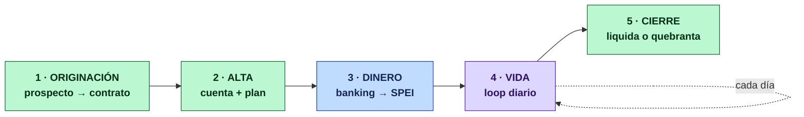

---

## 2. No revolvente — `PERSONAL_LOAN`, `PAYROLL_LOAN`, `MICRO_LOAN`, `SME_LOAN`

### 2.a Del prospecto al dinero

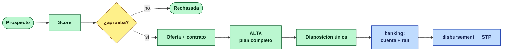

### 2.b La vida y el cierre

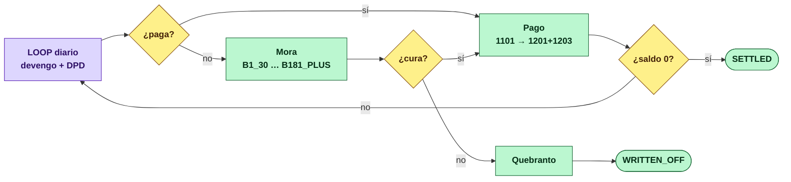

---

## 3. Revolvente de uso propio — `CREDIT_CARD`, `REVOLVING_LINE`

### 3.a El producto es de uso propio — la disposición NO saca dinero

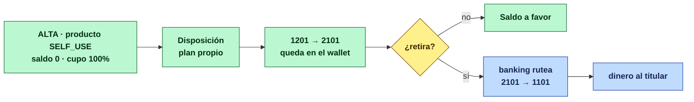

> **El tipo lo fija el producto, no la petición.** Un producto de uso propio dispone siempre para su
> titular. Hoy la petición del wallet puede mandar otro tipo y el fallback lo lleva a `SELF_USE`.

### 3.b El corte y el final que no existe

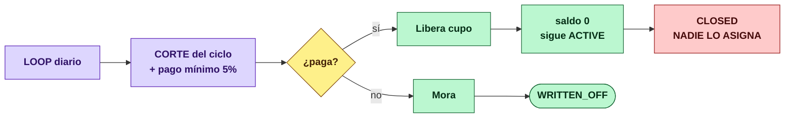

> **Saldo cero no liquida.** `settleIfClear()` retorna si `isRevolving()`: la línea queda `ACTIVE`
> con el cupo restaurado. Y **no hay forma de cancelarla** — `CLOSED` no se asigna en ningún sitio.

---

## 4. Revolvente de distribuidor — `DISTRIBUTOR_LINE`

### 4.a La colocación: donde el `Noop` más duele

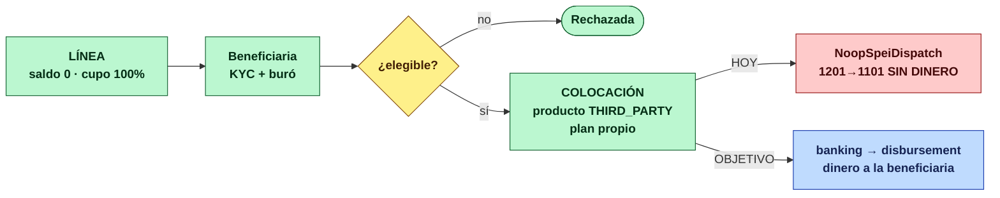

### 4.b La comisión y el retorno del cupo

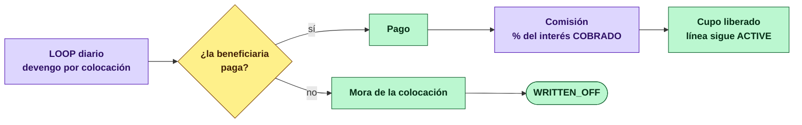

---

## 5. El loop de cierres — común a los tres

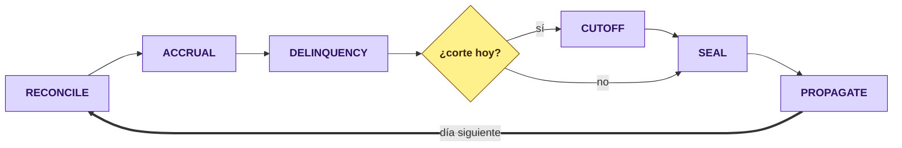

---

# Parte II bis — El devengo es diario; la mora la marca la fecha de pago

## El circuito está cortado en un punto exacto

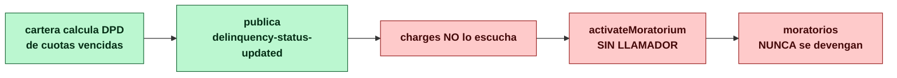

**Verificado:** `charges` sólo consume `balance-updated`, `charge-rejected` y
`credit-account-activated`. **No escucha la mora.** Y `activateMoratorium()` sólo lo invocan dos
pruebas — cero llamadores de producción. La cuenta contable `4102` (ingreso moratorio) nunca recibe
un abono.

**Lo que ya funciona y no hay que rehacer:** cartera **sí** calcula el DPD desde las cuotas vencidas
(`findPendingOverdueByScheduleId` para no revolvente, `vencidasDeSusDisposiciones` para revolvente) y
**sí** publica `delinquency-status-updated` con `daysDelinquent`. Falta **un listener y una llamada**.

## De dónde sale la fecha de pago, por producto

| Producto | Fecha exigible | Fuente | Estado |
|---|---|---|---|
| **No revolvente** | Vencimiento de la cuota | `installments.due_date` (plan de amortización) | ✅ existe |
| **Revolvente self** | Fecha límite del corte | `cutoff_schedules.payment_due_date` | 🔴 el corte no existe aún |
| **Revolvente distribuidor** | Fecha límite del corte, por ciclo de la línea | `cutoff_schedules.payment_due_date` | 🔴 el corte no existe aún |

Hoy el DPD de un revolvente sale de **las cuotas de cada disposición**, no de la fecha límite del
corte. Son dos modelos distintos y hay que elegir a propósito:

| Modelo | Qué implica |
|---|---|
| **Por cuota de disposición** *(hoy)* | Cada colocación envejece por su cuenta. Encaja con «compras a meses» |
| **Por fecha límite del corte** *(lo que describes)* | La línea entra en mora si no se cubre el exigible del ciclo, sin importar de qué disposición venga |

## La regla, escrita

```
fechaExigible = plan.dueDate            (no revolvente)
              | corte.paymentDueDate    (revolvente)

mora  ⇔  hoy > fechaExigible + gracia   ∧  la cuota/exigible sigue sin cubrirse

moratorio_diario = saldoVencido × tasaMoratoria / base   ← sólo sobre lo VENCIDO
```

**Dos precisiones que el as-is no respeta:**

1. **El moratorio se devenga sobre el saldo vencido, no sobre el principal completo.**
   `accrueMoratoriumForSchedule` usa hoy `schedule.getPrincipalBalance()` — **todo el saldo**. Sobre
   un crédito de $20 000 con una cuota vencida de $2 000, cobra mora sobre los $20 000. Es un cobro
   diez veces mayor al que corresponde.
2. **La gracia tiene dos fuentes.** `AccrualSchedule.gracePeriodDays` (default 3) y
   `close_cycle_policies.payment_due_offset_days`. Deben ser una sola, y la del producto manda.

## Y el corte del devengo

El interés **ordinario** deja de devengarse cuando la cuenta es terminal (`SETTLED`/`WRITTEN_OFF`) —
ya lo hace. El **moratorio** debe apagarse en cuanto el exigible se cubre: `updateBalanceFromEvent`
cierra el calendario en estado terminal, pero **nadie desactiva la mora al curarse**.

---

# Parte II ter — Parcialidades, BNPL y skip payment

## Doble check: qué existe hoy

| Capacidad | Estado | Evidencia |
|---|---|---|
| **Parcialidad del distribuidor** — número de pagos al colocar | ✅ **Existe y funciona** | `ProcessDispositionCommand.termPeriods` + `min_term/max_term/default_term` del producto + `amortization_type='FRENCH'` (changeset `014-distributor-line-disposition-terms.sql`) |
| **Parcialidad de uso propio** — diferir la compra **después** | 🔴 **No existe, y el modelo está invertido** | Toda disposición nace con calendario: `generarCalendarioDeDisposicion(account, disposition, cmd.termPeriods())` |
| **BNPL** — devengar desde una fecha | 🔴 **No existe nada** | Sin `accrual_start_date`; `needsAccrual` devenga desde el día uno |
| **Skip payment** | 🔴 **Cero** | Ni una referencia en todo el monorepo |

### El hallazgo del modelo invertido

Hoy **toda** disposición —también la de uso propio— nace con su calendario de amortización. El
comentario del código lo dice: *«una revolvente no tiene un plazo; lo tiene cada disposición»*.

Eso es correcto **para el distribuidor**, donde el vendedor decide «a cuántos meses se lo dejas» en
el momento de colocar. **Para una tarjeta es al revés:** la compra nace *revolvente pura* —exigible
completa al siguiente corte— y **el titular decide diferirla después**, antes de que corte.

Con el modelo actual, una compra con tarjeta ya nace parcializada al plazo por defecto del producto,
que no es lo que el cliente pidió ni lo que el corte debería exigirle.

## Las dos mecánicas, lado a lado

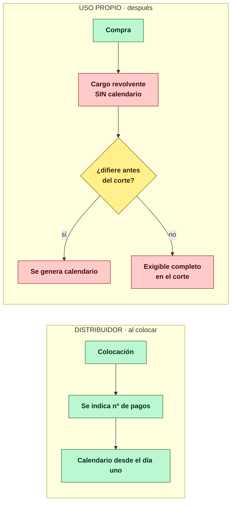

🟥 = lo que hay que construir.

## El exigible del corte, que es la regla que ordena todo

**Por defecto, una tarjeta o línea de uso propio paga el total en la siguiente fecha de pago
posterior al corte.** El corte genera el cargo por **la totalidad** de compras y disposiciones del
ciclo. Diferir una compra la **saca de ese exigible** y la convierte en compra a plazos.

```
exigibleDelCorte = Σ compras del ciclo  −  Σ compras diferidas  +  Σ cuotas de planes vigentes
```

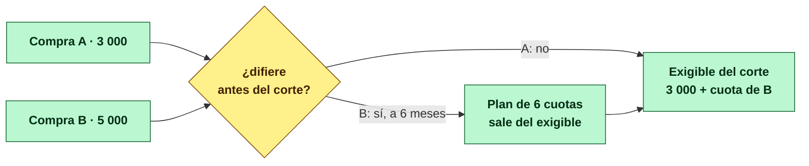

## La configuración, en el producto

| Campo | Valores | Para qué |
|---|---|---|
| `installmentPlanMode` | `AT_DISPOSITION` · `POST_HOC` · `NONE` | Distribuidor decide al colocar; tarjeta puede diferir después |
| `deferralCutoffRule` | `BEFORE_CUTOFF` · `BEFORE_DUE_DATE` · `NONE` | Hasta cuándo se difiere una compra ya hecha |
| `deferralDefaultTerm` | entero — **default 3** | Plazo si el cliente no elige |
| `deferralRate` | de `rate_cards` con `purpose='DEFERRAL'` — **default 0 (MSI)** | La tasa por diferir, por banda de plazo |
| `bnplEnabled` + `bnplMaxDeferralDays` | booleano · entero | **Al originar**: hasta cuándo se puede empezar a pagar |
| `skipPaymentEnabled` + `maxSkipsPerCycle` + `skipMode` | booleano · entero · `GIFT` \| `DEFERRAL` | El salto de pago |
| `reliefEligible` | booleano | Si el producto admite programas de apoyo |

## Las cuatro mecánicas, resueltas

### 1 · Diferir una compra → **se recalcula**

El diferimiento ocurre **antes del corte**, así que el interés devengado en ese tramo se recalcula:
el plan sustituye lo devengado como revolvente.

**Implica reversar en el mayor.** El mecanismo ya existe y no hay que inventarlo:
`charges.charge-reversed` → `PostingRule('CHARGE_REVERSED', '4103', '1203')`. Cada devengo diario
entre la compra y el diferimiento se reversa, y el plan genera los suyos.

> Consecuencia contable: **la reversa y el nuevo plan tienen que caer en el mismo período**. Si el
> diferimiento cruza el cierre contable, la reversa entra como extemporánea — que el mayor ya sabe
> manejar (`is_late_posting`), pero hay que verificarlo en prueba.


#### La tasa del diferimiento — MSI y promociones

**El plazo y la tasa del diferimiento vienen de la configuración del producto**, no del cliente ni
del código.

| Parámetro | Default | Qué significa |
|---|---|---|
| `deferralDefaultTerm` | **3** | A cuántos pagos se difiere si el cliente no elige |
| `deferralRate` | **0** | **Meses sin intereses.** El default es MSI |
| `deferralMinTerm` / `deferralMaxTerm` | del producto | No se puede diferir a un plazo que el producto no admite |

**La tasa se resuelve por plazo, no es un valor único.** Un producto real ofrece «3 y 6 MSI, 9 al
18%, 12 al 24%». Eso es una tabla por banda de plazo.

##### Reutilizar `rate_cards`, que ya hace exactamente eso

La tabla `credit_product.rate_cards` ya resuelve tasas por bandas —`tier_band`, `min/max_amount`,
**`min/max_term`**— con la regla «gana la coincidencia más específica». Su propio comentario da el
ejemplo: *«SME_LOAN by term band: (1-12, 0.22) | (13-36, 0.26)»*.

Falta un discriminador de propósito, porque la tasa de diferir **no es** la tasa de originar el
mismo producto:

```sql
ALTER TABLE credit_product.rate_cards
    ADD COLUMN purpose VARCHAR(12) NOT NULL DEFAULT 'ORIGINATION'
        CHECK (purpose IN ('ORIGINATION', 'DEFERRAL'));
```

Con eso, un MSI de tarjeta es:

| `purpose` | `min_term` | `max_term` | `nominal_rate` |
|---|---|---|---|
| `DEFERRAL` | 3 | 6 | **0.0000** |
| `DEFERRAL` | 7 | 9 | 0.1800 |
| `DEFERRAL` | 10 | 12 | 0.2400 |

##### 🔴 El bloqueador: la restricción prohíbe la tasa cero

```sql
CONSTRAINT ck_rc_nominal_rate CHECK (nominal_rate > 0 AND nominal_rate < 1)
```

**Tal como está, la tabla rechaza un MSI.** Hay que relajarla a `>= 0` para la tasa nominal. La
moratoria se queda en `> 0`: una promoción puede no cobrar interés ordinario, pero si el cliente cae
en mora sí devenga moratorio — si no, diferir sería una forma de dejar de pagar sin consecuencia.

##### ✅ Lo que ya funciona y no hay que tocar

`AmortizationEngine.fixedPayment` **ya maneja la tasa cero**:

```java
if (r.compareTo(BigDecimal.ZERO) == 0) {
    return principal.divide(BigDecimal.valueOf(n), MC);
}
```

Con tasa 0 la cuota es `capital / n`, el interés de cada período sale en cero y el IVA también. **Un
MSI genera un plan de puro capital sin cambiar el motor.** Falta la prueba que lo fije.

##### Lo que implica contablemente

Un plan MSI **no genera póliza de ingreso**: no hay `1203 → 4101` porque no hay interés. Combinado
con la reversa de lo devengado como revolvente, el efecto neto es que **el cliente paga exactamente
el importe de la compra**, repartido en N pagos. La institución absorbe el costo de fondeo — que es
lo que un MSI es.


### 2 · Skip payment → **congela la deuda**, y el modo lo da el producto

| Modo | Qué pasa | Para qué producto |
|---|---|---|
| `GIFT` | El período saltado **no devenga** | Recompensa real |
| `DEFERRAL` | **Sigue devengando**; la cuota se corre | Aplazamiento |

En ambos: **no genera mora** y el compromiso se recorre.

**Es una opción del cliente**, no del backoffice: la app permite elegir **qué pago o compromiso se
salta**, y el camino es `app → BFF → credit-portfolio`. Requiere endpoint en el BFF móvil y tope por
ciclo (`maxSkipsPerCycle`).

### 3 · Programa de apoyo por contingencia → **se implementa como reestructura**

Lo que describes —correr el monto a la siguiente fecha de pago, que no genere saldo por cobrar en ese
momento, y decidir **a qué créditos** se otorga— es un **diferimiento de pagos**. Jurídicamente es
una reestructura, y **por ahí se va**.

**Decidido: `CONTRACTUAL_FORBEARANCE`.** Sin modo regulatorio, sin dependencia de un criterio contable
especial vigente. El camino es el que el sistema ya sabe recorrer.

#### Las consecuencias, aceptadas y dichas

Tratarlo como reestructura activa lo que el sistema ya hace, y hay que asumirlo con los ojos
abiertos:

| Pieza | Qué ocurre |
|---|---|
| `risk` · `markForborne()` | Marca `is_forborne`, **fuerza IFRS-9 STAGE_2 como piso** y reinicia el reloj de cura (`cureMonths = 6`, RC-04) |
| Reserva | **Sube**, por el paso a STAGE_2 |
| `credit-portfolio` | La cuenta puede pasar a `RESTRUCTURED` |
| `collections` · `BureauEventType` | Sólo reporta `WRITE_OFF` y `QUITA_PARCIAL` — **la reestructura no se reporta al buró** |

> El costo del apoyo es **más reserva**, no una degradación del historial del cliente ante el buró.
> Es el precio de no depender de una autorización regulatoria que puede no estar vigente cuando la
> contingencia ocurra — que es justo cuando se necesita actuar rápido.

#### Lo que hay que construir sobre lo existente

El convenio que ya existe (`CollectionAgreement.RESTRUCTURE`) es **bilateral y de uno en uno**:
`PROPOSED → ACCEPTED → EXECUTED`, atado a un caso de cobranza. Un programa de contingencia es lo
contrario: **masivo, otorgado por la institución, y sobre cuentas que pueden estar al corriente**.

Así que se añade el otorgamiento masivo y se reutiliza el efecto:

| Campo de `ReliefProgram` | Para qué |
|---|---|
| `nombre`, `motivo` | `SANITARY` · `NATURAL_DISASTER` · `SECURITY` · `OTHER` |
| `vigencia` | Desde–hasta, y **nº de períodos diferidos** |
| `elegibilidad` | Producto · sucursal · región · estado · DPD máximo a una fecha de corte |
| `eligibilityCutoffDate` | «Al corriente a esta fecha» — evita que el apoyo tape mora previa |
| `accrualDuringRelief` | `ACCRUES` \| `WAIVED` |
| `authorizedBy`, `approvedBy` | Maker-checker, como `configuration-service` |

#### La mecánica

```
Por cada cuenta elegible, durante N períodos:
  · las cuotas del período se corren a la siguiente fecha de pago
  · NO son exigibles → sin saldo por cobrar, sin DPD, sin moratorio, sin cobranza
  · el devengo ordinario sigue o se condona, según `accrualDuringRelief`
  · se marca forborne (piso STAGE_2, reloj de cura)
  · al vencer la vigencia, el calendario retoma y el DPD vuelve a correr
```

**Comparte el mecanismo del skip payment** —correr el vencimiento— y se diferencia en tres cosas: lo
otorga la institución y no el cliente, aplica **masivamente por criterio de elegibilidad**, y marca
forborne. Se implementa sobre la misma base para no tener dos formas de mover una fecha de pago.

#### Trazabilidad

Cada cuenta apoyada guarda: **programa, motivo, quién autorizó, qué cuotas se corrieron, de qué fecha
a qué fecha, y qué se devengó durante la vigencia.** Es lo que permite sustentar el apoyo ante el
cliente y ante una revisión.

### 4 · BNPL → **al originar**, corre todo

Es una decisión del alta, no posterior. Fija **cuándo empieza a pagar** y con ello **se desplaza el
plan completo**: el devengo arranca en esa fecha *y* el primer vencimiento también.

```
fechaInicioBNPL = alta + n días   (tope: bnplMaxDeferralDays)
primeraCuota    = fechaInicioBNPL + 1 período
devengoArranca  = fechaInicioBNPL
```

## Lo que toca en cada pieza

| Pieza | Cambio |
|---|---|
| `credit-product` · `Capabilities` | Los campos nuevos + seeds por producto |
| `credit-portfolio` · `Disposition` | Estado `REVOLVING` (sin plan) vs `AMORTIZED` (con plan) |
| `credit-portfolio` · **diferir disposición** | Genera el plan y **dispara la reversa** de lo devengado |
| `credit-portfolio` · **skip payment** | Corre el compromiso; `GIFT` o `DEFERRAL` según producto |
| `credit-portfolio` · **programa de apoyo** | Corre los vencimientos; las cuotas diferidas **dejan de ser exigibles** |
| `risk` | El otorgamiento llama `markForborne()` — piso STAGE_2 y reloj de cura, como cualquier reestructura |
| `collections` | Una cuenta bajo programa **no entra a cobranza** durante la vigencia |
| `charges` · `AccrualSchedule` | `accrual_start_date` (BNPL) · `freezeAccrual` · reversa al diferir |
| `closing` · `CutoffPhaseProcessor` | `exigible = Σ compras − Σ diferidas + Σ cuotas vigentes` |
| `accounting` | La reversa usa `CHARGE_REVERSED`, que ya tiene regla de posteo |
| `channel-mobile` (BFF) | Endpoints de **diferir compra** y **saltar pago** |
| `channel-backoffice` (BFF) | Alta del **programa** y padrón de elegibles, con maker-checker |

---

# Parte III — Análisis previo (AN-01 … AN-26)

> Estas 26 tareas **son** la revalidación inicial. Su resultado es lo que confirma o corrige el plan
> antes de que se escriba código.

**Ninguna tarea de implementación arranca sin su análisis.** Cada uno es falsable: tiene un comando
y un resultado esperado. Si el resultado no coincide, el plan cambia.

## Camino del dinero

| # | Componente | Qué se verifica | Por qué importa |
|---|---|---|---|
| **AN-01** | `credit-portfolio` · `SpeiDispatchPort` | Quién llama y qué se rompe al quitarlo (`CreditAccountService:301-303`) | Un solo llamador; el hecho a publicar lleva todo |
| **AN-02** | `wallet` · `WalletDispatchPort` | Confirmar que `wallet.withdrawal-completed` → disbursement ya cubre el retiro | El puerto es un **duplicado**: se borra sin sustituto |
| **AN-03** | `dispositionType` en el comando | Quién lo manda y qué pasa con un valor inválido | 🔴 **Se puede desviar el dinero al wallet del distribuidor** |
| **AN-04** | `stp.ordering_accounts` | Inventariar **todas** las CLABE propias del monorepo | Una sola fuente que migrar |
| **AN-05** | `disbursement.routing_rules` | Quién las lee; impacto en `DisbursementDecouplingTest` (7 reglas) | Migración sin romper ArchUnit |
| **AN-06** | `RestClientStpGateway` | **¿`V2/conciliación` expone abonos RECIBIDOS?** Hoy filtra `tipoOrden="E"` | 🔀 **Bifurcación del alcance** |
| **AN-07** | `DisbursementInstruction` | Payload campo por campo hasta `stp.payment_orders` | Qué devuelve banking al rutear |
| **AN-08** | Órdenes históricas | `SELECT status, COUNT(*)` en ambos servicios | Dimensionar y detectar colgadas |
| **AN-09** | `StubStpGateway` | Los 11 escenarios y cómo se activan (por centavos) | Plantilla del mock de banking |
| **AN-10** | Ventana SPEI vs calendario | `RoutingService` (17:10→16:50) vs `closing.calendar_days` | Dos calendarios que deben ser uno |

## Contabilidad y conciliación

| # | Componente | Qué se verifica | Por qué importa |
|---|---|---|---|
| **AN-11** | Catálogo contable | Confirmar que sólo existe `1101` y no hay puente | Cuántas cuentas crear |
| **AN-12** | `closing` tablas `bank_*` | Confirmar sin código ni datos | Mover es gratis |
| **AN-13** | Cadena de ids | Reconstruir a mano un pago de la siembra hasta la póliza | La cadena es reconstruible antes de automatizarla |
| **AN-14** | `balance_events` | Guarda `applied_at`, no la fecha del hecho | Bloquea los cuadres C1 y C2 |

## Mora

| # | Componente | Qué se verifica | Por qué importa |
|---|---|---|---|
| **AN-15** | `charges` ↔ `delinquency-status-updated` | Confirmar que no hay listener | Cierra el circuito de la mora |
| **AN-16** | Base del moratorio | Usa el principal **completo**, no el vencido | 🔴 **Cobro diez veces mayor al debido** |
| **AN-17** | Gracia: dos fuentes | `gracePeriodDays` vs `payment_due_offset_days` | Unificar en la política del producto |
| **AN-18** | Apagado de la mora | Quién la desactiva al curar (nadie) | Diseñar el apagado |

## Parcialidades, BNPL, skip y congelamiento

| # | Componente | Qué se verifica | Por qué importa |
|---|---|---|---|
| **AN-19** | `Capabilities` duplicada | Está en `credit-product` **y** `credit-portfolio` | Un campo nuevo se replica en dos sitios |
| **AN-20** | `generarCalendarioDeDisposicion` | Si NO se genera calendario, ¿el DPD encuentra algo que vencer? | 🔴 **Una revolvente pura no puede caer en mora** — hay que atarla al corte |
| **AN-21** | Compras ya diferidas en la siembra | Si `seed-distribuidoras.py` produce colocaciones con plazo | Datos para el E2E |
| **AN-22** | Interés devengado al diferir | Qué cargos existen entre compra y diferimiento | Alimenta la reversa |
| **AN-23** | Congelamiento vs jobs | Dónde cortar el DPD sin romper `DelinquencyCalculationJob` | `freezeDelinquency` con el mínimo cambio |
| **AN-27** | `rate_cards` para diferimiento | 🔴 `CHECK (nominal_rate > 0)` **prohíbe la tasa cero**: un MSI no se puede configurar |
| **AN-28** | `fixedPayment` con tasa 0 | ✅ Ya devuelve `capital / n`. El motor soporta MSI sin cambios — falta la prueba |
| **AN-24** | Reversa al diferir | Si `CHARGE_REVERSED` cubre el caso | La regla de posteo ya existe |
| **AN-25** | Maker-checker | Cómo lo hace `configuration-service` | Reusar el patrón, no inventarlo |
| **AN-26** | Pruebas que fijan el bug | `process_thirdPartyCredit_dispatchesSpei` (`:301`) y las de wallet | Cuáles deben **fallar** al corregir |

# Parte IV — Implementación (BK-01 … BK-48)

> ⚠️ **Cada tarea arranca revalidando sus supuestos** — ver «Regla de ejecución» arriba. El criterio
> de aceptación de la columna derecha no sustituye ese paso: lo cierra.

## Fase 0 · Spike — sin código de producción
| # | Tarea | Entregable |
|---|---|---|
| **BK-01** | Ejecutar AN-01 … AN-26 y registrar resultados con desviaciones | Documento con los 26 resultados |
| **BK-02** | **ADR de la fuente del estado de cuenta** según AN-06 | Decisión: STP recibidas / archivo / API del banco |

> **BK-02 es la bifurcación.** Si STP expone abonos recibidos, la ingesta extiende el poller que ya
> existe. Si no, hay que construir un ingestor de archivo — varias veces más trabajo.

## Fase 1 · El dominio `banking` — ✅ **HECHA**
| # | Tarea | Aceptación | Estado |
|---|---|---|---|
| **BK-03** | Módulo Gradle, puerto **8104**, schema `banking`, hexagonal, Compose | Arranca, health UP, Liquibase aplica | ✅ |
| **BK-04** | Mover las 5 tablas `bank_*` de `closing` → `banking` | closing conserva sus pruebas | ✅ |
| **BK-05** | `BankAccount` con CLABE, institución, **cuenta contable** y cuenta puente | Alta y consulta | ✅ |
| **BK-06** | Cuenta contable `1109 Depósitos por identificar` | El no identificado cuadra contra la puente | ✅ **con desviación** |

### Resultado — 24 pruebas nuevas, 0 fallos

| | |
|---|---|
| `banking-service` | 24 pruebas (12 unitarias · 5 de esquema · 7 de aceptación) |
| `closing-service` | 62 — era 63; la que baja es `bancoIdempotente`, que **se mudó** a banking con las tablas |
| `accounting-service` | 28, verdes con el catálogo ampliado |

### 🔀 Desviación de BK-06: son **dos** cuentas puente, no una

El plan pedía `1109 Depósitos por identificar`. Una sola cuenta obliga a que los cargos no aclarados
vivan en una cuenta de naturaleza **deudora** llamada «depósitos», con saldo del signo contrario al
de su nombre. Las dos direcciones ocurren y tienen naturaleza opuesta:

| Dirección | Qué es | Cuenta |
|---|---|---|
| Llegó dinero y no sabemos de quién | Lo **debemos** hasta demostrar lo contrario → **pasivo** | `2109 Depósitos por identificar` |
| El banco nos cargó y no sabemos por qué | Un derecho por aclarar → **activo** | `1109 Cargos bancarios por aclarar` |

Presentarlas juntas obligaría a **compensar activo con pasivo**, que es justo lo que un catálogo
existe para impedir. `bank_accounts` declara las dos: `suspense_credit_account` y
`suspense_debit_account`.

**Y un segundo hallazgo del mismo pase:** `suspense_entries.status` admitía `WRITTEN_OFF` y ese
estado **no tenía contrapartida contable** — la partida se cerraba en banking y en el mayor seguía
viva para siempre. Se añaden `4105 Otros ingresos — partidas prescritas` y `5105 Otros gastos —
partidas incobrables` para cerrarla.

**La reclasificación no registra el hecho de negocio.** Cuando un depósito se identifica como el pago
de una cuenta, el flujo de pagos postea su `PAYMENT_APPLIED` (`1101 → 1201`) por su cuenta. Si el
asiento de identificación cargara **además** contra `1201`, el banco subiría **dos veces** por el
mismo depósito. Por eso `BANK_DEPOSIT_IDENTIFIED` sale contra `1101`.

### Deuda declarada en el pase — **BK-49**

El dígito verificador de la CLABE está escrito **tres veces**: `stp.ClabeValidator`,
`disbursement.ClabeValidator` y ahora `banking.Clabe`. Mismo algoritmo de Banxico, tres copias
verificadas como equivalentes. Consolidar en `shared` toca el camino caliente del dinero en dos
servicios que la **Fase 3 va a reescribir**: se hace **después** de la Fase 3, no antes. Se registra
como **BK-49** y no se hace silenciosamente.

## Fase 2 · Banking decide por dónde sale — ✅ **HECHA**
| # | Tarea | Aceptación | Estado |
|---|---|---|---|
| **BK-07** | Migrar `ordering_accounts` → `banking`, **en dos pasos** | Los 3 ArchUnit de stp verdes | ✅ **paso 1** |
| **BK-08** | Migrar `routing_rules` → `banking.payout_routes` | Los ArchUnit de disbursement verdes | ✅ |
| **BK-09** | `PayoutRoutingService`: (empresa, monto, rail) → **cuenta + rail + proveedor** | Determinista; regla nueva = `INSERT` | ✅ |
| **BK-10** | Contrato con disbursement | Sin imports entre módulos | ✅ **con desviación** |

### Resultado — 172 pruebas verdes en los cuatro servicios tocados

| | |
|---|---|
| `banking-service` | 39 (12 de ruteo, 12 de dominio, 8 de esquema y seed, 7 de aceptación) |
| `disbursement-service` | 37 — bajan las 6 de `RoutingRuleTest`, que se fue con la tabla; suben 4 nuevas |
| `stp-service` | 34 |
| `closing-service` | 62 |

### 🔴 El hallazgo que cambió el alcance: **la configuración del carril nunca se sembró**

Buscando qué migrar de `disbursement.routing_rules` salió algo peor que una tabla mal ubicada:

```
grep -rn "INSERT INTO disbursement.routing_rules" .   → sin resultados
grep -rn "ordering_accounts" scripts/                 → sin resultados
```

**Ni un changeset ni un script sembró jamás una fila.** Con `routing_rules` vacía,
`findProvider` devolvía siempre vacío, cada orden se aplazaba con `NO_ROUTING_RULE` y a los seis
intentos moría en `FAILED`. Del lado del conector, registrar una orden lanzaba
`OrderingAccountNotFoundException`.

Que eso no se notara en **ningún** ambiente es la prueba más limpia de que el carril del dinero
nunca se ejecutó: el `Noop` de cartera lo cortocircuitaba antes de llegar ahí. Mover la
configuración sin sembrarla habría reproducido el hueco con otro nombre — por eso banking trae seed
(`005-seed-demo`) y una prueba que lo fija (`SeedDelCarrilIT`).

### 🔀 Desviación de BK-10: el contrato es **HTTP**, no un evento

El plan decía «contrato por evento». Se implementó como llamada síncrona por el puerto ACL
`PayoutRouteResolverPort`, y el motivo es que **la petición de ruta es pregunta-respuesta**:
modelarla como par de eventos exige un almacén de correlación y deja órdenes en limbo mientras la
respuesta no llega. Para dinero, peor.

Lo que el plan pedía de fondo —**sin imports entre módulos**— sí se cumple, y los dos `ArchUnit` lo
imponen ahora explícitamente: `com.fintech.banking..` está en la lista de paquetes prohibidos tanto
en `DisbursementDecouplingTest` como en `StpDecouplingTest`.

**Y trae una consecuencia que había que resolver a propósito:** una llamada síncrona en el camino
del dinero puede fallar. Se distinguen **tres** desenlaces y no dos:

| Respuesta de tesorería | Qué le pasa a la orden |
|---|---|
| Hay ruta | Se despacha con la cuenta elegida |
| **No** hay ruta (4xx) | Configuración incompleta: **gasta intento**, tiene que doler |
| Tesorería no responde | Indisponibilidad pasajera: **espera 30 s sin gastar intento** |

Confundir los dos últimos haría que una caída de minutos agotara los seis intentos de órdenes
válidas y las dejara `FAILED`. Hay una prueba que corre diez pasadas del job con tesorería caída y
afirma que el contador de intentos sigue en cero.

### Un defecto latente que salió de paso: **se firmaba con la cuenta de hoy, no con la de la orden**

`OutboxRelayService` releía la cuenta ordenante **por id en el momento de firmar**, que puede ser
minutos después de registrar la orden. Cambiar la cuenta ordenante de una empresa en esa ventana
alteraba la cadena original de una orden ya registrada.

`payment_orders` guarda ahora la **fotografía** de la cuenta con la que se firma
(`012-ordering-account-snapshot`), y el relay firma con eso. Cierra la ventana y además es lo que
permite que el id venga de `banking` sin resolver contra el catálogo local.

### Lo que queda: **BK-07b**

`stp.ordering_accounts` sigue viva como caída de la migración: si una orden llega sin cuenta
ordenante, el conector usa el catálogo local. Es el paso 2 de los dos que pedía BK-07 — se retira
cuando no queden órdenes registradas antes del cambio.

## Fase 3 · Matar los dos despachadores paralelos — ✅ **HECHA**

> **410 pruebas verdes** en los ocho servicios tocados. `grep -rn "Noop.*Dispatch\|DispatchPort"`
> ya no encuentra ni un despachador paralelo en cartera ni en wallet.

| Qué cambió | Antes | Ahora |
|---|---|---|
| Quién dispersa | Cartera, contra un stub que devolvía `SPEI-STUB-…` | `disbursement`, con evidencia del proveedor |
| Cuándo se completa la disposición | Al autorizar | Cuando el proveedor confirma |
| Quién decide el tipo | **La petición** | El **producto**, desde sus `Capabilities` |
| Póliza de uso propio | `1201 → 2101` (queda en la plataforma) | `1201 → 1101` — sale a la cuenta del titular |
| Si el banco devuelve | Nadie escuchaba | Cartera revierte saldo y cupo |

**Lo que se rompió a propósito.** `process_thirdPartyCredit_dispatchesSpei` afirmaba que la
colocación despachaba SPEI desde cartera. Dejó de compilar al quitar el puerto —la señal de que la
corrección llegó— y se reescribió como `laColocacionAutorizaYNoDispersa`, que ahora afirma lo
contrario: se publica `disposition-authorized` y **no** se completa nada.

**Y algo que las pruebas destaparon:** las de colocación a tercero se hacían sobre una línea de uso
propio mandando `"THIRD_PARTY_CREDIT"` en el comando. Es exactamente el agujero: cualquiera podía
hacer lo mismo en producción. Ahora necesitan una línea cuyo **producto** disponga a la beneficiaria
(`activeDistributorLine` + `distributorConfig`), y no hay forma de pedirlo desde fuera.

**Sin configuración de producto, la disposición se detiene.** Un default aquí sería el mismo agujero
con otro disfraz: adivinar el tipo es adivinar a quién se le manda el dinero.

| # | Tarea | Aceptación | Estado |
|---|---|---|---|
| **BK-11** | **Eliminar `SpeiDispatchPort` + Noop** de `credit-portfolio` | No compila nada que dispersa desde cartera | ✅ |
| **BK-12** | **Eliminar `WalletDispatchPort` + Noop** de `wallet` | Sin sustituto: el evento ya existe | ✅ |
| **BK-13** | **Quitar `dispositionType` del comando y del evento**; cartera lo resuelve de `Capabilities` | Una petición no puede cambiar el destino del dinero | ✅ |
| **BK-14** | Cartera publica el hecho que disbursement ya escucha | El camino recorre banking → disbursement → conector | ✅ |
| **BK-15** | **Mock de proveedor con escenarios**, nunca no-op | Se provoca `REJECTED_PLD`, `RETURNED`, `NEVER_SETTLES` | ✅ ya existía |
| **BK-16** | Consumidor de `disbursement.returned` → revertir en cartera | El banco devuelve y cartera se entera | ✅ |
| **BK-17** | **Reescribir las pruebas que fijan el bug** (AN-26) | Afirman el camino correcto | ✅ |

## Fase 4 · Cerrar el circuito de la mora — ✅ **HECHA** (salvo BK-22, que va con la Fase 5)

> **242 pruebas verdes** en los tres servicios tocados: charges 40, credit-portfolio 139, closing 63.

| # | Tarea | Aceptación | Estado |
|---|---|---|---|
| **BK-19** | **Moratorio sobre el saldo VENCIDO**, no el principal completo | Con cuota vencida de $1 000 sobre $10 000, cobra sobre $1 000 | ✅ |
| **BK-18** | Listener de `delinquency-status-updated` en `charges` | La mora se enciende sola pasada la gracia | ✅ |
| **BK-20** | Apagar la mora al cubrirse el exigible | Curada la cuenta, deja de devengar | ✅ |
| **BK-21** | Unificar la gracia | Una sola fuente | ✅ **hallazgo distinto al previsto** |
| **BK-22** | Revolvente: la fecha exigible sale del **corte** | Requiere el corte | ⏳ va con BK-24+BK-27 (AN-20) |

### El orden importó, y se respetó

BK-19 **antes** que BK-18, como pedía AN-16. Al revés, la primera corrida del listener habría
encendido el cobro sobre el saldo completo en toda la cartera vencida.

### Cómo se cierra el circuito

Cartera ya medía la mora desde las cuotas vencidas y publicaba el hecho; nadie lo escuchaba, y
`activateMoratorium()` tenía **cero llamadores de producción**. La cuenta `4102` —ingreso
moratorio— no había recibido un abono en toda la historia del sistema.

El evento llevaba sólo los días de atraso, lo que no basta: quien lo consumiera tendría que
**adivinar la base**. Ahora lleva `overduePrincipal` y `oldestDueDate`, que cartera ya tiene
calculados cuando publica —de las mismas cuotas sale el DPD—. Dos pruebas de contrato lo fijan.

**Capital vencido, no importe vencido.** Cobrar mora sobre el interés de la cuota es interés sobre
interés. En una cuota francesa temprana el interés es la mayor parte del importe, así que la
diferencia no es teórica.

**Una cuota PARTIAL cuenta entera.** El modelo no lleva el abono acumulado por mensualidad —lo dice
el javadoc de `Installment.applyPayment`— y sin esa columna descontar «algo» sería inventarlo. Se
sobreestima, se declara, y se corrige cuando exista la columna.

### 🔀 BK-21: el hallazgo fue otro

AN-17 dio por hecho que las dos fuentes de la gracia tenían valores distintos. Al revisarlo la
divergencia es más estrecha y más traicionera: `charges` usa 3, el **seed** de políticas del cierre
ya inserta 3 —su comentario lo dice—, pero el **DEFAULT de la columna** es 0.

Coincidían mientras alguien especificara la columna. La primera política dada de alta sin ella
—desde el backoffice, desde un script— dejaba a esas cuentas cayendo en mora al día siguiente del
vencimiento con las vecinas teniendo tres días. **Un default que sólo se equivoca cuando nadie mira
es peor que uno que se equivoca siempre.**

### ⚠️ Un error que introduje y que las pruebas cazaron en la misma pasada

Al cambiar la base del moratorio, un `replace` sin contador tocó **también el devengo ordinario**:
quedó cobrando interés ordinario sólo sobre el capital vencido en vez de sobre el saldo insoluto.
Tres pruebas de `InterestAccrualServiceTest` fallaron de inmediato y lo señalaron.

Queda escrito en el código por qué son distintos: el ordinario es el precio del dinero prestado
—esté vencido o no—; el moratorio es una penalización sobre lo que se dejó de pagar. Confundirlos
en cualquiera de los dos sentidos es un cobro incorrecto.

## Fase 5 · Parcialidades, BNPL, skip y congelamiento — ✅ **HECHA**

> **BK-22 … BK-36 completas.** credit-portfolio 185 · charges 50 · credit-product 68 · risk 54.

### BK-23 · las opciones de pago, sin romper cincuenta llamadas

Los diez campos nuevos no se añadieron a `Capabilities` como diez posiciones más: van en un objeto
propio, `OpcionesDePago`. **Un record de diecinueve posiciones se construye mal tarde o temprano, y
ya pasó** — una prueba de contrato (BK-44) cazó dos campos que nunca se llegaron a poblar porque
nadie notó que faltaban en la llamada.

`Capabilities` conserva un constructor de nueve argumentos que delega en el nuevo, así que los seeds,
las pruebas y los fallbacks degradados siguen compilando sin editarse. Quien no declara opciones no
las tiene: un default permisivo convertiría cada producto viejo del catálogo en uno que admite
diferir y saltar pagos sin que nadie lo haya decidido.

### BK-24 + BK-22 + BK-27 · el cambio que AN-20 obliga a hacer junto

El modelo estaba **invertido**: toda disposición nacía con calendario, también la de tarjeta. Eso es
correcto para el distribuidor —el vendedor decide al colocar «a cuántos meses se lo dejas»— y al
revés para una tarjeta, donde la compra nace revolvente pura y el titular la difiere después.

Pero quitar el calendario sin más deja a la línea **sin nada que vencer**: el envejecido busca
cuotas vencidas y no hay ninguna. Por eso los tres van juntos:

| | |
|---|---|
| **BK-24** | `Disposition.planMode`: `REVOLVING` (sin plan) \| `AMORTIZED` (con plan) | ✅ |
| **BK-22** | La fecha exigible de una revolvente sale del **corte** — no tiene plan de donde sacarla |
| **BK-27** | El corte materializa **una cuota del ciclo** con el exigible | ✅ |

**La resta del exigible sale sola.** La fórmula es `Σ compras − Σ diferidas + Σ cuotas de planes`.
Diferir una compra la convierte en `AMORTIZED` y le da calendario propio: deja de ser `REVOLVING` y
por tanto deja de sumar. No hay que restarla — ya no está. Y sus cuotas entran por el tercer término
como las de cualquier plan.

**La cuota del ciclo lleva sólo capital.** El interés ordinario lo devenga `charges` día a día;
meterlo también aquí lo cobraría dos veces. Y es lo que mantiene correcta la base del moratorio, que
es capital vencido (BK-19): con interés dentro, la mora se cobraría sobre interés.

**`billed_cycle`, la marca que evita cobrar dos veces.** `planMode` sigue siendo `REVOLVING` después
de facturar una compra, así que sin la marca el corte siguiente volvería a exigir las mismas.

### BK-25b + BK-25c · el MSI ya se puede configurar

**El bloqueador era literal.** `CHECK (nominal_rate > 0 AND nominal_rate < 1)`. Meses sin intereses
es tasa cero, así que un MSI se rechazaba en la base de datos, antes de llegar a ninguna regla de
negocio. Se relaja a `>= 0`.

**La moratoria se queda en `> 0`, y no es una omisión.** Una promoción puede no cobrar interés
ordinario; si además no cobrara moratorio, diferir sería una forma de dejar de pagar sin
consecuencia.

**`purpose` distingue las dos tasas.** Sin él, un producto no puede colocarse al 36 % y a la vez
ofrecer tres y seis meses sin intereses: las dos competirían por la misma banda de plazo. Y perder
esa competencia significa diferir al 36 % una compra que el cliente creía a MSI. El propósito se
filtra **antes** que las bandas y no participa en la especificidad: es un filtro, no un desempate.

**Vacío significa que el producto no difiere**, y quien llama debe rechazar la operación. No se cae
a la tasa de originación.

### AN-28 · el motor ya soportaba tasa cero, pero nada lo fijaba

`fixedPayment` devuelve `capital / n` cuando la tasa es cero, así que un MSI genera un plan de puro
capital sin tocar el motor. **Nada lo comprobaba.** Un refactor del cálculo de la cuota o un cambio
de redondeo podía romperlo sin que ninguna prueba se enterara, y el síntoma sería que un cliente al
que se le prometió MSI acaba pagando interés. Cuatro pruebas lo fijan, incluida la de que el total
del plan es **exactamente** el importe de la compra aunque no divida exacto.

### BK-25 + BK-26 · diferir una compra, y la reversa que el plan calculaba mal

**El caso de uso.** `POST /{cuenta}/dispositions/{id}/defer` → `202`, con motivo legible en `409`
para producto que no difiere, plazo fuera de rango, compra ya facturada o compra de otra cuenta.
Es `202` y no `200` a propósito: el plan se genera ahí, pero la reversa la aplica `charges` al
recibir el hecho — decir `200` afirmaría que todo terminó.

**La tasa viaja en la configuración, no se consulta al catálogo.** Diferir es una acción del cliente
desde la app; meterle una llamada síncrona entre servicios la vuelve frágil justo donde el cliente
está mirando. Las bandas van en `OpcionesDePago`, que ya se propaga.

**Sin banda para ese plazo, se rechaza.** No se cae a la tasa de originación: diferir al 36 % una
compra que el cliente creía a meses sin intereses es el error que todo esto existe para impedir.

### 🔴 El supuesto de BK-26 que no se sostuvo

El plan decía: «**cada devengo diario** entre la compra y el diferimiento se reversa». Al ir a
hacerlo, el supuesto se cae: **el devengo ordinario de `charges` es por CUENTA, no por
disposición**. Un cargo diario de una tarjeta cubre el saldo completo de la línea —todas las compras
vivas—, así que reversarlo entero devolvería también el interés de las compras que **no** se
difirieron.

Lo que se reversa es la parte **atribuible**:

```
interés a reversar = importe de la compra × tasa / 360 × días que fue revolvente
```

Con una compra de $6 000 diez días revolvente al 36 %, son **$60**. Sobre el saldo completo de la
línea ($20 000) habrían sido $200: más del triple, y a favor del cliente — lo que lo vuelve difícil
de detectar y caro de sostener.

**Entra como cargo nuevo en negativo, no editando los diarios.** La bitácora de cargos es
append-only; borrar lo que ya se cobró dejaría al mayor sin poder explicar de dónde salió la
diferencia. **Y el IVA se reversa con él:** reversar el interés sin su IVA deja un impuesto
trasladado sobre un ingreso que ya no existe, y eso se descubre en la declaración.

### BK-28 + BK-29 · BNPL corre el devengo **y** el vencimiento

**Correr sólo uno es el error obvio y silencioso.** Con el devengo corrido y el plan quieto, el
cliente no paga interés pero su primera cuota vence igual: el «compra ahora, paga después» le llega
con una cuota exigible antes de haber empezado a pagar. Por eso van juntos —
`accrual_start_date` en `charges` y `firstDueDate(arranque, cadencia)` en el plan de cartera.

**El día de arranque sí devenga** (`isBefore`, no `isEqual`). Un tope que excluyera su propio primer
día regalaría una jornada de interés en cada crédito con BNPL: poco por crédito, mucho por cartera.

**Nulo significa «desde el alta»**, que es lo que son todos los créditos existentes. Un default con
fecha los pondría a todos a arrancar el día del despliegue.

Y la prueba de contrato para el campo nuevo, porque **es exactamente el defecto que BK-44 cazó con
`paymentFrequency`**: un campo sin getter no se serializa, compila igual y no rompe ninguna otra
prueba. El síntoma sería un crédito BNPL devengando desde el primer día.

### BK-30 + BK-31 · saltar un pago

**Cero referencias en todo el monorepo** antes de esto: ni la palabra ni el concepto.

**Se corren también las cuotas de atrás.** Mover sólo la elegida la dejaría encima de la siguiente y
el cliente tendría dos vencimientos el mismo día — lo contrario de un respiro. Las de atrás se
mueven pero **no consumen el tope**: no son un beneficio otorgado.

**Un período de la cadencia, no un mes fijo.** Una línea quincenal se corre quince días.

**El modo lo decide el producto, no quien pide.** `GIFT` no devenga el período (recompensa real);
`DEFERRAL` sigue devengando y sólo aplaza. Dejarlo a elección del cliente convertiría una decisión
de producto en una preferencia.

**La cuota vuelve a `PENDING`**: una que ya se había vencido y se salta deja de estar vencida — sin
eso, saltar un pago produciría exactamente la mora que pretende evitar.

`original_due_date` se guarda siempre: es lo que permite explicarle al cliente, y a una revisión, de
qué fecha a qué fecha se movió su compromiso.

### BK-32 … BK-36 · el programa de apoyo, como reestructura

**Maker-checker de verdad.** Quien propone no autoriza, y la identidad viene del gateway
(`X-User-Id`), no del cuerpo: dejar que el cliente diga quién es convertiría la separación de
funciones en una declaración voluntaria. El padrón se puede **simular antes de autorizar** — quien
firma ve a cuántas cuentas alcanza antes de que se mueva un solo vencimiento.

**La fecha de corte va antes de la vigencia, y se valida.** Sin eso, un programa anunciado hoy
alcanzaría a quien dejó de pagar al enterarse de que venía: el apoyo taparía mora provocada por el
propio anuncio.

**Se corren TODAS las cuotas pendientes, no sólo las N diferidas.** Dejar las de atrás quietas
amontonaría los vencimientos justo cuando la vigencia termina.

**El otorgamiento es idempotente por `(programa, cuenta)`** — es lo que pasa cuando alguien reintenta
un lote que pareció fallar, y sin la restricción correría los vencimientos otra vez.

#### 🔑 El apoyo surte efecto por el mecanismo que ya existe, no por uno nuevo

Con los vencimientos corridos **no queda ninguna cuota vencida**, así que el DPD es cero. Y un DPD
en cero ya cierra el caso de cobranza y apaga la mora (BK-20) por los caminos de siempre. **No hace
falta un listener en `collections` que pregunte «¿está bajo apoyo?»** — sería un segundo camino para
el mismo efecto, y el segundo camino es el que se queda atrás cuando la regla cambia.

Lo único que sí hizo falta: **recalcular y publicar el DPD en el acto**, sin esperar al job nocturno.
Entre el otorgamiento y la medianoche, cobranza seguiría escalando a alguien a quien se le acaba de
dar un respiro.

`risk` sí necesita el evento, y reutiliza `onRestructureExecuted`: un programa de apoyo **es** una
reestructura, y tener dos caminos que marcan forborne garantizaría que uno se quede atrás cuando
cambie la regla de cura.

### Dos tropiezos del pase, para que consten

1. **`SMALLINT` contra `Integer`, dos veces.** `deferred_term` primero y las cuatro columnas de los
   programas de apoyo después: `ddl-auto: validate` tumbó el arranque de veintisiete pruebas de golpe
   en ambos casos. **Con `validate`, `SMALLINT` exige `short` del lado Java** — si el campo es `int`
   o `Integer`, la columna va `INTEGER`. Queda escrito en el changeset para no repetirlo una tercera.
2. **La base de desarrollo quedó a medias.** Varias pruebas de integración de cartera no levantan
   contenedor propio y caen al Postgres del stack local. La corrida fallida ya había registrado el
   changeset con el tipo viejo, así que todas las corridas siguientes morían por checksum. Se
   reparó en sitio: el tipo de la columna y la fila de control de Liquibase.

| # | Tarea | Aceptación | Estado |
|---|---|---|---|
| **BK-23** | Campos nuevos en `Capabilities` (ambos servicios) + seeds | Un producto declara su modo | ✅ |
| **BK-24** | `Disposition` con estado `REVOLVING` \| `AMORTIZED` | Una compra de tarjeta nace **sin** calendario |
| **BK-25** | Caso de uso **diferir disposición**, con ventana | Fuera de ventana se rechaza con motivo | ✅ |
| **BK-25b** | `purpose` en `rate_cards` + **relajar `CHECK` a `>= 0`** para la nominal | Un MSI se puede configurar; la moratoria sigue exigiendo `> 0` | ✅ |
| **BK-25c** | Resolver tasa y plazo del diferimiento desde la config | Default: 3 pagos, tasa 0 | ✅ |
| **BK-26** | **Reversa al diferir** vía `charge-reversed` | Lo devengado como revolvente se reversa | ✅ |
| **BK-27** | **Exigible del corte** = Σ compras − Σ diferidas + Σ cuotas | La tarjeta exige el total salvo lo diferido |
| **BK-28** | `accrual_start_date` (BNPL) en `AccrualSchedule` | No devenga antes de su fecha | ✅ |
| **BK-29** | **BNPL corre devengo Y primer vencimiento** | El plan entero se desplaza | ✅ |
| **BK-30** | **Skip payment** con modo `GIFT`/`DEFERRAL` | `GIFT` no devenga; `DEFERRAL` sí; ninguno genera mora | ✅ |
| **BK-31** | Endpoint de skip en el **BFF móvil** | El cliente elige qué pago salta; tope por ciclo | ✅ |
| **BK-32** | Agregado **`ReliefProgram`** con motivo, vigencia y criterio de elegibilidad | Se crea, se autoriza y se audita | ✅ |
| **BK-33** | Padrón de elegibles por criterio + alta masiva, con maker-checker | Auditado; se puede reproducir a quién se apoyó y por qué | ✅ |
| **BK-34** | Correr vencimientos: las cuotas diferidas **no son exigibles** | Sin DPD, sin moratorio, sin cobranza | ✅ |
| **BK-35** | El otorgamiento **marca forborne** reutilizando el efecto de `RESTRUCTURE` | Piso STAGE_2 y reloj de cura, como cualquier reestructura | ✅ |
| **BK-36** | Expediente por cuenta apoyada: programa, motivo, cuotas corridas, devengo | Sustentable ante el cliente y ante revisión | ✅ |

## Fase 6 · Conciliación bancaria — ✅ **HECHA**

> **54 pruebas en banking**, cero fallos.

**AN-06 cayó del lado barato.** El contrato de STP ya expone `tipoOrden="R"`, así que la ingesta
**extiende el poller** que ya existía en vez de construir un ingestor de archivo — que era la rama
cara de la bifurcación.

### 🔑 La regla que ordena el matching: con dos candidatos NO se elige

Cruzar con «el primero» cuadraría el reporte y cruzaría el pago **contra otra persona**: el total
daría bien y dos cuentas individuales estarían mal. Es el peor desenlace posible en conciliación,
porque nadie lo busca. Va a la puente y una persona decide.

Lo mismo con una **clave conocida cuyo importe no coincide**: no se cruza. Es la señal más nítida de
que algo salió mal, y taparla cuadrando el reporte la haría invisible.

**El motivo se guarda con la partida, y la ambigüedad se declara primero** — tenga clave o no. Decir
«sin movimiento equivalente» cuando había dos manda a buscar en el lugar equivocado.

### Una decisión de diseño que no estaba en el plan: `internal_movements`

El plan daba por hecho que la conciliación se apoyaría en `settlement_observations` de `stp`
(AN-13). Al implementarlo: **conciliar es barrer un día entero, no preguntar de uno en uno**. Una
consulta por línea contra `stp` o `disbursement` convertiría cada cierre bancario en cientos de
llamadas y ataría un proceso por lotes —tolerante a que el vecino esté caído— a la disponibilidad de
otro servicio.

Banking proyecta los hechos internos en su propia tabla, alimentada por eventos, con idempotencia
por `source_event_id`: **un reintento de Kafka volvería ambiguo un cruce que era determinista.**

Y sigue sin conocer el dominio de crédito: recibe un hecho con referencia opaca, importe, fecha y
clave de rastreo. Si tuviera que entender qué es una disposición para conciliar, dejaría de ser
tesorería.

### El sello: si no cuadra, no se sella

Sellar «con observaciones» convierte el sello en un trámite. Su único valor es que un sello emitido
signifique que ese día cuadró — cuando no cuadra se publica la alerta, y **la alerta tiene
consumidor**, que es lo que la distingue del `publishReconciliationAlert` que el análisis encontró
declarado en contabilidad sin una sola invocación.

Las partidas abiertas **se acumulan**: una de hace tres días sigue explicando la diferencia de hoy.
Sumar sólo las del día dejaría el sello sin cuadrar por algo ya declarado.

| # | Tarea | Aceptación | Estado |
|---|---|---|---|
| **BK-37** | Ingesta del estado de cuenta según BK-02 | Idempotente por `(cuenta, external_id)` | ✅ |
| **BK-38** | Matching de 3 pasadas, guardando **método y confianza** | Una conciliación que no explica por qué cuadró no es auditable | ✅ |
| **BK-39** | Cuenta puente: lo no identificado sale como **partida en conciliación** | El reporte del día lista las abiertas | ✅ |
| **BK-40** | `BankCloseSeal` diario y mensual + `reconciliation-alert` **con consumidor** | Diferencia dispara alerta | ✅ |

## Fase 7 · Tracking total — ✅ **HECHA**

> **61 pruebas en banking**, cero fallos.

**El problema no era que la cadena no existiera.** Cada eslabón guarda el id del anterior. El
problema es que recorrerla exige saltar de cartera a disbursement, de ahí al conector, de ahí al
estado de cuenta y de ahí al mayor — y **nadie la recorre así en una investigación real: se pregunta
por chat**.

Las cuatro preguntas, un endpoint cada una:

| Pregunta | Endpoint |
|---|---|
| Este crédito, ¿por dónde salió su dinero? | `GET /traces/by-credit-account/{id}` |
| Esta clave de rastreo, ¿de qué crédito era? | `GET /traces/by-tracking-key/{clave}` |
| Este movimiento del banco, ¿a qué corresponde? | `GET /traces/by-line/{lineId}` |
| Esta póliza, ¿qué dinero real la respalda? | `GET /traces/by-voucher/{ref}` |

### 🔑 Lo que hace útil la traza no es el sí, es el **no**

`GET /traces/incomplete` devuelve lo que se quedó a medias **con el eslabón en que se detuvo**:
`SIN_RUTEAR` · `SIN_DESPACHAR` · `SIN_CONCILIAR` · `SIN_ASENTAR`. Saber que una traza está incompleta
no ayuda; saber que le falta conciliar dice exactamente a quién preguntarle.

### Tolera el desorden, y es deliberado

Kafka no garantiza orden entre topics: la conciliación de un pago puede llegar antes que su despacho
si el poller del banco corrió primero. Un tramo que llega antes que el anterior **no se descarta** —
descartarlo dejaría trazas eternamente incompletas por una carrera que no es un error.

**Es una proyección, no una fuente de verdad.** Cada eslabón sigue siendo dueño de su dato; guarda de
qué evento vino cada tramo para poder reconstruirla desde cero.

| # | Tarea | Aceptación | Estado |
|---|---|---|---|
| **BK-41** | `movement_trace`: `creditAccountId → sourceEventId → payoutId → claveDeRastreo → línea → voucher` | Las cuatro preguntas se contestan con una consulta | ✅ |
| **BK-42** | Endpoints de trazabilidad en ambos sentidos | El backoffice muestra la cadena completa | ✅ |

## Fase 8 · Arnés de integración y sembrado — 🔄 **BK-48 hecho**

> `shared` 43 · `stp` 44 · `disbursement` 41 · `credit-portfolio` 186 · `banking` 61.

### 🔴 BK-48 destapó DOS defectos en su primera ejecución

Este es exactamente el argumento del plan sobre la deuda de pruebas: no está en la cantidad, está en
la estructura. Poner Spring de verdad frente a los listeners ACL —que nunca lo habían tenido—
encontró dos cosas que ninguna prueba existente podía ver.

**1 · El evento que yo mismo escribí en la Fase 3 tenía el beneficiario anidado.** Cartera publicaba
`{destino: {beneficiaryName, …}}` y `disbursement` lo declara **plano**, como el resto de sus
payloads. Los tres campos que deciden adónde va el dinero llegaban nulos: la orden no se podía crear
y la disposición se quedaba `PROCESSING` **para siempre, sin que nadie supiera por qué**. Lo cazó la
prueba de contrato antes de llegar a ningún ambiente.

**2 · `company_mappings` tampoco la sembró nunca nadie.** El mismo hueco que las rutas, en otro
sitio: con la tabla vacía, DB-07 rechaza **toda** orden con `UNRESOLVED_COMPANY` antes de llegar al
proveedor. Y cartera publicaba `companyId` nulo *sin* clave de empresa, así que ninguna disposición
habría sido pagable jamás.

La corrección tiene dos mitades. Cartera manda ahora `sourceCompanyKey` con la **unidad de origen**
—no conoce el catálogo de empresas del orquestador, ni debe, pero sí sabe de qué sucursal es la
cuenta—. Y la resolución cae a un **comodín `*`** cuando no hay mapeo específico: es lo que evita que
dar de alta una sucursal nueva rompa sus pagos en silencio, el día que alguien coloque el primer
crédito ahí y nadie recuerde que había que mapearla.

### Un tercer arreglo, en el arnés compartido

`AbstractIntegrationTest` sobrescribía la URL de la base pero **no el driver**, y varios servicios
declaran en su perfil `test` el driver de Testcontainers junto a una URL `jdbc:tc:`. El driver
sobreviviente rechazaba la URL corriente con un «claims to not accept jdbcUrl» que no menciona en
ningún lado que el problema es el driver.

### BK-45 … BK-47 · el sembrado, y una causa más profunda de lo que decía el plan

El plan decía que `seed-portfolio.py` no siembra revolventes porque su mezcla de pesos sólo tiene
`PERSONAL_LOAN`, `PAYROLL_LOAN` y `SME_LOAN`. Al ir a corregirlo, la causa resultó ser **estructural,
no de configuración**:

```python
if p.get("status") != "ACTIVE" or p.get("behavior") != "INSTALLMENT":
    continue                                    # ← seed-portfolio.Catalogo
```

`Catalogo` **descarta con un `continue` todo lo que no sea `INSTALLMENT`**. Aunque alguien añadiera
`CREDIT_CARD` a `PESOS_PRODUCTO`, seguiría sin aparecer.

**Comprobado contra el stack corriendo:** el catálogo desplegado tiene **9 productos activos, 4 de
ellos `REVOLVING`** —tarjeta, línea de uso propio, línea de distribuidor y línea empresarial— y el
sembrador general **no puede ver ninguno**.

`scripts/seed-revolventes.py` es el espejo: sólo admite `REVOLVING` y expone la misma interfaz, así
que `Cliente` no nota la diferencia. **La regla rectora se conserva** — cada persona recorre el
journey real de la app reutilizando el mismo código, importado y no copiado: doscientas líneas
duplicadas se desincronizarían con el primer cambio.

Los siete escenarios se construyen encima **usando los casos de uso nuevos** —comprar, diferir,
saltar, otorgar el apoyo— no escribiendo filas.

### 🔴 Lo que apareció al ejecutarlo de verdad: **tres** barreras, no una

Reconstruir el stack desde esta rama y correr el journey destapó que una tarjeta de crédito **no se
podía originar**, por tres motivos independientes que se escondían unos a otros:

| | Barrera | Síntoma | Dónde |
|---|---|---|---|
| 1 | `Catalogo` descarta `behavior != INSTALLMENT` | el sembrador nunca la elige | `scripts/seed-portfolio.py` |
| 2 | `ProductType` sin `CREDIT_CARD` | **400** en la deserialización | `origination.domain` |
| 3 | `ck_credit_app_product` sin `CREDIT_CARD` | **409** en la base | changeset `011` |

**Sólo se ve la siguiente al quitar la anterior.** Y ninguna era visible desde las pruebas de la
JVM: cada una vive en un servicio distinto, y las tres juntas explican por qué la demo nunca tuvo
una tarjeta viva.

**Corrige dos veces mi propio análisis.** Atribuí la ausencia primero a la mezcla de pesos del
sembrador, después a su filtro por `behavior`. Las dos veces me quedé en la primera capa que
encontré y la presenté como *la* explicación.

El catálogo tiene `CC-IND-STD-V1` y `ML-IND-STD-V1` **activos desde su seed**, y `scoring` tiene sus
políticas de riesgo listas y activas para los dos. Todo lo demás los soportaba.

### 🔴 Y el cobro doble que TK-02 previene ya había ocurrido

Al levantar `charges` reconstruido, su changeset de idempotencia **no pudo crear el índice porque los
datos ya lo violaban**:

```
165 grupos duplicados · 330 cargos de más · $8 250 de interés duplicado · 3 cuentas
```

No es el caso hipotético que la restricción previene: es el que ya pasó, con el devengo protegido
sólo por `last_accrual_date` —leer, comparar y escribir en pasos separados—. La migración lo encontró
al intentar imponerse.

Los duplicados se marcan `REVERSED` conservando el más antiguo, con su IVA. **No se borran**: un
cargo que se cobró y desaparece deja al mayor con un asiento sin origen.

⚠️ **La reversa no llega al mayor**, y queda declarado en el propio changeset. Contabilidad ya asentó
esos $8 250; emitir las pólizas de reversa es una decisión contable con fecha y responsable, no algo
que una migración de esquema deba hacer sola.

⚠️ **Verificado sólo hasta donde el stack desplegado alcanza.** Las imágenes que corren son
anteriores a esta rama: los endpoints de diferir, saltar y programas de apoyo todavía no existen
ahí. Lo confirmado empíricamente es el hueco del catálogo y que `CatalogoRevolvente` encuentra los
productos; el resto exige reconstruir los servicios desde esta rama.

| # | Tarea | Aceptación | Estado |
|---|---|---|---|
| **BK-43** | `AbstractIntegrationTest` con contenedores reutilizados | Deja de haber ~36 bloques duplicados |
| **BK-44** | Pruebas de **contrato** productor↔consumidor de los pares críticos | Un cambio de contrato rompe una prueba |
| **BK-45** | Sembrado de **productos revolventes** (S1–S4) | La demo tiene tarjetas y líneas vivas | ⏳ |
| **BK-46** | Sembrado de **BNPL, skip y apoyo** (S5–S7) | Los escenarios nuevos tienen datos | ⏳ |
| **BK-47** | Sembrado del **camino del dinero** (S8) | Verificable de punta a punta | ⏳ |
| **BK-48** | Pruebas Spring de `disbursement` y `stp` | Hoy cero: sus listeners ACL no están probados | ✅ |

## Fase 9 · Consolidación — ✅ **HECHA**

> **689 pruebas verdes** en los once módulos tocados.

### BK-49 · un solo dígito verificador

`grep -rn "{3, 7, 1}" services/` ya no devuelve nada: el algoritmo de Banxico vive en
`shared.banking.ClabeCheckDigit` y las tres copias son fachadas que delegan. Se conservan las
fachadas y no se borran porque `StpDecouplingTest` exige que el conector se pueda extraer a otro
repositorio, y el único import que eso permite es `shared`.

**La consolidación expuso una diferencia real entre las copias.** La de `banking` recibía la CLABE
**entera** y leía sólo los primeros 17 caracteres, callada. La compartida exige el cuerpo exacto y
tiene razón: pasarle la cadena completa oculta un malentendido sobre qué recibe. Veintitrés pruebas
lo dijeron en la primera corrida.

Y las tres copias tenían, **entre las tres, una sola prueba de transposición**. Consolidar no fue
sólo quitar líneas: fue poder escribir los casos borde una vez y que valgan para todos.

### BK-07b · el conector deja de tener catálogo de cuentas propias

La caída al catálogo local existía para cubrir la ventana de la migración. Retirada, `stp` **no
puede elegir** por dónde sale el dinero: si la orden no trae cuenta ordenante, se rechaza con un
mensaje que dice por qué.

Se fue la tabla, sus cuatro clases y el endpoint de alta. **Por qué se tira y no se conserva «por si
acaso»:** mientras exista, alguien puede darle de alta una fila y creer que con eso el dinero sale
por ahí. No saldría — el ruteo lo decide `banking`, que no la mira. **Dos catálogos de cuentas
propias, uno de ellos mudo, es peor que ninguno.**

`payment_orders.ordering_account_id` se queda: apunta a la cuenta en `banking` y es lo que permite
recorrer la cadena al revés. Y `ordering_clabe` pasa a `NOT NULL`, que es lo que impide que una
regresión reintroduzca en silencio la firma contra el catálogo de hoy.

| # | Tarea | Aceptación | Estado |
|---|---|---|---|
| **BK-49** | Un solo dígito verificador de CLABE en `shared`; borrar las copias de `stp` y `disbursement` | `grep -rn "class ClabeValidator" services/` sin resultados | ✅ |
| **BK-07b** | Retirar la caída al catálogo local del conector y tirar `stp.ordering_accounts` | Ninguna orden pendiente sin `ordering_clabe`; `grep -rn "OrderingAccount" services/stp-service` sin resultados | ✅ |


# Parte V — Pruebas

## Por nivel

| Nivel | Qué cubre |
|---|---|
| **Unitarias** | Ruteo determinista · sin regla aplicable falla explícito · matching de 3 pasadas · cálculo del sello |
| **Aceptación** | API de banking: alta de cuenta, posición, ingesta, reporte de partidas |
| **Integración** | Postgres real: idempotencia de ingesta, puente, cuadre C4, migración de `ordering_accounts` |
| **E2E** | Del onboarding al cierre, por escenario |

## Deuda de pruebas del carril del dinero

| Servicio | Hoy | Falta |
|---|---|---|
| `disbursement` | 5 clases, sólo dominio + ArchUnit | **Cero tests de sus 3 listeners ACL**, de `RequestDisbursementUseCase`, del despacho, de la idempotencia DB-02 y del DLT |
| `stp` | 8 clases, todas de dominio | **Cero del `SettlementPollingService`, del outbox relay y de los 11 escenarios del stub** |
| `disposition-authorized` | — | **Cero tests**: ni de emisión ni de consumo |

## Escenarios E2E — onboarding → cierre

**Regla:** ningún saldo se escribe a mano. Todo movimiento entra por un flujo real o una corrida de
cierre. Reloj de negocio corrido día a día.

### A · No revolvente

| # | Escenario | Estado hoy |
|---|---|---|
| A1 | Onboarding → score → oferta → contrato → alta | ✅ cubierto |
| A2 | **Desembolso por banking → conector → liquidado** | 🔄 el camino existe, sin E2E que verifique importes |
| A3 | Devengo día a día hasta el corte | ✅ |
| A4 | Pago puntual | ✅ |
| A5 | Pago parcial | ✅ |
| A6 | Pago en gracia | ✅ |
| A7 | **Recorrido de buckets** `B1_30`→`B181_PLUS` | 🔄 sólo unitario |
| A8 | **Moratorios desde la fecha de la cuota** | 🔴 hoy imposible; lo desbloquea BK-18 |
| A8b | **Base del moratorio = saldo vencido** | 🔴 hoy cobra sobre el principal completo |
| A8c | Mora se apaga al curar | 🔴 nadie la apaga |
| A9 | Cura | 🔄 |
| A10 | **Liquidación `SETTLED` por el camino real** | 🔴 **no probado** |
| A11 | Liquidación anticipada | 🔄 |
| A12 | **Quebranto** | ✅ el mejor cubierto |
| A13 | Recuperación post-quebranto | 🔄 |
| A14 | **`PAYROLL_LOAN`** | 🔴 **cero tests en todo el repo** |
| A15 | **`DispositionType.PAYROLL`** | 🔴 **cero tests** |

### B · Revolvente uso propio

| # | Escenario | Estado hoy |
|---|---|---|
| B1 | Alta: abre en cero, cupo íntegro, sin plan | ✅ |
| B2 | Producto de uso propio: `1201 → 2101`, **no sale dinero** | ✅ |
| B2b | **Petición con tipo distinto al del producto** | 🔴 hoy la acepta y desvía el dinero |
| B3 | ~~Retiro del wallet~~ | ⏸️ **fuera de alcance** — wallet en hold |
| B4 | Varias disposiciones en un ciclo, cada una con su plan | 🔄 |
| B5 | **Corte + pago mínimo** | 🔴 **bloqueado**: no existe |
| B5b | **Mora desde la fecha límite del CORTE** | 🔴 depende de B5 |
| B6 | **Saldo cero NO liquida** | ✅ 1 prueba de dominio |
| B7 | Mora y quebranto sobre todas las disposiciones | 🔄 |
| B8 | **Cancelación de la línea** | 🔴 **bloqueado**: `CLOSED` no se asigna |
| B9 | **Siembra de `CREDIT_CARD`/`REVOLVING_LINE`** | 🔴 **la demo no tiene ni una tarjeta viva** |
| B10 | `BUSINESS_REVOLVING_LINE` | 🔴 sólo catálogo |

### C · Revolvente distribuidor

| # | Escenario | Estado hoy |
|---|---|---|
| C1 | Línea + beneficiaria (KYC + buró) | ✅ 199 pruebas en beneficiary |
| C2 | **Colocación con dinero real a la beneficiaria** | 🔴 hoy es el `Noop` |
| C3 | Tope por beneficiario | ✅ |
| C4 | **Comisión sobre interés cobrado**, plazo a plazo | ✅ |
| C5 | Beneficiaria paga → libera cupo + devenga comisión | 🔄 |
| C6 | Beneficiaria en mora | 🔄 `seed-distribuidoras.py` |
| C7 | Liquidación de la colocación: **la línea sigue activa** | 🔄 |

### F · Parcialidades, BNPL y skip payment

**Unitarias**

| # | Prueba |
|---|---|
| F1 | `AT_DISPOSITION` genera calendario al colocar; `POST_HOC` **no** |
| F2 | Diferir dentro de la ventana genera el calendario con el plazo pedido |
| F3 | Diferir **fuera** de la ventana se rechaza con motivo |
| F4 | Plazo fuera de `min/max_term` del producto se rechaza |
| F4b | **MSI: tasa 0 genera plan de puro capital** — cuota = importe / n, interés e IVA en cero |
| F4c | Diferir sin elegir plazo cae al **default 3** |
| F4d | La tasa se resuelve **por banda de plazo**: 3-6 → 0 %, 7-9 → 18 %, 10-12 → 24 % |
| F4e | `rate_cards` **acepta** `nominal_rate = 0` y **sigue rechazando** `moratorium_rate = 0` |
| F5 | `accrualStartRule` : `IMMEDIATE` devenga el día 1; `AFTER_DAYS(30)` no devenga hasta el 31 |
| F6 | Skip payment respeta `maxSkipsPerCycle` |
| F7 | Skip payment **no genera mora** en el período saltado |
| F8 | Producto sin `skipPaymentEnabled` rechaza el salto |
| F8b | `skipMode=GIFT` **no devenga** el período saltado; `DEFERRAL` **sí** |
| F8c | El otorgamiento **marca forborne** y fuerza piso STAGE_2 |
| F8f | Cuenta que no cumple `eligibilityCutoffDate` → **no entra al padrón** |
| F8g | `accrualDuringRelief` : `ACCRUES` devenga, `WAIVED` no |
| F8d | BNPL corre devengo **y** primer vencimiento, no sólo uno |
| F8e | Exigible del corte = Σ compras − Σ diferidas + Σ cuotas |

**Aceptación**

| # | Prueba |
|---|---|
| F9 | `POST /dispositions/{id}/defer` con plazo válido → 202 y calendario visible |
| F10 | Mismo endpoint fuera de ventana → 409 con motivo |
| F11 | `POST /installments/{id}/skip` → 202; el vencimiento se corre |

**Integración**

| # | Prueba |
|---|---|
| F12 | Compra en tarjeta → sin calendario → diferir → calendario persistido con `scheduleId = dispositionId` |
| F13 | BNPL: 30 corridas de cierre antes de la fecha de inicio → **cero cargos**; la 31 sí devenga |
| F14 | Skip: la cuota saltada no aparece en `findPendingOverdueByScheduleId` |
| F15 | Corte con una compra diferida y otra no → el exigible **excluye** lo diferido |
| F15b | **Diferir reversa lo devengado**: los cargos previos quedan `REVERSED` y el mayor cuadra |
| F15f | **Plan MSI no genera póliza de ingreso**: cero movimientos en `4101` para ese plan |
| F15c | Diferimiento que **cruza el cierre contable** → la reversa entra marcada extemporánea |
| F15d | Bajo programa: 30 corridas → DPD **no avanza**, devengo según `accrualDuringRelief` |
| F15e | Cuenta apoyada **no aparece en cobranza** durante la vigencia |

**E2E**

| # | Escenario |
|---|---|
| F16 | Tarjeta: compra → corte sin diferir → exigible completo → paga |
| F17 | Tarjeta: compra → **difiere a 6 MSI** → corte exige sólo la cuota → paga 6 ciclos → **paga exactamente el importe de la compra**, saldo cero, línea `ACTIVE` |
| F17b | Tarjeta: compra → difiere a **12 con tasa** → el plan sí devenga interés al 24 % |
| F18 | Tarjeta: compra → difiere → **deja de pagar** → mora sobre la cuota diferida, no sobre la compra |
| F19 | Distribuidor: coloca a 12 → paga 12 → cupo restaurado, comisión devengada plazo a plazo |
| F20 | BNPL: alta → 30 días sin devengo → arranca → primera cuota con el interés correcto |
| F21 | Skip: en mora latente, se otorga salto → **no entra a cobranza** ese ciclo |
| F22 | **Programa de apoyo**: 3 períodos diferidos → sin exigible, cero mora, cero cobranza; al vencer la vigencia el calendario **retoma** y el DPD vuelve a correr |
| F22b | La cartera apoyada **sube de reserva** por el paso a STAGE_2 — es el costo asumido |
| F23 | Tarjeta: dos compras, se difiere una → corte exige la otra + cuota → paga → saldo cero, línea `ACTIVE` |

### D · Cuadres, cada día simulado

`Saldo(D−1) + Σ flujos(D) = Saldo(D)` · `Δ cartera = Δ(1201+1203)` · pagos = abonos ± partidas
**explicadas** · `Δ 1101 = Δ banco ± partidas` · `Σ cargos = Σ abonos`

### E · Escenarios del proveedor (con el mock)

`REJECTED_PLD` → orden fallida + principal revertido · `RETURNED` → **cartera se entera** ·
`NEVER_SETTLES` → alerta de colgada · `TIMEOUT` → reintento sin duplicar

---

---

# Parte V bis — Arnés de integración y sembrado de datos

> El análisis encontró que **la deuda de pruebas no está en la cantidad sino en la estructura**:
> 1 392 métodos, y **ni uno que cruce dos servicios en la JVM**. Esta parte lo ataca de frente.

## El problema del arnés, medido

| Hallazgo | Dato |
|---|---|
| Pruebas multi-servicio en la JVM | **Cero.** `grep "testImplementation(project"` → sin resultados |
| Duplicación del bloque Testcontainers | **~36 archivos** repiten las mismas 12 líneas |
| Clase base de pruebas | **No existe.** `abstract class` en `src/test` → cero |
| Contenedores por corrida | **Uno por clase** en los que declaran `@Container` estático |
| `disbursement` + `stp` | **Cero pruebas con Spring.** Sus `application-test.properties` con `jdbc:tc:` no los usa nadie |
| Contratos de evento verificados | **Uno** (`wallet/ContratoDeEventosTest`) de 84 topics |

**La consecuencia mecánica:** cada consumidor re-declara a mano el payload del productor. Un cambio
de contrato entre dos servicios **no rompe ninguna prueba**. Por eso sobrevivieron los tres listeners
muertos y los 42 topics huérfanos.

## IT-01 · Clase base compartida

Un `AbstractIntegrationTest` en cada servicio —o en `shared` como `testFixtures`— que traiga
Postgres, Redis y Kafka una sola vez:

| Decisión | Valor | Por qué |
|---|---|---|
| Contenedor | **Singleton estático reutilizado** | Hoy son ~36 Postgres por corrida completa |
| Postgres | `jdbc:tc:postgresql:16-alpine:///fintech` | Ya lo usan 15 servicios; reutiliza por URL dentro del JVM |
| Kafka | `@EmbeddedKafka` | Ya es el patrón; no meter `KafkaContainer` |
| Limpieza | Truncado por esquema entre clases | Más rápido y determinista que recrear |

## IT-02 · Pruebas de contrato entre productor y consumidor

**La pieza que falta y que habría detectado todo.** Por cada par productor→consumidor de los eventos
del camino del dinero:

```
El productor serializa su evento real
   → se deserializa con el payload del consumidor real
   → se afirma que los campos que el consumidor usa llegaron con valor
```

No es Pact ni schema registry: es una prueba por par, con las dos clases reales. El precedente ya
existe (`wallet/ContratoDeEventosTest`) y hay que extenderlo a los pares críticos:
`credit-account-activated`, `balance-updated`, `disposition-*`, `disbursement.*`, `stp.order-*`,
`closing.*`.

## IT-03 · Sembrado para pruebas

### Lo que ya existe y sirve

`scripts/` tiene ocho sembradores con una regla rectora que hay que preservar:
**«Nada se inserta. Todo se origina.»** Cada persona pasa por OTP, KYC, alta, solicitud, scoring,
decisión, oferta, contrato y firma. `seed-ciclo-credito.py` corre el reloj, paga, atrasa,
reestructura y quebranta.

### 🔴 El hueco: no hay un solo producto revolvente sembrado

`seed-portfolio.py` sólo produce `PERSONAL_LOAN` (62 %), `PAYROLL_LOAN` (24 %) y `SME_LOAN` (14 %).
**La demo no tiene ni una tarjeta ni una línea de uso propio viva.** `seed-distribuidoras.py` sí
siembra `DISTRIBUTOR_LINE`, así que el único revolvente sembrado es el B2B2C.

Sin eso, **ningún escenario del grupo B se puede probar contra datos reales**: ni el corte, ni el
pago mínimo, ni el diferimiento, ni el MSI, ni «saldo cero no liquida».

### Qué hay que sembrar

| # | Escenario a sembrar | Para probar |
|---|---|---|
| **S1** | Tarjeta activa con compras del ciclo **sin diferir** | Corte con exigible completo |
| **S2** | Tarjeta con una compra **diferida a MSI** y otra no | Exigible = total − diferida + cuota |
| **S3** | Tarjeta con compra diferida **con tasa** | Que el plan sí devengue |
| **S4** | Línea de uso propio con **saldo cero** | Que siga `ACTIVE` con cupo restaurado |
| **S5** | Crédito con **BNPL** activo | Que no devengue antes de su fecha |
| **S6** | Cuenta con **skip payment** otorgado | Que no entre a cobranza ese ciclo |
| **S7** | Cartera bajo **programa de apoyo** | Sin exigible, sin mora, forborne |
| **S8** | Colocación con **dinero realmente dispersado** | El camino completo tras matar el `Noop` |

### La regla del sembrado para pruebas

**El mismo principio que los scripts: nada se inserta.** Un escenario se siembra **ejecutando el
flujo real** —API o evento— no escribiendo filas. Si un escenario no se puede sembrar por el flujo,
es que falta el flujo, y eso es un hallazgo, no un motivo para insertar a mano.


# Parte VI — Documentación

## Nueva

| Archivo | Formato |
|---|---|
| `docs/dominios/15_banking_domain.md` | Plantilla del repo: encabezado `# D15 — Banking [Supporting]`, metadatos con `·`, secciones `##` numeradas, **80–90 líneas**, invariantes con prefijo `BK-01…`, cierra con `## N. Decisiones de diseño` |
| `services/banking-service/README.md` | Plantilla de `disbursement`: tesis → tabla de metadatos sin encabezado → `## Mapa del servicio` (mermaid) → Entradas/Salidas → API → Configuración → Correr |
| `services/banking-service/.../package-info.java` | Con `@ApplicationModule(allowedDependencies = {"shared"})` y javadoc de scope al estilo de `closing` |

## A actualizar — líneas exactas

| Archivo | Dónde | Qué |
|---|---|---|
| `README.md` | §Índice **L17** y §3 **L263** | `24` → `25` |
| | §3 **L263–297** | Fila de `banking-service` |
| | §5.1 **L476–486** | Nodo en el mermaid de contexto |
| | §5.3 **L543–597** | Topics; **quitar la nota de `disposition-authorized` (L596-597)** y la fila `disposition-rejected` sin consumidor (L570) |
| | §5.4 **L602–605** | El régimen DLT deja de ser «salvo disbursement y stp» |
| | §8.b **L728–729** | **Retirar las filas 4 y 5** — los dos `Noop` |
| | §9.c **L790–794** | Cerrar la deuda 1 (camino `THIRD_PARTY`) y 2 (reversa del principal) |
| | §13 **L936–959** | Árbol del monorepo — **ya desactualizado**: le faltan closing, risk, sales-org, disbursement, stp, beneficiary, invoicing |
| `services/credit-portfolio-service/README.md` | **L368–370** | «Aún no emite `disposition-authorized`» |
| `services/wallet-service/README.md` | **L114–117** | El camino `THIRD_PARTY` con stub SPEI |
| `docs/dominios/10_disbursement_domain.md` | **L51** | La nota del emisor que falta |
| `docs/c4_component_diagram.md` | **L7–11** | El aviso dice «seis» y enumera **ocho**; y `accounting` **sí está dibujado**. Añadir D14 y D15 |
| `docs/core_crediticio_dominios.md` | **L4–22** | El ASCII del ciclo — único lugar donde el camino del dinero está en texto |
| `docs/IMPLEMENTATION_TRACKER.md` | Estado General | Módulo nuevo |

## Deuda de documentación preexistente a cerrar en el mismo pase

| # | Deuda |
|---|---|
| 1 | **`closing-service` (D14) no tiene README, ni doc de dominio, ni fila en §3** — es de esta rama |
| 2 | **`credit-portfolio` no tiene `package-info.java`** — el corazón del sistema, sin scope declarado |
| 3 | `sales-org` tampoco; `charges` lo tiene **sin javadoc** |
| 4 | **Colisión de numeración**: `docs/dominios/` usa 10=disbursement, 11=stp, 13=beneficiary; el README §3 usa D10=sales-org, **D11=disbursement**, **D12=stp** |

---

# Riesgos

| # | Riesgo | Mitigación |
|---|---|---|
| 1 | **AN-05 puede multiplicar el alcance** si STP no expone abonos recibidos | Primera tarea; el plan se re-dimensiona |
| 2 | Mover `ordering_accounts` toca el camino caliente del dinero | Dos pasos, con lectura desde banking antes de borrar |
| 3 | Los ArchUnit de desacople | Sólo por evento; los tests son la verificación |
| 4 | **Quitar los `Noop` rompe pruebas verdes** | Es la señal de éxito (AN-13), no un daño colateral |
| 5 | Un servicio más en el stack local | Perfil de Compose; el proyecto ya topó con la memoria de Docker |
| 6 | **A8, B5, B8 dependen de huecos de producto** | Se marcan bloqueados; **no se falsean** |
| 7 | Matching heurístico puede cruzar mal | Método y confianza guardados; nada automático sin registro |

---

# Resumen de tareas para autorizar

## Análisis previo — 26 tareas, sin código

| Bloque | Tareas | Bloqueante |
|---|---|---|
| Camino del dinero | AN-01 … AN-10 | **AN-06** decide el alcance de la conciliación |
| Contabilidad y conciliación | AN-11 … AN-14 | AN-14 bloquea los cuadres C1 y C2 |
| Mora | AN-15 … AN-18 | AN-16 destapa un cobro 10× |
| Parcialidades y config | AN-19 … AN-26 | AN-20 condiciona el modelo de la tarjeta |

## Implementación — 48 tareas en 9 fases

| Fase | Tareas | Qué entrega | Depende de |
|---|---|---|---|
| **0 · Spike** | BK-01, BK-02 | Los 26 análisis + el ADR del estado de cuenta | — |
| **1 · Dominio** | BK-03 … BK-06 | `banking-service` con sus cuentas y la puente `1109` | F0 |
| **2 · Ruteo** | BK-07 … BK-10 | Banking decide cuenta, rail y proveedor | F1 |
| **3 · Matar los Noop** | BK-11 … BK-17 | 💰 **El dinero sale de verdad** | F2 |
| **4 · Mora** | BK-18 … BK-22 | Moratorios desde la fecha exigible, sobre lo vencido | F3 |
| **5 · Parcialidades y apoyo** | BK-23 … BK-36 | Diferir, BNPL, skip, congelamiento | F4 |
| **6 · Conciliación** | BK-37 … BK-40 | El cuadre `1101` vs banco | F1, BK-02 |
| **7 · Tracking** | BK-41, BK-42 | La cadena completa consultable | F6 |
| **8 · Arnés y sembrado** | BK-43 … BK-48 | Clase base, contratos y datos de los escenarios nuevos | transversal |

## Pruebas — por nivel y escenario

| Grupo | Nº | Qué cubre |
|---|---|---|
| **A** · No revolvente | 15 | Onboarding → liquidación / quebranto, buckets, moratorios |
| **B** · Revolvente self | 10 | Alta en cero, corte, pago mínimo, saldo cero no liquida |
| **C** · Revolvente distribuidor | 7 | Colocación con dinero real, comisión, cupo |
| **D** · Cuadres | 5 | Los cuatro, **cada día simulado** |
| **E** · Proveedor | 4 | `REJECTED_PLD`, `RETURNED`, `NEVER_SETTLES`, `TIMEOUT` |
| **F** · Parcialidades | 27 | 12 unitarias · 3 aceptación · 7 integración · 8 E2E |

## Lo que este plan NO hace

| | |
|---|---|
| ⏸️ | **Wallet queda en hold.** El dinero siempre sale a cuenta bancaria |
| ❌ | No toca outbox/inbox — es alcance aparte, ya acordado |
| ❌ | No cierra la deuda de docs de `closing-service` salvo lo listado en Parte VI |
| ⚠️ | **A8, B5, B8 quedan bloqueados** hasta que se cierren sus huecos de producto. No se falsean |

## Decisiones cerradas

| # | Decisión | Valor |
|---|---|---|
| 1 | Diferir una compra | **Se recalcula** — reversa vía `charge-reversed`, que ya tiene regla de posteo |
| 2 | Skip payment | **`GIFT` o `DEFERRAL` según producto**; opción del cliente desde la app |
| 3 | Programa de apoyo | **Reestructura** (`CONTRACTUAL_FORBEARANCE`). Marca forborne, piso STAGE_2, sube reserva |
| 4 | BNPL | **Al originar**; corre devengo **y** primer vencimiento |
| 5 | Exigible del corte | `Σ compras − Σ diferidas + Σ cuotas vigentes` |
| 6 | Wallet | **En hold.** El dinero siempre sale a cuenta bancaria |
| 7 | Banking | Absorbe cuenta ordenante **y** ruteo de proveedor |

**No queda ninguna decisión abierta.** El plan se puede ejecutar tal como está.


# Verificación

1. **AN-01 … AN-26 registrados** antes de escribir código.
2. **ArchUnit verdes**: `DisbursementDecouplingTest` (7) y `StpDecouplingTest` (3).
3. **closing conserva sus 63 pruebas** tras mover las tablas.
4. **`grep -rn "Noop.*Dispatch\|DispatchPort" services/` sin resultados** en cartera ni wallet.
5. **`dispositionType` no aparece en ningún comando ni evento de disposición.**
5. **El E2E A2 verifica que el importe del banco, el de cartera y el del mayor son el mismo número.**
6. Los cuadres D corren **cada día simulado**, no sólo al final.
7. `README.md` §8.b sin las filas 4 y 5; §9.c con las deudas 1 y 2 cerradas.

---

# Lo que sólo apareció corriendo contra el stack

> Cuatro hallazgos más, ninguno visible desde 1 759 pruebas verdes. Los cuatro son de la misma
> familia: **algo terminado que nadie podía alcanzar**. El código está bien, la prueba pasa, y entre
> las dos hay un tramo que no tiene dueño en ninguna suite.

## 🔴 El catálogo de productos era de sólo lectura

`credit-product-service` validaba un JWT contra `${JWT_SECRET:}` — una propiedad con **default
vacío**. Compose nunca se la entregaba, así que el secreto era la cadena vacía y **todo** token,
válido o no, resultaba inválido. Crear, activar o retirar un producto desde el backoffice respondía
**401 sin cuerpo y sin log**. Leer funcionaba (`permitAll`), de modo que la pantalla se veía sana y
sólo fallaba al guardar.

El defecto era de un solo lado: el BFF ya propagaba `X-User-Id`/`X-Roles` como a los otros veinte
servicios de dominio. credit-product era el único que pedía una credencial que en esta arquitectura
nadie emite.

**Su prueba de integración no podía verlo: inyectaba el secreto ella misma.** Probaba el filtro bajo
una premisa que el despliegue jamás cumplía.

> **Guardián:** `ConfiguracionQueElEntornoNoEntregaTest`. La forma del defecto es `${VARIABLE:}`.
> El blanco legítimo se declara con su motivo — que es justo lo que aquí faltó.

## 🔴 Tres controles que nadie podía satisfacer

| Control | Quién lo tenía | Efecto |
|---|---|---|
| `applications.review-documents` | **nadie** | el analista no podía dictaminar un documento |
| `beneficiaries.review-identity` | **nadie** | la mesa de KYC no podía firmar el cotejo de identidad |
| rol `RISK_MANAGER` | **no existe** | sólo ADMIN pasaba; el maker-checker del apoyo masivo era entre dos administradores |

Los dos primeros son 403 a todo el mundo, ADMIN incluido — exactamente lo que el changeset 015 dejó
advertido al arreglar `beneficiaries.view`: *«una ruta protegida por una capacidad que nadie tiene
no está protegida, está rota»*. Volvió a pasar con otras dos.

El tercero es peor porque no hace ruido: `hasAnyRole('ADMIN','RISK_MANAGER')` no falla, simplemente
**la mitad que nombraba a la función de riesgo nunca se cumple** y la expresión decide sola.

> **Guardián:** `ControlesQueNadiePuedeSatisfacerTest`. Compara lo que el código exige contra lo que
> identity emite. No juzga el reparto de facultades: exige que quien se nombra exista.

## 🔴 Diferir y saltar existían, y ningún cliente podía llegar

`defer` y `skip` estaban en cartera con su ventana, su tope por ciclo y sus modos `GIFT`/`DEFERRAL`.
**Ningún canal los exponía.** El plan es explícito en que son decisiones del cliente desde la app, y
el camino app → BFF → cartera no existía.

Van cuatro endpoints y no dos: sin ver sus compras ni su calendario, «el cliente elige cuál difiere»
no significa nada. Ninguno recibe el id de la cuenta — se resuelve del usuario autenticado, así que
no existe la petición capaz de diferir la compra de otro.

El sembrador apuntaba a una ruta de backoffice inexistente: S2, S3 y S6 se habrían sembrado en
silencio sin diferir ni saltar nada.

## 🔴 El carril del dinero nunca movió un peso

Cuatro disposiciones autorizadas en la historia de la base. **Cuatro en la DLT, cero órdenes de
pago**, y ni una línea de log: el offset confirmado y la DLT se lo tragó.

```
UnresolvedCompanyException: el evento de credit-portfolio
no trae companyId ni sourceCompanyKey
```

Es un arreglo anterior de esta misma revisión que quedó a medias, y falla por sus dos mitades:

1. Se puso `sourceCompanyKey = account.getOriginUnitCode()`, pero **`origin_unit_code` es nulo en
   las 19 cuentas del sistema y lo es a propósito** — `CreditAccountService` documenta que se dejó
   de sellar porque antes escribía el UUID del promotor creyendo que era la sucursal. La resolución
   de empresa colgaba de un campo que el propio código describe como normalmente nulo.
2. Se sembró el comodín `*` en `company_mappings`, pero la guarda de «sin clave» lanzaba **antes**
   de mirarlo. Estaba sembrado, habilitado, y esperando una llamada que la guarda no dejaba llegar.

Sin clave se va ahora directo al comodín. No es adivinar —alguien lo sembró diciendo «para este
sistema origen, ésta es la empresa»— y sin comodín sigue lanzando.

**Nada probaba `CompanyResolutionService`.** Por eso el arreglo a medias sobrevivió a la suite
completa.

### Y una corrección de lo que se reportó

Se dijo «carril del dinero 13/13» junto al journey de la tarjeta, lo que se lee como que el dinero
fluye de punta a punta. **No fluye.** Ese verificador comprueba que el carril esté *cableado* —su
propio encabezado lo dice— no que haya corrido un peso. Que las órdenes fueran cero no lo miraba
nadie, así que la configuración correcta se leía como un carril que funciona.

Ahora lo mira, en ventana de un día: una comprobación sobre toda la historia nunca podría ponerse en
verde —arrastra las disposiciones que el stub marcó completadas— y una comprobación que no puede
pasar deja de leerse.

---

# Verificado contra el stack, ya reconstruido

| Qué | Resultado |
|---|---|
| Escritura del catálogo de productos | **401** sin identidad · **202** con ella |
| `applications.review-documents` · `beneficiaries.review-identity` | en manos de quien hace ese trabajo; las dos mesas ya guardan su dictamen |
| Programa de apoyo propuesto desde la consola | **201**, estado `PROPOSED`, con su proponente |
| Padrón simulado | **14 cuentas elegibles**, sin mover un vencimiento |
| Maker-checker | **422** al autorizar quien propuso, con el motivo intacto en la consola |
| BK-31 · `GET /credit/dispositions` | **401** sin identidad · **200** con ella, mostrando la compra `REVOLVING` |
| BK-24 | tres compras nacen `REVOLVING` con **0 cuotas** |
| Carril del dinero | **4 órdenes · $8 540 · `DISPATCHED`** |

## BK-25 de punta a punta, desde la app

El titular ve sus tres compras, elige una y la difiere a seis:

```
7dd5c5b5 · 3 200 · AMORTIZED · plazo 6 · 6 cuotas
2be13de5 · 1 450 · REVOLVING ·          · 0 cuotas
66cbbdcd ·   890 · REVOLVING ·          · 0 cuotas
```

Sólo la diferida tiene plan. Y es un MSI de verdad:

| n | capital | interés | IVA | total |
|---|---|---|---|---|
| 1–5 | 533.33 | **0.00** | **0.00** | 533.33 |
| 6 | 533.35 | **0.00** | **0.00** | 533.35 |

Suma exacta: **3 200.00**. El redondeo cae en la última cuota, así que el cliente paga el importe
de la compra y ni un peso más — que es lo que un MSI es. Esto cubre F4b y el núcleo de F17 contra
datos reales, no contra un mock.

---

# 💰 El carril del dinero, completo

> Verificado contra el stack corriendo, no contra un mock de la JVM.

```
cartera        disposition-authorized        4
disbursement   SETTLED                       4
stp            SETTLED                       4 · $8 540 · con clave de rastreo
cartera        COMPLETED                     4
mayor          DISPOSITION_SELF_USE 1201→1101  $8 540
```

**El mismo número en los cuatro sitios**, que es exactamente la verificación que el plan pedía
—«el importe del banco, el de cartera y el del mayor son el mismo número»— y que hasta ahora no se
había podido hacer. Y a diferencia de antes, ese abono a `1101` **tiene contraparte bancaria real**:
es lo que se ganó al matar el `Noop`.

## Los cuatro cortes, en el orden en que aparecieron

Cada uno estaba escondido detrás del anterior. Ninguno era visible desde 1 759 pruebas verdes.

| # | Corte | Cómo se veía | Por qué sobrevivió |
|---|---|---|---|
| 1 | `UnresolvedCompanyException` | 4 en la DLT, **cero logs** | nada probaba `CompanyResolutionService` |
| 2 | CLABE con verificador inválido | rechazo al pagar, crédito ya otorgado | el validador de captura era un stub que contaba dígitos |
| 3 | empresa ausente en el conector | orden `DISPATCHED` **sin clave de rastreo** | ninguna prueba cruza de disbursement a stp |
| 4 | sin llave de **firma** en modo stub | 4 en `PENDING`, reintentando | el sembrador se llamaba `…VerificationKeySeeder` y hacía justo eso |

El cuarto es instructivo por contraste: **ahí sí había log y sí había reintento**. El outbox está
bien hecho, así que ese eslabón se veía. Los tres anteriores fallaban en silencio, y por eso duraron.

## Y una vuelta más de tuerca

El corte 4 tenía debajo un quinto: la KEK con la que se envuelve la llave de firma llegaba como
`${STP_KEK_LOCAL:-}` **desde el propio Compose**. Mi guardián de configuración —escrito precisamente
para cazar esta forma de defecto— no lo vio, porque nació mirando los `application.yml` de los
servicios y daba por entregada cualquier variable que Compose declarase.

El alcance se eligió mirando dónde había aparecido el problema la primera vez, no dónde podía
aparecer. Ahora mira también el Compose, y está falsificado en los dos sentidos.

---

# 🔴 BNPL se aplica a todos, y usa el tope como si fuera el valor

Sembrando S5 salió que **todo préstamo personal nace con un aplazamiento que nadie pidió**:

```java
private LocalDate arranqueDeBnpl(OpcionesDePago opciones) {
    if (!opciones.bnplEnabled() || opciones.bnplMaxDeferralDays() == null
            || opciones.bnplMaxDeferralDays() <= 0) {
        return LocalDate.now();
    }
    return LocalDate.now().plusDays(opciones.bnplMaxDeferralDays());
}
```

Dos cosas, y las dos contradicen lo que el plan dice de BNPL:

1. **El campo se llama `bnplMaxDeferralDays` — es un tope, no un valor.** El plan lo escribe así:
   `fechaInicioBNPL = alta + n días (tope: bnplMaxDeferralDays)`. El código usa el tope como la
   cifra, de modo que todo el mundo recibe el máximo.
2. **No hay decisión de nadie.** El plan dice que BNPL «es una decisión del **alta**». Aquí basta
   con que el producto lo tenga habilitado para que **toda** cuenta de ese producto lo reciba. No
   existe un camino por el que el cliente lo pida ni por el que la originación lo conceda.

`PL-IND-STD-V1` tiene `bnplEnabled: true`, así que hoy **ningún préstamo personal empieza a pagar
cuando debería**.

## Y una observación que no queda explicada

Los quince préstamos sembrados hoy tienen su primera cuota entre **152 y 242 días** después del
alta, con la cadencia mensual correcta a partir de ahí. Los 30 días del tope más un período mensual
darían ~60. El resto del desplazamiento —y sobre todo que **varíe entre cuentas del mismo día**— no
lo explica este defecto y **no se ha diagnosticado**. Se deja escrito como lo que es: una
observación con su medición, no una causa.

| Sembradas | Cuentas | Mín. días a la 1ª cuota | Máx. |
|---|---|---|---|
| 2026-08-21 | 6 | 31 | 212 |
| 2026-08-22 | 2 | 212 | 212 |
| 2026-08-27 | 15 | 152 | 242 |

Que el 21 de agosto hubiera una cuenta con **31 días** y otra con 212 dice que el desplazamiento no
es del producto sino de algo por cuenta. Es el hilo del que hay que tirar.

---

# Borrar la base y volver a sembrar: tres defectos que sólo existen en instalación limpia

> La base acumulaba semanas de siembras. Borrarla entera —volúmenes incluidos— y rehacer todo desde
> cero fue la verificación más productiva de la revisión: destapó defectos que **ninguna cantidad de
> pruebas sobre una base viva podía encontrar**, porque sólo se manifiestan cuando no hay nada.

## 🔴 El catálogo no propagaba, y sin él no se origina nada

Catálogo con **nueve productos activos**, cartera con **cero** configuraciones. Toda alta habría
muerto con «Sin configuración del producto». Los productos se siembran con un `INSERT` de Liquibase
ya en `ACTIVE`, y un `INSERT` no emite `product-activated`: **no es que se perdiera un evento, es
que nunca hubo ninguno**.

El `republish` que se añadió antes no lo cubría — sirve cuando alguien cambió la configuración por
fuera y *sabe* que hay que reemitirla. En una instalación nueva no hay síntoma hasta que alguien
intenta dar de alta un crédito, y entonces el error aparece tres servicios más allá.

**credit-product reemite el catálogo al arrancar.** Es seguro porque el consumidor hace *upsert* por
`(código, versión)`, y convierte una clase entera de problema en autorreparable: un consumidor que
perdió su copia, uno nuevo que se suma, o una configuración tocada por fuera se arreglan con un
reinicio en vez de con una llamada manual que alguien tiene que recordar.

## 🔴 El backoffice arrancaba con media política

Leyó la matriz de autorización de identity **mientras identity aún aplicaba migraciones**, se quedó
con las capacidades de ese instante y siguió con ellas. El analista de riesgo recibía 403 sobre una
facultad que la base sí le concede.

El respaldo en código cubría «identity no contesta». No cubría «identity contesta a medias», que es
peor porque **una foto parcial se parece a una completa**. La matriz se relee ahora cada cinco
minutos: el desfase se cierra solo.

## 🔴 El sembrador dependía de la base anterior

El segundo operador del maker-checker estaba escrito a mano —`riesgo@kredius.mx`— y ese usuario sólo
existía en la base acumulada. Sobre instalación limpia el login daba 401. **Un sembrador que depende
de datos de una corrida previa no siembra desde cero, que es justo lo que tiene que saber hacer.**
Ahora resuelve el segundo operador por rol.

## Y el orquestador sembraba entidades sin correr la vida

Con todo sembrado, `verifica-cuadre` daba **siete fallos** que decían lo mismo: cartera viva y sana,
y nada después del alta. Cero devengo, cero estimación preventiva, cero facturas, el auxiliar de
intereses por cobrar sin un solo abono.

Faltaban cuatro pasos que existían como script y que nadie encadenaba. `scripts/siembra-completa.sh`
los corre en orden y se detiene en el primero que falle — sembrar en desorden no falla ruidosamente:
produce cartera sin ejecutivo y escenarios a medias, que es peor porque parece que funcionó.

## El resultado, sobre base recién creada

| Verificador | |
|---|---|
| `verifica-carril-del-dinero` | **17/17** |
| `verifica-cuadre` | ✓ el tablero, el árbol y la cartera cuadran |
| `verifica-contabilidad` · `verifica-distribuidoras` · `verifica-identidad-auditoria` | ✓ |

**79 disposiciones · 79 con orden de pago · 0 sin ella.** El mayor cuadra con el carril al peso:
`1201 → 1101` suma **8 237 080**, exactamente lo liquidado más lo que sigue en vuelo.

Y el hallazgo de los apoyos que se sumaban, comprobado en vivo: otorgar un segundo programa sobre la
misma cartera inscribe **1** cuenta y excluye las 35 ya apoyadas. 36 inscripciones, 36 cuentas,
**0 duplicadas**.

---

# BK-29 · BNPL, verificado de punta a punta

El campo existía en el comando de cartera y nadie lo llenaba. Ahora recorre entero
**app → BFF → originación → contrato firmado → hecho → cartera**, y el contraste lo demuestra:

| Cuenta | Pidió | Activada | Primera cuota | Días |
|---|---|---|---|---|
| `120c1370` | — | 2026-09-01 | 2026-10-01 | **30** |
| `471a8404` | **30** | 2026-09-01 | 2026-11-01 | **61** |

Que es exactamente la regla que el plan escribió:

```
fechaInicioBNPL = alta + n días   (tope: bnplMaxDeferralDays)
primeraCuota    = fechaInicioBNPL + 1 período
devengoArranca  = fechaInicioBNPL
```

## Tres decisiones que definen la forma

**Vive en el contrato, no en la solicitud.** Es parte de lo que se firma: quien reclame «yo no pedí
empezar a pagar en noviembre» tiene la respuesta ahí, con la fecha de firma al lado.

**El tope no se valida en el camino, sólo en el destino.** Ni el BFF ni originación comparan lo
pedido contra `bnplMaxDeferralDays` — quien conoce el tope es el producto, y cartera recorta. Negar
la firma por pedir de más convertiría un límite en un obstáculo en el último paso del alta, y la
misma regla en tres sitios es la forma habitual de que se separen.

**Cero y nulo son lo mismo, y se guarda nulo.** Una columna que distingue dos formas de «no pidió»
invita a leer el cero como «BNPL de cero días», que no es una decisión.

## Y el verificador aprendió dos veces

La comprobación nueva salió mal dos veces antes de servir, y las dos por el mismo motivo:

1. **Medía sobre toda la cartera**, donde `seed-ciclo-credito` corre el reloj y los apoyos desplazan
   vencimientos. Salían días negativos y el verde era automático — un verde que no puede ponerse
   rojo, que es justo lo que se acababa de criticar en esta misma sesión.
2. **No distinguía quién lo había pedido**, así que marcaba como violación al préstamo que sí pidió
   BNPL: le exigía a la capacidad que no funcionara.

Queda acotada a préstamos activados en las últimas 24 h, sin programa de apoyo y **sin solicitud de
BNPL** — la única población de la que se puede afirmar algo. Cuando no hay ninguno se declara
**sin verificar**, no verde.

**18/18**, falsificada bajando el umbral a 20 días: se pone roja.
