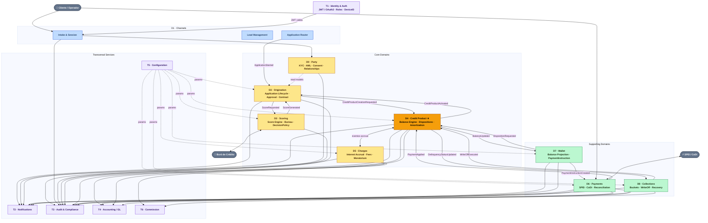

# fintech-services — Análisis de Arquitectura y Dominio

> Análisis completo del core crediticio B2B2C. Ciclo de vida completo del crédito gobernado por tipos explícitos, nunca por comparación de atributos. Fuente de referencia para decisiones de diseño e implementación.

---

## Índice

1. [Visión General](#1-visión-general)
2. [Principios Arquitectónicos Globales](#2-principios-arquitectónicos-globales)
3. [Arquitectura del Sistema — C4 L3](#3-arquitectura-del-sistema--c4-l3)
4. [Mapa de Dominios](#4-mapa-de-dominios)
5. [Dominios Core](#5-dominios-core)
   - [D0: Party](#d0--party-core-root)
   - [D1: Channels](#d1--channels-supporting)
   - [D2: Scoring](#d2--scoring-core)
   - [D3: Origination](#d3--origination-core)
   - [D4: Credit Product ★](#d4--credit-product-core-)
   - [D5: Charges](#d5--charges-core)
   - [D6: Payments](#d6--payments-supporting)
   - [D7: Wallet](#d7--wallet-supporting)
   - [D8: Collections](#d8--collections-supporting)
6. [Dominios Transversales](#6-dominios-transversales)
   - [T1: Identity & Auth](#t1--identity--auth)
   - [T2: Notifications](#t2--notifications)
   - [T3: Audit & Compliance](#t3--audit--compliance)
   - [T4: Accounting / GL](#t4--accounting--gl)
   - [T5: Configuration](#t5--configuration)
   - [T6: Commission](#t6--commission)
7. [Flujos de Negocio End-to-End](#7-flujos-de-negocio-end-to-end)
8. [Modelo de Eventos](#8-modelo-de-eventos)
9. [Matriz de Comunicación entre Módulos](#9-matriz-de-comunicación-entre-módulos)
10. [Cumplimiento Regulatorio](#10-cumplimiento-regulatorio)
11. [Decisiones de Diseño Globales](#11-decisiones-de-diseño-globales)

---

## 1. Visión General

**fintech-services** es un core crediticio B2B2C implementado como **microservicios totalmente desacoplados** (ver [ADR-001](../README.md)). Gestiona el ciclo de vida completo del crédito: desde el onboarding de la persona hasta el quebranto y recuperación, pasando por selección de producto, scoring, originación, administración de cuenta, devengamiento de cargos, pagos y cobranza.

> **Nota de evolución:** el proyecto se concibió como monolito modular (Spring Modulith) pero evolucionó a microservicios independientes (`*-service`, schema-per-service, comunicación Kafka). Spring Modulith se conserva para disciplina de fronteras *dentro* de cada servicio. La sección siguiente documenta esa evolución.

### Modelo de negocio

```
DISTRIBUIDOR (partyType=DISTRIBUTOR)
    └── administra línea de crédito DISTRIBUTOR_LINE
         └── beneficiarios reciben recursos
              └── distribuidor responde como obligor
```

```
CLIENTE DIRECTO (partyType=INDIVIDUAL o BUSINESS)
    └── contrata crédito (PERSONAL_LOAN, REVOLVING_LINE, PAYROLL_LOAN, GROUP_LOAN)
         └── obligor y beneficiario son el mismo
```

### Por qué microservicios desacoplados (estado actual)

- **Database-per-service**: cada servicio dueño de su schema, sin queries cross-schema ni FK cross-context
- **Async event-driven (Kafka)**: comunicación entre dominios por eventos; única excepción síncrona = validación de token contra T1
- **Event-carried state transfer + read models locales**: ningún servicio lee la BD de otro; cada uno proyecta lo que necesita desde eventos ajenos
- **Coreografía, no orquestación central**; **snapshot inmutable** de términos al originar
- **Límite de consistencia respetado**: se desacopla *entre* contextos, nunca *dentro* (el motor de saldos vive en un solo servicio, credit-portfolio)
- **Spring Modulith** se conserva para disciplina de fronteras dentro de cada servicio

---

## 2. Principios Arquitectónicos Globales

### P1 — Tipificación explícita

`partyType`, `productType`, `dispositionType` gobiernan **toda** la lógica. Nunca se infiere comportamiento de atributos como `if obligorId == beneficiaryId`.

```java
// MAL — inferencia por atributo
if (product.getObligorId().equals(product.getBeneficiaryId())) { ... }

// BIEN — tipo explícito
if (product.getDispositionType() == DispositionType.SELF_USE) { ... }
```

### P2 — credit-portfolio = única fuente de verdad de saldos

> Antes "CreditProduct". Tras el split (ADR-001), el motor de saldos es **credit-portfolio** (agregado `CreditAccount`); `credit-product` es el catálogo.

- Charges y Payments **emiten eventos**; credit-portfolio **los aplica**
- Consultas de saldo: O(1) directo a credit-portfolio — sin agregar eventos en runtime
- Elimina race conditions de concurrent accrual + payment
- El motor vive en **un solo servicio** (consistencia fuerte sobre dinero)

### P3 — Routing siempre explícito

```
Channels → Origination → Scoring
```

Scoring **nunca** recibe eventos directamente de Channels. El flujo tiene una sola dirección sin atajos.

### P4 — Collections cobra siempre al `obligorPartyId`

En DISTRIBUTOR_LINE el distribuidor paga, sin importar quién recibió los recursos. Esto evita confusión de pagos cross-party.

### P5 — Separación intención / ejecución

`WriteOffRequested` (intención de cobranza) ≠ `WriteOffExecuted` (autorización que consume CreditProduct). Esta separación garantiza que ningún dominio modifique saldos sin pasar por el motor de balances.

### P6 — Módulos sin dependencias directas de código

```
# Prohibido
import com.fintech.scoring.ScoringService; // desde otro módulo

# Permitido — async
kafkaTemplate.send("fintech.scoring.requested", event);

# Permitido — sync (solo T1 auth)
restClient.get().uri("/api/v1/auth/validate").retrieve()...
```

---

## 3. Arquitectura del Sistema — C4 L3

> ⚠️ El diagrama siguiente precede al split de ADR-001: el nodo **`D4 · Credit Product ★`** representa ahora **dos servicios** — `credit-product` (catálogo) y `credit-portfolio` ★ (corazón / motor de saldos). El flujo `CreditProductCreationRequested` llega a credit-portfolio con un snapshot resuelto contra el catálogo. Pendiente de re-dibujar.



### Leyenda

| Color | Tipo |
|---|---|
| Amarillo | Core Domain |
| Ámbar | Credit Product ★ — corazón del sistema |
| Verde | Supporting Domain |
| Azul | Channels (entrada) |
| Morado | Transversal Service |
| Gris | Actor / Sistema externo |

---

## 4. Mapa de Dominios

| # | Dominio | Tipo | Función principal |
|---|---|---|---|
| D0 | Party | Core Root | Sujeto del crédito — raíz de todo |
| D1 | Channels | Supporting | Captación, sesiones, routing a Origination |
| D2 | Scoring | Core | Evaluación de riesgo + DecisionPolicy |
| D3 | Origination | Core | Onboarding persona (`Prospect`) + selección producto y aprobación (`CreditApplication`) |
| D4 | Credit Product | Core | **Catálogo / fábrica** de productos (definiciones, rate cards) |
| D4★ | Credit Portfolio | Core ★ | **El corazón** — motor de saldos y cuenta viva (`CreditAccount`) |
| D5 | Charges | Core | Devengamiento de intereses y cargos |
| D6 | Payments | Supporting | Recepción y aplicación de pagos |
| D7 | Wallet | Supporting | Proyección de saldo para UI |
| D8 | Collections | Supporting | Cobranza, mora y quebranto |
| T1 | Identity & Auth | Transversal | JWT, sesiones, dispositivos |
| T2 | Notifications | Transversal | Comunicaciones multicanal |
| T3 | Audit & Compliance | Transversal | Log inmutable regulatorio |
| T4 | Accounting / GL | Transversal | Libro mayor, partida doble |
| T5 | Configuration | Transversal | Parámetros de negocio versionados |
| T6 | Commission | Transversal | Comisiones de red comercial |

### Matriz de uso de transversales

| Dominio | T1 Auth | T2 Notif | T3 Audit | T4 GL | T5 Config | T6 Comm |
|---|:---:|:---:|:---:|:---:|:---:|:---:|
| D0 Party | ✅ | ✅ | ✅ | — | — | — |
| D1 Channels | ✅ | ✅ | ✅ | — | ✅ | — |
| D2 Scoring | ✅ | — | ✅ | — | ✅ | — |
| D3 Origination | ✅ | ✅ | ✅ | ✅ | ✅ | — |
| D4 Credit Product (catálogo) | — | — | ✅ | — | ✅ | — |
| D4★ Credit Portfolio | ✅ | ✅ | ✅ | ✅ | ✅ | ✅ |
| D5 Charges | — | ✅ | ✅ | ✅ | ✅ | ✅ |
| D6 Payments | — | ✅ | ✅ | ✅ | ✅ | ✅ |
| D7 Wallet | ✅ | ✅ | ✅ | ✅ | ✅ | — |
| D8 Collections | — | ✅ | ✅ | ✅ | ✅ | ✅ |

---

## 5. Dominios Core

---

### D0 — Party [Core Root]

> Todo sujeto que puede ser obligado o relacionado con la institución. Todos los dominios referencian `partyId`. `partyType` es **inmutable post-creación**.

#### partyType — inmutable post-creación

| Tipo | ¿Puede ser Obligor? | Notas |
|---|---|---|
| `INDIVIDUAL` | Sí | Persona física |
| `BUSINESS` | Sí | Persona moral — requiere representante legal |
| `DISTRIBUTOR` | Sí — responde por línea completa | `productType = DISTRIBUTOR_LINE` |
| `GUARANTOR` | Sí — solidariamente | Aval de otro party |
| `BENEFICIARY` | **No** | Solo recibe recursos — **nunca `obligorPartyId`** |

#### Ciclo de vida KYC

```
DRAFT → PENDING_KYC → ACTIVE → SUSPENDED → BLACKLISTED → CLOSED
```

- `BLACKLISTED` bloquea **toda** nueva originación de forma inmediata
- `INDIVIDUAL/BUSINESS` necesitan Identity verificada para pasar a `ACTIVE`

#### Agregado Party — campos clave

| Campo | Tipo | Regla |
|---|---|---|
| `partyId` | UUID v7 | Inmutable |
| `partyType` | enum | **Inmutable post-creación** |
| `status` | enum | Ver ciclo de vida |
| `riskProfile.tier` | 1–5 | Actualizado por Scoring (pasivo) |
| `riskProfile.isPEP` | bool | → COMMITTEE obligatorio en Origination |
| `biometrics.livenessScore` | float | Mínimo 0.85 |
| `consents[CREDIT_BUREAU]` | Consent | Prerequisito para scoring |

#### Invariantes críticas

- **I-01**: `partyType` inmutable — cambio requiere nuevo Party
- **I-04**: `BENEFICIARY` nunca como `obligorPartyId`
- **I-06**: `Consent(CREDIT_BUREAU)` vigente = prerequisito para emitir `ConsentGranted`
- **I-07**: `BLACKLISTED` bloquea toda nueva originación

#### Subdominios

`party-profile` · `identity-kyc` · `aml-compliance` · `consent-management`

#### Eventos emitidos

| Evento | → Consumidores |
|---|---|
| `PartyCreated` | Audit, Notifications |
| `PartyActivated` | Origination, Notifications |
| `PartyBlacklisted` | Channels, Scoring, Collections, Notifications |
| `ConsentGranted` | Scoring, Origination |
| `RiskProfileUpdated` | Collections, Scoring |
| `KYCCompleted` | Origination, Scoring |
| `AMLScreeningCompleted` | Audit, Origination |

#### Read models expuestos

`PartyProfileView` · `PartyKYCStatusView` · `PartyConsentView` · `PartyRiskView` · `PartyHistoryView` · `PartyRelationshipView`

#### Integraciones externas (ACL)

| Externo | Interface |
|---|---|
| RENAPO | `NationalIdVerifier` — valida CURP |
| INE API | `VoterIdVerifier` — valida credencial elector |
| Incode/Jumio | `LivenessChecker` — biometría + prueba de vida |
| OFAC / CNBV / UIF | `AMLListChecker`, `PEPChecker` |

#### Flujo onboarding

```
RegisterParty [DRAFT]
  → UploadDocument → IdentityVerified
  → CaptureBiometric (score ≥ 0.85)
  → AMLScreening → AMLScreeningCompleted
  → GrantConsent(CREDIT_BUREAU) → ConsentGranted
  → KYCCompleted → PartyActivated [ACTIVE]
```

---

### D1 — Channels [Supporting]

> Punto de entrada. Captación y routing. **Sin lógica de decisión crediticia.**

#### Tipos de canal

`DIGITAL_APP` · `WEB_PORTAL` · `BRANCH` · `API_PARTNER`

#### Flujo

```
Cliente → Channels (valida auth con T1)
        → crea/valida Party en D0
        → crea Lead
        → inicia Application → ApplicationStarted → Origination
```

#### Reglas

- Channels **no toma decisiones** — solo enruta
- Cada sesión validada por T1 antes de abrirse
- `SessionExpired` publicado cuando TTL vence (T5-configurable)

#### Eventos emitidos

`ApplicationStarted` · `LeadCreated` · `SessionExpired`

---

### D2 — Scoring [Core]

> Motor de evaluación de riesgo. Emite `DecisionPolicy` con condiciones — **no aprueba créditos**. La aprobación es responsabilidad de Origination.

#### Selección de modelo por `(partyType, productType)`

| partyType | productType | Burós | Estrategia |
|---|---|---|---|
| `INDIVIDUAL` | `PERSONAL_LOAN` | BC + CC | `WORST_OF` |
| `INDIVIDUAL` | `REVOLVING_LINE` | BC | `WEIGHTED_AVG` 60/40 |
| `INDIVIDUAL` | `PAYROLL_LOAN` | BC | `BUREAU_ONLY` |
| `BUSINESS` | `REVOLVING_LINE` | CC Comercial | `WEIGHTED_AVG` 40/60 |
| `DISTRIBUTOR` | `DISTRIBUTOR_LINE` | BC + CC | `WORST_OF` + capacidad línea |
| `GUARANTOR` | según producto | igual al producto | `WORST_OF` vs acreditado |
| `INDIVIDUAL` | `GROUP_LOAN` | BC | `INTERNAL_ONLY` |

*BC = Buró de Crédito · CC = Círculo de Crédito*

#### Reglas críticas

| Regla | Detalle |
|---|---|
| SO-01 | `ConsentGranted(CREDIT_BUREAU)` vigente — si no → `ScoreFailed(CONSENT_MISSING)` |
| SO-02 | Score COMPLETED con `validUntil` futuro y modelo ACTIVE → **REUSED** (sin consultar buró) |
| SO-04 | `amlRiskLevel=PROHIBITED` → falla inmediata sin consultar buró |
| SO-05 | `isPEP=true` → `PolicyCondition(PEP_REVIEW_REQUIRED)` → COMMITTEE en Origination |
| DE-01 | `finalScore < cutoffScore` → `approved=false` sin excepción |
| DE-04 | `DISTRIBUTOR_LINE` genera `approvedLineAmount`, no `approvedAmount` |

#### Flujo happy path

```
ScoreRequested
  → [Consent OK + No reuse + AML OK]
  → BureauQuery×N (paralelo)
  → InternalScore
  → FinalScore (composición según estrategia)
  → DecisionPolicy
  → ScoreGenerated + RiskTierUpdated
```

#### Flujo reuse

```
ScoreRequested
  → [ScoreRequest COMPLETED, validUntil futuro, modelo ACTIVE]
  → ScoreReused (sin consultar buró → ahorro de costo regulatorio)
```

#### Eventos emitidos

`ScoreGenerated` · `ScoreRejected` · `ScoreFailed` · `ScoreReused` · `RiskTierUpdated` · `BureauQueryCompleted`

#### Por qué DecisionPolicy ≠ aprobación

Origination puede añadir validaciones adicionales (documentos, comité) que Scoring no conoce. Scoring produce condiciones; Origination toma la decisión final.

---

### D3 — Origination [Core]

> Orquestador del ciclo. Termina en `ContractSigned + CreditProductCreationRequested`.
>
> ⚠️ **Re-orientado (ADR-001):** dos subdominios — (1) **`Prospect`** = onboarding de la persona/identidad (sin producto; `ProspectCreated` dispara solo el **prefetch** de buró en scoring); (2) **`CreditApplication`** = el cliente onboardeado **elige producto** → emite `ScoreRequested(productType)` → dispara el **decision engine** de scoring. Una persona se onboardea una vez y crea N aplicaciones. Doc: [03_credit_origination_domain.md](dominios/03_credit_origination_domain.md).

#### Máquina de estados

```
DRAFT
  → KYC_VALIDATION
  → PENDING_SCORING
  → SCORING
       ├─ ScoreFailed ──────────────────→ FAILED (terminal)
       └─ ScoreRejected ────────────────→ REJECTED (terminal)
  → PENDING_DOCUMENTS (si aplica)
  → PENDING_APPROVAL
       ├─ AUTOMATIC ──────────────────→ APPROVED
       ├─ MANUAL ─────────────────────→ UNDER_MANUAL_REVIEW → APPROVED | REJECTED
       └─ COMMITTEE ──────────────────→ COMMITTEE_REVIEW   → APPROVED | REJECTED
  → OFFER_PRESENTED
       └─ OFFER_ACCEPTED
  → PENDING_SIGNATURE
  → CONTRACT_SIGNED
  → DISBURSED (terminal)

Terminales adicionales: CANCELLED · EXPIRED
```

#### Selección de ApprovalFlow (evaluado en orden)

| Condición | Flow |
|---|---|
| `isPEP=true` OR `amount > committee_threshold` OR `tier ≥ 4` | `COMMITTEE` |
| `score ≥ threshold_auto` AND `amount ≤ max_auto` AND `tier ≤ 2` AND `conditions = []` | `AUTOMATIC` |
| Resto | `MANUAL` |

#### Documentos requeridos por `productType`

| Tipo | Documentos |
|---|---|
| `PERSONAL_LOAN / REVOLVING_LINE` | `INCOME_PROOF`, `ADDRESS_PROOF` |
| `DISTRIBUTOR_LINE` | + `DISTRIBUTOR_AGREEMENT`, `BANK_STATEMENT_3M` |
| `GROUP_LOAN` | `GROUP_MEMBER_ID×n`, `GROUP_CHARTER` |
| `PAYROLL_LOAN` | `PAYROLL_STUB`, `EMPLOYMENT_LETTER`, `ADDRESS_PROOF` |

#### Invariantes críticas

- **OA-01**: Estado terminal → inmutable
- **OA-03**: Una sola aplicación activa por `(partyId, productType)`
- **OA-04**: CONTRACT_SIGNED solo desde PENDING_SIGNATURE con firma válida
- **OA-05**: Documento REJECTED bloquea ApprovalDecision APPROVED
- **CM-04**: Contrato firmado inmutable — modificaciones van a D4 (Restructure)

#### Eventos emitidos

| Evento | → Consumidores |
|---|---|
| `ScoreRequested` | Scoring |
| `ApplicationApproved` | Notifications, Audit |
| `ApplicationRejected` | Notifications (CONDUSEF), Party, Audit |
| `ContractSigned` | Party, Audit, Notifications |
| `CreditProductCreationRequested` | **Credit Product** |

---

### D4 / D4★ — Credit Product (catálogo) + Credit Portfolio (corazón)

> ⚠️ **Split (ADR-001):** "Credit Product" se dividió en dos servicios:
> - **`credit-product`** = catálogo / fábrica de productos (definiciones, capacidades, rate cards, versionado). Doc: [04_credit_product_domain.md](dominios/04_credit_product_domain.md).
> - **`credit-portfolio`** ★ = el corazón: cuenta viva, motor de saldos (`CreditAccount`). Doc: [04b_credit_portfolio_domain.md](dominios/04b_credit_portfolio_domain.md).
>
> La sección de abajo describe el **motor de saldos** (ahora `credit-portfolio`). El agregado `CreditProduct` se renombra `CreditAccount`; el evento `CreditProductActivated` → `CreditAccountActivated`. La matriz de capacidades por `productType` la **define** el catálogo y la **ejecuta** el portfolio vía snapshot inmutable al originar.

#### Motor por `productType` (definido por catálogo, ejecutado por portfolio)

| Feature | PERSONAL_LOAN | REVOLVING_LINE | DISTRIBUTOR_LINE | GROUP_LOAN | PAYROLL_LOAN |
|---|:---:|:---:|:---:|:---:|:---:|
| AmortizationSchedule | ✅ | ❌ | ❌ | ✅ | ✅ |
| creditLimit / availableCredit | ❌ | ✅ | ✅ | ❌ | ❌ |
| Múltiples disposiciones | ❌ | ✅ | ✅ | ❌ | ❌ |
| dispositionType | `SELF_USE` | `SELF_USE` | `THIRD_PARTY_CREDIT` | `SELF_USE` | `PAYROLL` |
| Commission accrual (T6) | ❌ | ❌ | ✅ | ❌ | ❌ |
| cutoffDate / pago mínimo | ❌ | ✅ | ✅ | ❌ | ❌ |
| Múltiples obligors | ❌ | ❌ | ❌ | ✅ | ❌ |

#### Modelo de saldos

```
totalDebt       = principalBalance + accruedInterestBalance + penaltyBalance
availableCredit = creditLimit − principalBalance − pendingDispositions  [solo revolventes]

Jerarquía de pago (default, configurable T5):
  1. penaltyBalance   (mora + fees + seguros)
  2. accruedInterestBalance
  3. principalBalance
```

#### Ciclo de vida

```
PENDING_ACTIVATION → ACTIVE ↔ RESTRUCTURED → SETTLED (terminal)
                                            → WRITTEN_OFF (terminal)
                                            → CLOSED (terminal)
ACTIVE → SUSPENDED (fraud/legal) → ACTIVE (al levantar)
```

> `daysDelinquent` se actualiza por **job nocturno** — el producto permanece ACTIVE aunque esté en mora.

#### Actualizaciones de saldo por evento entrante

| Evento | De | Efecto en balances |
|---|---|---|
| `DispositionCompleted` | propio | `principalBalance += amount`; `availableCredit -= amount` |
| `OrdinaryInterestAccrued` | D5 Charges | `accruedInterestBalance += totalAmount` |
| `MoratoriumInterestCharged` | D5 Charges | `penaltyBalance += totalAmount` |
| `*FeeCharged` | D5 Charges | `penaltyBalance += totalAmount` |
| `ChargeReversed / ChargeWaived` | D5 Charges | Revierte el balance correspondiente |
| `PaymentApplied` | D6 Payments | Reduce en jerarquía; `availableCredit += capitalPaid` (revolvente) |
| `WriteOffExecuted` | D8 Collections | **Todos los saldos → 0**; `status → WRITTEN_OFF` |

#### Invariantes críticas

- **CP-01**: `productType / obligorPartyId / contractId` inmutables post-activación
- **CP-02**: `totalDebt ≥ 0`
- **CP-03**: `availableCredit` nunca negativo
- **CP-05**: `PERSONAL_LOAN / PAYROLL_LOAN` → solo una disposición
- **CP-06**: `DISTRIBUTOR_LINE` → cada disposición con `beneficiaryPartyId + THIRD_PARTY_CREDIT`
- **CP-07**: `daysDelinquent` solo lo escribe `DelinquencyCalculationService`
- **CP-09**: `WRITTEN_OFF` no acepta Restructure

#### Eventos emitidos

| Evento | → Consumidores |
|---|---|
| `CreditProductActivated` | Origination, Party, Wallet, Charges, T6 |
| `BalanceUpdated` | Wallet, Collections, T4 |
| `DispositionCreated` | Charges, Wallet, T6, T4 |
| `DispositionCompleted` | T4, Wallet, Notifications |
| `InstallmentDue` | **Charges** (inicia accrual), Notifications |
| `DelinquencyStatusUpdated` | **Collections**, **Charges** (mora), Notifications, Wallet |
| `DelinquencyCleared` | Collections, Charges |
| `ProductSettled` | Party, Collections, T4, Notifications |
| `ProductWrittenOff` | Party, T4, Notifications |
| `AccountStatementGenerated` | Notifications, T3 |

#### Jobs nocturnos

| Job | Hora | Acción |
|---|---|---|
| `DelinquencyCalculationJob` | 23:59 | Calcula `daysDelinquent` para cada ACTIVE → `DelinquencyStatusUpdated` si cambió |
| `InstallmentDueJob` | 00:01 | Detecta cuotas vencidas → `InstallmentDue` |

---

### D5 — Charges [Core]

> Motor de devengamiento. **Nunca modifica saldos directamente** — emite eventos que CreditProduct procesa.

#### Tipos de cargo

| Tipo | Base | Trigger |
|---|---|---|
| Interés ordinario | `principalBalance` diario | `InstallmentDue` / diario |
| Interés moratorio | Saldo vencido | `daysDelinquent > gracePeriodDays` (default 3) |
| Comisión apertura | Monto del crédito | Una vez en activación |
| Comisión administración | Fijo / periódico | Periódico (T5) |
| Comisión prepago | Capital en exceso | Dentro de `prepayment_free_months` (T5) |
| Seguro | Prima configurable | Periódico |
| IVA 16% | Sobre cada cargo | `ChargeRecord` separado vinculado |

#### Reglas clave

- `ChargeReversed` ≠ `ChargeWaived`
  - **Reversed**: corrección técnica → cancela ingreso contable
  - **Waived**: condonación → genera gasto (P&L)
- Moratorio: `daysDelinquent > gracePeriodDays` — base = **saldo vencido solamente**
- IVA: cada interés/fee genera un `ChargeRecord` vinculado de IVA

#### Jobs

| Job | Hora | Acción |
|---|---|---|
| `DailyAccrualJob` | 23:00 | Interés ordinario sobre `principalBalance` |
| `MoratoriumAccrualJob` | 23:30 | Interés moratorio cuando `daysDelinquent > grace` |

#### Eventos emitidos

`OrdinaryInterestAccrued` · `MoratoriumInterestCharged` · `OpeningFeeCharged` · `AdminFeeCharged` · `PrepaymentFeeCharged` · `InsurancePremiumCharged` · `ChargeReversed` · `ChargeWaived`

---

### D6 — Payments [Supporting]

> Recepción y aplicación de pagos. **Nunca modifica saldos directamente** — emite `PaymentApplied` para que CreditProduct lo procese.

#### Métodos de pago

`SPEI` · `CoDi` · `DOMICILIACION` · `VENTANILLA` · `TARJETA` · `INTERNAL_TRANSFER`

#### Reglas críticas

| Regla | Detalle |
|---|---|
| Idempotencia | Por `externalRef` (referencia única SPEI/CoDi) — duplicados ignorados |
| Validación | Producto no debe ser `WRITTEN_OFF` |
| Ventana devolución | 72h hábiles (configurable T5) |
| Excedente | `APPLY_NEXT_INSTALLMENT` o `RETURN_TO_PAYER` (T5 por productType) |
| Reconciliación | Batch diario por `paymentMethod` — discrepancia → alerta T4 |

#### Jerarquía de aplicación (configurable T5)

```
1. penaltyBalance  →  2. accruedInterestBalance  →  3. principalBalance
```

#### Eventos emitidos

`PaymentReceived` · `PaymentApplied` · `PaymentReturned` · `ReconciliationCompleted`

---

### D7 — Wallet [Supporting]

> Proyección read-only del estado de CreditProduct para la UI. **No es fuente de verdad.**

#### Responsabilidades

- `WalletView` 1:1 con CreditProduct — sincroniza en cada evento relevante
- Validación fail-fast: `amount ≤ availableCredit` **antes** de enviar a CreditProduct
- `WalletSnapshotUpdated` consolida múltiples eventos → un solo refresh de UI
- `PaymentInstruction` con ciclo: `PENDING → SENT → EXPIRED`

#### Eventos consumidos (para sincronizar proyección)

`BalanceUpdated` · `DispositionCreated` · `DispositionCompleted` · `AccountStatementGenerated` · `CupoLiberated`

#### Eventos emitidos

`DispositionRequested` · `PaymentInstructionCreated` · `WalletSnapshotUpdated`

---

### D8 — Collections [Supporting]

> Gestión de cobranza, recuperación y quebranto. **Nunca modifica saldos directamente.**

#### Buckets de mora

| Bucket | Días | Acción automática |
|---|---|---|
| `B1_30` | 1–30d | Notificación automática (T2) |
| `B31_60` | 31–60d | Agente asignado, oferta reestructura |
| `B61_90` | 61–90d | Cobranza intensiva, aviso legal |
| `B91_PLUS` | 91+d | Pre-quebranto, agencia externa, acción legal |

#### Flujo de quebranto (write-off)

```
daysDelinquent ≥ threshold (T5, default 91d)
  → Collections.WriteOffRequested (intención)
  → Aprobación T5/T4
  → Collections.WriteOffExecuted (autorización)
  → CreditProduct consume WriteOffExecuted
  → Todos los saldos → 0, status → WRITTEN_OFF
```

#### PaymentPromise

```
ACTIVE → KEPT (pago ≥ prometido antes de fecha)
       → BROKEN (fecha pasa sin pago suficiente)
       → EXPIRED (TTL)
```

#### Reglas CONDUSEF

- Máximo 3 intentos de contacto por día
- Horario permitido: 08:00–20:00
- Notificaciones de escalación no son opt-outable

#### Eventos emitidos

`CollectionCaseCreated` · `CollectionCaseEscalated` · `WriteOffRequested` · `WriteOffExecuted` · `RecoveryPaymentApplied` · `ContactAttemptRegistered` · `PaymentPromiseMade` · `PaymentPromiseBroken`

---

## 6. Dominios Transversales

---

### T1 — Identity & Auth

> Prerequisito síncrono para cualquier interacción. **No emite eventos de dominio** — responde solo a solicitudes síncronas.

#### Responsabilidades

- Autenticación: NIP, biometría, e-firma SAT, OTP SMS/email
- Emisión, refresh y revocación de tokens JWT
- MFA según nivel de riesgo de operación (T5-configurable)
- Registro y validación de dispositivos de confianza (`isTrustedDevice`)
- `SignatureValidator` para contrato en Origination

#### JWT claims

```json
{
  "sub": "partyId",
  "roles": ["CUSTOMER", "ADMIN"],
  "deviceId": "device-uuid",
  "jti": "token-uuid"
}
```

#### Reglas clave

| Regla | Detalle |
|---|---|
| IA-01 | `failedAttempts ≥ threshold(T5)` → LOCKED por `lockDuration(T5)` |
| IA-02 | Token revocado en logout o fraude → todas las sesiones activas expiran |
| IA-03 | Operaciones alto valor (disposición >X, cambio CLABE) → MFA adicional |
| IA-04 | Dispositivo no registrado → MFA obligatorio |
| IA-05 | e-firma SAT validada contra SAT — no almacena llave privada |

#### Interfaces expuestas

| Interface | Consumidor | Para qué |
|---|---|---|
| `AuthSessionValidator` | Channels | Verifica token antes de abrir Session |
| `SignatureValidator` | Origination | Valida NIP/biometría/e-firma en contrato |
| `TokenIntrospection` | Todos (middleware) | Valida `actorId`, `roles`, `deviceId` |
| `DeviceRegistrationAPI` | Channels (MOBILE_APP) | Registra dispositivo como trusted |

#### Por qué T1 es síncrono y no emite eventos

Auth es prerequisito — el resto del flujo depende de la respuesta. Un evento async no garantiza que la sesión esté validada antes de que el siguiente paso ocurra.

---

### T2 — Notifications

> Suscriptor de eventos. **Nunca modifica estado de ningún dominio.**

#### Canales y fallback

```
PUSH → SMS → EMAIL (fallback en cascada)
WhatsApp (canal adicional configurable T5)
```

#### Reglas

- Templates parametrizados por `(eventType, productType, locale)`
- Rate limiting y quiet hours configurables en T5
- Notificaciones regulatorias **no opt-outable**: `ApplicationRejected`, `WriteOffExecuted`, `CollectionCaseEscalated`
- Opt-out de canal bloquea ese canal en preferencias de `Party.Contact`

---

### T3 — Audit & Compliance

> Log inmutable de todos los eventos. **Append-only — nunca modifica estado.**

#### Retención regulatoria

| Tipo de documento | Años | Regulación |
|---|---|---|
| Reportes de buró | 5 | CNBV Circular 14/2013 |
| Contratos | 10 | Código de Comercio |
| Estados de cuenta | 5 | CONDUSEF |
| AML/UIF | 10 | LFPIORPI |

#### Suscripción global

T3 es suscriptor de **todos** los eventos de todos los dominios. Registra: `timestamp`, `eventType`, `actorId`, `correlationId`, payload JSON completo.

---

### T4 — Accounting / GL

> Libro mayor. Traduce eventos financieros a asientos contables. **La verdad operativa (CreditProduct) ≠ verdad contable (GL).**

#### Reglas clave

- Partida doble por cada evento económico (crédito = débito)
- `WAIVED ≠ REVERSED`:
  - **Waived**: condonación = gasto (impacto en P&L)
  - **Reversed**: corrección técnica = cancelación de ingreso
- Reconciliación diaria: saldo GL debe igualar saldo CreditProduct (alerta en delta)
- Quebranto → cuentas "castigo"; recuperación post-quebranto → ingreso extraordinario
- Catálogo de cuentas parametrizado por `(chargeType, productType)` en T5

#### Eventos que generan asiento

`CreditProductActivated` · `DispositionCompleted` · `OrdinaryInterestAccrued` · `MoratoriumInterestCharged` · `*FeeCharged` · `ChargeWaived` · `ChargeReversed` · `PaymentApplied` · `WriteOffExecuted` · `RecoveryPaymentApplied` · `ProductRestructured(DEBT_FORGIVENESS)`

---

### T5 — Configuration

> Parámetros de negocio versionados. Todos los dominios hacen pull. **Nunca se elimina un parámetro — se marca DEPRECATED.**

#### Ciclo de parámetros (maker-checker)

```
DRAFT → PENDING_APPROVAL → ACTIVE (en effectiveDate) → DEPRECATED
```

#### Parámetros clave por dominio

**Charges / D5:**
```
grace_period_days: 3
opening_fee_rate[PERSONAL_LOAN]: 2.5%
prepayment_free_months[PERSONAL_LOAN]: 2
vat_rate: 16%
```

**Payments / D6:**
```
return_window_hours: 72
surplus_handling[PERSONAL_LOAN]: RETURN_TO_PAYER
spei_operating_hours: 08:00–22:00
```

**Collections / D8:**
```
write_off_threshold_days[PERSONAL_LOAN]: 91
max_contact_attempts_per_day: 3
contact_allowed_hours: 08:00–20:00
```

**Origination / D3:**
```
committee_threshold_amount: 50000
reapplication_cooldown_days[PERSONAL_LOAN]: 30
```

**Auth / T1:**
```
max_failed_attempts: 5
lockout_duration_minutes: 30
mfa_threshold_amount: 10000
```

#### Cache e invalidación

Cada dominio cachea los parámetros en startup. `ConfigurationUpdated` invalida cache cuando un parámetro entra en vigencia.

---

### T6 — Commission

> Acumulación y liquidación de comisiones de la red comercial (promotores, distribuidores).

#### Tipos de comisión

| Tipo | Trigger |
|---|---|
| `ORIGINATION_FEE` | D4 activación de producto |
| `DISPOSITION_FEE` | D4 disposición en DISTRIBUTOR_LINE |
| `COLLECTION_BONUS` | D6 pago recibido |
| `RENEWAL_BONUS` | Renovación de producto |

#### Reglas

- Snapshot de tasa al momento del devengamiento → inmutable para cambios futuros de tasa
- Liquidación batch mensual con umbral mínimo (T5)
- `ProductSettled` antes de meses mínimos → reversión proporcional
- **T6 acumula; T4 ejecuta el pago a CLABE del promotor/distribuidor**

---

## 7. Flujos de Negocio End-to-End

### 7.1 Ciclo de Originación — Happy Path

```
Cliente
  → Channels: valida auth (T1) → abre sesión
  → D0 Party: crear/validar party, KYC, AML, ConsentGranted
  → D1 Channels: ApplicationStarted
  → D3 Origination: DRAFT → KYC_VALIDATION → PENDING_SCORING
  → D3 emite ScoreRequested → D2 Scoring
  → D2: consultas buró (paralelo) → InternalScore → FinalScore → DecisionPolicy
  → D2 emite ScoreGenerated
  → D3: determina AUTOMATIC → APPROVED
  → D3: genera CreditOffer + CAT → OFFER_PRESENTED
  → Cliente acepta → D3: genera contrato → PENDING_SIGNATURE
  → D3: valida firma (T1) → CONTRACT_SIGNED
  → D3 emite CreditProductCreationRequested
  → D4 Credit Product: crea cuenta → desembolsa vía SPEI → ACTIVE
  → D4 emite CreditProductActivated
  → D3: DISBURSED (terminal)
  → T6: acumula ORIGINATION_FEE
  → T4: asiento contable desembolso
```

### 7.2 Ciclo de Vida del Crédito (operación diaria)

```
[23:00] D5 DailyAccrualJob
  → OrdinaryInterestAccrued → D4 accruedInterestBalance +=

[cutoffDate — solo revolventes] D4
  → AccountStatementGenerated → D7 Wallet + Notifications

[Cliente] D7 Wallet
  → DispositionRequested (fail-fast: amount ≤ availableCredit)
  → D4 DispositionCreated → SPEI → DispositionCompleted
  → D4 BalanceUpdated → D7 WalletSnapshotUpdated

[Cliente paga] D7
  → PaymentInstructionCreated → D6 Payments
  → PaymentApplied → D4 (jerarquía: penalty → interest → principal)
  → D4 BalanceUpdated → D7 WalletSnapshotUpdated
  → T4: asiento pago
  → T6: acumula COLLECTION_BONUS (si aplica)
```

### 7.3 Flujo de Mora y Cobranza

```
[23:59] D4 DelinquencyCalculationJob
  → daysDelinquent cambió → DelinquencyStatusUpdated(bucket=B1_30)
  → D8 Collections: CollectionCaseCreated
  → T2 Notifications: alerta al cliente

[días pasan sin pago]
  → DelinquencyStatusUpdated(bucket=B31_60)
  → D8: agente asignado, oferta reestructura
  → D5: MoratoriumAccrualJob → MoratoriumInterestCharged
  → D4 penaltyBalance +=

[bucket=B91_PLUS]
  → D8: WriteOffRequested (intención)
  → Aprobación (T5/T4)
  → D8: WriteOffExecuted
  → D4: todos los saldos → 0, status → WRITTEN_OFF
  → T4: asiento quebranto (cuentas "castigo")

[Recuperación post-quebranto]
  → D6: PaymentApplied → D8: RecoveryPaymentApplied
  → T4: ingreso extraordinario (no restaura saldos en D4)
```

### 7.4 Delinquency Cleared

```
Cliente paga en B1_30 o B31_60
  → D6 PaymentApplied → D4 BalanceUpdated
  → D4: totalDebt == 0 o cuota al corriente
  → D4: DelinquencyCleared
  → D8: CollectionCase → CLOSED
  → D5: suspende MoratoriumAccrualJob
```

---

## 8. Modelo de Eventos

### Convención de nombres

```
{Dominio}{EntidadAcción}
Ej: CreditProductActivated, PaymentApplied, CollectionCaseEscalated
```

### Tópicos Kafka (propuesta)

| Tópico | Productores | Consumidores |
|---|---|---|
| `fintech.party.events` | D0 | D3, Scoring (read model), Collections, T2, T3 |
| `fintech.scoring.requested` | D3 | D2 |
| `fintech.scoring.events` | D2 | D3, D0 |
| `fintech.origination.events` | D3 | D2 (prospect-created→prefetch, score-requested→eval), credit-portfolio, Party, T2, T3, T4 |
| `fintech.credit-product.events` | D4 (catálogo) | Origination (ProductDefined/Versioned), T3 |
| `fintech.credit-portfolio.events` | D4★ | D5, D6, D7, D8, Party, T2, T3, T4, T6 |
| `fintech.charges.events` | D5 | credit-portfolio, T2, T3, T4 |
| `fintech.payments.events` | D6 | credit-portfolio, D8, T2, T3, T4, T6 |
| `fintech.wallet.events` | D7 | T3 |
| `fintech.collections.events` | D8 | credit-portfolio, T2, T3, T4 |
| `fintech.configuration.events` | T5 | Todos (cache invalidation) |
| `fintech.commission.events` | T6 | T4, T3 |
| `fintech.domain.events` | Todos | T3 (suscripción global audit) |

---

## 9. Matriz de Comunicación entre Módulos

| De → A | D0 | D1 | D2 | D3 | D4 | D5 | D6 | D7 | D8 | T1 | T2 | T3 | T4 | T5 | T6 |
|---|:---:|:---:|:---:|:---:|:---:|:---:|:---:|:---:|:---:|:---:|:---:|:---:|:---:|:---:|:---:|
| D0 | — | — | R | R | — | — | — | — | R | — | E | E | — | — | R |
| D1 | E | — | — | E | — | — | — | — | — | REST | E | E | — | R | — |
| D2 | R | — | — | E | — | — | — | — | — | — | — | E | — | R | — |
| D3 | R | — | E | — | E | — | — | — | — | REST | E | E | E | R | — |
| D4 | E | — | — | E | — | E | — | E | E | — | E | E | E | R | E |
| D5 | — | — | — | — | E | — | — | — | — | — | E | E | E | R | — |
| D6 | — | — | — | — | E | — | — | — | E | — | E | E | E | R | E |
| D7 | — | — | — | — | E | — | E | — | — | REST | E | E | — | R | — |
| D8 | — | — | — | — | E | — | — | — | — | — | E | E | E | R | — |

**E** = Emite evento Kafka · **R** = Lee read model · **REST** = Llamada síncrona

---

## 10. Cumplimiento Regulatorio

| Regulación | Impacto | Dominio(s) |
|---|---|---|
| **CNBV Circular 14/2013** | Retención buró 5 años; reportes R01–R24; reconciliación GL diaria | T3, T4 |
| **CONDUSEF** | Texto regulatorio en rechazos; máx 3 llamadas/día; retención expediente 5 años; desglose CAT | D3, D8, T2, T3 |
| **UIF / AML / LFPIORPI** | Screening OFAC+CNBV antes de activar; PEP; retención 10 años; reporte operaciones sospechosas | D0, T3 |
| **SAT** | e-firma validation (no almacena llave privada); GL para reporting fiscal; CAT (Circular BdM 21/2009) | T1, T4, D3 |
| **LGTYOC** | Tasa moratoria ≤ 2× tasa nominal | D5 |
| **Código de Comercio** | Contratos: retención 10 años | T3 |
| **Datos biométricos** | Hash solamente — nunca raw; expiración 12 meses | D0 |

---

## 11. Decisiones de Diseño Globales

| Decisión | Alternativa descartada | Por qué se eligió |
|---|---|---|
| **Split credit-product (catálogo) ↔ credit-portfolio (corazón)** | Un solo servicio "Credit Product" | Configuración (lectura intensa, casi estática) ≠ cuenta viva (escritura intensa, operacional) — Single Responsibility (ADR-001) |
| **Originación: persona (Prospect) ≠ crédito (CreditApplication)** | Prospect carga producto y dispara scoring al registrarse | Una persona se onboardea una vez y pide N créditos; la política de riesgo es por producto, sin producto no hay matriz que aplicar (ADR-001) |
| **Microservicios desacoplados** | Monolito modular | El repo ya es microservicios; database-per-service + Kafka + read models locales; extracción ya realizada |
| **Motor único portfolio por productType** | Un servicio/clase por tipo de producto | Agregar producto = registrar configuración en el catálogo, no modificar código |
| **credit-portfolio = fuente de verdad de saldos** | Calcular saldo agregando Charges+Payments en runtime | O(1) para consultas; elimina race conditions de concurrent reads |
| **Charges/Payments emiten eventos — no modifican saldos** | Charges/Payments modifican directamente | Desacoplamiento total; reversiones/condonaciones independientes del motor de balances |
| **`daysDelinquent` por job nocturno** | Reactivo (cada pago/cargo recalcula) | Mora es propiedad temporal, no reactiva — un solo job garantiza exactamente una transición/día |
| **`partyType` inmutable** | Permitir cambio con migración de datos | Cambio durante productos activos genera inconsistencias de trazabilidad |
| **T1 síncrono, sin eventos** | T1 con eventos async de autenticación | Auth es prerequisito bloqueante — async no garantiza validación antes del siguiente paso |
| **Wallet como proyección read-only** | Wallet como fuente de verdad alternativa | Dual-write crea inconsistencias; CreditProduct es siempre autoridad |
| **Collections: write-off en dos pasos** | WriteOff directo desde Collections | Separación intención (Requested) / ejecución (Executed) — D4 mantiene autoridad sobre sus saldos |
| **Scoring produce DecisionPolicy, no aprobación** | Scoring aprueba/rechaza directamente | Origination puede añadir validaciones (documentos, comité) que Scoring no conoce |
