```mermaid
%%{init: {'theme': 'base', 'themeVariables': {'fontSize':'13px','primaryColor':'#fff','lineColor':'#555'}}}%%
flowchart TB

    classDef external  fill:#64748b,stroke:#334155,color:#fff,font-weight:bold
    classDef channel   fill:#bfdbfe,stroke:#1d4ed8,color:#1e3a5f,font-weight:bold
    classDef core      fill:#fde68a,stroke:#b45309,color:#3b1c00,font-weight:bold
    classDef corestar  fill:#f59e0b,stroke:#92400e,color:#000,font-weight:bold
    classDef supporting fill:#bbf7d0,stroke:#15803d,color:#14290a,font-weight:bold
    classDef transversal fill:#ede9fe,stroke:#6d28d9,color:#2e1065,font-weight:bold

    %% ══════════════════════════════════════════
    %% ACTORES EXTERNOS
    %% ══════════════════════════════════════════
    CLIENTE(["👤 Cliente\n/ Operador"]):::external
    BUREAU(["🏦 Buró de\nCrédito"]):::external
    SPEI_EXT(["⚡ SPEI / CoDi\n(pagos interbancarios)"]):::external

    %% ══════════════════════════════════════════
    %% T1 — IDENTITY & AUTH  (prerequisito de Channels)
    %% ══════════════════════════════════════════
    T1["**T1 · Identity & Auth** [Transversal]\n─────────────────────────────\nJWT / OAuth2\nRoles & Permisos\nDevice ID"]:::transversal

    %% ══════════════════════════════════════════
    %% D1 — CHANNELS  [Supporting]
    %% ══════════════════════════════════════════
    subgraph CH["D1 · Channels  [Supporting]"]
        direction TB
        D1_SESSION["**Intake & Session**\nAbre/cierra sesión\nvalida auth via T1"]:::channel
        D1_LEAD["**Lead Management**\nCaptura intención\nLeadCreated / Converted"]:::channel
        D1_ROUTER["**Application Router**\nEmite ApplicationStarted\nen routing a Origination"]:::channel
    end

    %% ══════════════════════════════════════════
    %% CORE DOMAINS
    %% ══════════════════════════════════════════
    subgraph CORE["■  Core Domains"]
        direction LR

        D0["**D0 · Party**  [Core · Raíz]\n──────────────────────────────\nParty Profile  ·  KYC  ·  AML\nConsent Management\nRelationships (aval, distribuidor…)\n\n📤 PartyCreated  ·  PartyActivated\n    PartyBlacklisted  ·  RiskProfileUpdated\n    ConsentGranted"]:::core

        D3["**D3 · Origination**  [Core]\n──────────────────────────────\nApplication Lifecycle\n  (DRAFT → APPROVED / REJECTED)\nApproval Flow Orchestrator (T5)\nContract & Signing\n\n📤 ScoreRequested\n    CreditProductCreationRequested\n    ApplicationApproved / Rejected\n    ContractSigned"]:::core

        D2["**D2 · Scoring**  [Core]\n──────────────────────────────\nScore Engine\n  (modelo por partyType+productType)\nBureau Connector\nDecision Policy Emitter\n\n📤 ScoreGenerated  ·  ScoreRejected\n    ScoreFailed  ·  RiskTierUpdated"]:::core

        D4["**D4 · Credit Product**  ★  [Core]\n══════════════════════════════\n▸ Account Manager\n▸ Balance Engine  ← fuente de verdad\n▸ Installment Scheduler\n▸ Delinquency Monitor\n\n📤 CreditProductActivated  ·  BalanceUpdated\n    CupoLiberated  ·  InstallmentDue\n    DispositionCreated/Completed\n    DelinquencyStatusUpdated  ·  DelinquencyCleared\n    ProductSettled  ·  ProductWrittenOff\n    ProductRestructured  ·  AccountStatementGenerated"]:::corestar

        D5["**D5 · Charges**  [Core]\n──────────────────────────────\nInterest Accrual Engine\nFee Calculator\nMoratorium Engine\n\n📤 OrdinaryInterestAccrued\n    MoratoriumInterestCharged\n    *FeeCharged  ·  ChargeReversed\n    ChargeWaived"]:::core
    end

    %% ══════════════════════════════════════════
    %% SUPPORTING DOMAINS
    %% ══════════════════════════════════════════
    subgraph SUPP["■  Supporting Domains"]
        direction LR

        D6["**D6 · Payments**  [Supporting]\n──────────────────────────────\nPayment Receiver (SPEI/CoDi/ventanilla)\nPayment Applicator (jerarquía T5)\nReconciliation Engine\n\n📤 PaymentReceived  ·  PaymentApplied\n    PaymentRejected  ·  PaymentReturned\n    ReconciliationCompleted"]:::supporting

        D7["**D7 · Wallet**  [Supporting]\n──────────────────────────────\nBalance Snapshot  ← proyecta CreditProduct\nDisposition Orchestrator\nPayment Instruction Builder\n\n📤 PaymentInstructionCreated\n    DispositionRequested\n    WalletSnapshotUpdated"]:::supporting

        D8["**D8 · Collections**  [Supporting]\n──────────────────────────────\nCollection Case Manager\nBucket Classifier  (bucket 1→4 + castigado)\nWrite-Off Engine\n\n📤 CollectionCaseCreated/Escalated\n    ContactAttemptRegistered\n    PaymentPromiseMade/Broken\n    WriteOffRequested  ·  WriteOffExecuted\n    RecoveryPaymentApplied"]:::supporting
    end

    %% ══════════════════════════════════════════
    %% TRANSVERSAL SERVICES
    %% ══════════════════════════════════════════
    subgraph TRANS["■  Transversal Services"]
        direction LR
        T2["**T2 · Notifications**\n─────────────\nSMS · Email\nPush · WhatsApp\n\nConsume eventos\nde todos los dominios"]:::transversal
        T3["**T3 · Audit & Compliance**\n─────────────\nRepositorio inmutable\nCNBV · CONDUSEF · UIF\n\nSuscripción global\na todos los eventos"]:::transversal
        T4["**T4 · Accounting / GL**\n─────────────\nLibro Mayor\nAsientos dobles\n(fuente contable ≠ operacional)"]:::transversal
        T5["**T5 · Configuration**\n─────────────\nParámetros de negocio\n(pull por todos)\n\nVersionado · ConfigurationUpdated\npara cambios"]:::transversal
        T6["**T6 · Commission**\n─────────────\nAcumulación y\nliquidación\nred comercial"]:::transversal
    end

    %% ══════════════════════════════════════════
    %% INTERACCIONES — ENTRADA
    %% ══════════════════════════════════════════

    CLIENTE        -->|"interacciones de canal"| D1_SESSION
    T1             -->|"JWT + roles\n(valida auth)"| D1_SESSION

    D1_SESSION     -->|"comandos crear/actualizar party"| D0
    D1_ROUTER      -->|"**ApplicationStarted**"| D3

    %% ══════════════════════════════════════════
    %% INTERACCIONES — FLUJO DE ORIGINACIÓN
    %% ══════════════════════════════════════════

    D0             -. "PartyProfileView\nKYCStatusView\nConsentView\nRelationshipView" .-> D3

    D3             -->|"**ScoreRequested**"| D2
    D2             <-->|"score request\n/ response"| BUREAU
    D2             -->|"**ScoreGenerated**\nScoreRejected · ScoreFailed"| D3
    D2             -->|"**RiskTierUpdated**"| D0

    D3             -->|"**CreditProductCreationRequested**"| D4
    D4             -->|"**CreditProductActivated**"| D3

    %% ══════════════════════════════════════════
    %% INTERACCIONES — PRODUCT ↔ CHARGES
    %% ══════════════════════════════════════════

    D4             -->|"CreditProductActivated\nInstallmentDue\nDelinquencyStatusUpdated/Cleared\nProductSettled/WrittenOff\nProductRestructured"| D5
    D5             -->|"OrdinaryInterestAccrued\nMoratoriumInterestCharged\n*FeeCharged\nChargeReversed/Waived"| D4

    %% ══════════════════════════════════════════
    %% INTERACCIONES — PRODUCT → WALLET → PAYMENTS
    %% ══════════════════════════════════════════

    D4             -->|"BalanceUpdated · CupoLiberated\nDispositionCreated/Completed\nAccountStatementGenerated"| D7
    D7             -->|"**DispositionRequested**"| D4
    D7             -->|"**PaymentInstructionCreated**"| D6

    CLIENTE        -->|"pago ventanilla\n/ cajero"| D6
    SPEI_EXT       <-->|"SPEI / CoDi webhooks\n(confirmación externa)"| D6

    D6             -->|"**PaymentApplied**"| D4
    D6             -->|"**PaymentApplied**"| D8

    %% ══════════════════════════════════════════
    %% INTERACCIONES — PRODUCT ↔ COLLECTIONS
    %% ══════════════════════════════════════════

    D4             -->|"DelinquencyStatusUpdated/Cleared\nProductRestructured\nProductSettled/WrittenOff"| D8
    D8             -->|"**WriteOffExecuted**"| D4
    D0             -. "PartyContactView" .-> D8
    D4             -->|"ProductSettled\nProductWrittenOff"| D0

    %% ══════════════════════════════════════════
    %% INTERACCIONES — TRANSVERSALES
    %% ══════════════════════════════════════════

    %% T4 — Accounting
    D5             -->|"Interest/Fee events"| T4
    D6             -->|"PaymentApplied · PaymentReturned\nReconciliationCompleted"| T4
    D4             -->|"DispositionCompleted\nProductRestructured(DEBT_FORGIVENESS)"| T4
    D8             -->|"WriteOffExecuted\nRecoveryPaymentApplied"| T4

    %% T6 — Commission
    D4             -->|"CreditProductActivated\nDispositionCreated · ProductSettled"| T6
    D6             -->|"PaymentApplied"| T6
    D0             -. "PartyProfileView\n(promotor / distribuidor)" .-> T6

    %% T5 — Configuration (pull por todos los dominios)
    T5             -. "parámetros\n(pull)" .-> D2
    T5             -. "parámetros\n(pull)" .-> D3
    T5             -. "parámetros\n(pull)" .-> D4
    T5             -. "parámetros\n(pull)" .-> D5
    T5             -. "parámetros\n(pull)" .-> D6
    T5             -. "parámetros\n(pull)" .-> D7
    T5             -. "parámetros\n(pull)" .-> D8

    %% T2 — Notifications
    D3             -->|"domain events"| T2
    D4             -->|"domain events"| T2
    D5             -->|"domain events"| T2
    D6             -->|"domain events"| T2
    D7             -->|"domain events"| T2
    D8             -->|"domain events"| T2

    %% T3 — Audit (suscripción global)
    D0             -->|"todos los eventos"| T3
    D1_SESSION     -->|"todos los eventos"| T3
    D2             -->|"todos los eventos"| T3
    D3             -->|"todos los eventos"| T3
    D4             -->|"todos los eventos"| T3
    D5             -->|"todos los eventos"| T3
    D6             -->|"todos los eventos"| T3
    D7             -->|"todos los eventos"| T3
    D8             -->|"todos los eventos"| T3
```

# C4 — Diagrama de Componentes: Core Crediticio

> **Nivel:** C4 L3 — Componentes  
> **Alcance:** el **núcleo del ciclo de crédito** (D0–D8 + T1–T6).  
> **Convención de flechas:** `──►` evento/comando · `- - ►` lectura de vista (query)
>
> ⚠️ **No están dibujados** los servicios posteriores a este diagrama: **D9 Risk**,
> **D10 sales-org**, **D11 disbursement**, **D12 stp**, **D13 beneficiary** (colocación B2B2C),
> **D14 closing** (cierres y cortes), **D15 banking** (tesorería y conciliación) y
> **T7 Observability**. Se deja anotado en vez de dibujarlos a medias: un diagrama incompleto que no
> lo declara es peor que uno acotado que sí.
>
> El aviso decía «seis» y enumeraba ocho. Ahora no lleva número: contarlos aquí garantiza que la
> cuenta se quede vieja al siguiente servicio, y la lista ya dice cuántos son.
>
> El inventario completo y al día está en la [tabla de servicios del README](../README.md#3-servicios-26--gateway--observabilidad--estado).

---



---

## Leyenda

| Color | Tipo |
|---|---|
| 🟡 Amarillo | Core Domain (reglas de negocio críticas) |
| 🟠 Ámbar intenso | **Credit Product ★** — corazón del core |
| 🟢 Verde | Supporting Domain |
| 🔵 Azul | Channels (entrada) |
| 🟣 Morado | Transversal Service |
| ⬛ Gris | Actor / Sistema externo |

| Flecha | Significado |
|---|---|
| `──►` | Evento de dominio o comando |
| `- - ►` | Lectura de vista (query, sin acoplar) |
| `◄──►` | Comunicación bidireccional |

---

## Flujos principales resumidos

### 1. Ciclo de Originación (happy path)
```
Cliente → Channels → Party (crear/validar)
                   → Origination
                        → Scoring ↔ Buró
                        ← ScoreGenerated
                        → Credit Product (crear cuenta)
                        ← CreditProductActivated
```

### 2. Ciclo de Vida del Crédito
```
Credit Product → Charges (Interest Accrual, Fees)
              ← *FeeCharged, OrdinaryInterestAccrued

Credit Product → Wallet (BalanceUpdated, AccountStatementGenerated)
              ← DispositionRequested

Wallet → Payments (PaymentInstructionCreated)
       ← PaymentApplied → Credit Product (ajusta saldos)
```

### 3. Flujo de Cobranza
```
Credit Product → DelinquencyStatusUpdated → Collections
                                             → Charges (MoratoriumInterestCharged)
Payments       → PaymentApplied           → Collections
Collections    → WriteOffExecuted         → Credit Product (saldos a cero)
```

### 4. Servicios Transversales
| Servicio | Rol |
|---|---|
| **T1 · Auth** | Prerequisito; Channels valida JWT antes de abrir sesión |
| **T2 · Notifications** | Consume eventos de D3–D8; nunca modifica estado |
| **T3 · Audit** | Suscripción global e inmutable a todos los eventos |
| **T4 · Accounting** | Traduce eventos financieros a asientos contables (no modifica saldos operacionales) |
| **T5 · Configuration** | Todos los dominios hacen pull; backoffice escribe con aprobación |
| **T6 · Commission** | Acumula comisiones de la red comercial desde D4 y D6 |
