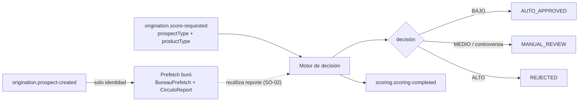

# D2 — Scoring [Core Domain]

> Evaluación de riesgo crediticio **al originar**. Dos momentos: (1) **prefetch** del buró al onboardear (trae y guarda el reporte, no decide); (2) **evaluación** cuando el cliente elige producto (corre el motor de reglas contra la política de ESE producto y emite la decisión). Distinto de [risk (09)](09_risk_domain.md), que evalúa la cuenta ya viva.

**Servicio:** `scoring-service` · **Schema:** `scoring` · **Puerto:** 8082 (bootRun) / 8080 (Docker)

> Reconciliado con el código (2026-08). Se conservan los IDs de invariantes.

## 1. Split prefetch ↔ evaluación

- **SO-01:** `prospect-created` **no** dispara evaluación, solo prefetch.
- **SO-02:** la evaluación **reutiliza** el reporte prefetcheado; no vuelve a llamar al buró si ya existe.

## 2. Agregados

| Agregado | Rol |
|---|---|
| `BureauPrefetch` | Solicitud de prefetch por prospecto (`BureauPrefetchStatus`), keyed por `prospectType`. |
| `CirculoReport` | Reporte del buró (`CirculoReportStatus`) + hijos en cascada: `CirculoScore`, `CirculoCredit`, `CirculoInquiry`, `CirculoEmployment`, `CirculoAddress`. |
| `ScoringPolicy` | Política por **`(prospectType, productTypeIntent)`**, activa y versionada; agrupa `ScoringRule[]` + `RiskThreshold[]`. |
| `ScoringRule` | Regla: `ruleType`, `operator`, `thresholdValue`, `scoreContribution`, `disqualifying`, `creditType?`, `periodMonths?`. |
| `RiskThreshold` | Banda: `riskLevel` → `minScore` → `decision`. |
| `ScoreEvaluation` | Resultado: `totalScore`, `riskLevel`, `decision`, `RuleEvaluationDetail[]` (por qué el score quedó donde quedó). |
| `PrequalificationSnapshot` | Precalificación (items) para la app antes de solicitar. |

## 3. Motor de reglas (configurable desde backoffice)

- **`RuleType`** (catálogo del buró que una política puede evaluar): `MORA_CHECK`, `WORST_ARREARS_BALANCE`, `BALANCE_CHECK`, `OVERDUE_ACCOUNTS_COUNT`, `CURRENT_ACCOUNTS_COUNT`, `OVERDUE_PAYMENTS_COUNT`, `ARREARS_RECENCY_MONTHS`, `PREVENTION_KEY_COUNT`, `TOTAL_DEBT`, `CREDIT_UTILIZATION`, `MONTHLY_PAYMENT_LOAD`, `DEBT_TO_INCOME`, `FICO_THRESHOLD`, `CREDIT_COUNT`, `CREDIT_HISTORY_MONTHS`, `INQUIRY_COUNT`, `AGE_YEARS`, `MONTHLY_INCOME`, `EMPLOYMENT_MONTHS`, `DEPENDENTS_COUNT`.
- **`RuleOperator`**: `GT · GTE · LT · LTE · EQ`.
- **`RiskLevel`**: `BAJO · MEDIO · ALTO`. **`ScoringDecision`**: `AUTO_APPROVED · MANUAL_REVIEW · REJECTED`.
- **`ScoringRuleEvaluator`**: corre cada regla; suma `scoreContribution`; una regla `disqualifying` que matchea fuerza `REJECTED` sin importar el score; el `totalScore` cae en la banda (`RiskThreshold`) que define la decisión.
- **Invariantes:** SP-01 una política activa por `(prospectType, productTypeIntent)` · SP-02 crear sobre un par existente **sube versión** (no duplica).

> El catálogo de `RuleType` se expone (`GET /policies/rule-types`) para que el alta de políticas se construya desde el backoffice y no desde una lista escrita en la consola. Lo que el motor sabe evaluar es exactamente lo que la consola puede configurar.

## 4. API REST — `/api/v1/scoring`

| Método | Ruta | Uso |
|---|---|---|
| `POST` | `/evaluate/{prospectId}` | Corre el motor de decisión. |
| `POST` | `/prequalify/{prospectId}` | Precalificación. |
| `GET` | `/evaluations/{prospectId}/latest` | Última evaluación (ficha de la mesa de análisis). |
| `GET` | `/reports/by-prospect/{prospectId}` | Reporte de buró más reciente. |
| `GET`/`POST` | `/policies`, `/policies/{policyId}` | Catálogo de políticas (alta = versiona). |
| `GET` | `/policies/rule-types` | Catálogo de variables configurables. |

## 5. Eventos Kafka

**Consume:** `origination.prospect-created` (prefetch, no evalúa), `origination.score-requested` (motor de decisión).

**Produce:** `scoring.scoring-completed` (`applicationId`, `decision`, `riskLevel`, `totalScore` → origination, audit), `scoring.scoring-approved` (→ audit).

**Retry:** régimen por defecto (sin DLT). Ver [README raíz §5.4](../../README.md#54-política-de-reintentos-y-dlt-kafka).

## 6. Persistencia

Liquibase, schema `scoring` (10 changesets): `bureau_prefetches` (+ `prospect_type`), `circulo_reports` + hijos, `scoring_policies` + `scoring_rules` + `risk_thresholds`, `score_evaluations`, `prequalification_snapshots`, y seeds de políticas iniciales (INDIVIDUAL/PERSONAL_LOAN, multi-segmento B2C/B2B/B2B2C).

## 7. ACL

| Externo | Interface | Para qué |
|---|---|---|
| Círculo de Crédito / Buró | adaptador de reporte | Prefetch del historial crediticio (config `application.yml`). |

## 8. Decisiones de diseño

| Decisión | Por qué |
|---|---|
| Prefetch ≠ evaluación | El buró solo necesita identidad; la decisión necesita producto. Se difiere la evaluación a la selección de producto. |
| Política por `(prospectType, productTypeIntent)` | La matriz de riesgo es por producto y por tipo de prospecto; no hay decisión sin producto elegido. |
| Reglas + umbrales como datos versionados | Ajustar la política = configuración desde backoffice, no cambio de código; se preserva qué versión decidió cada caso. |
| `disqualifying` corta el score | Un criterio duro (p.ej. mora reciente grave) rechaza sin importar los puntos acumulados. |
