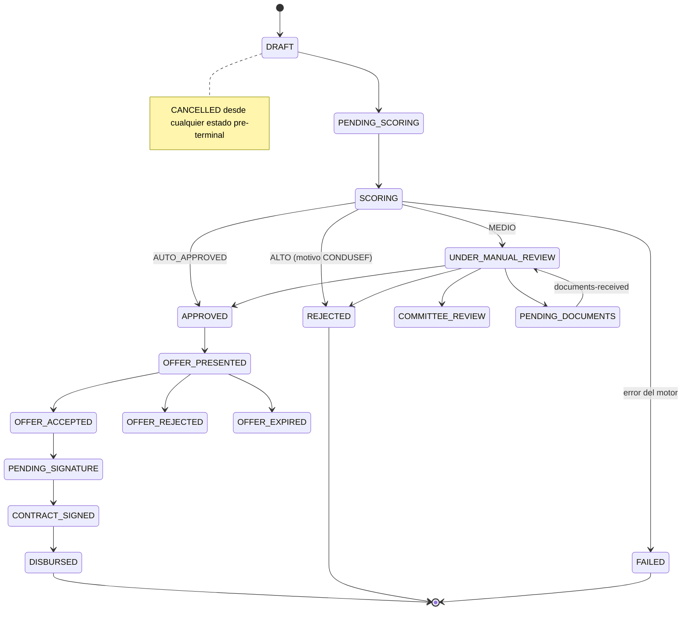

# D3 — Credit Origination [Core Domain]

> Onboarding de la **persona** y ciclo de la **solicitud de crédito**, hasta la firma del contrato que dispara la creación de la cuenta viva. Un bounded context, **dos agregados** con lenguajes distintos.

**Servicio:** `origination-service` · **Schema:** `origination` · **Puerto:** 8081 (bootRun) / 8080 (Docker)

> Reconciliado con el código (2026-08). Se conservan los IDs de invariantes.

## 1. Dos agregados (persona ≠ crédito)

- **`Prospect`** (subdominio *application-intake*) — onboarding de persona + identidad + consentimientos (privacidad + Buró). Su alta dispara **solo el prefetch** de scoring (no evalúa). No carga producto.
- **`CreditApplication`** (subdominio *underwriting*) — el cliente ya onboardeado **elige producto** (`productType`, monto, plazo). *Esto* dispara la evaluación de scoring. Una persona se onboardea una vez y puede crear N solicitudes; la política de riesgo es **por producto**.

## 2. Ciclo de la CreditApplication

`ApplicationStatus`: DRAFT · PENDING_SCORING · SCORING · UNDER_MANUAL_REVIEW · COMMITTEE_REVIEW · PENDING_DOCUMENTS · APPROVED · OFFER_PRESENTED · OFFER_ACCEPTED · OFFER_EXPIRED · OFFER_REJECTED · PENDING_SIGNATURE · CONTRACT_SIGNED · DISBURSED · REJECTED · FAILED · CANCELLED.
`ProspectStatus`: CAPTURED · SUBMITTED · CONVERTED.

**Invariantes:** OA-01 estado terminal inmutable · OA-02 originar `DISTRIBUTOR_LINE` exige rol distribuidor · OA-03 **una** solicitud activa por `prospectId+productType` (índice único parcial) · UW-05 REJECTED exige `rejectionReason` (CONDUSEF) · SO-02 la evaluación reutiliza el reporte de buró prefetcheado en el onboarding.

## 3. Enums de dominio

`ProductType`: PERSONAL_LOAN · REVOLVING_LINE · PAYROLL_LOAN · GROUP_LOAN · DISTRIBUTOR_LINE · SME_LOAN.
`ProspectType`: INDIVIDUAL · BUSINESS. `TargetAudience`: B2C · B2B · B2B2C (derivada del `productType`).
`ProspectDocumentType`: INE_FRONT · INE_BACK · ADDRESS_PROOF · INCOME_PROOF (con `IncomeProofType`).

## 4. El expediente (documentos)

Los archivos viajan **dentro del alta** (`ProspectDocumentFile`, `bytea`) — es el único momento en que existen a la vez el archivo (que vivía en el teléfono) y la autorización para asociarlo (el alta es pública). Después se completan/reemplazan con sesión: `PUT /prospects/{id}/documents/{tipo}/file`. Un documento faltante no tumba el alta → `PENDING_DOCUMENTS`.

## 5. Firma → snapshot hacia la cuenta viva

Al firmar (`POST …/contract/sign`), `ContractService` **congela** los términos de la oferta y la **identidad del beneficiario** (nombre + RFC/CURP, resueltos del `Prospect`) y emite `origination.credit-product-creation-requested`. Ese snapshot es lo único que credit-portfolio necesita: nunca vuelve a llamar a origination ni al catálogo. La identidad del beneficiario es requisito de STP para firmar la orden de pago (entregable 2B.1).

## 6. Resolución del promotor (red comercial)

`PromoterResolver` traduce el `promoterCode` de la solicitud a un distribuidor (party+rol, vía sales-org/party). Un código que no resuelve **rechaza** la solicitud (`PromoterCodeNotResolvableException`) en vez de originar un crédito que nunca generaría comisión (desactiva la bomba CM-07).

## 7. API REST

| Base | Endpoints |
|---|---|
| `/api/v1/origination/prospects` | `POST /` (alta con documentos), `GET /{prospectId}`, `GET /lookup`, `…/documents`, `…/documents/{tipo}/file` (GET/PUT) |
| `/api/v1/origination/applications` | `POST /` (crear), `GET /` (bandeja filtrable), `GET /{applicationId}` |
| `…/applications/{id}/offer` | `POST /accept`, `POST /reject` |
| `…/applications/{id}/contract` | `POST /generate`, `POST /sign` |
| `/api/v1/origination/underwriting` | `POST /{id}/decision`, `/route-to-review`, `/request-documents`, `/documents-received` |
| `/internal/test-support` | llevar una solicitud a revisión manual/comité sin depender del score (dev-only) |

## 8. Eventos Kafka

**Consume:** `channels.application-started`, `scoring.scoring-completed` (aplica la decisión, correlaciona por `applicationId`), `credit-portfolio.credit-account-activated` (marca DISBURSED).

**Produce:** `origination.prospect-created` (persona + `password` raw para aprovisionar identity — se redacta en audit), `score-requested` (con `productType`), `offer-presented`, `contract-signed`, `credit-product-creation-requested` (snapshot + beneficiario), `application-approved`, `application-rejected`, `documents-requested`.

**Retry:** régimen por defecto (sin DLT). Ver [README raíz §5.4](../../README.md#54-política-de-reintentos-y-dlt-kafka).

## 9. Persistencia

Liquibase, schema `origination`: `prospects`, `prospect_addresses`, `prospect_documents` + `prospect_document_files` (bytea), `credit_applications` (con `promoter_code`, `beneficiary_party_id`), `contracts`, `credit_offers`, índices de búsqueda de la bandeja.
