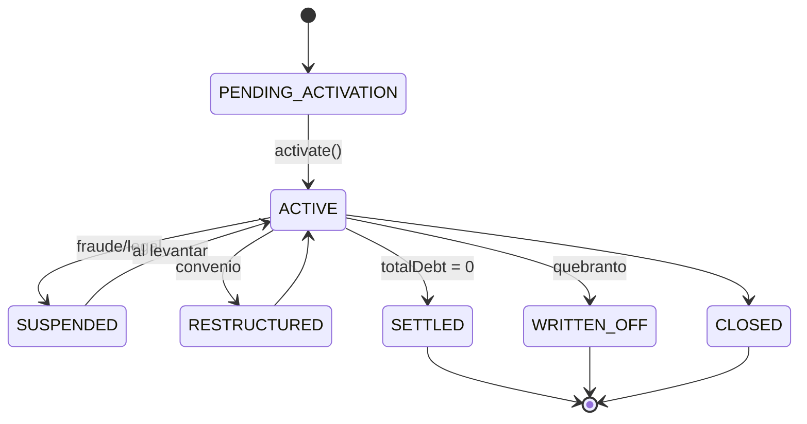

# D4★ — Credit — Portfolio [Core Domain ★ — EL CORAZÓN]

> Administra la **cuenta de crédito viva**. Motor único para todos los tipos — comportamiento gobernado por `productType` + `dispositionType`, parametrizado por el **snapshot** del catálogo (credit-product) congelado al originar. **Única fuente de verdad de todos los saldos.**
>
> Resultado del split de "D4 Credit Product" (ver [ADR en README](../../README.md#1-decisión-de-arquitectura)). El catálogo vive en [credit-product (04)](04_credit_product_domain.md); aquí vive la cuenta operacional. Agregado raíz **`CreditAccount`**; evento **`CreditAccountActivated`**.

**Servicio:** `credit-portfolio-service` · **Schema:** `credit_portfolio` · **Puerto:** 8087 (bootRun) / 8080 (Docker)

> Esta especificación está **reconciliada con el código** (2026-08). Los invariantes conservan sus IDs; los flujos de desembolso reflejan la integración event-driven con `disbursement-service`/`stp-service`.

## 1. Motor por productType (gobernado por el snapshot del catálogo)

| Feature | PERSONAL_LOAN | REVOLVING_LINE | DISTRIBUTOR_LINE | GROUP_LOAN | PAYROLL_LOAN |
|---|:---:|:---:|:---:|:---:|:---:|
| AmortizationSchedule | ✅ | ❌ | ❌ | ✅ | ✅ |
| creditLimit / availableCredit | ❌ | ✅ | ✅ | ❌ | ❌ |
| Múltiples disposiciones | ❌ | ✅ | ✅ | ❌ | ❌ |
| dispositionType permitido | `SELF_USE` | `SELF_USE` | `THIRD_PARTY_CREDIT` | `SELF_USE` | `PAYROLL` |
| Commission accrual (T6) | ❌ | ❌ | ✅ | ❌ | ❌ |
| cutoffDate / pago mínimo | ❌ | ✅ | ✅ | ❌ | ❌ |

> El **código del motor** (estrategias por tipo) vive aquí; los **datos que lo parametrizan** llegan en el snapshot (`ProductConfigVersion` + `Capabilities`). Agregar un producto = registrar una `ProductDefinition` en credit-product, no tocar este motor.

## 2. Máquina de estados



`CreditAccountStatus`: `PENDING_ACTIVATION · ACTIVE · SUSPENDED · RESTRUCTURED · SETTLED · WRITTEN_OFF · CLOSED`.
`daysDelinquent` se actualiza por job — la cuenta permanece ACTIVE aunque esté en mora.

## 3. Subdominios (módulos internos — un solo servicio por consistencia de saldos)

`product-lifecycle` · `disposition-engine` · `balance-engine` ★ · `amortization-engine` · `statement-generation` · `restructure-engine`. No se parten: el motor de saldos exige consistencia fuerte transaccional. Se desacopla *entre* contextos (Charges/Payments/Collections), nunca *dentro* del límite de consistencia de la cuenta.

## 4. Agregado: CreditAccount [Root]

| Campo | Tipo | Nota |
|---|---|---|
| `creditAccountId` | UUID | Inmutable |
| `contractId / contractNumber` | ref / string | Inmutables |
| `productCode / productVersion` | ref | Snapshot del catálogo usado al originar |
| `obligorPartyId` | PartyId | Inmutable — siempre el que paga |
| `productType / productBehavior` | enum | Inmutable post-activación |
| `status` | CreditAccountStatus | Ver §2 |
| `nominalRate / moratoriumRate / openingFeeRate` | Percentage | Inmutables salvo Restructure |
| `assignedTerm?` | int (meses) | Null para revolventes |
| `creditLimit? / availableCredit?` | Money | Solo revolventes |
| `principalBalance` | Money | Capital insoluto |
| `accruedInterestBalance` | Money | Interés devengado no pagado |
| `penaltyBalance` | Money | Mora + comisiones + seguros |
| `clabeAccount` | string | Destino del desembolso |
| `beneficiaryName / beneficiaryTaxId` | string | **Identidad del beneficiario, congelada al originar (mig 012)** — STP la exige para firmar; viaja en `credit-account-activated` |
| `daysDelinquent` | int | Job — 0 si al corriente |
| `balanceVersion` | long | Se incrementa en cada mutación; viaja en `balance-updated` para detectar staleness |

**Sub-entidades:** `Disposition` (`DispositionStatus`: PENDING · PROCESSING · COMPLETED · FAILED · REVERSED; `DispositionType`: SELF_USE · THIRD_PARTY_CREDIT · PAYROLL), `Installment` (`InstallmentStatus`: PENDING · PAID · OVERDUE · PARTIAL), `BalanceEvent` (bitácora de mutaciones + idempotencia por `sourceEventId`).

**Invariantes:** CP-01 `productType/obligorPartyId/contractId` inmutables · CP-02 `totalDebt≥0` · CP-03 `availableCredit` nunca negativo · CP-04 SUSPENDED no procesa disposiciones ni reestructuras · CP-05 PERSONAL_LOAN/PAYROLL_LOAN → una sola disposición completada · CP-06 DISTRIBUTOR_LINE → `THIRD_PARTY_CREDIT` + `beneficiaryPartyId` · CP-07 `daysDelinquent` solo lo escribe el job de delinquency · CP-08 `SETTLED` solo si `totalDebt=0` sin disposiciones PENDING/PROCESSING · CP-09 WRITTEN_OFF no acepta Restructure.

## 5. Modelo de saldos

```
totalDebt       = principalBalance + accruedInterestBalance + penaltyBalance
availableCredit = creditLimit − principalBalance − pendingDispositions   [revolventes]

Jerarquía de pago (configurable T5, default): penalty → interés → principal
```

Actualizaciones por evento entrante (patrón: **los demás calculan, portfolio aplica**; Charges/Payments/Collections nunca escriben la BD de portfolio):

| Evento entrante | De | Efecto |
|---|---|---|
| `charges.charge-applied` | Charges | `accruedInterestBalance` o `penaltyBalance += amount` según `chargeType` |
| `charges.charge-reversed` | Charges | Revierte según `originalChargeType` |
| `payments.payment-applied` | Payments | Reduce en jerarquía; libera cupo (revolvente); `lastPaymentDate` |
| `payments.payment-returned` | Payments | Restaura saldos revertidos |
| `collections.agreement-executed` | Collections | QUITA_PARCIAL reduce deuda; RESTRUCTURE ajusta tasa/plazo |
| `collections.write-off-executed` | Collections | Saldos → 0; `status → WRITTEN_OFF` |
| `wallet.disposition-requested` | Wallet | Nueva disposición sobre línea activa |
| `product-catalog.product-activated/retired` | credit-product | Actualiza el `ProductConfigVersion` disponible |

## 6. Desembolso — flujo event-driven (reconciliado con el código)

El desembolso **ya no se despacha en línea**. Antes `activate()` llamaba a SPEI dentro de la transacción y marcaba la disposición COMPLETED sin que saliera un peso; hoy:

```mermaid
sequenceDiagram
    participant O as origination
    participant CP as credit-portfolio
    participant D as disbursement
    participant T as stp
    O->>CP: origination.credit-product-creation-requested (snapshot + beneficiario)
    Note over CP: crea CreditAccount, disposición en PROCESSING (sin SPEI inline)
    CP->>D: credit-portfolio.credit-account-activated { disbursementInstruction }
    D->>T: disbursement.stp-requested
    T-->>D: stp.order-settled
    D->>CP: disbursement.completed (externalRef real)
    Note over CP: disposición → COMPLETED; publica disposition-completed
    D-->>CP: disbursement.failed → disposición FAILED
```

- La `DisbursementInstruction` (bloque anidado de `credit-account-activated`) viaja **solo si hay dinero que mover** (revolvente abre en cero → `null`). Lleva `dispositionId, amount, MXN, beneficiaryName, clabeAccount, "40", beneficiaryTaxId, concept`.
- Cierre de ciclo: `DisbursementOutcomeListener` consume `disbursement.completed`/`disbursement.failed`, correlaciona por `dispositionId` (eco en `sourceMetadata`/`sourceReference`) y completa/falla la disposición (idempotente si no está PROCESSING).
- **Pendiente (2B.2):** el camino wallet `THIRD_PARTY` aún se liquida con el `SpeiDispatchPort` stub; su ruta por `credit-portfolio.disposition-authorized` → disbursement no está cableada (credit-portfolio aún no emite ese hecho).

## 7. API REST — `/api/v1/portfolio/accounts`

| Método | Ruta | Uso |
|---|---|---|
| `GET` | `/` (`?partyId=`) | Cuentas de un party (móvil) |
| `GET` | `/search` | Listado filtrable+paginado (status, productType, dpd, partyIds, q, sort) |
| `GET` | `/batch?ids=` | Hidrata varias cuentas en **una** consulta (mata el N+1 del BFF) |
| `GET` | `/summary` · `/stats?groupBy=` · `/product-mix` | Agregados para el tablero (calculados en la base) |
| `GET` | `/{creditAccountId}` · `/{id}/amortization-schedule` · `/{id}/dispositions` | Ficha, calendario, disposiciones |

**Test-support (`/internal/test-support`, `TEST_SUPPORT_ENABLED`, no enrutado por el gateway):** corte, marcar vencidas, recalcular mora, mover fecha de una mensualidad, correr jobs de delinquency/installment-due/upcoming.

### Cartera por unidad de origen

`GET /api/v1/portfolio/accounts/stats/by-origin-unit?unitCodes=`

Agrupa por `origin_unit_code`: **la unidad que colocó el crédito, sellada al activarlo**. No cambia
aunque la cartera se reasigne — es la decisión del changeset 013, tomada para que la balanza de marzo
siga dando lo mismo en agosto.

**No es lo mismo que «la unidad del ejecutivo que lleva hoy al cliente»**, que responde el rollup
comercial del BFF. Son dos preguntas distintas sobre la misma cartera: mientras nada se reasigne
coinciden, y en cuanto se reasigne una cartera dejarán de hacerlo. Por eso viajan por endpoints
separados y el cuerpo declara su `attribution`.

Devuelve los tres tramos IFRS-9 sin colapsar y **no** una provisión ya calculada: la escala de
pérdida esperada vive en el canal, y duplicarla aquí garantizaría que un día las dos se separen.

> **Nota de SQL:** el filtro va en **dos consultas** —con y sin `unitCodes`— y no con
> `(:codes IS NULL OR …)`. Ese truco funciona en JPQL pero en SQL **nativo** Postgres no infiere el
> tipo de una colección nula: `could not determine data type of parameter $1`.

> **Dato conocido:** `origin_unit_code` guarda hoy códigos de **ejecutivo** (`E_SAL_1`), no de
> sucursal como dice el comentario del changeset. Funciona igual —el subárbol los incluye y suman
> hacia arriba— pero el nombre miente sobre el nivel.

## 8. Eventos Kafka

**Consume:** `origination.credit-product-creation-requested`, `product-catalog.product-activated`/`product-retired`, `charges.charge-applied`/`charge-reversed`, `payments.payment-applied`/`payment-returned`, `wallet.disposition-requested`, `collections.agreement-executed`/`write-off-executed`, `disbursement.completed`, `disbursement.failed`.

**Produce:** `credit-portfolio.credit-account-activated` (con `disbursementInstruction`), `balance-updated`, `delinquency-status-updated`, `disposition-completed`, `disposition-rejected`, `installment-due`, `installment-upcoming`, `payment-rejected`, `charge-rejected`.

**Retry:** régimen por defecto (sin DLT). Idempotencia por `BalanceEvent.sourceEventId`. Ver [README raíz §5.4](../../README.md#54-política-de-reintentos-y-dlt-kafka).

## 9. Jobs

| Job | Acción |
|---|---|
| DelinquencyCalculation | `daysDelinquent` por cuenta ACTIVE → `delinquency-status-updated` si cambió |
| InstallmentDue | Cuotas vencidas → `installment-due` |
| UpcomingInstallment | Próximas a vencer → `installment-upcoming` (recordatorio de cobranza) |

## 10. Persistencia

Liquibase, schema `credit_portfolio` (12 changesets): `credit_accounts`, `dispositions`, `installments`, `product_config_versions`, `balance_events`, índices de delinquency/búsqueda, `disposition.source_event_id` (idempotencia), y `012-add-beneficiary-identity` (`beneficiary_name`, `beneficiary_tax_id`).

## 11. Decisiones de diseño

| Decisión | Por qué |
|---|---|
| Separar catálogo (credit-product) de cuenta viva | Lectura intensa vs escritura intensa; configuración vs operación |
| Motor único por productType | Agregar producto = configurar el catálogo, no tocar el motor |
| CreditAccount = fuente de verdad de saldos | O(1) en consultas — sin agregar Charges+Payments en runtime |
| Snapshot inmutable del catálogo + beneficiario al originar | La cuenta no depende del catálogo en runtime; protege el expediente regulatorio |
| Desembolso por eventos (disbursement/stp), no SPEI inline | La deuda nace al activar; el dinero se confirma después — sin marcar COMPLETED antes de tiempo |
| Balance-engine en un solo servicio | Consistencia fuerte sobre dinero — no partir el límite de consistencia |
| `daysDelinquent` por job | Mora es temporal, no reactiva — evita race conditions |
