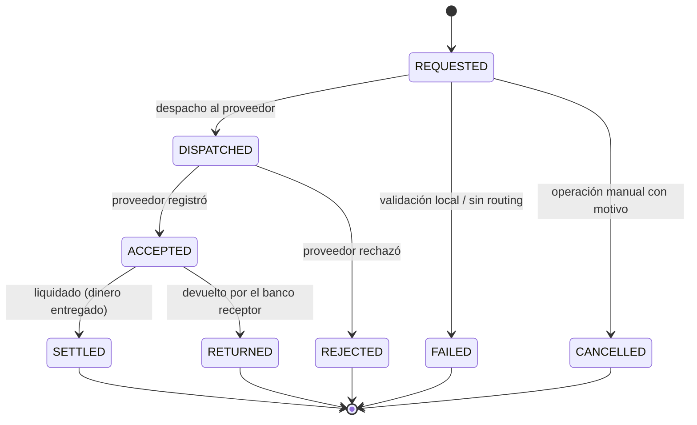

# D10 — Disbursement [Supporting / Comercializable aparte]

> Motor de **payouts** multi-rail y multi-empresa. Recibe "hay que pagar esto" y saca el dinero por el proveedor correcto, con idempotencia, ventana operativa, reintentos y DLT. **Su núcleo no tiene vocabulario de crédito**: la procedencia viaja en campos opacos que devuelve en eco. Servicio **interno** — no publicado en el gateway.

**Servicio:** `disbursement-service` · **Schema:** `disbursement` · **Puerto:** 8080 (Docker)

> Reconciliado con el código (2026-08).

## 1. La restricción que define el diseño (§7.2)

Todo el vocabulario de crédito muere en la **frontera** (los `@KafkaListener` de entrada). Lo que entra al núcleo es una orden de pago con la procedencia en `sourceSystem`/`sourceType`/`sourceReference`/`sourceEventId`/`sourceMetadata` (mapa opaco). El núcleo **no lee** `sourceMetadata` para decidir nada (DB-09) — lo devuelve en eco para que el emisor correlacione. Borrar los tres listeners de entrada deja un servicio de payouts que funciona igual por REST: esa es la prueba de "comercializable aparte".

## 2. Máquina de estados — DisbursementOrder

`DisbursementStatus`: REQUESTED · DISPATCHED · ACCEPTED · SETTLED · RETURNED · REJECTED · FAILED · CANCELLED. `Rail`: SPEI · CODI · INTERNAL. `DisbursementSource`: DISPOSITION · WITHDRAWAL · SURPLUS_RETURN · ACCOUNT_VERIFICATION · API · MANUAL.

**Invariantes:** DB-01 estado terminal inmutable (transición desde terminal → 422) · DB-02 `(sourceSystem, sourceType, sourceEventId)` **UNIQUE** → evento repetido se ignora · DB-03 `SETTLED` solo con evidencia del proveedor (`ACCEPTED` no es dinero entregado) · DB-04 CLABE validada (dígito verificador) **antes** de despachar; falla → `FAILED/INVALID_BENEFICIARY_ACCOUNT` sin tocar al proveedor · DB-05 fuera de ventana operativa queda `REQUESTED` con `scheduled_for` (no se rechaza) · DB-06 toda transición escribe en `disbursement_events` (append-only) · DB-07 `companyId` obligatorio, resuelto antes de crear la orden; sin empresa → `FAILED/UNRESOLVED_COMPANY` · DB-08 `banxicoCode` retryable (p.ej. -30) vuelve a `REQUESTED` con backoff acotado, no a `REJECTED` · DB-09 el núcleo no lee `sourceMetadata` para decidir.

## 3. Agregados

| Agregado / VO | Rol |
|---|---|
| `DisbursementOrder` [root] | La orden de pago (monto, beneficiario, rail, estado, origen opaco). |
| `Beneficiary` | Nombre, cuenta, tipo de cuenta ("40" CLABE/"3" tarjeta/"10" celular), RFC, institución. |
| `Provider` | Proveedor de pago (STP…). |
| `CompanyMapping` | Resuelve el `companyId` (tenant) — DB-07. |
| `OperatingWindow` | Ventana operativa por rail — DB-05. |
| `DisbursementEvent` | Bitácora append-only de transiciones (DB-06). |
| `ClabeValidator` | Dígito verificador CLABE — DB-04. |

## 4. Entradas / Salidas (Kafka)

**Consume:** `credit-portfolio.credit-account-activated` (si trae `disbursementInstruction` y `dispositionType ≠ SELF_USE`, hay algo que pagar), `credit-portfolio.disposition-authorized` (camino wallet `THIRD_PARTY` — el emisor aún no lo publica, 2B.2), `wallet.withdrawal-completed`, y los resultados del conector: `stp.order-accepted`, `stp.order-settled`, `stp.order-rejected`, `stp.order-returned`.

**Produce:** `disbursement.stp-requested` (→ stp), `disbursement.completed` (→ credit-portfolio, con `externalRef` real + `sourceMetadata` en eco), `disbursement.failed` (→ credit-portfolio), `disbursement.accepted`, `disbursement.returned`.

## 5. Reintentos y DLT (régimen "mueve dinero")

`KafkaConfig`: backoff exponencial **no bloqueante** (`initialInterval=1s`, `multiplier=2.0`, `maxInterval=30s`, `maxElapsedTime=15s` → ~4 intentos) y, agotado, **DLT** `<topic>.dlt` (misma partición). Errores **deterministas** van directo al DLT sin gastar reintentos (`addNotRetryableExceptions`): `UnresolvedCompanyException`, `InvalidBeneficiaryAccountException`, `DisbursementNotFoundException`. Idempotencia por DB-02. Ver [README raíz §5.4](../../README.md#54-política-de-reintentos-y-dlt-kafka).

## 6. API REST — `/api/v1/disbursements` (interna / operación por el BFF)

| Método | Ruta | Uso |
|---|---|---|
| `GET` | `/{disbursementId}` · `/{id}/events` | Orden + su bitácora de transiciones. |
| `POST` | `/{disbursementId}/cancel` | Cancelar (solo desde REQUESTED, con motivo). |
| — | ~~`/routing`~~ | **Retirado (BK-08).** Por dónde sale el dinero lo decide `banking`; este servicio lo consulta por su puerto ACL. |
| `GET`/`POST` | `/company-mappings` | Resolución de empresa (tenant). |

## 7. Persistencia y outbox

Liquibase, schema `disbursement`: `company_mappings`, `disbursement_orders`, `disbursement_events`, y la tabla de **event-publication** (outbox de Spring Modulith — el evento sale en la misma transacción que el cambio de estado). El repositorio usa `FOR UPDATE SKIP LOCKED` (`@Lock(PESSIMISTIC_WRITE)` + hint `lock.timeout=-2`) para despachar en paralelo sin coordinador.

## 8. Decisiones de diseño

| Decisión | Por qué |
|---|---|
| Núcleo sin vocabulario de crédito | Vendible aparte; el origen viaja opaco y se devuelve en eco. |
| Un topic por proveedor (`disbursement.stp-requested`) | Agregar proveedor no toca a los emisores. |
| Backoff + DLT (a diferencia del resto) | Cada mensaje no procesado es un pago en riesgo: debe quedar visible. |
| Errores deterministas directo al DLT | Reintentar una CLABE inválida solo retrasa el diagnóstico. |
| Ventana operativa → `scheduled_for` | Fuera de horario no se rechaza, se agenda (DB-05). |
