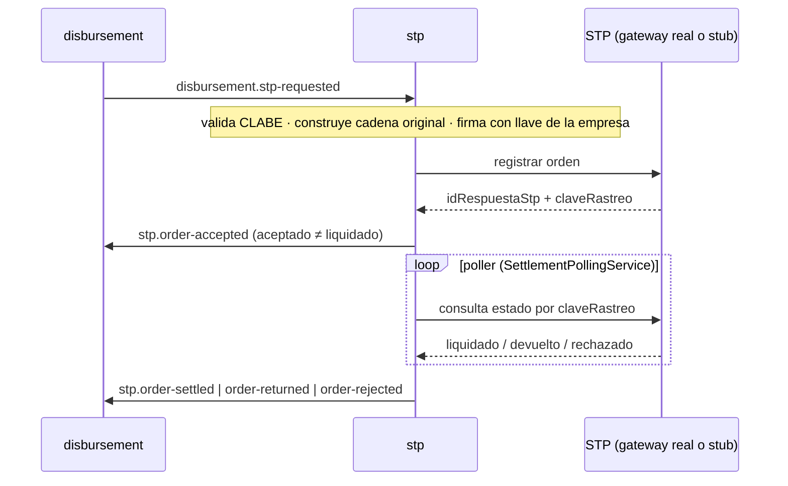

# D11 — STP Connector [Generic Subdomain / ACL]

> Conector con **STP** (SPEI) para `disbursement`. Traduce una orden de pago genérica al contrato exacto de STP: **cadena original + firma**, registro de la orden, y **conciliación por consulta (poller), no por webhook**. Multi-empresa desde el día uno (custodia de llaves por tenant). Servicio **interno**, sin exposición a internet.

**Servicio:** `stp-service` · **Schema:** `stp` · **Puerto:** 8101 (bootRun) / 8080 (Docker)

> Reconciliado con el código (2026-08).

## 1. Qué sabe y qué NO

Sabe: construir la **cadena original** en el orden exacto de campos, firmarla con la llave de la empresa, registrar la orden ante STP, consultar liquidación y clasificar el código Banxico. **No sabe** nada de crédito, disposiciones ni cuentas: recibe `StpPaymentRequestedPayload` (monto, beneficiario, concepto, referencia, empresa) y devuelve resultados. Es un ACL puro.

## 2. Flujo (sin webhooks)

`stp.order-accepted` significa **registrado**, no dinero entregado; `stp.order-settled` lo confirma el poller.

## 3. Agregados

| Agregado / VO | Rol |
|---|---|
| `StpPaymentOrder` [root] | Orden ante STP (`StpPaymentOrderStatus`); su bitácora `StpPaymentOrderEvent`. |
| `SettlementObservation` | Observación del poller (`SettlementObservationStatus`: APPLIED · DUPLICATE · UNMATCHED · SIGNATURE_INVALID · SIGNATURE_UNVERIFIED · FAILED). |
| `StpCompany` / `StpCompanyKey` | Tenant + su llave (`KeyStatus`: ACTIVE · ROTATING · RETIRED · REVOKED) — custodia por empresa. |
| `OrderingAccount` | Cuenta ordenante por empresa. |
| `TrackingKey` | `claveRastreo` — identificador ante Banxico (secuencia por empresa). |
| `OutboxMessage` | Outbox transaccional (`OutboxStatus`) relevado por `OutboxRelayService`. |
| `OrdenPagoFirmaSupport` | Construcción **explícita** (no reflexiva) de la cadena original firmable. |
| `BanxicoResponseCode` | Catálogo de códigos Banxico → clasificación retryable/terminal. |
| `ClabeValidator` / `BeneficiaryNameMatcher` | Validación de cuenta y match de nombre del beneficiario. |

## 4. La firma — la pieza de mayor riesgo

La cadena original se arma **campo por campo en orden explícito** (`OrdenPagoFirmaSupport`), nunca por reflexión: un cambio de orden invalida la firma ante Banxico. El nombre (posición 14) y RFC/CURP (posición 16) del beneficiario **son obligatorios** — por eso viajan congelados desde originación (2B.1). La llave privada por empresa se guarda cifrada (**envelope encryption**, `KeyMaterialCipher`) y se resuelve vía `SigningKeyProvider`; rotación soportada por `KeyStatus`.

## 5. Stub para ambientes bajos

`fintech.stp.gateway.mode = stub | real` (`StpGatewayPort`). El stub firma de verdad y responde de forma **determinista por los centavos** del monto (para provocar aceptado/rechazado/devuelto en pruebas), persistiendo en `stub-orders`. Guarda contra usar `stub` en producción. Así los entornos bajos ejercitan el flujo completo sin tocar STP real.

## 6. Entradas / Salidas (Kafka)

**Consume:** `disbursement.stp-requested` (`STP_INBOUND_TOPIC`, configurable).

**Produce:** `stp.order-accepted`, `stp.order-settled`, `stp.order-rejected`, `stp.order-returned` (→ disbursement).

**Reintentos y DLT:** igual que disbursement — backoff exponencial (1→2→4→8s, `maxElapsed 15s`) + DLT `<topic>.dlt`; errores deterministas directos (no-retryable). Ver [README raíz §5.4](../../README.md#54-política-de-reintentos-y-dlt-kafka).

## 7. API REST — `/api/v1/stp` (interna)

| Método | Ruta | Uso |
|---|---|---|
| `GET` | `/payment-orders` · `/payment-orders/{paymentRequestId}` | Órdenes. |
| `GET` | `/settlement-observations` | Observaciones del poller. |
| `POST` | `/poll` | Disparar conciliación (operación/dev). |
| `GET`/`POST` | `/companies/{companyId}/keys` · `/companies/{companyId}/ordering-accounts` | Administración multi-empresa (ADMIN). |

## 8. Persistencia y outbox

Liquibase, schema `stp` (11 changesets): `companies`, `company_keys`, `ordering_accounts`, `payment_orders`, `payment_order_events`, `settlement_observations`, `tracking_key_sequences`, `outbox_messages`, `stub_orders`, y event-publication. El repositorio de outbox usa `@Lock(PESSIMISTIC_WRITE)` para el relay concurrente.

## 9. Decisiones de diseño

| Decisión | Por qué |
|---|---|
| Conciliación por poller, no webhook | Sin exposición a internet; STP se consulta, no nos llama. |
| Cadena original explícita | El orden de campos es el contrato de firma; la reflexión es un riesgo de regresión silenciosa. |
| Multi-empresa con envelope encryption | Cada tenant tiene su llave; rotación sin downtime. |
| Outbox transaccional | El evento de resultado sale en la misma transacción que el cambio de estado. |
| Stub determinista que firma de verdad | Ambientes bajos ejercitan firma + flujo sin STP real. |
