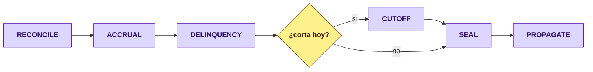

# D14 — Closing [Core]

> **El día contable, ejecutado cuenta por cuenta.** Devenga, envejece, corta el ciclo del que lo tiene, sella lo que cuadró y propaga de vuelta el exigible. Reparte el trabajo entre pods sin coordinador central.

**Servicio:** `closing-service` · **Schema:** `closing` · **Puerto:** 8103 (bootRun) · 8080 (Docker)

> Escrito contra el código (2026-08).

## 1. El hueco que cierra

El cierre vivía repartido en `@Scheduled` de tres servicios, cada uno con su reloj. Dos consecuencias que sólo se ven cuando algo falla: **nadie podía afirmar que un día cerró** —cada job dejaba su rastro por separado— y **reprocesar un día era imposible**, porque los jobs se disparan por reloj y no por fecha de negocio.

Además el barrido competía por el pool de conexiones con la API de cartera. Sacarlo de ahí es medio motivo de que el servicio exista.

## 2. Las seis fases

El orden no es negociable: devengar después de envejecer produce un DPD que ignora el cargo del día, y sellar antes de cortar sella un saldo que el corte va a mover.

## 3. Agregados

| Agregado / VO | Rol |
|---|---|
| `CloseRun` [root] | Una corrida de un día de negocio. Sabe cuántas unidades planificó y cuántas terminaron. |
| `CloseUnit` | Una cuenta dentro de la corrida, con su arrendamiento y su fase. Es la unidad de reparto. |
| `CloseSeal` | La afirmación de que ese día, esa cuenta, cuadró. Lleva hash de las cifras. |
| `ClosePolicy` | Qué fases corre un producto, con qué base de devengo y qué regla de corte. |
| `CutoffSchedule` | El calendario de cortes de una cuenta revolvente: fecha de corte y fecha exigible. |
| `AccountCloseProfile` | La proyección de la cuenta que el cierre mantiene — no consulta a cartera en línea. |
| `CalendarDay` | Un día del calendario de negocio y si se opera en él. |
| `ReconciliationFinding` | Un descuadre detectado, con su tipo y las cifras que lo prueban. |

**Invariantes:**
**CL-01** el reparto usa **candado de Redis, nunca `FOR UPDATE`** — el barrido no puede bloquear la API de cartera ·
**CL-02** un pod cuyo arrendamiento venció **no escribe**: el token de cercado lo rechaza ·
**CL-03** quien pierde el CAS optimista pasa a la unidad siguiente, no reintenta ·
**CL-04** el `LeaseReaper` devuelve al lote lo que un pod muerto dejó tomado ·
**CL-05** el hash del sello se calcula sobre importes **normalizados a escala 4** — la misma cifra da la misma cadena venga de memoria o de la base ·
**CL-06** si no cuadra, **no se sella**: sellar «con observaciones» convierte el sello en un trámite ·
**CL-07** hay **una sola política ACTIVE por alcance**, impuesta por índice único parcial: con dos, cuál gana depende del orden de las filas y el cierre deja de ser reproducible ·
**CL-08** la gracia por defecto es **3 días**, la misma que `charges` (BK-21).

## 4. Por qué el calendario se guarda día por día

Los días inhábiles bancarios en México no salen de una fórmula estable —hay traslados por decreto— y un algoritmo que acierta este año y falla el siguiente es **peor que una tabla**, porque nadie lo revisa.

## 5. Lo que deliberadamente NO hace

| | Por qué |
|---|---|
| No calcula intereses | Es de `charges`. El cierre dispara la fase y consume el resultado. |
| No concilia bancos | Es de `banking` (D15), que emite su propio sello. El cierre lo consume como cifra de control, no como dueño. |
| No inventa el importe de una cuota | Sale del plan de amortización, que es de cartera. Duplicar la aritmética crearía dos fuentes de verdad que divergen al primer redondeo. |

## 6. Entradas / Salidas (Kafka)

**Consume:** `credit-portfolio.credit-account-activated` —con `paymentFrequency` y `termPeriods`, que viajan para que el corte se derive sin consultar el calendario de la cuenta en línea— y `credit-portfolio.balance-updated`.

**Produce:** `closing.unit-window-opened` · `closing.cutoff-closed` · `closing.day-sealed`.

## 7. El corte cierra el circuito de la revolvente

`closing.cutoff-closed` lleva `paymentDueDate`, y **ése es el dato clave**: es la fecha exigible de una revolvente. Un producto a plazo la saca de su plan; una tarjeta no tiene plan, y sin esta fecha no tendría ninguna.

Cartera la consume y materializa **una cuota del ciclo** con el exigible (`Σ compras − Σ diferidas + Σ cuotas vigentes`). Sin eso, una compra de tarjeta —que nace sin calendario— no tendría nada que vencer, y la línea saldría invariablemente con cero días de atraso: un cero que arrastra a riesgo, a cobranza y al quebranto detrás.

## 8. Decisiones de diseño

| # | Decisión | Por qué |
|---|---|---|
| 1 | Candado **Redis**, no de base | El barrido y la API comparten base; un `FOR UPDATE` los enfrenta justo cuando el cierre corre. |
| 2 | Token de cercado además del candado | Un candado que expira no basta: el pod que lo tenía puede seguir vivo y escribir tarde. |
| 3 | Unidad = cuenta, no lote | Un lote que falla a la mitad deja un día ambiguo. Una cuenta que falla deja 4 999 cerradas y una señalada. |
| 4 | Proyección propia de la cuenta | Consultar a cartera por cuenta convertiría el cierre en su cliente más pesado, la noche en que menos conviene. |
| 5 | Hash normalizado a escala 4 | `NUMERIC(19,4)` devuelve escala 4 y `toPlainString()` la respeta: sin normalizar, **ningún sello releído se verificaba** (TK-05). |
| 6 | El sello bancario lo emite `banking` | Quien dispara una conciliación no es su dueño. |
