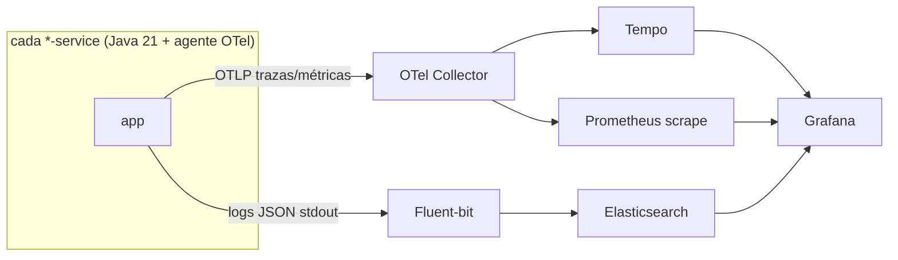

# T7 — Observability [Transversal · Infra]

> No es un dominio de negocio: es la **plataforma de observabilidad** de los tres pilares (trazas, métricas, logs) y cómo cada servicio se cablea a ella. Sin schema ni API de negocio.

**Servicio/carpeta:** `observability-service` (config del stack) · **Sin schema propio**

> Reconciliado con `docker-compose.yml` (2026-08).

## 1. Stack (imágenes reales)

| Pilar | Componente | Imagen |
|---|---|---|
| Recolección | OpenTelemetry Collector | `otel/opentelemetry-collector-contrib:0.110.0` |
| Trazas | Tempo | `grafana/tempo:2.6.1` |
| Métricas | Prometheus | `prom/prometheus:v2.55.1` |
| Logs | Fluent-bit → Elasticsearch | `elasticsearch` |
| Visualización | Grafana | `grafana/grafana:11.3.0` |

## 2. Los tres pilares

- **Trazas:** el agente OTel abre spans y propaga `traceparent` (W3C) desde el gateway al upstream. Grafana → Explore → Tempo → Search por Service Name.
- **Métricas:** cada servicio expone `/actuator/prometheus` (Micrometer); Prometheus lo scrapea.
- **Logs:** JSON estructurado a stdout con `trace_id`/`corrId` para correlacionar con la traza; Fluent-bit los envía a Elasticsearch.

## 3. Correlación

El `traceparent` del gateway + el `X-Correlation-Id` (MDC en cada servicio) atan una petición extremo a extremo: de la traza en Tempo al log en Elasticsearch al panel en Grafana. Es lo que permite responder "qué pasó con esta petición" sin adivinar por hora.

## 4. Cómo se incorpora un servicio

1. Dependencia de métricas (Micrometer/Prometheus) + exponer `/actuator/prometheus`.
2. Logs JSON con `trace_id`.
3. Cablear el servicio en `docker-compose.yml` con el agente OTel.
4. Registrar el scrape en Prometheus.

Detalle paso a paso operativo en [services/observability-service/README.md](../../services/observability-service/README.md).

## 5. Decisiones de diseño

| Decisión | Por qué |
|---|---|
| OTel Collector como hub | Un solo punto de recolección; cambiar backend no toca los servicios. |
| Perfil opt-in en compose | Levantar el stack de observabilidad es opcional para desarrollo ligero. |
| Correlación traza↔log↔métrica | Diagnóstico extremo a extremo sin juntar señales a mano. |
