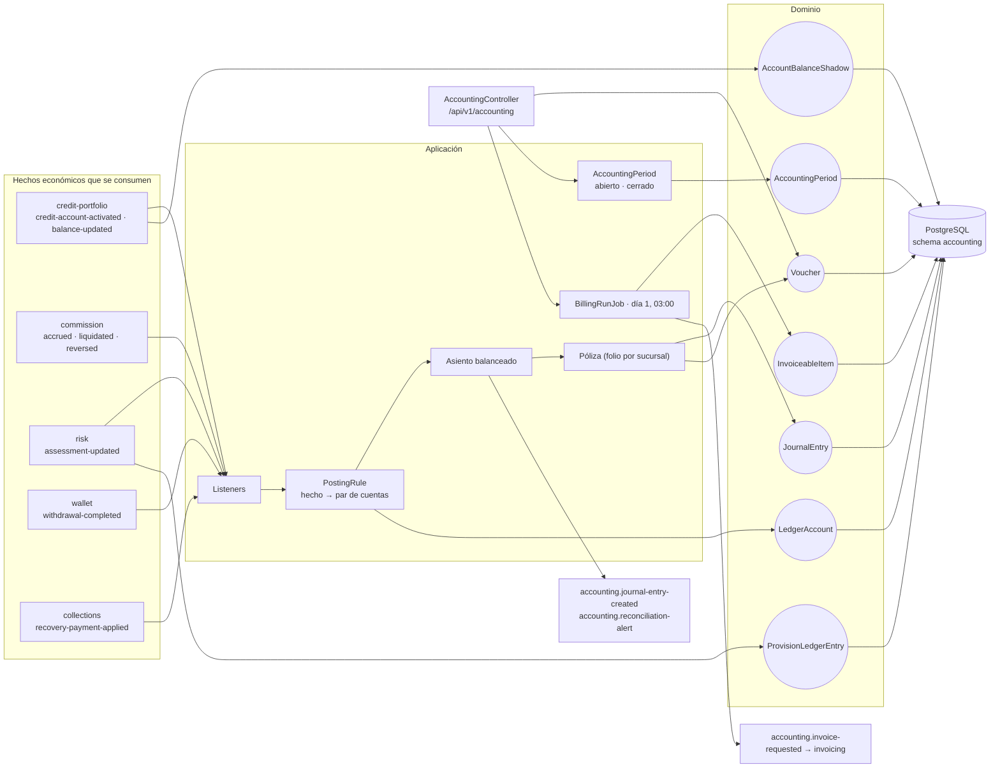
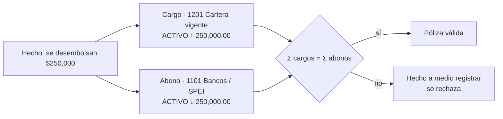

# accounting-service (T4)

Libro mayor por **partida doble** del core crediticio. No decide negocio: **proyecta** los hechos
económicos que emiten los demás dominios —saldos, comisiones, riesgo, retiros, pagos de cobranza— en
pólizas contables balanceadas, atribuidas a una **sucursal** y a un **préstamo**, y de ahí deriva la
balanza de comprobación, la estimación preventiva y los ítems facturables.

| | |
|---|---|
| **Puerto** | `8095` (bootRun) · `:8080` interno en Docker |
| **Schema** | `accounting` |
| **Arquitectura** | Hexagonal + Spring Modulith |
| **Régimen Kafka** | Por defecto (sin DLT) |
| **Dominio** | [docs/dominios/T4_accounting_gl.md](../../docs/dominios/T4_accounting_gl.md) |

## Mapa del servicio



**La regla de oro del servicio:** accounting **no decide negocio**. Cada póliza es la proyección de
un hecho que otro dominio ya afirmó. Si un saldo está mal, se corrige en su dueño y la contabilidad
lo sigue; nunca al revés.

---

## 1 · El proceso contable, desde cero

Esta sección existe porque el resto del repo asume que quien lo lee sabe contabilidad, y no tiene por
qué. Sin entender qué es un cargo no se puede saber si una pantalla está mintiendo.

### 1.1 · Cargo y abono no significan «entra» y «sale»

Es el malentendido más caro. **Cargo** (débito) y **abono** (crédito) no son «más» y «menos»: son los
dos lados de una anotación, y lo que significan **depende de la naturaleza de la cuenta**.

| Naturaleza | Un **cargo** la… | Un **abono** la… | Ejemplos del catálogo |
|---|---|---|---|
| **Activo** — lo que la institución tiene o le deben | aumenta | disminuye | `1101` Bancos, `1201` Cartera vigente, `1203` Intereses por cobrar |
| **Pasivo** — lo que la institución debe | disminuye | aumenta | `2110` IVA por pagar, `2120` Comisiones por pagar |
| **Capital** — lo que es de los dueños | disminuye | aumenta | `3901` Saldo inicial por incorporación |
| **Ingreso** — lo que la institución gana | disminuye (reversa) | aumenta | `4101` Ingresos por intereses |
| **Gasto** — lo que la institución consume | aumenta | disminuye (reversa) | `5101` Gasto por estimación preventiva |
| **Contra-activo** — un activo de signo invertido | disminuye | aumenta | `1290` Estimación preventiva |
| **Orden** — compromisos que no son del balance | — | — | `7101` / `7201` Líneas autorizadas |

Por eso «cargo a Bancos» es que entró dinero, pero «cargo a IVA por pagar» es que se **pagó** el IVA
—la deuda bajó—. La misma palabra, efectos opuestos.

> **`1290` es contra-activo y esto importa.** La estimación preventiva es un activo de naturaleza
> **acreedora**: vive restando de la cartera. Con la fórmula `saldo = cargos − abonos` sale en
> negativo, que es aritméticamente correcto y contablemente ilegible. Por eso el tipo existe en el
> enum y la consola invierte el signo al presentar, sin tocar el dato.

### 1.2 · La partida doble

**Todo hecho económico se anota dos veces**, en dos cuentas distintas, por el mismo importe: una
recibe el cargo y otra el abono. No es redundancia contable, es una invariante: si la suma de cargos
no iguala la de abonos, hay un hecho a medio registrar.

Cuando el banco desembolsa $250,000:

```
Cargo   1201 Cartera de crédito vigente   250,000.00     ← ahora nos deben eso
   Abono   1101 Bancos / SPEI                250,000.00  ← salió de nuestra cuenta
```



El patrimonio no cambió: se convirtió efectivo en un derecho de cobro. Eso es lo que la partida
doble captura y una lista de movimientos sueltos no.

### 1.3 · Asiento y póliza no son lo mismo

Aquí se separan dos cosas que en el lenguaje común se confunden:

- Un **asiento** es una anotación: un cargo con su abono. En este servicio es una fila de
  `journal_entries`.
- Una **póliza** es el **documento** que agrupa todos los asientos de un mismo hecho económico. Lleva
  folio consecutivo, fecha, concepto y estatus. Es la unidad que se audita y la que se cita.

Un pago que liquida capital **e** intereses son dos asientos —caja contra capital, caja contra
intereses— bajo **una** póliza. Sin encabezado no habría forma de decir «esto fue un solo pago».

**Tres tipos**, que es la práctica mexicana:

| Tipo | Cuándo | Ejemplo |
|---|---|---|
| **Ingreso** | Entra dinero a caja | Un pago del cliente, una recuperación |
| **Egreso** | Sale dinero de caja | El desembolso del crédito, un retiro de wallet |
| **Diario** | Todo lo demás — la mayoría | El devengo, la estimación, las reversas |

El devengo es de **diario** y no de ingreso porque no entra un peso a la caja: se reconoce un derecho
de cobro que todavía nadie ha pagado.

### 1.4 · El folio es por sucursal, y por eso se ve raro

El consecutivo es por **(tipo, sucursal, período)**. La sucursal Culiacán tiene sus folios 1..N sin
huecos causados por el movimiento de otra plaza — que es lo que un auditor revisa primero.

La consecuencia: en una lista que mezcla sucursales aparecen dos `D-0072` seguidos que **no son
duplicados**, son el 72 de dos series distintas. Por eso la consola muestra la serie completa,
`D-LEO-0072`, que es además cómo se cita un folio.

### 1.5 · El período sale del hecho, no del reloj

El período (`YYYYMM`) se deriva de **cuándo ocurrió el hecho**, en zona `America/Mexico_City`, no de
cuándo se procesó. Un devengo del 31 procesado a las 00:03 del día 1 pertenece al 31.

Si ese período ya está **cerrado**, el asiento no se rechaza: va al primer período abierto marcado
como **extemporáneo**, conservando el mes al que pertenecía. Rechazarlo exigiría una bandeja de
asientos caídos y alguien que la trabaje; sin eso el hecho se pierde en un log, y perder el hecho es
peor que asentarlo tarde con la etiqueta puesta.

---

## 2 · Catálogo de cuentas

| Código | Nombre | Naturaleza | Para qué |
|---|---|---|---|
| `1101` | Bancos / SPEI | Activo | El efectivo. Se carga al cobrar, se abona al desembolsar |
| `1201` | Cartera de crédito vigente | Activo | El capital colocado que el acreditado debe |
| `1203` | Intereses y comisiones por cobrar | Activo | Lo devengado y todavía no cobrado |
| `1210` | Cartera de crédito castigada | **Orden** | Memoria de lo dado de baja del balance |
| `1290` | Estimación preventiva | **Contra-activo** | La pérdida esperada; resta de la cartera |
| `2101` | Fondos de clientes por disponer | Pasivo | Dinero del cliente en la plataforma |
| `2110` | IVA trasladado por pagar | Pasivo | El IVA cobrado que se le debe al SAT |
| `2120` | Comisiones por pagar | Pasivo | Lo que se le debe a distribuidores y promotores |
| `3901` | Saldo inicial por incorporación | Capital | Contrapartida al incorporar cartera preexistente |
| `4101` | Ingresos por intereses | Ingreso | El interés ordinario devengado |
| `4102` | Ingresos por intereses moratorios | Ingreso | El interés por mora |
| `4103` | Ingresos por comisiones | Ingreso | Apertura, administración, prepago, seguro |
| `4104` | Recuperación de cartera castigada | Ingreso | Lo que se recupera de lo ya quebrantado |
| `5101` | Gasto por estimación preventiva | Gasto | El costo de constituir la reserva |
| `5102` | Gasto por quebranto / quita | Gasto | La pérdida que la reserva no alcanzó a cubrir |
| `5103` | Gasto por condonación | Gasto | Lo que se le perdona al cliente |
| `5104` | Gasto por comisiones | Gasto | La comisión devengada al canal |
| `7101` / `7201` | Líneas autorizadas / por disponer | **Orden** | El compromiso de una línea; cuadran entre sí |
| `7301` | Control de cartera castigada | **Orden** | Contrapartida de `1210`; cuadran entre sí |

> **Las cuentas de orden no son del balance.** Registran que la institución se comprometió a prestar,
> no que haya prestado. Sumarlas al activo infla el balance con dinero que nunca salió, y por eso la
> balanza las presenta en una sección aparte que cuadra sola.

---

## 3 · El ciclo de vida de un préstamo, póliza por póliza

Un crédito de **$250,000** a 36 meses, tasa 32% anual, comisión de apertura 1%, colocado por la
Sucursal León (`S_LEO`). Cada bloque es **una póliza**.

### Paso 1 — Se autoriza la línea · `ACCOUNT_ACTIVATED`

```
Póliza D-LEO-0001 · Diario · «Alta de línea de crédito autorizada»
   Cargo   7101 Líneas de crédito autorizadas      250,000.00
      Abono   7201 Líneas autorizadas por disponer    250,000.00
```

**Por qué en cuentas de orden.** Autorizar no coloca capital. Cargar `1201` contra nada infla el
activo con dinero que no salió. Pero un crédito autorizado y no dispuesto **sí** es un compromiso
real de la institución, y antes no existía en ninguna parte de la contabilidad.

### Paso 2 — Se desembolsa · `DISPOSITION_AT_ORIGINATION`

```
Póliza E-LEO-0001 · Egreso · «Disposición del crédito al activar»
   Cargo   1201 Cartera de crédito vigente         250,000.00
      Abono   1101 Bancos / SPEI                      250,000.00
```

Aquí nace la deuda. El efectivo se convirtió en derecho de cobro; el patrimonio no cambió.

### Paso 3 — Comisión de apertura y su IVA · `CHARGE_OPENING_FEE`, `CHARGE_IVA`

```
Póliza D-LEO-0002 · Diario · «Comisión de apertura 1%»
   Cargo   1203 Intereses y comisiones por cobrar    2,500.00
      Abono   4103 Ingresos por comisiones              2,500.00

Póliza D-LEO-0003 · Diario · «IVA trasladado»
   Cargo   1203 Intereses y comisiones por cobrar      400.00
      Abono   2110 IVA trasladado por pagar              400.00
```

El IVA **no es ingreso**: es dinero del SAT que la institución cobra y retiene un rato. Por eso va a
pasivo y no a resultados.

### Paso 4 — Devengo, día tras día · `CHARGE_ORDINARY_INTEREST`

**Éste es el corazón del asunto.** El interés no se gana el día que se cobra: se gana **con el paso
del tiempo**, un día a la vez. A eso se le llama devengar.

Un día de interés sobre $250,000 al 32% anual son ~$222.22:

```
Póliza D-LEO-0004 · Diario · «Devengamiento de interés ordinario»
   Cargo   1203 Intereses y comisiones por cobrar      222.22    ← nos lo deben
      Abono   4101 Ingresos por intereses                222.22  ← ya lo ganamos
```

Al día siguiente, otra póliza igual. Y otra. **El movimiento de la póliza es siempre el mismo; lo que
cambia es que `1203` crece y el ingreso se acumula.** Treinta días son treinta pólizas y ~$6,666 de
ingreso reconocido, sin que haya entrado un solo peso a la caja.

Ahí está la diferencia entre lo **devengado** y lo **cobrado**, y es la razón de que una institución
pueda reportar utilidad y no tener efectivo.

Si el crédito cae en mora, se suma el moratorio con la misma forma, contra `4102`.

### Paso 5 — El cliente paga · `PAYMENT_APPLIED`

Paga $10,000, de los cuales $6,666 cubren el interés devengado y $3,334 abonan a capital:

```
Póliza I-LEO-0001 · Ingreso · «Pago recibido»
   Cargo   1101 Bancos / SPEI                       10,000.00
      Abono   1203 Intereses y comisiones por cobrar    6,666.00
      Abono   1201 Cartera de crédito vigente           3,334.00
```

**Tres renglones, una póliza.** El desglose no es cosmético: si todo se abonara a capital —que es lo
que hacía la regla original— `1203` crecería indefinidamente aunque los clientes pagaran sus
intereses, y con unos meses de operación la balanza dejaría de ser presentable.

### Paso 6 — Se estima la pérdida · `PROVISION_EPR`

```
Póliza D-LEO-0005 · Diario · «Estimación preventiva — deterioro»
   Cargo   5101 Gasto por estimación preventiva      18,500.00
      Abono   1290 Estimación preventiva                18,500.00
```

Se reconoce como **gasto** que probablemente no se cobre todo. La cartera sigue valiendo $250,000 en
`1201`; lo que baja es su valor neto, porque `1290` resta.

Se asienta **por delta**: riesgo publica el monto absoluto cada noche y aquí sólo se anota el cambio.
Si el crédito mejora, el asiento va al revés y libera reserva.

### Paso 7 — Se castiga · `WRITE_OFF`

Si el crédito se declara irrecuperable con $47,420 de saldo y $38,000 de reserva constituida:

```
Póliza D-LEO-0006 · Diario · «Quebranto de cartera»
   Cargo   1290 Estimación preventiva               38,000.00   ← se consume la reserva
   Cargo   5102 Gasto por quebranto                  9,420.00   ← lo que no alcanzó
      Abono   1201 Cartera de crédito vigente          47,420.00
```

**Primero se consume la reserva, y sólo el excedente golpea resultados.** Si todo fuera a gasto, se
reconocería dos veces la misma pérdida: una al provisionar y otra al castigar.

### Paso 8 — Se recupera algo · `RECOVERY_PAYMENT`

```
Póliza I-LEO-0002 · Ingreso · «Recuperación de cartera castigada»
   Cargo   1101 Bancos / SPEI                        3,500.00
      Abono   4104 Recuperación de cartera castigada    3,500.00
```

Ingreso extraordinario, no reversa: la pérdida ya se reconoció y esto es dinero nuevo.

### Otros hechos

| Hecho | Cargo | Abono |
|---|---|---|
| `CHARGE_WAIVED` — condonación | `5103` Gasto por condonación | `1203` |
| `CHARGE_REVERSED` — reversa de cargo | `4103` Ingresos por comisiones | `1203` |
| `PAYMENT_RETURNED` — pago devuelto | `1201` | `1101` |
| `WALLET_WITHDRAWAL` — retiro | `2101` Fondos de clientes | `1101` |
| `COMMISSION_ACCRUED` — comisión al canal | `5104` Gasto por comisiones | `2120` |
| `COMMISSION_LIQUIDATED` — se le paga | `2120` | `1101` |
| `OPENING_BALANCE` — incorporación | `1201` / `1203` | `3901` |

---

## 4 · Dónde entra IFRS 9

La NIIF 9 gobierna tres cosas de este libro: cómo se **clasifica** el activo, cómo se **reconoce el
ingreso** y cómo se **estima la pérdida**.

### 4.1 · Costo amortizado

Un crédito de este negocio se mantiene para cobrar principal e intereses, así que se mide a **costo
amortizado**. Su valor en libros es:

```
Cartera bruta (1201 + 1203)  −  Estimación preventiva (1290)  =  valor neto en libros
```

### 4.2 · Las tres etapas y la pérdida esperada

IFRS 9 abandonó el modelo de pérdida incurrida —provisionar cuando ya pasó algo— por el de **pérdida
crediticia esperada** (ECL): se provisiona desde el día uno, antes de que nadie deje de pagar.

| Etapa | Cuándo | Reserva que se constituye |
|---|---|---|
| **Stage 1** | Riesgo sin aumento significativo (≤30 días) | ECL a **12 meses** |
| **Stage 2** | Aumento significativo del riesgo — SICR (31-90 días) | ECL de **toda la vida** |
| **Stage 3** | Deterioro crediticio (90+ días) | ECL de toda la vida, con interés sobre el **neto** |

`risk-service` calcula la etapa y el monto; este servicio **sólo lo asienta**. El paso de Stage 1 a
Stage 2 se ve aquí como un cargo grande a `5101`: la reserva salta de cubrir doce meses a cubrir la
vida entera del crédito.

### 4.3 · Baja del activo y recuperación

Se castiga cuando **no hay expectativa razonable de recuperación**. El asiento del paso 7 es
exactamente eso: se consume la reserva ya constituida y sólo el faltante va a resultados. Una
recuperación posterior es ingreso del período en que llega — no se reversa el castigo.

### 4.4 · Dónde este libro todavía **no** cumple IFRS 9

Esto se dice aquí en vez de dejarlo implícito, porque un README que declare cumplimiento sin tenerlo
es peor que uno que no lo mencione.

| Requisito | Qué hace hoy este servicio | Efecto |
|---|---|---|
| **Tasa de interés efectiva.** Las comisiones de originación se difieren a lo largo de la vida del crédito, no se reconocen de golpe | Reconoce la comisión de apertura **íntegra al desembolsar** (`1203`/`4103`) | Adelanta ingreso. Sobrestima el resultado de los primeros meses y subestima el de los últimos |
| **Interés de Stage 3 sobre el saldo neto**, no sobre el bruto | Devenga siempre sobre el bruto | Sobrestima el ingreso por intereses de la cartera deteriorada |
| **Descuento a valor presente** de la ECL | Asienta el monto que publica riesgo, sin descontar | Depende de que riesgo ya lo haga |

**Las dos exigen que el dominio publique un dato que hoy no publica** —el saldo neto de Stage 3 y la
comisión pendiente de diferir—, así que no se arreglan en el posteo. Cambiar sólo el asiento
produciría números distintos e igual de incorrectos, que es peor: un error conocido se puede acotar,
uno disfrazado de corrección no.

**Ya corregido (changeset `010`):** *cartera castigada fuera del balance*. `1210` existía y ninguna
regla la usaba —el quebranto abonaba directo a `1201`— así que lo castigado desaparecía del mayor.
Ahora el castigo emite una segunda póliza en **cuentas de orden**:

```
Póliza D-LEO-0007 · Diario · «Registro en cuentas de orden de la cartera castigada»
   Cargo   1210 Cartera de crédito castigada        47,420.00
      Abono   7301 Control de cartera castigada        47,420.00
```

`1210` dejó de ser activo y pasó a ser de orden: registrarlo como activo devolvería al balance
justamente lo que la baja pretende sacar. Dar de baja el activo **no extingue el derecho de cobro**
(IFRS 9 §5.4.4), y de ahí que una recuperación posterior tenga contra qué contrastarse.

---

## 5 · Dominio

| Agregado | Rol |
|---|---|
| `Voucher` | **Póliza**: encabezado con folio por (tipo, sucursal, período). Cuadre garantizado por restricción de base |
| `JournalEntry` | Asiento de partida doble; inmutable, cuelga de una póliza |
| `LedgerAccount` | Cuenta del catálogo, con su naturaleza |
| `PostingRule` | Regla que traduce un evento de dominio en cargo/abono. **Dato, no código** |
| `AccountingPeriod` | El mes contable y si acepta asientos |
| `AccountBalanceShadow` | Réplica local del saldo y de la **sucursal sellada** del crédito |
| `ProvisionLedgerEntry` | Lo ya provisionado por cuenta, para asentar sólo el delta |
| `InvoiceableItem` | Ítem facturable acumulado que dispara `accounting.invoice-requested` |

### La sucursal se sella una vez

La sucursal de origen viaja en `credit-portfolio.credit-account-activated` y se recuerda en el
shadow. **No se recalcula**: si se derivara del ejecutivo que lleva al cliente hoy, reasignar una
cartera reescribiría la contabilidad de los meses anteriores y la balanza de marzo daría otro número
en agosto.

---

## 6 · API REST — `/api/v1/accounting`

| Método | Ruta | Descripción |
|---|---|---|
| `GET` | `/vouchers` | Libro de pólizas paginado; filtra por período, `unitCodes`, tipo, crédito, party |
| `GET` | `/vouchers/{id}` | Una póliza con sus renglones de un solo lado |
| `GET` | `/summary` | Cuadre, devengo, comisiones, provisión y desglose por sucursal |
| `GET` | `/units` | Movimiento por sucursal, agregado **en SQL** |
| `GET` | `/trial-balance` | Balanza de comprobación, acotable por sucursal |
| `GET` | `/accounts/{id}/ledger` | Ficha contable de un préstamo: saldos y sus pólizas |
| `GET` | `/periods` | Períodos con su estatus |
| `POST` | `/periods/{p}/close` · `/reopen` | Cierre contable |
| `POST` | `/accounts/{id}/org-unit` | Atribuye a una sucursal las pólizas de un crédito sellado a posteriori |
| `POST` | `/billing-runs` | Corrida de facturación → `invoice-requested` |

El alcance por subárbol llega **resuelto**: el BFF pregunta a sales-org una vez y manda los códigos.
Contabilidad no conoce el árbol comercial ni tiene por qué.

---

## 7 · Eventos Kafka

**Consume:** `credit-portfolio.credit-account-activated`, `credit-portfolio.balance-updated`,
`commission.commission-accrued` / `-liquidated` / `-reversed`, `risk.assessment-updated`,
`wallet.withdrawal-completed`, `collections.recovery-payment-applied`.

**Produce:** `accounting.invoice-requested`, `accounting.journal-entry-created`,
`accounting.reconciliation-alert`.

**Reintentos:** régimen por defecto de la plataforma (`DefaultErrorHandler`, sin DLT). Los
consumidores son idempotentes por `sourceEventId`. Ver [README raíz §5.4](../../README.md#54-política-de-reintentos-y-dlt-kafka).

---

## 8 · Migraciones

Liquibase, 10 changesets bajo `src/main/resources/db/changelog/accounting/`. Los cuatro últimos son los
que introdujeron la póliza (`007`), las cuentas de orden y el desglose del pago (`008`), el asiento
de apertura (`009`) y la baja del activo por quebranto (`010`).

## 9 · Build & test

```bash
./gradlew :accounting-service:test
```

16 pruebas. Las que conviene no romper: el pago se desglosa entre capital e intereses, el quebranto
consume la reserva antes que resultados, y un crédito visto a media vida se incorpora contra capital
en vez de etiquetar el saldo entero como el hecho que llegó primero.
