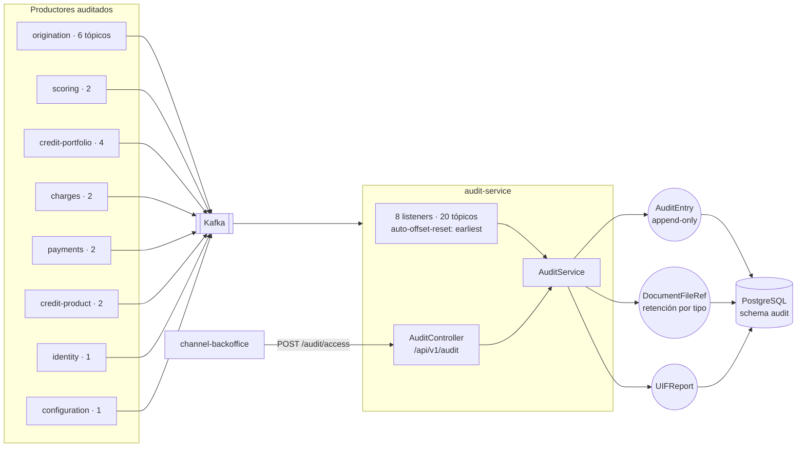

# audit-service (T3)

**Repositorio inmutable de eventos y documentos regulatorios.** Suscriptor de Kafka que persiste lo
que pasa en la plataforma para auditoría CNBV / CONDUSEF / UIF. **Nunca modifica el estado de otro
dominio**, y no publica eventos: la bitácora es terminal.

| | |
|---|---|
| **Puerto** | `8090` (bootRun) · `:8080` interno en Docker |
| **Schema** | `audit` |
| **Auth** | **Header-trust** — exige `ROLE_AUDITOR`, `ROLE_REGULATOR` o `ROLE_ADMIN` |
| **Régimen Kafka** | Por defecto (sin DLT) |
| **Dominio** | [docs/dominios/T3_audit_compliance.md](../../docs/dominios/T3_audit_compliance.md) |

---

## 1. Mapa del servicio



**No publica nada.** La bitácora de **acceso** (quién consultó qué) no llega por evento sino por
REST desde el BFF: `POST /api/v1/audit/access`. Que sea síncrono es deliberado — si el registro de
acceso falla, quien consulta debe enterarse.

---

## 2. Tópicos consumidos (20)

| Productor | Tópicos |
|---|---|
| origination | `prospect-created` · `score-requested` · `contract-signed` · `application-approved` · `application-rejected` · `documents-requested` |
| scoring | `scoring-completed` · `scoring-approved` |
| credit-portfolio | `credit-account-activated` · `balance-updated` · `payment-rejected` · `charge-rejected` |
| charges | `charge-applied` · `charge-reversed` |
| payments | `payment-applied` · `payment-returned` |
| credit-product | `product-catalog.product-activated` · `product-catalog.product-retired` |
| identity | `identity.login-attempted` |
| configuration | `configuration.configuration-updated` |

Todos con `auto-offset-reset: earliest`: en su primer arranque el servicio captura el historial
completo que siga en el retention del broker, no sólo lo que pase de ahí en adelante.

> **Alcance real:** audit se describe como «suscriptor global», pero suscribe una **lista explícita**
> de 20 tópicos, no un patrón. Los eventos de `beneficiary.*`, `collections.*`, `wallet.*`,
> `commission.*`, `disbursement.*`, `stp.*` y `risk.*` **no** están cableados hoy. Añadir uno es un
> `@KafkaListener` más; mientras no exista, no está en la bitácora.

---

## 3. API REST — `/api/v1/audit`

| Método | Ruta | Descripción |
|---|---|---|
| `GET` | `/entries` | Bitácora. Filtros: `partyId`, `aggregateId`, `eventType`, `from`, `to` |
| `GET` | `/entries/{entryId}` | Detalle con el payload completo del evento |
| `GET` | `/parties/{partyId}/documents` | Documentos archivados bajo retención regulatoria |
| `GET` | `/parties/{partyId}/uif-reports` | Reportes UIF del party |
| `GET` | `/parties/{partyId}/expedition` | Expediente completo: entradas + documentos + UIF |
| `POST` | `/access` | Registrar un acceso a información sensible |

---

## 4. Retención regulatoria

| Tipo de documento | Años | Fundamento |
|---|---|---|
| Reportes de buró | 5 | CNBV, Circular 14/2013 |
| Contratos | 10 | Código de Comercio |
| Estados de cuenta | 5 | CONDUSEF |
| Registros AML / UIF | 10 | LFPIORPI |
| Expediente crediticio | 7 posteriores a la liquidación | CNBV |

---

## 5. Eventos Kafka

**Consume:** los 20 tópicos de §2. **Produce:** ninguno.

**Reintentos:** régimen por defecto (`DefaultErrorHandler`, sin DLT). Deserialización tolerante
(`USE_TYPE_INFO_HEADERS=false`, `TRUSTED_PACKAGES=com.fintech.*`), que en un suscriptor de tantos
dominios es lo que evita que un cambio de paquete del emisor tumbe la bitácora.
Ver [README raíz §5.4](../../README.md#54-política-de-reintentos-y-dlt-kafka).

---

## 6. Persistencia, tests y ejecución

Schema `audit`, 9 changesets Liquibase bajo `db/changelog/audit/`.

```bash
./gradlew :audit-service:test    # AuditServiceTest (unit) + AuditControllerTest (@WebMvcTest)
docker compose up -d audit-service
```
