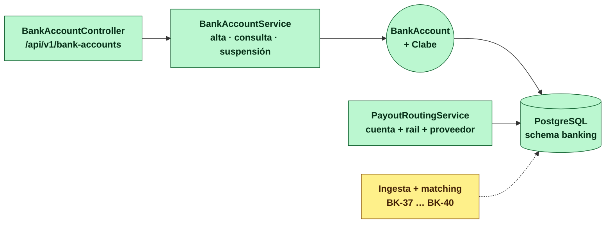

# banking-service (D15)

**Tesorería.** Nuestras cuentas en instituciones financieras, **de cuál sale cada pago**, por qué
rail y con qué proveedor, y **qué dice el banco que pasó**. No conoce el dominio de crédito: recibe
una petición de pago con su referencia opaca y responde por dónde sale.

> **Servicio interno.** No recibe tráfico de internet y **no está publicado en el gateway**.

| | |
|---|---|
| **Puerto** | `8104` (bootRun) · `:8080` interno en Docker |
| **Schema** | `banking` · paquete `com.fintech.banking` |
| **Dominio** | [docs/dominios/15_banking_domain.md](../../docs/dominios/15_banking_domain.md) |
| **Estado** | Fases 1 y 2 (BK-03 … BK-10). La conciliación está en el esquema, sin código todavía |

---

## Mapa del servicio



🟩 implementado · 🟨 esquema listo, código pendiente.

## Qué hay en el esquema

| Tabla | Qué guarda | ¿Tiene código? |
|---|---|---|
| `bank_accounts` | Nuestras cuentas: institución, CLABE, titular, **tres** cuentas del mayor | ✅ |
| `payout_routes` | (empresa, rail, monto) → **cuenta + rail + proveedor** | ✅ |
| `bank_statement_lines` | El movimiento tal como lo reporta el banco. Dato externo: crudo, sin corregir | ⏳ BK-37 |
| `bank_matches` | El cruce, con **método y confianza** | ⏳ BK-38 |
| `suspense_entries` | Lo no identificado, como **partida en conciliación** | ⏳ BK-39 |
| `bank_close_seals` | El sello del día/mes por cuenta | ⏳ BK-40 |

Las cinco últimas vivían en `closing` y se mudaron aquí (BK-04). No tenían **ni una clase Java** que
las tocara, así que la mudanza costó cero migración.

## Las tres cuentas del mayor

Cada cuenta propia declara tres, y las tres hacen falta para que el sello cuadre:

| Campo | Default | Para qué |
|---|---|---|
| `ledger_account` | `1101` Bancos | Contra la que se concilia el saldo |
| `suspense_credit_account` | `2109` Depósitos por identificar | **Pasivo**: llegó dinero y no sabemos de quién |
| `suspense_debit_account` | `1109` Cargos bancarios por aclarar | **Activo**: el banco cargó y no sabemos por qué |

Son dos puentes y no una porque las dos direcciones tienen naturaleza opuesta. Ver
[§4 del doc de dominio](../../docs/dominios/15_banking_domain.md).

## API

| Verbo | Ruta | Rol |
|---|---|---|
| `POST` | `/api/v1/bank-accounts` | `ADMIN` |
| `GET` | `/api/v1/bank-accounts/{id}` | `ADMIN` · `OPS_SUPERVISOR` · `AUDITOR` |
| `GET` | `/api/v1/bank-accounts?companyId=` | idem |
| `POST` | `/api/v1/bank-accounts/{id}/suspend` | `ADMIN` |
| `POST` | `/api/v1/bank-accounts/{id}/reactivate` | `ADMIN` |
| `POST` | `/api/v1/payouts/route` | `SERVICE` · `ADMIN` |
| `POST` | `/api/v1/payout-routes` | `ADMIN` |
| `GET` | `/api/v1/payout-routes` | `ADMIN` · `OPS_SUPERVISOR` · `AUDITOR` |
| `DELETE` | `/api/v1/payout-routes/{id}` | `ADMIN` |

`POST /payouts/route` es **el único sitio donde la CLABE sale completa**: el conector la necesita
para armar la cadena original. Por eso pide rol `SERVICE` y no uno de consulta.

### Cómo se elige la ruta

Gana la de menor `priority`; a igual prioridad, la **específica de empresa** sobre la genérica; a
igual todo, **la más antigua**. Ese último desempate no es cosmético: `findAllEnabled()` no garantiza
orden, y sin él dos rutas empatadas harían que el pago saliera un día por una cuenta y al siguiente
por otra sin que nadie cambiara nada.

Una ruta cuya cuenta está `SUSPENDED` **se salta** y gana la siguiente. Si no se filtrara aquí,
suspender una cuenta no sacaría nada del ruteo: la ruta seguiría ganando y el pago fallaría en el
proveedor, que es donde ya no se puede corregir.

**El alta es `ADMIN` y nada menos.** Quien puede dar de alta una CLABE ordenante puede, en el
siguiente paso, apuntarle una ruta y hacer que el dinero salga por ella. Es el permiso más sensible
del servicio, por encima de consultar cualquier saldo.

**La CLABE nunca sale completa** — ni en la respuesta, ni en la bitácora, ni en el mensaje de un
error de duplicado.

```bash
curl -X POST localhost:8104/api/v1/bank-accounts \
  -H 'X-User-Id: ops' -H 'X-Roles: ADMIN' -H 'Content-Type: application/json' \
  -d '{"institutionName":"BBVA","clabe":"012180001234567890","holderName":"FINTECH SA DE CV"}'
```

## Configuración

| Propiedad | Default | Qué hace |
|---|---|---|
| `fintech.banking.base-currency` | `MXN` | Moneda de las cuentas propias |

**Sin ruta aplicable el pago no sale, y eso no es configurable.** No hay cuenta de respaldo a la que
caer: un default silencioso es exactamente lo que hacía el `is_default` del conector, y es el defecto
que este servicio existe para corregir.

## Correr

```bash
./gradlew :banking-service:bootRun          # 8104
./gradlew :banking-service:test             # 39 pruebas
docker compose up banking-service           # 8104 → 8080
```

Las pruebas de integración usan el arnés compartido (`AbstractIntegrationTest`): Postgres y Redis
reales, un contenedor por JVM.
