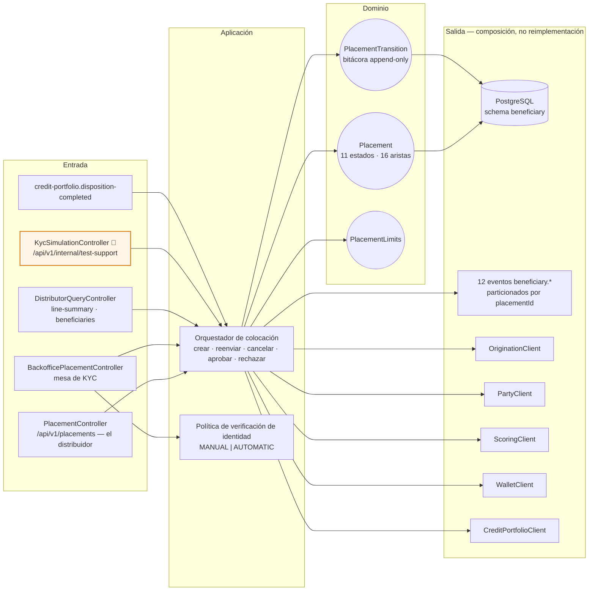
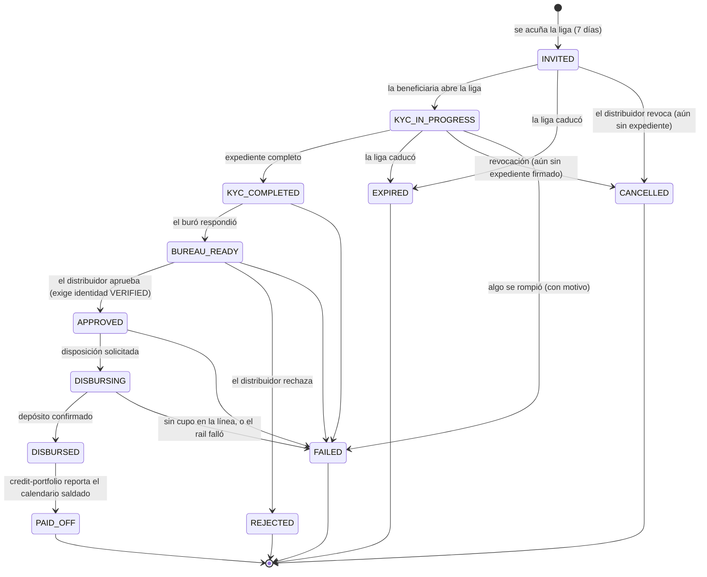
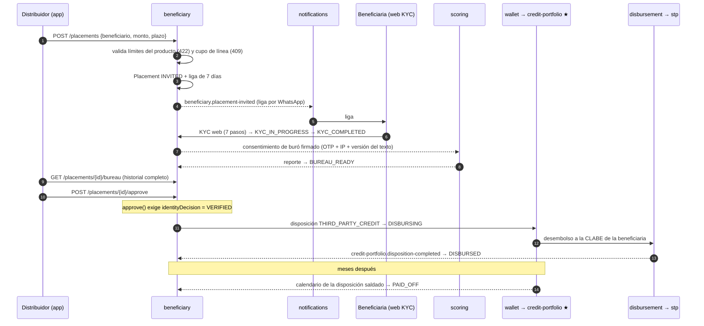

# beneficiary-service (D13)

**Colocación B2B2C.** Un distribuidor con línea revolvente le presta a sus clientes: cada uno hace
su propio KYC desde su teléfono, autoriza su propia consulta de buró y recibe el depósito en su
cuenta. El distribuidor ve el historial completo —la plataforma **no filtra por score**— y decide,
firmando que asume el riesgo.

| | |
|---|---|
| **Puerto** | `8102` (bootRun) · `:8080` interno en Docker |
| **Schema** | `beneficiary` |
| **Arquitectura** | Hexagonal + Spring Modulith |
| **Régimen Kafka** | Por defecto (sin DLT) |
| **Diseño y plan** | [docs/BENEFICIARY_SERVICE_PLAN.md](../../docs/BENEFICIARY_SERVICE_PLAN.md) · [dominio](../../docs/dominios/13_beneficiary_domain.md) |

## Mapa del servicio



## Quién debe

**La distribuidora.** Hay una sola cuenta de crédito —su línea `DISTRIBUTOR_LINE`— y cada
colocación es una `Disposition THIRD_PARTY_CREDIT` de esa línea. A la beneficiaria se le informa
que el crédito es suyo, y lo es frente a la distribuidora: lo que queda a su nombre es el
**contrato de colocación**, un documento del expediente y no una exposición en cartera.

## Dominio

| Agregado | Rol |
|---|---|
| `Placement` | La colocación: distribuidor, beneficiario, monto, plazo y su máquina de estados. |
| `PlacementLimits` | Los límites del producto: **tope por beneficiario**, mínimo, plazos y escalones. |
| `PlacementTransition` | Bitácora append-only de cada cambio de estado — la fuente del `timeline[]` de la app. |

## Máquina de estados



**16 aristas, ni una más.** Están fijadas por un test: cambiarlas tiene que ser una decisión.

Los estados internos son más finos que los nueve que la app pinta, y `wireName()` los proyecta
(`KYC_COMPLETED → kycInProgress`, `DISBURSING → approved`, `DISBURSED → active`). Tres existen
porque el buró y el desembolso son asíncronos y pueden fallar sin que nadie haya decidido nada:

- `KYC_COMPLETED` — el expediente existe pero el buró no ha respondido. Sin él, un buró lento
  sería indistinguible de un KYC incompleto.
- `DISBURSING` — la línea **no se aparta al invitar**, así que dos colocaciones pueden aprobarse
  contra la misma línea y la segunda encontrar saldo insuficiente. La autoridad del cupo es
  credit-portfolio. Sin este estado, `APPROVED` sería una promesa que el servicio no puede cumplir.
- `FAILED` — los demás terminales son decisiones de alguien; éste registra que algo se rompió, y
  por eso siempre lleva motivo. **Requiere que la app agregue `failed` a su enum**: su fallback
  manda los valores desconocidos a `invited`, y una colocación muerta pintada como «liga enviada»
  dejaría al distribuidor esperando para siempre.

Y `DISBURSED` **no es terminal**: entre el depósito y el último pago hay meses de vida, y de ahí
sale `PAID_OFF` cuando credit-portfolio reporta el calendario de la disposición saldado.

Dos reglas del diseño están grabadas en la máquina, no en un servicio:

1. **Revocar sólo antes del expediente.** Con documentos entregados y autorización firmada, la
   salida del distribuidor es `REJECTED` —una decisión con nombre— no una revocación silenciosa.
2. **Vencer sólo mientras la liga vive.** Los 7 días corren sobre la liga, no sobre la colocación.

## Límites de colocación

Cuánto puede colocarle un distribuidor **a una sola persona** lo fija el producto
(`credit-product`, `DISTRIBUTOR_LINE`), no el código ni el distribuidor:

| Campo | `DL-DIST-STD-V1` |
|---|---|
| `min_amount` / `max_amount` | $5,000 / **$60,000 por beneficiario** |
| `amount_step` | $1,000 |
| `min_term` / `max_term` / `term_step` | del catálogo |

**El tope por beneficiario no es el tamaño de la línea.** La línea acota cuánto puede deber el
distribuidor en total; esto acota cuánto puede darle a una persona. Sin ese segundo límite, uno
con línea de $500,000 podría colocárselos completos a un solo cliente y dejar toda su línea
colgada del historial de un desconocido. Es una regla de riesgo, y por eso vive en el producto y
se cambia sin redeploy.

Los dos topes se aplican juntos y responden preguntas distintas: el del producto dice cuánto es
prudente prestarle a una persona (422), el de la línea dice cuánto le queda a él (409).

## API REST

### Privada — el distribuidor (JWT vía gateway, `X-User-Id`)

| Método | Ruta | Estado |
|---|---|---|
| `GET` | `/api/v1/placements?status=` | ✅ — envoltura `{"placements":[…]}` |
| `GET` | `/api/v1/placements/{id}` | ✅ |
| `POST` | `/api/v1/placements` | ✅ — crear es inseparable de acuñar la liga |
| `POST` | `/api/v1/placements/{id}/resend` · `/cancel` | ✅ |
| `GET` | `/api/v1/placements/{id}/bureau` | ✅ — historial completo, sin filtrar por score |
| `POST` | `/api/v1/placements/{id}/approve` · `/reject` | ✅ |
| `GET` | `/api/v1/beneficiaries` · `/distributor/line-summary` | ✅ (`DistributorQueryController`) |

### Backoffice — la mesa de KYC

| Método | Ruta | Capacidad | Notas |
|---|---|---|---|
| `GET` | `/api/v1/backoffice/placements` | `beneficiaries.view` | Bandeja transversal: cruza **todas** las distribuidoras. Filtros: `distributorPartyId`, `status`, `identityDecision`, `stalledDays`, `from`/`to`. |
| `GET` | `/api/v1/backoffice/placements/{id}` | `beneficiaries.view` | Ficha con bitácora. |
| `POST` | `/api/v1/backoffice/placements/{id}/identity-review` | `beneficiaries.review-identity` | **Dictaminar identidad.** `{decision, rejectionReason?, verificationSource?}` |

**Dictaminar no es ver.** Son capacidades distintas: el auditor lee todo y no decide nada, y soporte
atiende clientes pero no firma la comprobación de una persona. El autor sale de la sesión y **nunca
del cuerpo** — dejar que el cliente diga quién dictamina permitiría firmar con el nombre de otro, y
la firma es todo lo que vuelve evidencia a un dictamen.

Raíz separada de `/api/v1/placements` **a propósito**: aquélla deriva la distribuidora del token y
sólo devuelve lo suyo; ésta cruza todas. Si compartieran raíz, un descuido al declarar la seguridad
convertiría la consulta de la app en una fuga de la cartera ajena.

### Identidad: manual hoy, automática después

`fintech.beneficiary.identity-verification.mode` = `MANUAL` (default) | `AUTOMATIC`.

**La bandera controla el flujo, no el arranque.** En `MANUAL` todo lo revisa un analista de crédito
y no se llama a nadie. En `AUTOMATIC` el proveedor evalúa y el analista recibe **sólo las
excepciones**: umbral no alcanzado, documento que no pudo validar, o **el proveedor caído**.

**La degradación es el punto.** Un proveedor de KYC es un tercero y se cae; cuando pase, la
colocación sigue avanzando con una persona en vez de atorarse. Ninguna rama rompe el flujo, y el
motivo siempre queda escrito (`identityReviewNotes`) para que el analista sepa qué mirar.

El veredicto (`identityDecision`) es un juicio propio con autor, fecha, motivo y origen; ya **no** se
deriva del avance de la colocación. Y `approve()` exige identidad `VERIFIED`: la distribuidora asume
el riesgo, Kredius comprueba la identidad, y ninguna condición sustituye a la otra.

Sigue faltando **la evidencia que mirar** (OCR, prueba de vida, RENAPO): la ficha responde
`identityEvidence.available=false` con su motivo.

### Pública — la beneficiaria (sin JWT, token de invitado de 15 min)

`/api/v1/beneficiary/public/**` — los 7 pasos del KYC web. ⬜ fase 3.

Está en `permitAll` de Spring Security porque no hay JWT que validar: la credencial es el token
de la liga y quien lo revisa es el filtro de token de la fase 2. El diseño le reserva un bloque
`server` propio en el gateway (`kyc.*`) que **nunca** inyectaría `X-User-Id` ni `X-Roles` — ese
bloque **todavía no existe** en `nginx.conf`: hoy sólo hay `mobile.*`, `backoffice.*` y el
`default_server`.

## Flujo completo de una colocación



## Simuladores locales

| Qué se simula | Dónde | Cómo se enciende |
|---|---|---|
| **Completar el KYC de una colocación** sin pasar por los 7 pasos web | `KycSimulationController` — `POST /api/v1/internal/test-support/placements/{placementId}/complete-kyc` | `BENEFICIARY_KYC_SIMULATION_ENABLED=true` |
| El mismo atajo, expuesto para la app | `channel-mobile-service` lo proxea en `/internal/test-support/placements/{id}/complete-kyc` | La misma variable, leída también por el BFF |
| **Proveedor de verificación de identidad** | No hay integración: el modo `MANUAL` es el default y no llama a nadie | `fintech.beneficiary.identity-verification.mode` |

El controlador de simulación devuelve `404`/error explícito cuando la bandera está apagada, y el
gateway no enruta `/internal/*`. Existe porque la **fase 3** —el KYC web público
(`/api/v1/beneficiary/public/**`)— todavía no está construida: sin este atajo, ninguna colocación
podría pasar de `INVITED` en local y el journey B2B2C no sería demostrable.

## Eventos Kafka

**Produce** — uno por transición, particionado por `placementId` para que el orden se preserve por
colocación:

`beneficiary.placement-invited` · `.kyc-started` · `.kyc-completed` · `.bureau-consent-granted` ·
`.bureau-ready` · `.placement-approved` · `.placement-rejected` · `.placement-expired` ·
`.placement-cancelled` · `.placement-disbursed` · `.placement-paid-off` · `.placement-failed`

`bureau-consent-granted` es la constancia regulatoria: lleva fecha, hora, IP, versión del texto
aceptado y el `otpVerificationId` que ata el consentimiento a un teléfono demostrablemente suyo.
El token de la liga **nunca** viaja en un evento.

**Consume** (fases 4-5): `scoring.scoring-completed`,
`credit-portfolio.disposition-completed`, `credit-portfolio.disposition-rejected`.

## Composición — este servicio no reinventa dominio

| Necesidad | Quién la resuelve |
|---|---|
| Prospecto y documentos del expediente | `origination` |
| Party de la beneficiaria y relación con el distribuidor | `party` |
| Consulta de buró y reporte | `scoring` |
| Descuento de línea y disposición | `wallet` → `credit-portfolio` |
| SPEI a su CLABE | `disbursement` → `stp` |
| Bonificación 20% decreciente por atraso | `commission` (`DISTRIBUTOR_PUNCTUALITY_SHARE`, fase 7) |
| Liga por WhatsApp y avisos | `notifications` |
| Bitácora regulatoria | `audit` (suscriptor global) |

## Migraciones

Liquibase (6 changesets) bajo `db/changelog/beneficiary/`. Los `CHECK` de `002` codifican
invariantes del dominio en la base, no sólo en Java: expediente todo-o-nada, disposición
obligatoria para desembolsar y `FAILED` siempre con motivo. El `005` alinea con el contrato de
la app y agrega el índice único parcial de **una sola liga viva por (distribuidor, celular)** —
por distribuidor y no global, porque dos distribuidores distintos colocándole a la misma persona
es negocio legítimo. El `006` añade el veredicto de identidad con su `CHECK` de firma —un
«verificado» sin autor no puede existir— y el que impide aprobar sin identidad comprobada.

## Conformidad con el contrato de la app

La respuesta cumple `KREDIUS_COLOCACION_API.md` §3 campo por campo, y hay un test que lo fija.
Dos detalles no son cosméticos:

- **El celular se enmascara en el servidor** y el crudo no se serializa nunca — hay un test que
  lee el cuerpo completo y verifica que el número no aparece. Que el cliente reciba el dato y
  decida taparlo sería confiar la privacidad de un tercero a una decisión de UI.
- **`daysPastDue` lo decide el backend**, no el reloj del teléfono; junto con `commissionAccrued`
  y `paymentsMade` viaja en `PlacementMetrics`, que es la parte de la respuesta que se compone de
  otros servicios.

## Tests

**222 ✅**

| Grupo | Qué protege |
|---|---|
| 145 · máquina de estados | Los 132 pares origen/destino, exhaustivos. Un test por caso feliz dejaría pasar una arista de más, que es como una colocación vencida termina aprobada. |
| 13 · proyección a estados de cable | Que una colocación muerta nunca se pinte como viva en la app. |
| 10 · política de verificación | **La degradación**: proveedor caído, que lanza, sin contrato, umbral no alcanzado, métrica sin medir. Ninguna rama rompe el flujo. |
| 7 · veredicto de identidad | Que `approve` exija identidad, que todo dictamen lleve autor y que un rechazo lleve motivo. |
| 22 · invariantes y alta previa | |
| 6 · límites de producto | El tope por beneficiario, que no es el tamaño de la línea. |
| 11 · servicio de aplicación | |
| 7 · WebMvcTest | Incluido que el celular crudo no salga nunca en la respuesta. |
| 5 · IT con Postgres real | `ddl-auto: validate`, los `CHECK` y el índice de liga viva. |

```bash
# macOS: ./gradlew falla por `readlink -e`; se invoca el wrapper a mano.
DOCKER_HOST=unix:///Users/$USER/.docker/run/docker.sock \
TESTCONTAINERS_DOCKER_SOCKET_OVERRIDE=/var/run/docker.sock \
java -classpath gradle/wrapper/gradle-wrapper.jar org.gradle.wrapper.GradleWrapperMain \
  :beneficiary-service:cleanTest :beneficiary-service:test
```
