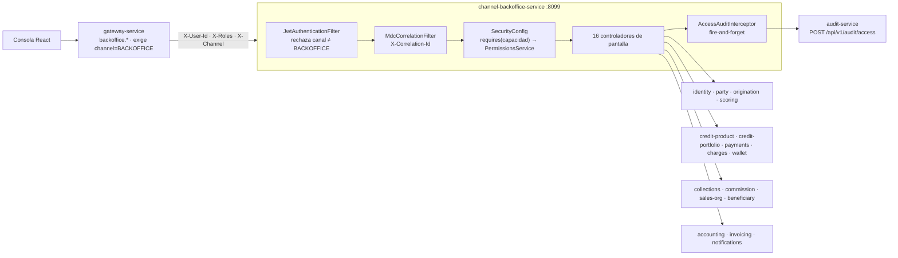
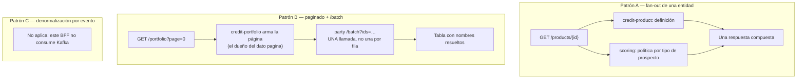

# channel-backoffice-service (BO)

**BFF de la consola operativa (React).** Única puerta del backoffice: recibe el tráfico del gateway
—que exige `channel=BACKOFFICE`—, **compone** pantallas llamando por REST a los servicios de dominio
y traduce todo al contrato que consume el front. Sin base de datos de negocio; su estado es efímero
(Redis para sesión y caché).

| | |
|---|---|
| **Puerto** | `8099` (bootRun y Docker) |
| **Persistencia** | Redis (efímero) — **sin schema propio** |
| **Auth** | Header-trust + **autorización por capacidad**, no por rol |
| **Kafka** | No produce ni consume: es un compositor REST puro |
| **Subdominio en el gateway** | `backoffice.localhost` · `backoffice.fintech-service` |

> **Regla de oro:** el número de llamadas del BFF **no** puede depender del número de filas. Si para
> pintar una tabla hay que iterar, falta un `/batch` en el servicio dueño del dato.

## Mapa del servicio



## Seguridad e identidad

- El gateway valida el JWT RS256 e inyecta `X-User-Id` / `X-Roles` / `X-Channel`. `JwtAuthenticationFilter` los lee (no revalida el token) y **rechaza** cualquier canal ≠ `BACKOFFICE`.
- Las llamadas a dominio reenvían esa identidad con `DomainClientSupport.staffIdentity()`.
- `MdcCorrelationFilter` propaga `X-Correlation-Id`.

## Controladores (pantallas)

| Controller | Área |
|---|---|
| `StaffAuthController` / `StaffDirectoryController` | Login/refresh/logout de staff, directorio de personal. |
| `DashboardController` | Tablero: capital colocado, cartera vencida (CNBV/IFRS-9), cobranza del periodo. |
| `PortfolioController` | Cartera con avance del plan de pagos (resuelve nombres en **lote**). |
| `ClientsController` | Búsqueda y expediente del cliente. |
| `OriginationController` | Bandeja, **mesa de análisis** y **dictamen de documentos** del expediente. |
| `ProductsController` | Catálogo; detalle producto = **condiciones + scoring por tipo de prospecto** (`GET /products/{id}`); alta de políticas de riesgo. |
| `SalesOrgController` / `ExecutivesController` | Estructura comercial y alcance por subárbol. |
| `PermissionsController` | Matriz de permisos por rol. |
| `AuditController` | Consulta de la bitácora (solo roles de auditoría). |
| `CollectionsController` | Casos de cobranza + **bandejas transversales** de promesas y contactos. |
| `BeneficiariesController` | **Mesa de KYC** de la colocación B2B2C (bandeja + ficha). |
| `NotificationsController` | Campana: buzón del empleado en sesión. |
| `AccountingController` | Mayor, períodos y facturación. |

## Clientes de dominio (REST)

`Identity`, `Party`, `Origination`, `Scoring`, `CreditProduct`, `CreditPortfolio`, `Payments`,
`Charges`, `Wallet`, `Collections`, `Commission`, `SalesOrg`, `Audit`, `Accounting`, `Invoicing`,
`Beneficiary`, `Notifications`.

## Autorización por capacidad, no por rol

`SecurityConfig` gatea con `requires("capacidad")` contra `PermissionsService`, que es **la misma
fuente que responde `/permissions/me`**. Es la contraparte de `nav.ts` en el front, y esa duplicación
es intencional: ocultar un botón no es una medida de seguridad. Si las dos listas se separan, la que
manda es la del servidor y el síntoma será un módulo visible que devuelve 403.

Dos excepciones que gatean por rol: `/staff/**` (ADMIN) y `/config/**`.

**Sin capacidad**: `/permissions/me` —es *cómo* la consola averigua cuáles tiene— y `/notifications`,
que es el buzón propio; gatearlo dejaría sin campana justo a quien hay que avisarle de sus cosas.

### Ver no es dictaminar

Consultar un expediente y **firmar un juicio sobre él** son capacidades distintas, y se declaran
por separado:

| Capacidad | Roles | Para |
|---|---|---|
| `beneficiaries.view` | ADMIN, OPS_SUPERVISOR, CREDIT_ANALYST, RISK_ANALYST, SUPPORT, AUDITOR | Ver la bandeja y la ficha de KYC |
| `beneficiaries.review-identity` | **ADMIN, CREDIT_ANALYST** | Dictaminar la identidad de una beneficiaria |
| `applications.review-documents` | ADMIN, CREDIT_ANALYST, UNDERWRITER, RISK_ANALYST | Dictaminar documentos del expediente |

El auditor lee todo y **no decide nada**; soporte atiende clientes pero no firma la comprobación de
una persona; y riesgo evalúa cartera, no identidades. Por eso dictaminar identidad se reduce al
analista de crédito.

**El autor sale de la sesión y nunca del cuerpo.** Dejar que el cliente diga quién dictamina
permitiría firmar con el nombre de otro, y la firma es todo lo que vuelve evidencia a un dictamen.

### Pendientes de sembrar

Las tres de arriba. Hasta que se siembren nadie las tiene y los módulos **no aparecen en ningún
menú** — que es lo correcto, pero explica por qué no se ven.

## Bitácora de acceso

Un `AccessAuditInterceptor` registra **cada** request del operador en audit-service (fire-and-forget, no bloquea la navegación): **quién** (staffUserId + correo + nombre resueltos vía `StaffIdentityResolver` cacheado, roles, canal, IP `X-Forwarded-For`/`X-Real-IP`, user-agent, sesión = `jti`), **sobre qué** (acción VIEW/SEARCH/DOWNLOAD/MUTATION, recurso, id, método/ruta), resultado y **cuándo** (instante + duración). Conmutable con `fintech.channel-backoffice.access-audit-enabled`.

## Composición — patrones



- **A (fan-out de una entidad):** el detalle de producto son sus condiciones **más** su política de scoring.
- **B (paginado + `/batch`):** la página la arma el servicio dueño; los nombres se resuelven en **una** llamada.
- **C (denormalización por evento):** no aplica — el BFF es REST puro.

## Sin Kafka

Este servicio **no** produce ni consume eventos: es un compositor REST. La auditoría de acceso viaja por REST a audit-service.

## Build & test

```bash
java -classpath gradle/wrapper/gradle-wrapper.jar org.gradle.wrapper.GradleWrapperMain :channel-backoffice-service:test
```
> Nota: el módulo de tests está en revisión por refactors concurrentes (matriz de roles / subject resolver).

## Lo que está publicado y todavía no se ve

| Ruta | Estado |
|---|---|
| `GET /beneficiaries/placements` · `/{id}` | Funciona; falta sembrar `beneficiaries.view`. Filtra por `identityDecision` — `PENDING` es la cola del analista. |
| `POST /beneficiaries/placements/{id}/identity-review` | Funciona; falta sembrar `beneficiaries.review-identity`. **Es lo que habilita el depósito**: sin identidad verificada, la distribuidora no puede aprobar. La ficha responde `identityEvidence.available: false` porque la captura de evidencia no existe todavía — el analista firma sobre lo que haya en el expediente de origination. |
| `GET /collections/payment-promises` · `/contact-attempts` | Funcionan; falta que la consola las consuma. |
| `GET /dashboard/commercial/by-origin-unit` | Funciona. Requiere selector en el front para no confundirse con el rollup por ejecutivo actual. |
| `PUT /origination/applications/{id}/documents/{type}/review` | Funciona; falta sembrar `applications.review-documents`. Volver a subir el archivo borra el dictamen. |
| `GET /notifications` · `PUT /notifications/read-all` | Funcionan y **devuelven cero**: ningún servicio publica avisos todavía. |

