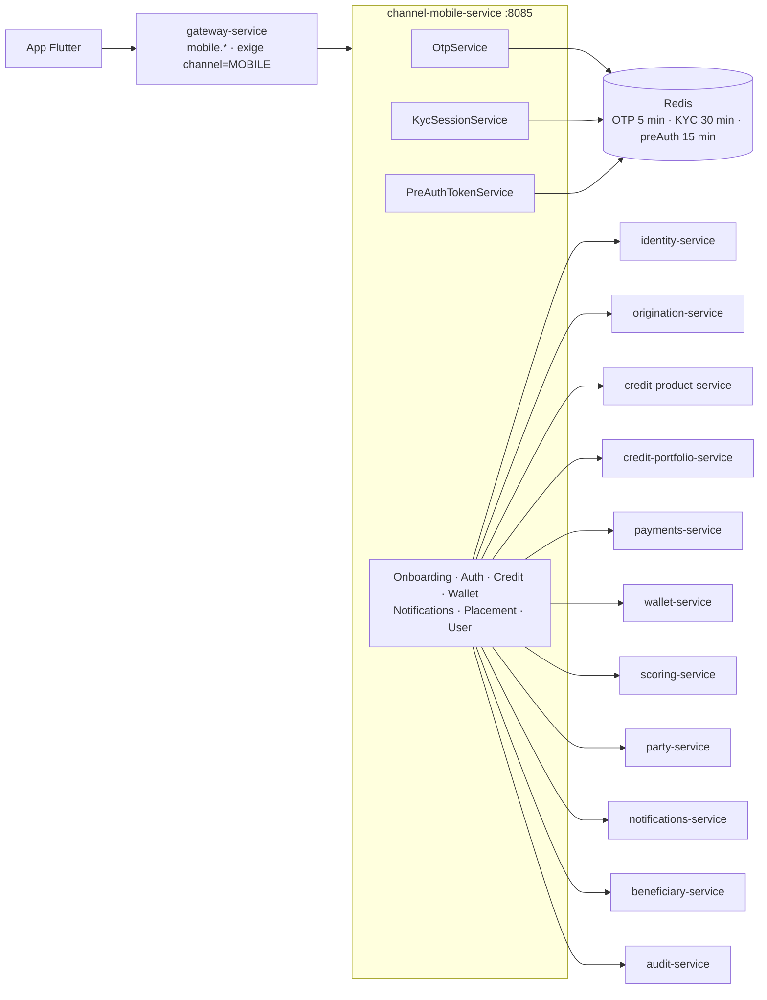
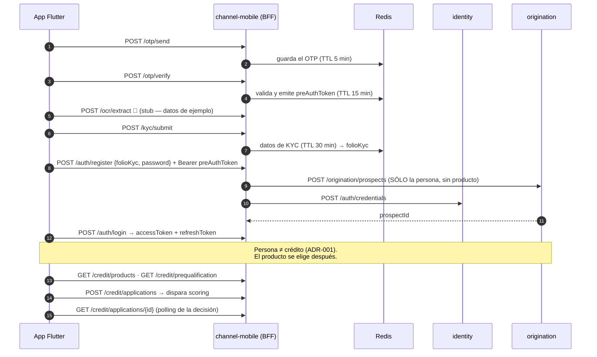
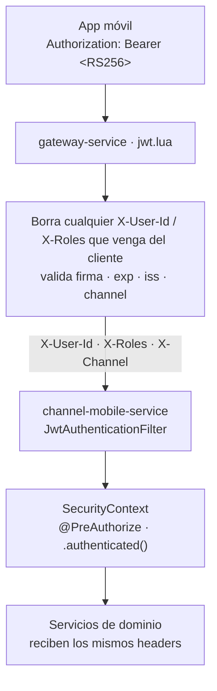

# channel-mobile-service (D1)

**BFF de la app móvil.** Compone las pantallas del cliente llamando a los servicios de dominio y
reenviando la identidad que el gateway ya verificó. Es el único punto de entrada de la app Flutter
al sistema.

**Stateless con estado efímero en Redis:** no tiene base de datos propia. Sesiones de OTP, tokens
pre-auth y datos de KYC temporales viven en Redis con TTL; lo definitivo se persiste en identity y
origination.

| | |
|---|---|
| **Puerto** | `8085` (bootRun y Docker — no usa `:8080` interno) |
| **Persistencia** | Redis (efímero) — **sin schema propio** |
| **Auth** | **Header-trust** — no valida JWT (ver §Modelo de autenticación) |
| **Subdominio en el gateway** | `mobile.localhost` · `mobile.fintech-service` |

## Arquitectura



Todas las llamadas salientes son `WebClient` y **reenvían `X-User-Id`, `X-Roles` y `X-Channel`**:
el dominio confía en la decisión que tomó el gateway, no vuelve a validar el token.

### Flujo de onboarding completo



---

## Endpoints

Puerto **8085**, rutas planas sin prefijo `/api/v1` — el BFF expone lo que la app consume.

### Onboarding y sesión

| Método | Ruta | Auth | Descripción |
|---|---|---|---|
| `POST` | `/otp/send` · `/otp/resend` | — | Envía el OTP (con rate limit en el gateway y en el servicio) |
| `POST` | `/otp/verify` | — | Valida el OTP → `preAuthToken` |
| `POST` | `/ocr/extract` | — | 🧪 **Stub** — datos de ejemplo; en producción irá contra un OCR real |
| `POST` | `/kyc/submit` | — | Guarda el KYC temporal → `folioKyc` |
| `PUT` | `/kyc/documents/{documentType}` | — | Sube o reemplaza un documento del expediente |
| `POST` | `/auth/register` | preAuthToken | Da de alta **sólo el prospecto** → `prospectId` |
| `POST` | `/auth/login` · `/auth/refresh` | — | Sesión del cliente |
| `POST` | `/auth/logout` | Bearer | Revoca las sesiones en identity |
| `GET` | `/users/me` | Bearer | Perfil del usuario en sesión |

### Crédito

| Método | Ruta | Descripción |
|---|---|---|
| `GET` | `/credit/products` | Catálogo activo |
| `GET` | `/credit/prequalification` | Qué alcanza hoy el cliente (scoring) |
| `POST` · `GET` | `/credit/applications` · `/{id}` | Crear solicitud (dispara scoring) · consultar |
| `POST` | `/credit/applications/{id}/offer` · `/offer/accept` · `/offer/reject` | Oferta |
| `POST` | `/credit/applications/{id}/contract` · `/contract/sign` | Contrato y firma |
| `GET` | `/credit/account` | Cuenta viva con el avance del plan de pagos |
| `POST` | `/credit/payment` | Registrar un pago |
| `POST` | `/credit/dispose` | Disponer de la línea |
| `GET` | `/credit/dispositions` | Sus compras — cuál puede diferir |
| `GET` | `/credit/schedule` | Sus pagos — cuál puede saltar |
| `POST` | `/credit/dispositions/{id}/defer` | Diferir una compra a plazos |
| `POST` | `/credit/installments/{id}/skip` | Saltar un pago |

Los cuatro últimos son decisiones **del titular**, no del backoffice, y por eso viven aquí. Ninguno
recibe el id de la cuenta: se resuelve del usuario autenticado, así que no existe la petición capaz
de diferir la compra de otro ni de saltarle el pago.

### Monedero, avisos y colocación B2B2C

| Método | Ruta | Descripción |
|---|---|---|
| `GET` | `/wallet/balance` · `/wallet/transactions` | Saldo y movimientos |
| `POST` | `/wallet/transfer` | Transferencia desde el monedero |
| `GET` | `/notifications` | Buzón |
| `PUT` | `/notifications/{id}/read` · `/notifications/read-all` | Marcar leído |
| `GET` | `/distributor/line-summary` | Resumen de la línea del distribuidor |
| `GET` · `POST` | `/placements` | Colocaciones · crear |
| `GET` | `/placements/{placementId}` · `/bureau` | Detalle · reporte de buró |
| `POST` | `/placements/{placementId}/approve` · `/reject` · `/resend` · `/cancel` | Decisión del distribuidor |
| `GET` | `/beneficiaries` | Beneficiarias del distribuidor |

### Soporte (dev-only)

Proxy hacia los `/internal/test-support/*` de los dominios, para que la app y las pruebas E2E puedan
disparar los jobs y simular el paso del tiempo. Apagado salvo que el entorno lo encienda; el gateway
no enruta `/internal/*`.

| Método | Ruta | Hacia |
|---|---|---|
| `POST` | `/internal/test-support/run-daily-accrual` | charges |
| `POST` | `/internal/test-support/run-upcoming-installment-job` · `/run-installment-due-job` · `/run-delinquency-job` | credit-portfolio |
| `POST` | `/internal/test-support/accounts/{id}/installments/{n}/shift-due-date` | credit-portfolio |
| `POST` | `/internal/test-support/placements/{placementId}/complete-kyc` | beneficiary 🧪 (`BENEFICIARY_KYC_SIMULATION_ENABLED`) |

---

## Simuladores locales

| Qué se simula | Dónde | Cómo se enciende |
|---|---|---|
| **OCR de identificación** | `OnboardingController.ocrExtract` — devuelve datos de ejemplo | Siempre (no hay proveedor integrado) |
| **Código OTP fijo** | `OtpService` | `OTP_CODE_VALIDATION=false` + `OTP_DEV_CODE` |
| **KYC de una colocación** | Proxy a `beneficiary-service` | `BENEFICIARY_KYC_SIMULATION_ENABLED=true` |

El OTP con código fijo existe porque en local no hay pasarela de SMS: sin él, ningún alta puede
completarse. `OTP_CODE_VALIDATION` va en `true` por default, y ponerlo en `false` en un entorno real
convertiría el segundo factor en decoración.

---

### POST `/otp/send` — Request / Response

```json
// Request
{ "phoneNumber": "+5215512345678" }

// Response 200
{ "message": "OTP sent" }

// Response 429 — rate limit
{ "type": "https://fintech.com/errors/OTP_RATE_LIMIT_EXCEEDED", "status": 429 }
```

### POST `/otp/verify` — Request / Response

```json
// Request
{ "phoneNumber": "+5215512345678", "code": "123456" }

// Response 200
{ "preAuthToken": "<jwt-de-corta-vida>" }

// Response 400 — código incorrecto o expirado
{ "type": "https://fintech.com/errors/OTP_INVALID_OR_EXPIRED", "status": 400 }
```

### POST `/auth/register` — Request / Response

```json
// Request (requiere Bearer preAuthToken; el teléfono se toma del token)
{
  "folioKyc": "uuid-del-kyc-session",
  "password": "MiContraseña123"
}

// Response 201 — crea SÓLO el prospecto (sin tokens; la sesión se obtiene en /auth/login)
{
  "success":    true,
  "prospectId": "uuid-creado-en-origination",
  "message":    "Prospecto creado"
}
```

### POST `/auth/login` — Request / Response

```json
// Request
{ "phone": "+5215512345678", "password": "MiContraseña123", "deviceId": "uuid" }

// Response 200
{
  "accessToken":  "eyJ...",
  "refreshToken": "hex64chars",
  "expiresIn":    900,
  "tokenType":    "Bearer"
}
```

### POST `/credit/applications` — Request / Response

```json
// Request (Bearer accessToken)
{ "prospectId": "uuid", "productType": "PERSONAL_LOAN", "requestedAmount": 50000, "requestedTerm": 12 }

// Response 201
{ "applicationId": "uuid", "prospectId": "uuid", "productType": "PERSONAL_LOAN", "status": "PENDING_SCORING" }
```

---

---

## Sin Kafka

Este BFF **no produce ni consume eventos**: es un compositor REST, igual que
[channel-backoffice](../channel-backoffice-service/README.md). Todo lo que necesita lo pide
síncrono al dueño del dato y lo traduce al contrato de la app.

---

## Modelo de autenticación — header-trust

El BFF **no valida JWT** directamente. Delega la autenticación al `gateway-service`.



**Por qué no hay JWT_SECRET aquí:** la firma ya fue verificada por el gateway. El BFF confía en `X-User-Id` y `X-Roles` porque solo el gateway puede inyectarlos — los servicios no están expuestos directamente al exterior.

**Seguridad del modelo:** el gateway borra cualquier `X-User-Id` o `X-Roles` que venga del cliente antes de validar el token, por lo que un cliente no puede inyectar su propia identidad.

### SecurityConfig — qué rutas son públicas

| Ruta | Estado |
|---|---|
| `/auth/login` | `permitAll()` |
| `/auth/refresh` | `permitAll()` |
| `/auth/register` | `permitAll()` — el preAuthToken lo controla a nivel de negocio |
| `/otp/**` | `permitAll()` |
| `/ocr/**` | `permitAll()` |
| `/kyc/**` | `permitAll()` |
| Todo lo demás | `.authenticated()` — requiere X-User-Id |

---

## Variables de entorno

| Variable | Default | Descripción |
|---|---|---|
| `IDENTITY_SERVICE_URL` | `http://localhost:8080` | URL de identity-service |
| `ORIGINATION_SERVICE_URL` | `http://localhost:8081` | URL de origination-service |
| `CREDIT_PRODUCT_SERVICE_URL` | `http://localhost:8084` | URL de credit-product-service (catálogo) |
| `REDIS_HOST` | `localhost` | Host de Redis |
| `REDIS_PORT` | `6379` | Puerto de Redis |
| `OTP_EXPIRY_MINUTES` | `5` | TTL del código OTP |
| `OTP_MAX_ATTEMPTS` | `3` | Intentos máximos de verificación por OTP |
| `OTP_MAX_SENDS_PER_WINDOW` | `5` | Envíos máximos de OTP en la ventana |
| `OTP_SEND_WINDOW_MINUTES` | `60` | Ventana de rate limiting para envío de OTP |
| `KYC_SESSION_EXPIRY_MINUTES` | `30` | TTL de los datos KYC en Redis |
| `OTP_CODE_VALIDATION` | `true` | `false` en ambientes bajos → usa `OTP_DEV_CODE` |
| `OTP_DEV_CODE` | *(vacío)* | Código OTP fijo para pruebas. Solo si `OTP_CODE_VALIDATION=false` |
| `SERVER_PORT` | `8085` | Puerto HTTP |

---

## Correr localmente

**Prerequisitos:** Java 21, Docker.

```bash
# 1. Infraestructura (Redis + servicios dependientes)
docker compose up redis -d
docker compose --profile identity-service up -d
docker compose --profile origination-service up -d

# 2. BFF
./gradlew :channel-mobile-service:bootRun
```

Inicia en `http://localhost:8085`.
Swagger UI: `http://localhost:8085/swagger-ui.html`

### Con Docker

```bash
docker build --build-arg SERVICE=channel-mobile-service -t fintech/channel-mobile-service .
docker compose --profile channel-mobile-service up -d
```

---

## Tests

```bash
./gradlew :channel-mobile-service:test
```

---

## Swagger / OpenAPI

| Recurso | URL |
|---|---|
| Swagger UI | `http://localhost:8085/swagger-ui.html` |
| OpenAPI JSON | `http://localhost:8085/v3/api-docs` |
| Actuator health | `http://localhost:8085/actuator/health` |

---

## Notas de diseño

- **Sin DB propia**: el BFF es stateless por diseño. Redis es únicamente para estado efímero (OTP, tokens, KYC pre-registro).
- **OCR stub**: `POST /ocr/extract` devuelve datos ficticios. La integración real con Incode/Jumio es un TODO.
- **Sin JWT_SECRET**: la validación JWT la hace el gateway. El BFF lee identidad desde headers `X-User-Id`/`X-Roles` inyectados por el gateway después de verificar la firma RS256.
- **Rate limiting de OTP**: implementado en memoria (Redis). Máx `OTP_MAX_SENDS_PER_WINDOW` envíos en `OTP_SEND_WINDOW_MINUTES` minutos por número.
