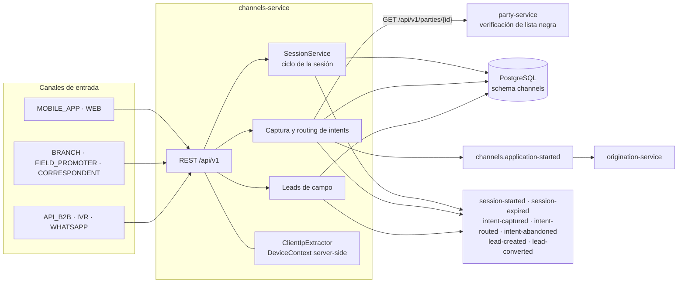
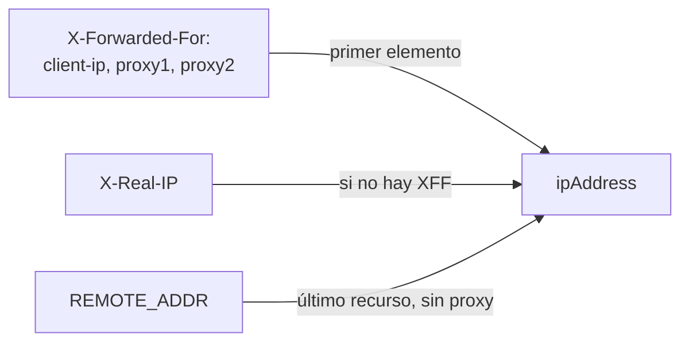
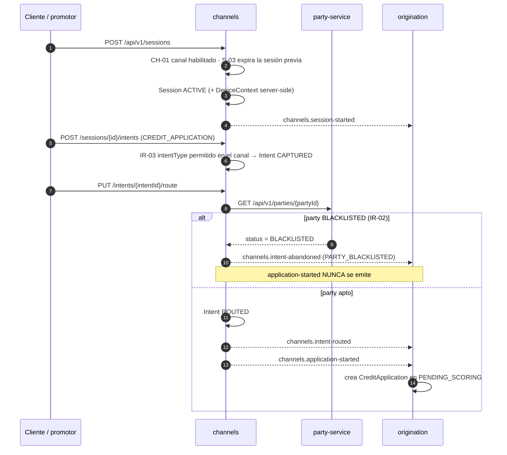

# channels-service (D1b)

**Captación y enrutamiento.** Gestiona sesiones de negocio, captura la intención del cliente y la
enruta al dominio que corresponde. **No toma decisiones crediticias**: su responsabilidad termina
al emitir `channels.application-started`.

| | |
|---|---|
| **Puerto** | `8091` (bootRun) · `:8080` interno en Docker |
| **Schema** | `channels` |
| **Auth** | **Header-trust** — `/api/v1/channels` exige `ADMIN` o `SUPPORT` |
| **Régimen Kafka** | Sólo produce (no consume) |
| **Dominio** | [docs/dominios/01_channels_domain.md](../../docs/dominios/01_channels_domain.md) |

## Mapa del servicio



## Tipos de Canal

| Canal | Intents permitidos | TTL sesión |
|---|---|---|
| `MOBILE_APP` | CREDIT_APPLICATION, PAYMENT, ACCOUNT_INQUIRY, REFINANCING, SUPPORT | 30 min |
| `WEB` | CREDIT_APPLICATION, PAYMENT, ACCOUNT_INQUIRY, REFINANCING, SUPPORT | 30 min |
| `API_B2B` | CREDIT_APPLICATION, REFINANCING | 60 min |
| `BRANCH` | todos | 120 min |
| `FIELD_PROMOTER` | CREDIT_APPLICATION | 60 min |
| `CORRESPONDENT` | CREDIT_APPLICATION, PAYMENT | 60 min |
| `IVR` | PAYMENT, ACCOUNT_INQUIRY, SUPPORT | 15 min |
| `WHATSAPP` | CREDIT_APPLICATION, ACCOUNT_INQUIRY, SUPPORT | 60 min |

## Autenticación

Header-trust — el gateway inyecta `X-User-Id` y `X-Roles`. Todos los endpoints requieren autenticación. `/api/v1/channels` requiere rol `ADMIN` o `SUPPORT`.

## Endpoints

| Método | Path | Descripción |
|---|---|---|
| `GET` | `/api/v1/channels` | Canales activos (ADMIN) |
| `POST` | `/api/v1/sessions` | Iniciar sesión de negocio |
| `GET` | `/api/v1/sessions/{id}` | Consultar sesión |
| `PUT` | `/api/v1/sessions/{id}/close` | Cerrar sesión |
| `POST` | `/api/v1/sessions/{id}/intents` | Capturar intent |
| `PUT` | `/api/v1/sessions/{id}/intents/{intentId}/route` | Enrutar intent |
| `PUT` | `/api/v1/sessions/{id}/intents/{intentId}/abandon` | Abandonar intent |
| `POST` | `/api/v1/leads` | Registrar lead (campo) |
| `GET` | `/api/v1/leads/{id}` | Consultar lead |
| `PUT` | `/api/v1/leads/{id}/convert` | Convertir lead |

## Device Context

Cada sesión captura el contexto completo del dispositivo para trazabilidad regulatoria y detección de fraude. Todos los campos de riesgo se extraen del lado servidor — el cliente **no puede falsificar la IP ni el User-Agent**.

| Campo | Fuente | Descripción |
|---|---|---|
| `deviceId` | Cliente (SDK) | Identificador único del dispositivo |
| `deviceType` | SDK o inferido de UA | MOBILE / TABLET / DESKTOP / UNKNOWN |
| `deviceModel` | Cliente (SDK) | Modelo del dispositivo |
| `deviceManufacturer` | Cliente (SDK) | Fabricante |
| `os` / `osVersion` | Cliente (SDK) | Sistema operativo y versión |
| `appVersion` / `sdkVersion` | Cliente (SDK) | Versión de la app / SDK de integración |
| `networkType` | Cliente (SDK) | WIFI / LTE / 5G / ETHERNET |
| `userAgent` | Header `User-Agent` (servidor) | Siempre server-side |
| `browser` / `browserVersion` | Parseado del User-Agent | Chrome / Firefox / Safari / Edge / Opera |
| `ipAddress` | `X-Forwarded-For[0]` → `X-Real-IP` → `RemoteAddr` | Cadena de proxies estándar |
| `ipCountry` | Header `X-Country-Code` (gateway GeoIP) | ISO 3166-1 alpha-2 |
| `isTrustedDevice` | Cliente (SDK) | Dispositivo registrado previamente |
| `isRooted` / `isEmulator` | SDK auto-reportado | Indicadores de riesgo — limitación: spoofable en ataques avanzados |

### Extracción de IP



La lógica vive en `ClientIpExtractor` (util público, testeable de forma aislada).

---

## Reglas clave

- **CH-01** Canal `DISABLED` no genera sesiones
- **S-03** Una sola sesión activa por `partyId+channelType` — nueva sesión expira la anterior
- **IR-02** `Party.status=BLACKLISTED` → `IntentAbandoned(PARTY_BLACKLISTED)` — `ApplicationStarted` **nunca** se emite
- **IR-03** `intentType` debe estar en `Channel.allowedIntents`
- **L-02** Lead `CONVERTED` es inmutable

## Eventos publicados

| Topic | Cuándo |
|---|---|
| `channels.session-started` | Al iniciar sesión |
| `channels.session-expired` | Al expirar o cerrar sesión |
| `channels.intent-captured` | Al capturar intent |
| `channels.intent-routed` | Al enrutar intent |
| `channels.intent-abandoned` | Al abandonar intent (incluye BLACKLISTED) |
| `channels.application-started` | Intent CREDIT_APPLICATION o REFINANCING enrutado con partyId presente |
| `channels.lead-created` | Al registrar lead |
| `channels.lead-converted` | Al convertir lead |

## Flujo principal



## Tests

```
./gradlew :channels:test
# SessionServiceTest      — 5 unit (Mockito): startSession, S-03, CH-01, not found, closeSession
# ChannelControllerTest   — 8 @WebMvcTest: 401/403/200 channels, 201/401/400/404 sessions, 400 intents
# SessionControllerIpTest — 7 unit: X-Forwarded-For, X-Real-IP, RemoteAddr, IPv6, whitespace, single IP, blank header
# Total: 20 ✅
```


---

## Eventos Kafka

**Consume:** ninguno.

**Produce:** `channels.application-started` → **origination**. Los demás
(`session-started`, `session-expired`, `intent-captured`, `intent-routed`, `intent-abandoned`,
`lead-created`, `lead-converted`) **no tienen consumidor hoy**: quedan como traza de captación y
analítica.

**Reintentos:** régimen por defecto, sin DLT.
Ver [README raíz §5.4](../../README.md#54-política-de-reintentos-y-dlt-kafka).
