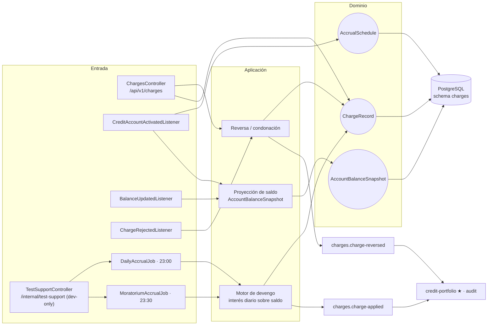
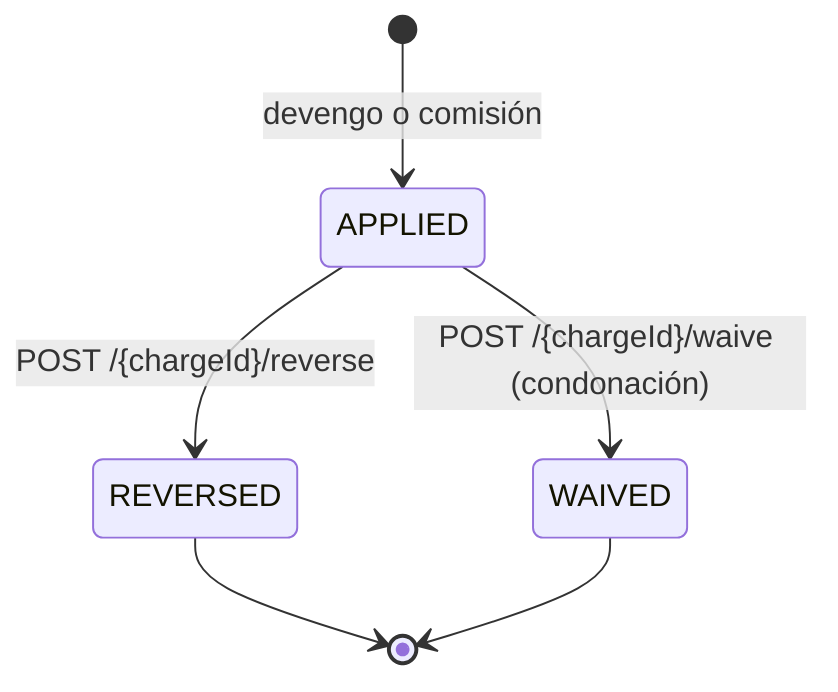
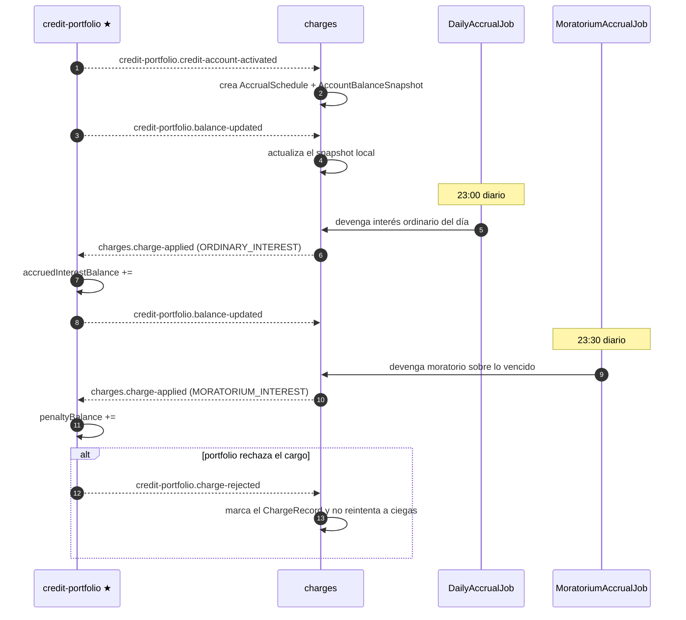
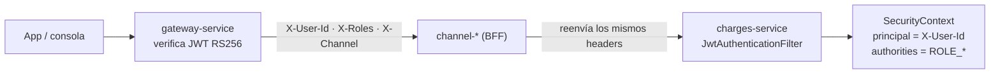

# charges-service (D5)

**Devengamiento y cargos sobre la cuenta viva.** Calcula, programa y registra todo lo que se le
carga a un crédito activo: interés ordinario, interés moratorio, comisión de apertura, comisión de
administración, comisión por prepago, prima de seguro e IVA.

**No escribe saldos.** Es la mitad "calcula" del patrón de ADR-001: charges emite el hecho
(`charge-applied`), y [credit-portfolio](../credit-portfolio-service/README.md) lo aplica sobre la
fuente de verdad. Si portfolio lo rechaza, se entera por `charge-rejected` y corrige.

| | |
|---|---|
| **Puerto** | `8088` (bootRun) · `:8080` interno en Docker |
| **Schema** | `charges` |
| **Auth** | **Header-trust** — no valida JWT (ver §5) |
| **Régimen Kafka** | Por defecto (sin DLT) |
| **Dominio** | [docs/dominios/05_charges_domain.md](../../docs/dominios/05_charges_domain.md) |

---

## 1. Mapa del servicio



---

## 2. Dominio

| Agregado | Rol |
|---|---|
| `ChargeRecord` | Un cargo concreto aplicado a la cuenta. Estados: `APPLIED` · `REVERSED` · `WAIVED` |
| `AccrualSchedule` | Calendario de devengo por cuenta: desde dónde y hasta dónde se ha devengado |
| `AccountBalanceSnapshot` | Proyección local del saldo, alimentada por `balance-updated`. Evita llamar a portfolio para devengar |

**`ChargeType`:** `ORDINARY_INTEREST` · `MORATORIUM_INTEREST` · `OPENING_FEE` · `ADMIN_FEE` ·
`PREPAYMENT_FEE` · `INSURANCE_PREMIUM` · `IVA`.



Tanto `REVERSED` como `WAIVED` publican `charges.charge-reversed`: para el saldo son el mismo
efecto, pero se distinguen en el registro porque contable y comercialmente no son lo mismo.

---

## 3. Ciclo de devengo diario



El moratorio corre **después** del ordinario (23:30 contra 23:00) a propósito: el saldo vencido del
día ya quedó determinado cuando se calcula la penalización.

---

## 4. API REST

**Base:** `/api/v1/charges`

| Método | Ruta | Descripción |
|---|---|---|
| `GET` | `/accounts/{creditAccountId}` | Cargos de la cuenta |
| `GET` | `/accounts/{creditAccountId}/schedule` | Calendario de devengo |
| `GET` | `/accounts/{creditAccountId}/balance` | Snapshot de saldo que ve charges |
| `POST` | `/{chargeId}/reverse` | Reversa (error operativo) |
| `POST` | `/{chargeId}/waive` | Condonación (decisión comercial) |

### Soporte (dev-only, `TEST_SUPPORT_ENABLED=true`)

| Método | Ruta | Para qué |
|---|---|---|
| `POST` | `/internal/test-support/run-daily-accrual` | Correr el devengo ordinario sin esperar a las 23:00 |
| `POST` | `/internal/test-support/run-moratorium-accrual` | Correr el devengo moratorio |
| `POST` | `/internal/test-support/rewind-accrual-schedules` | Retroceder el calendario para simular días transcurridos |

El gateway **no** enruta `/internal/*`: no son alcanzables desde fuera.

---

## 5. Autenticación — modelo *header-trust*

charges **no valida JWT**. La firma RS256 ya se verificó en el gateway; el BFF reenvía la identidad
y charges confía en ella.



| Archivo | Responsabilidad |
|---|---|
| `JwtAuthenticationFilter.java` | Lee `X-User-Id` (→ *principal*) y `X-Roles` (→ `ROLE_<rol>`). Sin llave secreta |
| `ChargesProperties.java` | No tiene campo `jwtSecret` |
| `application.yml` | No define `jwt-secret` ni `JWT_SECRET` |

La red interna de Docker no publica este puerto al host: el único camino de entrada es el gateway.

---

## 6. Eventos Kafka

**Consume:** `credit-portfolio.credit-account-activated` · `credit-portfolio.balance-updated` ·
`credit-portfolio.charge-rejected`.

**Produce:** `charges.charge-applied` · `charges.charge-reversed` (→ credit-portfolio, audit).

> charges **no** consume `product-catalog.*`: la configuración del producto que necesita para
> devengar le llega dentro de `credit-account-activated`.

**Reintentos:** régimen por defecto de la plataforma, sin DLT.
Ver [README raíz §5.4](../../README.md#54-política-de-reintentos-y-dlt-kafka).

---

## 7. Persistencia — schema `charges`

5 changesets Liquibase bajo `db/changelog/charges/`.

```yaml
spring:
  liquibase:
    default-schema: charges      # las tablas del dominio
    liquibase-schema: public     # DATABASECHANGELOG
```

**Por qué `liquibase-schema: public`:** si se omite, Liquibase intenta crear `DATABASECHANGELOG`
dentro de `charges`, que en el primer arranque todavía no existe — y el bootstrap falla. La tabla de
control vive en `public`; las del dominio, en su schema.

---

## 8. Configuración

| Variable | Default | Nota |
|---|---|---|
| `SERVER_PORT` | `8088` | `8080` en Docker |
| `POSTGRES_USER` / `POSTGRES_PASSWORD` | `fintech` / `fintech` | |
| `KAFKA_BOOTSTRAP_SERVERS` | `localhost:9092` | |
| `SPRING_PROFILES_ACTIVE` | — | `docker` en Compose |
| `TEST_SUPPORT_ENABLED` | `false` | **Debe quedar en `false`** |

Sin `JWT_SECRET`: el modelo es header-trust.

---

## 9. Tests y ejecución local

```bash
./gradlew :charges-service:test

docker compose up -d                 # plataforma completa
docker compose up -d charges-service # sólo este (requiere postgres, kafka, credit-portfolio)
```
