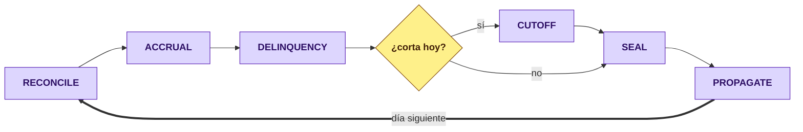

# closing-service (D14)

**El motor de cierres y cortes.** Corre el día contable cuenta por cuenta: devenga, envejece, corta
el ciclo del que lo tiene, sella lo que cuadró y **propaga de vuelta** lo que la cartera necesita
saber. Reparte el trabajo entre pods sin coordinador central.

> **Servicio interno.** No recibe tráfico de internet y **no está publicado en el gateway**.

| | |
|---|---|
| **Puerto** | `8103` (bootRun) · `:8080` interno en Docker |
| **Schema** | `closing` · paquete `com.fintech.closing` |
| **Dominio** | [docs/dominios/14_closing_domain.md](../../docs/dominios/14_closing_domain.md) |

---

## Por qué existe

El cierre vivía repartido en `@Scheduled` de tres servicios, cada uno con su reloj y su criterio de
qué día estaba procesando. Eso tiene dos consecuencias que sólo se ven cuando algo falla:

1. **Nadie podía decir si el día cerró.** Cada job dejaba su rastro por separado; no había una
   afirmación única de «el 15 de junio cuadró».
2. **Reprocesar un día era imposible sin efectos colaterales.** Los jobs se disparan por reloj, no
   por fecha de negocio: pedirle a uno que rehiciera el martes significaba esperar al martes.

Y el barrido competía por el pool de conexiones con la API de cartera. Sacarlo de ahí es **medio
motivo de que este servicio exista**.

## Las seis fases, en orden



El orden no es negociable: devengar antes de envejecer produce un DPD que ignora el cargo del día, y
sellar antes de cortar sella un saldo que el corte va a mover.

## Cómo reparte el trabajo

Cada cuenta es una **unidad de cierre** con su propio arrendamiento. Varios pods toman unidades del
mismo lote sin pisarse, y sin un coordinador que decida quién hace qué:

| Pieza | Qué resuelve |
|---|---|
| **Candado Redis** (`shared.lock`) | Que dos pods no tomen la misma unidad. Nunca `FOR UPDATE` en base — el barrido no puede bloquear la API |
| **Token de cercado** | Que un pod cuyo arrendamiento venció no escriba encima del que lo relevó |
| **CAS optimista** | `UPDATE … WHERE status='PENDING'`: quien pierde la carrera sigue a la unidad siguiente |
| **`LeaseReaper`** | Devuelve al lote lo que un pod muerto dejó tomado |

## El sello, que es el punto

Una corrida termina emitiendo un **sello**: la afirmación de que ese día, para esa cuenta, las
cifras cuadran. Su hash se calcula sobre los importes normalizados a escala 4 —la misma cifra da la
misma cadena venga de memoria o de la base—; sin esa normalización, **ningún sello releído se
verificaba íntegro**, que fue exactamente el defecto que TK-05 corrigió.

Si no cuadra, **no se sella**: sellar «con observaciones» convierte el sello en un trámite.

## Qué NO hace

| | |
|---|---|
| ❌ | **No calcula intereses.** Eso es de `charges`. El cierre lo dispara y consume el resultado |
| ❌ | **No concilia bancos.** Eso es de `banking` (D15), que emite su propio sello; el cierre lo consume como cifra de control |
| ❌ | **No decide el importe de una cuota.** Sale del plan de amortización, que es de cartera. Duplicar la aritmética crearía dos fuentes de verdad que divergen al primer redondeo |

## Entradas / Salidas

**Consume:** `credit-portfolio.credit-account-activated` (con cadencia y plazo, para derivar el
calendario de corte sin consultar cartera en línea) · `credit-portfolio.balance-updated`.

**Produce:** `closing.unit-window-opened` · `closing.cutoff-closed` (que cartera proyecta de vuelta
como el exigible del ciclo) · `closing.day-sealed`.

## Configuración

| Propiedad | Default | Qué hace |
|---|---|---|
| `fintech.closing.calendar-code` | `MX` | Qué calendario de días hábiles usar |
| `fintech.closing.node-id` | `$HOSTNAME` | Identidad del pod en el arrendamiento. En Kubernetes la inyecta la downward API |
| `fintech.closing.batch-size` | `500` | Unidades por lote |
| `fintech.closing.lease` | `5m` | Cuánto dura el arrendamiento antes de que el reaper lo recupere |
| `fintech.closing.workers` | `4` | Hilos por pod |
| `fintech.lock.wait-time` | `0s` | Cero a propósito: quien no gana el candado pasa a la unidad siguiente en vez de bloquear un hilo |

## Correr

```bash
./gradlew :closing-service:bootRun          # 8103
./gradlew :closing-service:test             # 63 pruebas
docker compose up closing-service           # 8103 → 8080
```
