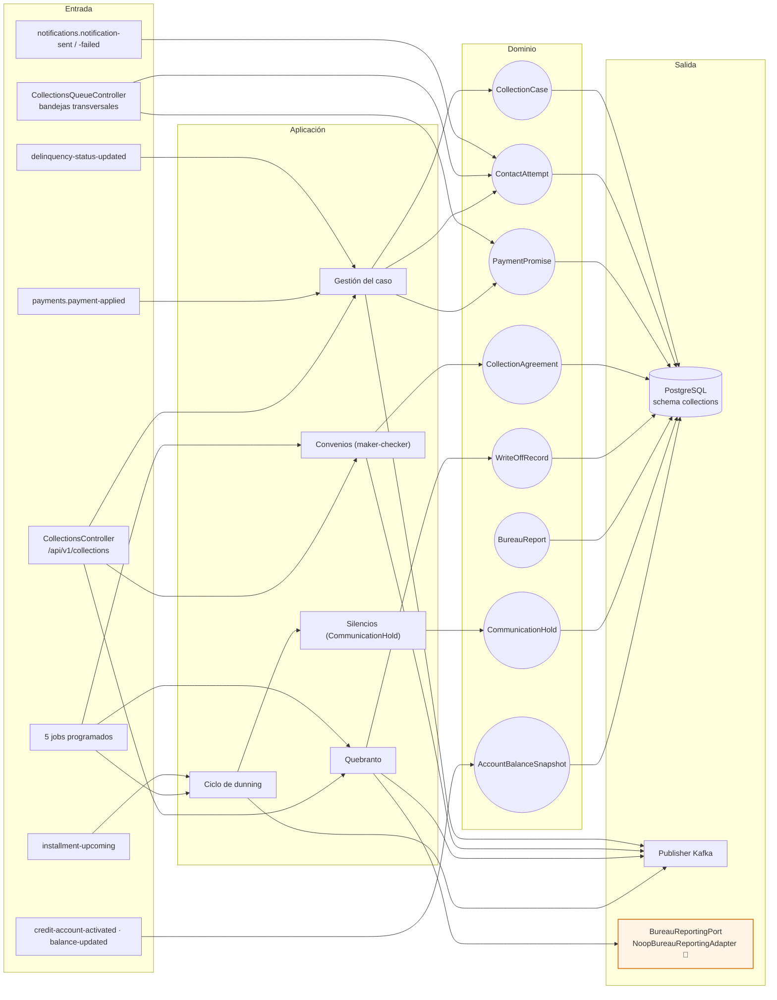
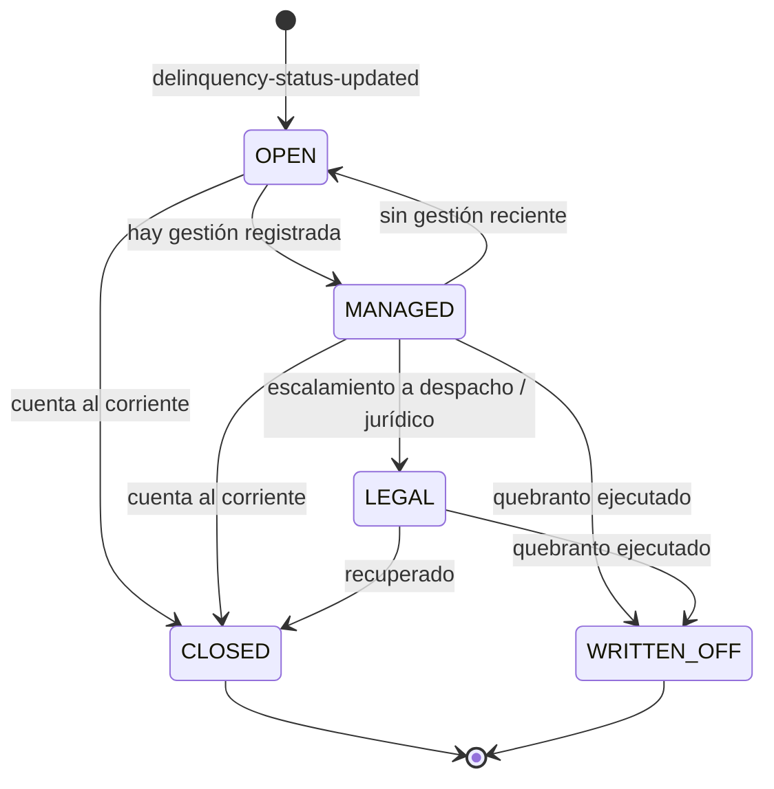
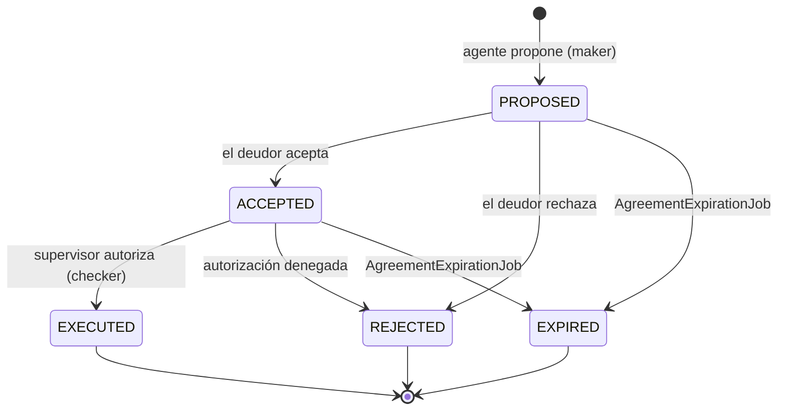
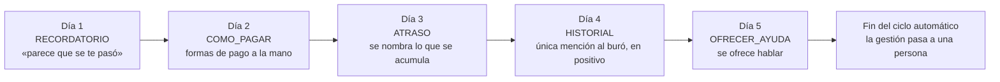

# collections-service (D8)

**Cobranza y recuperación.** Abre y gestiona **casos** cuando una cuenta cae en mora, registra la
gestión (contactos, promesas), negocia **convenios** con flujo maker-checker, ejecuta el
**quebranto** y reporta al buró. Trabaja sobre una proyección local del saldo: **nunca lee la
cartera directamente**.

| | |
|---|---|
| **Puerto** | `8093` (bootRun) · `:8080` interno en Docker |
| **Schema** | `collections` |
| **Arquitectura** | Hexagonal + Spring Modulith |
| **Régimen Kafka** | Por defecto (sin DLT) |
| **Dominio** | [docs/dominios/08_collections_domain.md](../../docs/dominios/08_collections_domain.md) |

---

## 1. Mapa del servicio



---

## 2. Dominio

| Agregado | Rol |
|---|---|
| `CollectionCase` | Caso de una cuenta en mora — `OPEN` · `MANAGED` · `LEGAL` · `WRITTEN_OFF` · `CLOSED` |
| `ContactAttempt` | Intento de contacto, con canal, resultado y origen |
| `PaymentPromise` | Promesa de pago — `ACTIVE` · `KEPT` · `BROKEN` · `EXPIRED` |
| `CollectionAgreement` | Convenio bilateral (`RESTRUCTURE` o `QUITA_PARCIAL`) |
| `WriteOffRecord` | Quebranto ejecutado — unilateral, a diferencia del convenio |
| `BureauReport` | Reporte enviado al buró |
| `CommunicationHold` | Por qué está callada la cobranza automática de un caso |
| `AccountBalanceSnapshot` | Read model del saldo, desde `balance-updated` |

### Caso



### Convenio — maker-checker



Sólo `EXECUTED` publica `collections.agreement-executed`, que es lo que reestructura la cuenta en
credit-portfolio y abre la ventana de cura en risk. Quien propone no autoriza: la quita es dinero
que la institución deja de cobrar.

---

## 3. El ciclo de dunning: cinco días y se acaba



**No es una cadencia indefinida.** Cinco mensajes diarios desde que se cae en mora, y después
gestiona una persona. Un sistema que sigue escribiendo solo durante seis meses no cobra más:
acumula quejas y entrena al cliente a ignorar el canal.

**El tono sube; el trato no baja.** Empieza asumiendo olvido —que es lo que casi siempre es— y
termina ofreciendo hablar. Ninguno amenaza. La mención al historial crediticio (día 4) es un hecho
que se puede evitar poniéndose al corriente, no una palanca: el reporte a buró ocurre por el
atraso, no por decisión de cobranza, así que no hay nada que ofrecer a cambio de que no ocurra —y
usarlo como presión es justo lo que CONDUSEF sanciona.

### Cuándo se calla la cobranza (`HoldReason`)

| Motivo | Por qué |
|---|---|
| `ACTIVE_PROMISE` | Presionar a quien acaba de comprometerse destruye el compromiso |
| `PROMISE_KEPT` | Cumplió: se le agradece y se le deja respirar |
| `AGREEMENT_IN_FLIGHT` | No se negocia y se presiona a la vez |
| `AGENCY_ASSIGNED` | Dos cobradores sobre la misma persona es la queja típica |
| `MANUAL` | Lo puso un agente, con motivo |

---

## 4. API REST — `/api/v1/collections`

| Método | Ruta | Descripción |
|---|---|---|
| `GET` | `/cases` · `/cases/{caseId}` | Bandeja de casos · detalle |
| `GET` | `/accounts/{creditAccountId}/case` | Caso por cuenta |
| `GET` | `/cases/{caseId}/contact-attempts` · `/payment-promises` · `/agreements` · `/communication-holds` | Sub-recursos del caso |
| `POST` | `/cases/{caseId}/contact-attempts` · `/payment-promises` | Registrar gestión |
| `POST` | `/cases/{caseId}/agreements` | Proponer convenio (*maker*) |
| `PUT` | `/agreements/{agreementId}/accept` · `/reject` · `/authorize` | Aceptación del deudor · rechazo · autorización (*checker*) |
| `GET` | `/agreements/awaiting-authorization` | Bandeja del supervisor |
| `POST` | `/cases/{caseId}/request-write-off` · `/write-offs` | Solicitar y ejecutar quebranto |
| `GET` | `/accounts/{creditAccountId}/write-off` | Quebranto de una cuenta |
| `GET` | `/bureau-reports` · `/config` | Reportes enviados · parámetros vigentes de trato |

### Bandejas transversales

| Método | Ruta | Qué resuelve |
|---|---|---|
| `GET` | `/payment-promises` | «Promesas vigentes» cruzando casos. Filtros: `status`, `bucket`, `agentId`, `dueFrom`/`dueTo`, `dueToday` |
| `GET` | `/contact-attempts` | «Gestión de contacto» cruzando casos. Filtros: `result`, `channel`, `bucket`, `agentId`, `from`/`to` |

Antes sólo existían como sub-recursos de un caso, así que armar una bandeja obligaba a una llamada
por fila desde el canal. Ahora la consulta la resuelve el dueño con `JOIN` al caso —el tramo y el
gestor viven ahí, no en la promesa— y dos subconsultas correlacionadas que traen los intentos de
hoy y el resultado del último contacto.

**Los flags de trato al cliente se calculan aquí, no en la consola:** `contactCapReached` (tope de
intentos del día), `contactable` y la ventana horaria del sobre salen de `CollectionsProperties`.
Dejarlos del lado de quien pinta la pantalla los volvería una sugerencia visual en vez de una regla.

El día se cuenta en **hora de México**, no en UTC: el tope diario es una regla de trato, y su día es
el de la persona a la que se le llama — con UTC el contador se reiniciaría a las 6 de la tarde.

---

## 5. Jobs programados

| Job | Cron | Qué hace |
|---|---|---|
| `BureauReportingJob` | `0 0 2 * * *` | Envía al buró los casos que corresponde reportar |
| `WriteOffCandidatesJob` | `0 0 6 * * MON` | Semanal: propone candidatos a quebranto |
| `PromiseBrokenCheckJob` | `0 0 8 * * *` | Marca promesas incumplidas |
| `AgreementExpirationJob` | `0 15 8 * * *` | Vence convenios propuestos o aceptados sin autorizar |
| `DunningScheduleJob` | `0 0 10 * * *` | Ejecuta el escalón de dunning que toca, respetando los *holds* |

---

## 6. Dependencias externas y sus simuladores locales

| Dependencia real | Adaptador | Comportamiento |
|---|---|---|
| Círculo de Crédito — API de **reporte** de cartera | `NoopBureauReportingAdapter` 🧪 | Confirma el envío al instante con la referencia `BUREAU-STUB-XXXXXXXX` |

Es la otra mitad del buró: [scoring](../scoring-service/README.md) **consulta**, collections
**reporta**. Ambas están simuladas en local, pero por razones distintas — la consulta tiene sandbox
y la de reporte todavía no tiene contrato.

---

## 7. Eventos Kafka

**Consume:** `credit-portfolio.credit-account-activated` · `credit-portfolio.balance-updated` ·
`credit-portfolio.delinquency-status-updated` · `credit-portfolio.installment-upcoming` ·
`payments.payment-applied` · `notifications.notification-sent` · `notifications.notification-failed`.

> Los dos últimos existen para que el expediente del caso incluya **también lo automático**: cada
> mensaje que salió (o falló) queda como constancia junto a lo que un agente capturó a mano.

**Produce:**

| Tópico | Consumidores |
|---|---|
| `collections.agreement-executed` | credit-portfolio, risk |
| `collections.write-off-executed` | credit-portfolio |
| `collections.pre-due-reminder-triggered` · `.dunning-requested` · `.payment-thanks` | notifications |
| `collections.recovery-payment-applied` | accounting |
| `case-created` · `case-escalated` · `contact-attempt-registered` · `payment-promise-made` · `payment-promise-broken` · `agreement-proposed` · `bureau-report-submitted` · `write-off-requested` | *sin consumidor hoy* — traza de gestión |

**Reintentos:** régimen por defecto, sin DLT.
Ver [README raíz §5.4](../../README.md#54-política-de-reintentos-y-dlt-kafka).

---

## 8. Persistencia y ejecución

Schema `collections`, 11 changesets Liquibase bajo `db/changelog/collections/`.

```bash
./gradlew :collections-service:test
docker compose up -d collections-service
```
