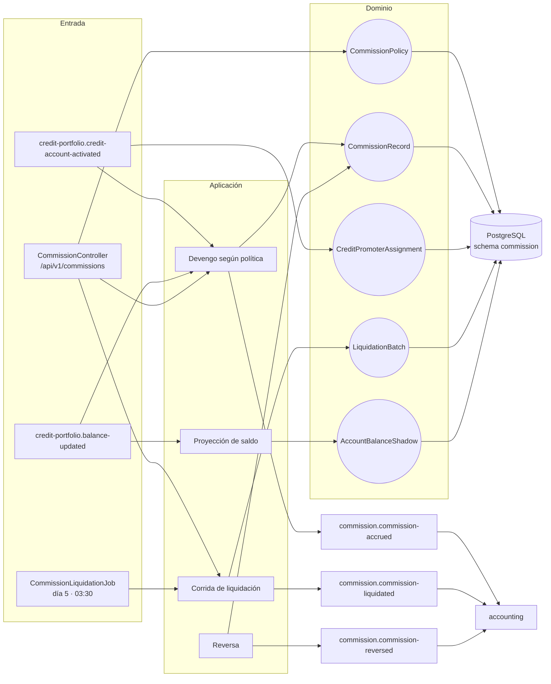
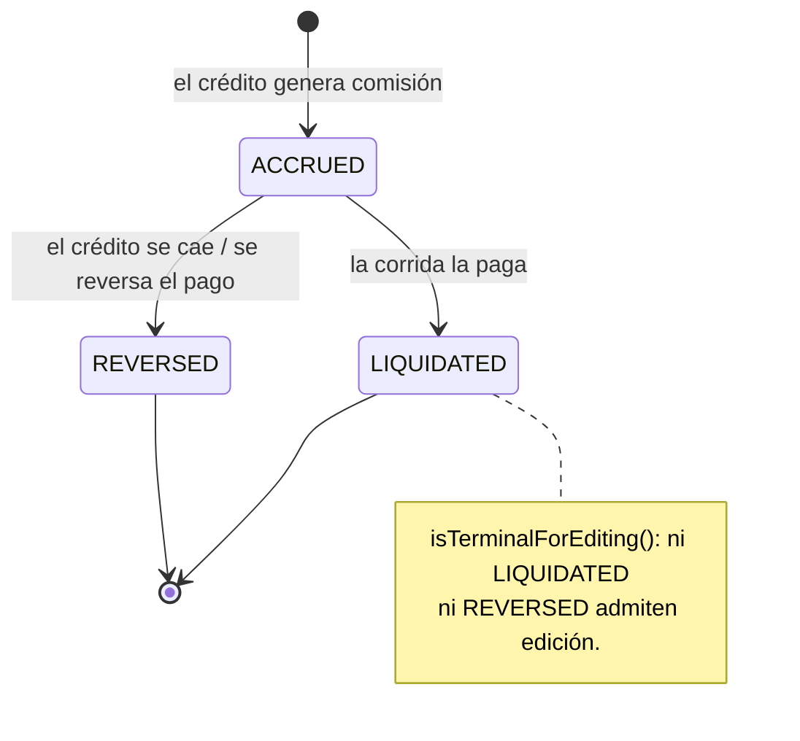

# commission-service (T6)

**Comisiones de la red comercial.** Devenga lo que cada crédito le genera al promotor o
distribuidor que lo originó, lo acumula y lo **liquida** en corridas, con reversa cuando el crédito
se cae. Es el consumidor natural de la resolución `promoterCode → distribuidor` que hace
originación.

| | |
|---|---|
| **Puerto** | `8097` (bootRun) · `:8080` interno en Docker |
| **Schema** | `commission` |
| **Arquitectura** | Hexagonal + Spring Modulith |
| **Régimen Kafka** | Por defecto (sin DLT) |
| **Dominio** | [docs/dominios/T6_commission.md](../../docs/dominios/T6_commission.md) |

---

## 1. Mapa del servicio



---

## 2. Dominio

| Agregado | Rol |
|---|---|
| `CommissionPolicy` | Regla de cálculo por producto/segmento — `DRAFT` · `ACTIVE` · `DEPRECATED` |
| `CommissionRecord` | Comisión devengada de un crédito — `ACCRUED` → `LIQUIDATED` \| `REVERSED` |
| `CreditPromoterAssignment` | Vínculo crédito → promotor o distribuidor beneficiario |
| `LiquidationBatch` | Corrida que paga lo devengado pendiente — `PENDING` → `SENT` → `CONFIRMED` |
| `AccountBalanceShadow` | Read model del saldo, desde `balance-updated` |

### Tipos de comisión

| `CommissionType` | Cuándo se devenga | Para quién |
|---|---|---|
| `DISTRIBUTOR_INTEREST_SHARE` | Por pago cobrado (*trailing*, contra cobranza) | Distribuidor B2B2C |
| `ORIGINATION_FEE` | Una sola vez, al activar | Promotor de red propia (B2C) |
| `COLLECTION_BONUS` | Por pago recuperado en un caso asignado | Gestor de cobranza |
| `RENEWAL_BONUS` | Al reactivar o renovar el producto | Promotor original |

> `DISTRIBUTOR_INTEREST_SHARE` se devenga **contra el interés efectivamente cobrado**, no contra el
> facturado: una comisión que se paga sobre lo que nadie cobró es un quebranto con otro nombre.



---

## 3. API REST — `/api/v1/commissions`

| Método | Ruta | Descripción |
|---|---|---|
| `GET` | `/accounts/{creditAccountId}` | Comisiones generadas por un crédito |
| `GET` | `/beneficiaries/{partyId}/pending` | Lo devengado pendiente de liquidar |
| `GET` | `/promoters/credits` | Créditos por promotor |
| `GET` · `POST` | `/policies` | Catálogo de políticas |
| `POST` | `/liquidation-runs` | Disparar una corrida a mano |

---

## 4. Jobs programados

| Job | Cron | Qué hace |
|---|---|---|
| `CommissionLiquidationJob` | `0 30 3 5 * *` | Día 5 de cada mes, 03:30 — liquida lo devengado del periodo |

---

## 5. Eventos Kafka

**Consume:** `credit-portfolio.credit-account-activated` (crea el vínculo y devenga lo *upfront*) ·
`credit-portfolio.balance-updated` (devenga lo *trailing*).

**Produce:** `commission.commission-accrued` · `commission.commission-liquidated` ·
`commission.commission-reversed` — los tres a **accounting**.

**Reintentos:** régimen por defecto, sin DLT.
Ver [README raíz §5.4](../../README.md#54-política-de-reintentos-y-dlt-kafka).

---

## 6. Persistencia y ejecución

Schema `commission`, 7 changesets Liquibase bajo `db/changelog/commission/`.

```bash
./gradlew :commission-service:test
docker compose up -d commission-service
```
