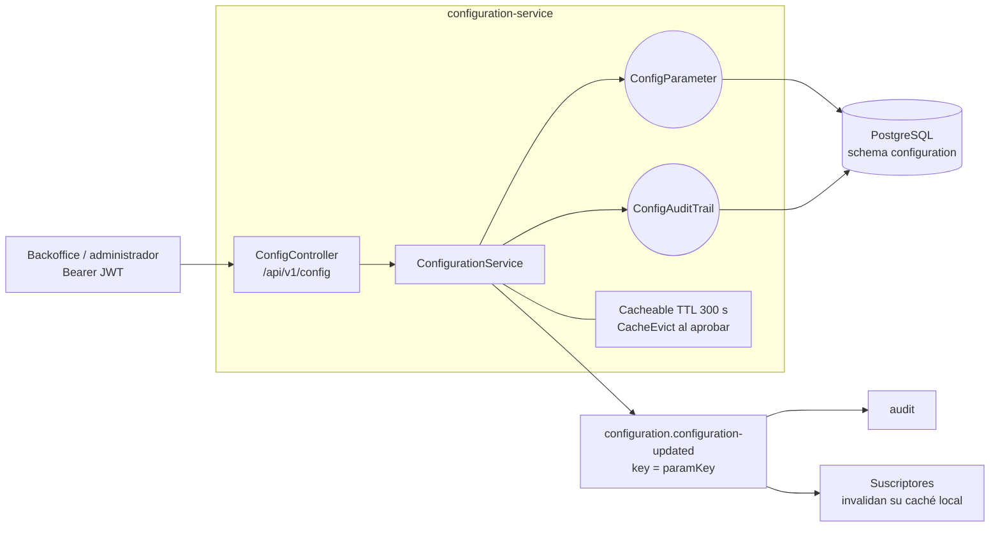
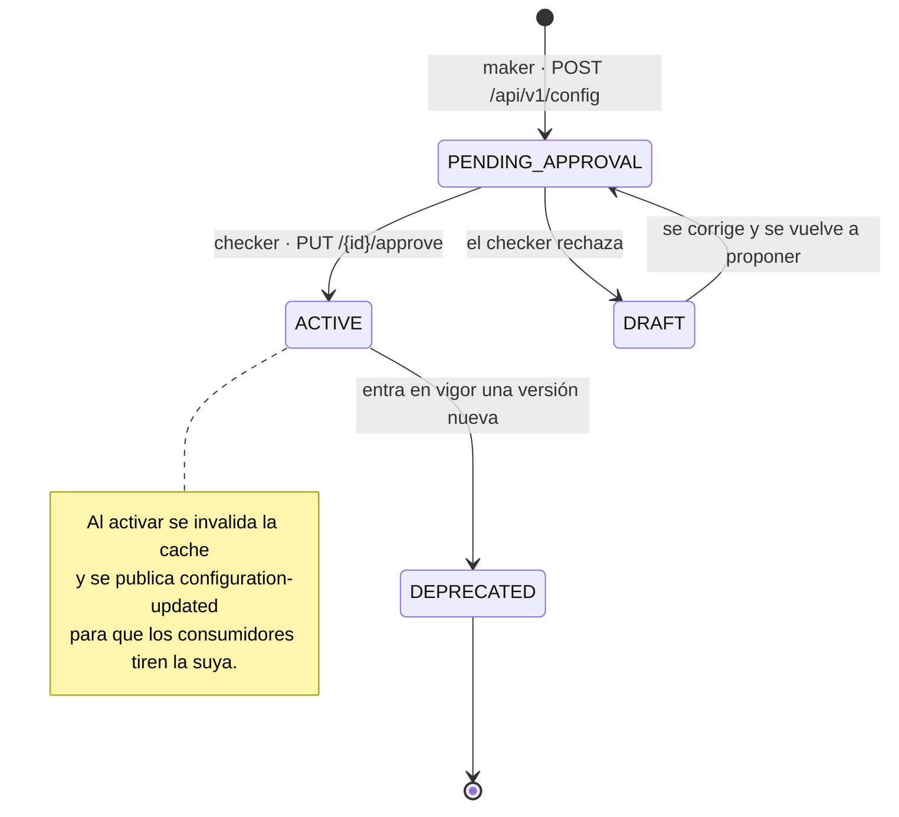

# configuration-service (T5)

**Repositorio central de parámetros de negocio versionados.** Los dominios leen de aquí en vez de
hardcodear tasas, comisiones o reglas que pueden cambiar por producto, canal, regulación o decisión
comercial.

Los parámetros siguen un ciclo **maker-checker**: quien los propone (*maker*) los deja en
`PENDING_APPROVAL`; quien los aprueba (*checker*) los activa. Un parámetro activo **nunca se
borra** — se depreca solo cuando entra en vigor una versión nueva.

| | |
|---|---|
| **Puerto** | `8086` (bootRun) · `:8080` interno en Docker |
| **Schema** | `configuration` |
| **Arquitectura** | Hexagonal + Spring Modulith |
| **Régimen Kafka** | Sólo produce (no consume) |
| **Dominio** | [docs/dominios/T5_configuration.md](../../docs/dominios/T5_configuration.md) |

---

## Mapa del servicio



### Ciclo de vida de un parámetro



**Quien propone no aprueba.** Un parámetro de configuración mueve tasas y comisiones de toda la
cartera: separar *maker* y *checker* es la misma razón por la que un convenio de cobranza necesita
la autorización de un supervisor.

---

---

## Endpoints

Puerto: **8086**. Todos requieren Bearer JWT (emitido por `identity-service`).

| Método | Path | Auth | Status | Descripción |
|---|---|---|---|---|
| `GET` | `/api/v1/config/{key}` | Bearer | 200 / 404 | Leer parámetro ACTIVE con cache Redis |
| `POST` | `/api/v1/config` | Bearer | 201 | Crear parámetro (maker) → PENDING_APPROVAL |
| `PUT` | `/api/v1/config/{id}/approve` | Bearer | 200 / 404 / 422 | Aprobar parámetro (checker) → ACTIVE |
| `GET` | `/api/v1/config/{key}/history` | Bearer | 200 | Historial de versiones del parámetro |

### GET `/api/v1/config/{key}` — Response 200

```json
{
  "id":                 "uuid",
  "paramKey":           "vat_rate",
  "value":              "0.16",
  "productType":        null,
  "channelType":        null,
  "version":            1,
  "status":             "ACTIVE",
  "effectiveDate":      "2026-06-04",
  "createdBy":          "uuid-maker",
  "approvedBy":         "uuid-checker",
  "previousVersionRef": null,
  "createdAt":          "2026-06-04T17:00:00Z",
  "updatedAt":          "2026-06-04T17:05:00Z"
}
```

Query params opcionales: `productType`, `channelType` (segmentación por producto/canal).

### POST `/api/v1/config` — Request

```json
{
  "paramKey":      "grace_period_days",
  "value":         "5",
  "productType":   "PERSONAL_LOAN",
  "channelType":   null,
  "effectiveDate": "2026-07-01"
}
```

Response 201 con el parámetro en estado `PENDING_APPROVAL`.

---

## Kafka — Evento publicado

**Topic:** `configuration.configuration-updated`
**Key:** `paramKey`

```json
{
  "key":           "vat_rate",
  "newValue":      "0.18",
  "effectiveDate": "2026-07-01",
  "productType":   "",
  "channelType":   ""
}
```

Los consumidores deben usar este evento para invalidar su cache local del parámetro. Los dominios que deben suscribirse: D1 (Channels), D2 (Scoring), D3 (Origination), D4 (CreditProduct), D5 (Charges), D6 (Payments), D8 (Collections).

---

## Cache

Los parámetros activos se cachean en Redis con TTL configurable (default 300 s). La clave de cache es `{paramKey}:{productType}:{channelType}`.

Al aprobar un parámetro, se invalida **toda** la cache del servicio (`allEntries = true`) para cubrir todos los segmentos del mismo key.

El cache solo se activa cuando `spring.cache.type=redis` (default en producción). En pruebas se usa `spring.cache.type=none`.

---

## Base de datos

Schema PostgreSQL: **`configuration`**. Liquibase gestiona las migraciones al arrancar.

### `configuration.config_parameters`

| Columna | Tipo | Descripción |
|---|---|---|
| `id` | UUID PK | Generado al crear |
| `param_key` | VARCHAR(100) | Clave del parámetro (ej. `vat_rate`) |
| `value` | TEXT | Valor como string. El dominio consumidor interpreta el tipo. |
| `product_type` | VARCHAR(50) nullable | Segmentación por tipo de producto |
| `channel_type` | VARCHAR(50) nullable | Segmentación por canal |
| `version` | INT | Versión incremental por `param_key` |
| `status` | VARCHAR(30) | `DRAFT \| PENDING_APPROVAL \| ACTIVE \| DEPRECATED` |
| `effective_date` | DATE nullable | Fecha de vigencia del parámetro |
| `created_by` | UUID | UUID del actor maker |
| `approved_by` | UUID nullable | UUID del actor checker. Null hasta aprobación. |
| `previous_version_ref` | UUID nullable | Referencia a la versión anterior |
| `created_at` | TIMESTAMPTZ | Inmutable |
| `updated_at` | TIMESTAMPTZ | Última modificación de estado |

**Índice único parcial:** solo puede existir un parámetro `ACTIVE` por `(param_key, product_type, channel_type)`.

### `configuration.config_audit_trail`

| Columna | Tipo | Descripción |
|---|---|---|
| `id` | UUID PK | |
| `parameter_id` | UUID FK | Referencia a `config_parameters` |
| `action` | VARCHAR(30) | `CREATED \| APPROVED \| REJECTED \| DEPRECATED` |
| `actor_id` | UUID | Quién realizó la acción |
| `timestamp` | TIMESTAMPTZ | Momento exacto de la acción |
| `old_value` | TEXT nullable | Valor anterior (en aprobaciones/deprecaciones) |
| `new_value` | TEXT nullable | Valor nuevo |

### Parámetros semilla (migración 005)

| Clave | Valor | Descripción |
|---|---|---|
| `vat_rate` | `0.16` | IVA — 16% (CF-04: cambio requiere nivel DIRECTIVO) |
| `grace_period_days` | `3` | Días de gracia antes de mora (PERSONAL_LOAN) |
| `return_window_hours` | `72` | Ventana de devolución de pagos |
| `max_contact_attempts_per_day` | `3` | Límite regulatorio CONDUSEF |
| `contact_allowed_hours` | `08:00-20:00` | Horario de contacto CONDUSEF |
| `score_validity_days` | `30` | Validez del score (INDIVIDUAL) |
| `codi_token_ttl_minutes` | `5` | TTL del token CoDi |

---

## Variables de entorno

| Variable | Default | Descripción |
|---|---|---|
| `JWT_SECRET` | `change-me-...` | **Requerido en prod.** Secreto HMAC-SHA256 en Base64 |
| `SPRING_DATASOURCE_URL` | `jdbc:postgresql://localhost:5432/fintech` | URL JDBC |
| `SPRING_DATASOURCE_USERNAME` | `fintech` | Usuario PostgreSQL |
| `SPRING_DATASOURCE_PASSWORD` | `fintech` | Contraseña PostgreSQL |
| `REDIS_HOST` | `localhost` | Host Redis |
| `REDIS_PORT` | `6379` | Puerto Redis |
| `KAFKA_BOOTSTRAP_SERVERS` | `localhost:9092` | Brokers Kafka |
| `CONFIG_CACHE_TTL_SECONDS` | `300` | TTL del cache de parámetros activos |
| `SERVER_PORT` | `8086` | Puerto HTTP |
| `CONFIGURATION_PORT` | `8086` | Puerto expuesto en Docker Compose |

---

## Tests

| Clase | Tipo | Casos |
|---|---|---|
| `ConfigurationServiceTest` | Unit (Mockito) | 8: create, increment version, approve+event, deprecate prev active, approve notFound, invalid transition, getHistory, getActive empty |
| `ConfigControllerTest` | @WebMvcTest | 8: GET 200/404, noToken 401, POST 201/400, PUT 200/404, history 200 |
| `ConfigurationAcceptanceTest` | Testcontainers | 5: AC-1..5 seed+CRUD completo |

```bash
./gradlew :configuration-service:test
```

**Resultado:** 21 tests · 0 fallos · 0 skipped

---

## Correr localmente

**Prerequisitos:** Java 21, Docker.

```bash
# 1. Infraestructura
docker compose up postgres redis kafka zookeeper -d

# 2. Servicio
./gradlew :configuration-service:bootRun
```

Inicia en `http://localhost:8086`.
Swagger UI: `http://localhost:8086/swagger-ui.html`

### Con Docker

```bash
docker build --build-arg SERVICE=configuration-service -t fintech/configuration-service .
docker compose --profile configuration-service up -d
```

---

## Swagger / OpenAPI

| Recurso | URL |
|---|---|
| Swagger UI | `http://localhost:8086/swagger-ui.html` |
| OpenAPI JSON | `http://localhost:8086/v3/api-docs` |
| Actuator health | `http://localhost:8086/actuator/health` |

---

## Notas de diseño

- **Maker ≠ Checker**: el mismo actor no debería aprobar un parámetro que él mismo creó. Esta restricción es de negocio — el servicio no la impone técnicamente (TODO: validación opcional).
- **Kafka failure no revierte**: si la publicación de `configuration-updated` falla al aprobar, el parámetro queda `ACTIVE` de todas formas. Los dominios consumidores verán la actualización en su próxima lectura (cache miss).
- **Historial regulatorio**: los parámetros nunca se borran. La migración 003-audit-trail + el historial permiten reconstruir qué valor estaba vigente en cualquier fecha pasada (CNBV, retención 7 años).


