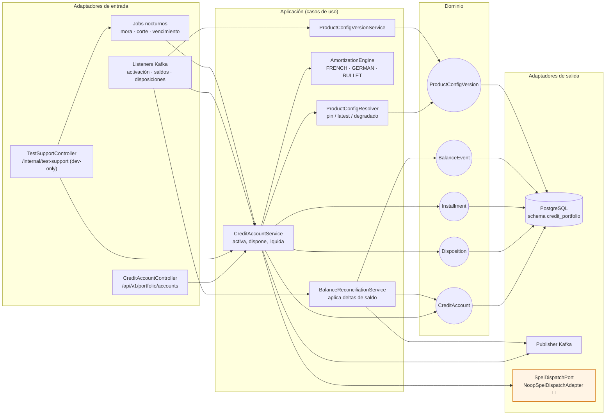
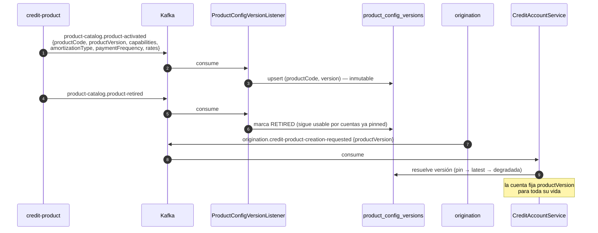
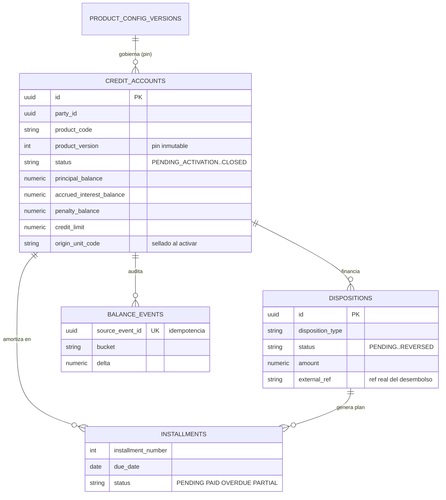
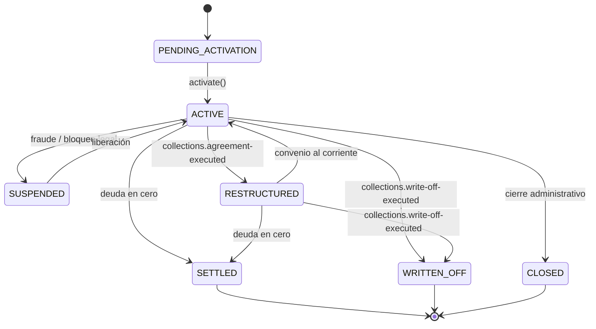
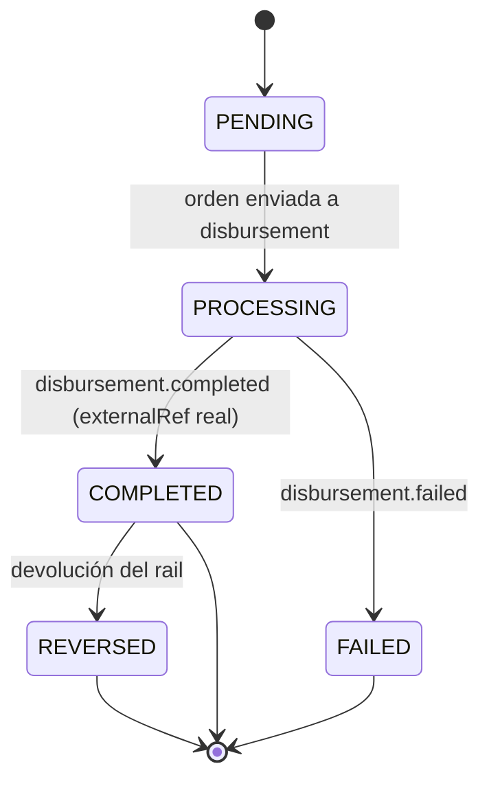
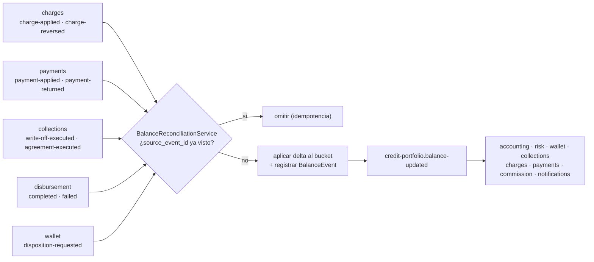
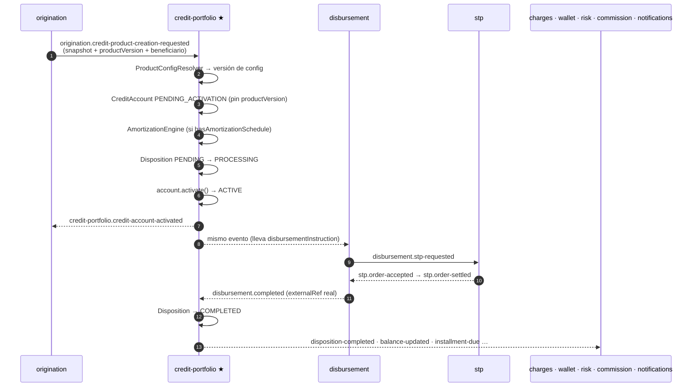
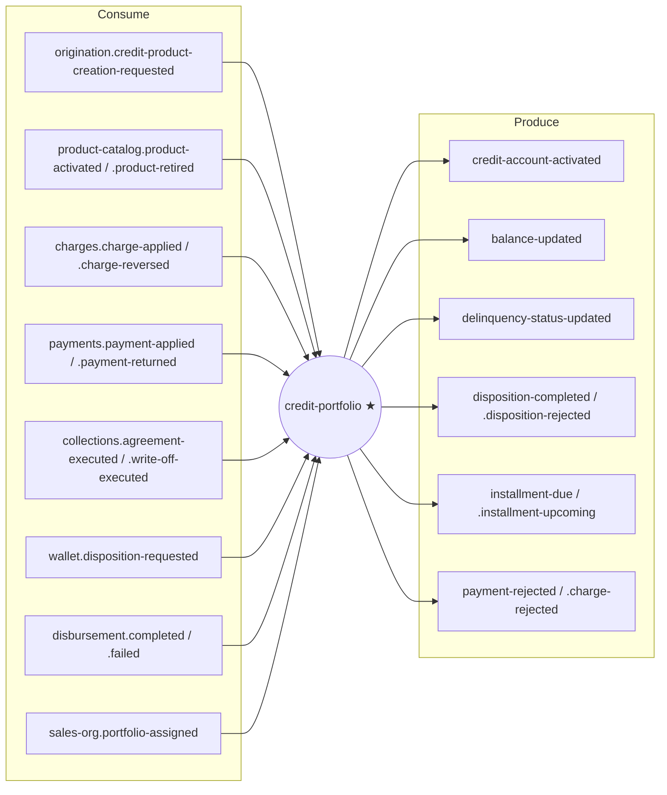

# credit-portfolio-service ★ (D4★)

**El corazón del core crediticio.** Única fuente de verdad de los saldos y dueño de la cuenta de
crédito viva: desde que se activa hasta que se liquida, se quebranta o se cierra. Es un **motor
config-driven**: lo que hace con una cuenta lo decide la configuración versionada del producto, no
una cadena de `if (productType == …)`.

> **No confundir con [credit-product-service](../credit-product-service/README.md) (D4).**
> credit-product define **qué es** un producto (catálogo, tasas, reglas de elegibilidad).
> credit-portfolio administra **las cuentas que ya existen** (saldos, disposiciones, amortización, mora).

| | |
|---|---|
| **Puerto** | `8087` (bootRun) · `:8080` interno en Docker |
| **Schema** | `credit_portfolio` |
| **Arquitectura** | Hexagonal + Spring Modulith |
| **Régimen Kafka** | Por defecto (sin DLT) — ver [README raíz §5.4](../../README.md#54-política-de-reintentos-y-dlt-kafka) |
| **Dominio** | [docs/dominios/04b_credit_portfolio_domain.md](../../docs/dominios/04b_credit_portfolio_domain.md) |

---

## 1. Mapa del servicio



🧪 = adaptador simulado en local. Ver [§7](#7-dependencias-externas-y-sus-simuladores-locales).

---

## 2. Modelo de configuración: propagación versionada

La config del producto **no se congela como copia** dentro de cada cuenta: se **propaga** desde
credit-product como versiones inmutables, y cada cuenta **fija** (`pin`) la versión con la que fue
originada. Es la aplicación de ADR-001 (read models locales, cero llamadas REST cross-dominio).



- Un cambio de configuración es una **versión nueva**; no toca las cuentas existentes.
- **Fallback degradado**: si la versión aún no propagó al momento de activar, se materializa una
  config degradada desde el snapshot de origination y se reconcilia (*clear degraded*) cuando llega
  el evento autoritativo. Se prefiere una cuenta activa marcada como degradada a una activación
  perdida.

### Motor por *capabilities*, no por `productType`

| Capability | Gobierna |
|---|---|
| `hasAmortizationSchedule` | Genera tabla de amortización al desembolsar |
| `hasCreditLimit` · `allowsMultipleDispositions` | Lógica revolvente (cupo, disposiciones múltiples) |
| `dispositionType` | `SELF_USE` · `THIRD_PARTY_CREDIT` · `PAYROLL` |
| `hasCutoffDate` · `hasMinimumPayment` | Estado de cuenta revolvente |
| `commissionsEnabled` · `requiresBeneficiaryPartyId` | Línea de distribuidor (T6) |

**Amortización config-driven:** métodos `FRENCH` (cuota fija), `GERMAN` (capital fijo) y `BULLET`
(interés periódico + capital al vencimiento), cruzados con frecuencias `WEEKLY` / `BIWEEKLY` / `MONTHLY`.

---

## 3. Dominio

| Agregado | Tabla | Rol |
|---|---|---|
| `CreditAccount` | `credit_accounts` | Cuenta viva: saldos, tasas, estado, CLABE, `product_version` fijada |
| `Disposition` | `dispositions` | Cada desembolso contra la cuenta (`SELF_USE`, `THIRD_PARTY_CREDIT`, `PAYROLL`) |
| `Installment` | `installments` | Renglón de la tabla de amortización |
| `BalanceEvent` | `balance_events` | Auditoría inmutable de cada delta de saldo + llave de idempotencia |
| `ProductConfigVersion` | `product_config_versions` | Read model versionado de la config del producto (capabilities JSONB) |



### Máquina de estados — `CreditAccount`



`SETTLED`, `WRITTEN_OFF` y `CLOSED` son **terminales** (`CreditAccountStatus.isTerminal()`).

### Máquina de estados — `Disposition`



> Una línea revolvente que se paga **no** se liquida: vuelve a quedar disponible. El cierre a
> `SETTLED` sólo aplica cuando el producto no permite disposiciones múltiples.

---

## 4. Balance engine ★

El patrón de ADR-001: **los demás calculan, portfolio aplica.** charges, payments y collections
nunca escriben saldos — emiten hechos. `BalanceReconciliationService` los aplica sobre la fuente de
verdad, los audita en `balance_events` y republica `balance-updated`.

```
totalDebt       = principalBalance + accruedInterestBalance + penaltyBalance
availableCredit = creditLimit − principalBalance − pendingDispositions      [revolventes]

Jerarquía de pago:  1) penaltyBalance → 2) accruedInterestBalance → 3) principalBalance
```



| Evento entrante | Efecto en el saldo |
|---|---|
| `charges.charge-applied` (`ORDINARY_INTEREST`) | `accruedInterestBalance +=` |
| `charges.charge-applied` (mora / comisiones) | `penaltyBalance +=` |
| `charges.charge-reversed` (reversa o condonación) | Revierte del bucket original, nunca por debajo de cero (**CP-02**) |
| `payments.payment-applied` | Reduce en jerarquía; en revolventes libera cupo; evalúa `settleIfClear` |
| `payments.payment-returned` | Restaura la deuda |
| `collections.write-off-executed` | Todos los saldos a cero → `WRITTEN_OFF` (terminal) |
| `collections.agreement-executed` | Reestructura el plan → `RESTRUCTURED` |
| `disbursement.completed` / `.failed` | Cierra la disposición con el `externalRef` real |

> **Idempotencia:** cada evento entrante trae un `eventId`; `balance_events.source_event_id` es
> único. Una reentrega (*at-least-once* de Kafka) se detecta y se descarta.

---

## 5. Flujo de activación y desembolso



---

## 6. API REST

**Base:** `/api/v1/portfolio/accounts` · Swagger local: `http://localhost:8087/swagger-ui.html`

| Método | Ruta | Descripción |
|---|---|---|
| `GET` | `/` | Listado paginado de cuentas |
| `GET` | `/search` | Búsqueda por criterios de cartera |
| `GET` | `/batch` | Resolución en lote por ids (evita N+1 desde los BFF) |
| `GET` | `/{creditAccountId}` | Detalle de la cuenta |
| `GET` | `/{creditAccountId}/amortization-schedule` | Plan de pagos de la cuenta |
| `GET` | `/{creditAccountId}/dispositions` | Disposiciones de la cuenta |
| `GET` | `/{creditAccountId}/dispositions/{dispositionId}/schedule` | Plan de pagos de una disposición |
| `GET` | `/stats` · `/summary` · `/product-mix` | Agregados de cartera |
| `GET` | `/stats/by-origin-unit` | Cartera agrupada por unidad **de origen** (ver §11) |
| `PUT` | `/{creditAccountId}/origin-unit` | Corrige la unidad de origen sellada |

### Endpoints de soporte (dev-only, `/internal/test-support`)

Apagados salvo `TEST_SUPPORT_ENABLED=true`; el gateway **no** enruta `/internal/*`.

| Método | Ruta | Para qué |
|---|---|---|
| `POST` | `/run-delinquency-job` | Recalcular mora sin esperar a las 23:59 |
| `POST` | `/run-upcoming-installment-job` | Disparar el aviso de cuota próxima |
| `POST` | `/run-installment-due-job` | Marcar cuotas vencidas |
| `POST` | `/accounts/{id}/installments/{n}/shift-due-date` | Mover la fecha de una mensualidad |
| `POST` | `/dispositions/{id}/age-schedule` | Envejecer un plan completo |

---

## 7. Dependencias externas y sus simuladores locales

| Dependencia real | Puerto de salida | Adaptador local | Comportamiento simulado |
|---|---|---|---|
| SPEI / BANXICO (camino heredado) | `SpeiDispatchPort` | `NoopSpeiDispatchAdapter` | Confirma el envío al instante y devuelve `SPEI-STUB-XXXXXXXX` |

> Este stub es el **camino heredado**. El camino vivo del dinero es
> `credit-account-activated → disbursement-service → stp-service`, que sí modela la orden, la firma
> y la conciliación (con su propio stub de red, ver [stp-service](../stp-service/README.md)). El
> `externalRef` que termina en la disposición es el **real** que devuelve disbursement, no el del stub.

---

## 8. Eventos Kafka



**Aún no emite** `credit-portfolio.disposition-authorized`: disbursement ya lo consume (camino
wallet `THIRD_PARTY`), pero el emisor es el entregable 2B.2. Hoy el desembolso se dispara sólo
desde `credit-account-activated`.

**Reintentos:** régimen por defecto de la plataforma (`DefaultErrorHandler`, reintento acotado y
*seek-past*; sin DLT). Deserialización tolerante: `USE_TYPE_INFO_HEADERS=false`,
`TRUSTED_PACKAGES=com.fintech.*`.

---

## 9. Jobs programados

| Job | Cron | Qué hace |
|---|---|---|
| `DelinquencyCalculationJob` | `0 59 23 * * *` | Calcula `daysDelinquent` → `delinquency-status-updated` |
| `UpcomingInstallmentJob` | `0 0 0 * * *` | Avisa cuotas por vencer → `installment-upcoming` |
| `InstallmentDueJob` | `0 1 0 * * *` | Marca cuotas vencidas → `installment-due` |

Cada job aísla el fallo **por cuenta**: una cuenta que revienta no detiene el barrido.

---

## 10. Persistencia

Schema `credit_portfolio`, 14 changesets Liquibase bajo `db/changelog/creditportfolio/`
(master YAML + SQL; nunca XML). Tabla adicional `event_publication` — outbox de Spring Modulith.

---

## 11. Cartera por unidad de origen

`GET /api/v1/portfolio/accounts/stats/by-origin-unit?unitCodes=E_PAC_1,S_PUE`

Agrupa por `origin_unit_code`: **la unidad que colocó el crédito, sellada al activarlo**. No cambia
aunque la cartera se reasigne — es la decisión del changeset 013, tomada para que la balanza de
marzo siga dando lo mismo en agosto.

**No es lo mismo que «la unidad del ejecutivo que lleva hoy al cliente».** Ésa la responde el
rollup comercial del BFF (`/dashboard/commercial`). Son dos preguntas distintas sobre la misma
cartera: mientras nada se reasigne coinciden, y en cuanto se reasigne una cartera dejarán de
hacerlo. Por eso viajan por endpoints separados y el cuerpo declara su `attribution`.

Devuelve los tres tramos IFRS-9 sin colapsar (`stage1/2/3`) y **no** una provisión ya calculada: la
escala de pérdida esperada vive en el canal, junto al resto del tablero, y duplicarla aquí
garantizaría que un día las dos se separen.

Las cuentas sin sellar se agrupan bajo `(sin unidad)` en vez de repartirse: un hueco visible se
corrige, uno repartido con una heurística no se detecta.

> **Nota de SQL:** el filtro va en **dos consultas** —con y sin `unitCodes`— y no con
> `(:codes IS NULL OR …)`. Ese truco funciona en JPQL pero en SQL nativo Postgres no infiere el
> tipo de una colección nula: `could not determine data type of parameter $1`.

---

## 11b. Las tres reglas que se corrigieron al verificar contra el stack

### BNPL es una solicitud, no una propiedad del producto

`bnplMaxDeferralDays` es un **tope** —el nombre lo dice— y se usaba como la cifra a aplicar, sin
mirar si alguien lo había pedido. Como `PL-IND-STD-V1` trae BNPL habilitado, **ningún préstamo
personal empezaba a pagar cuando debía**: el plan entero nacía corrido el máximo, para todos.

La regla vive ahora en `OpcionesDePago`, con la configuración: es la configuración quien sabe qué
significa cada uno de sus campos, y tenerla suelta en el servicio fue lo que permitió confundir un
límite con un valor.

- Sin solicitud, no hay BNPL. Nulo y cero significan lo mismo: nadie lo pidió.
- Un producto que no lo admite **ignora** la solicitud, no la aplica a la fuerza.
- Pedir de más se **recorta** al tope: el producto ya declaró hasta dónde espera, y negar el alta
  entera por pedir de más convierte un límite en un obstáculo.

Verificado vivo: el que no pide paga a **30 días**; el que pide 30 paga a **61** —treinta más un
período—, que es la regla del plan escrita tal cual.

### 🔴 Un crédito no puede estar bajo dos apoyos a la vez

La guarda que existía era **por programa**: impedía reotorgar el mismo lote dos veces. No impedía lo
que pasó de verdad — dos programas **distintos**, cada uno autorizado a diferir tres períodos,
alcanzando la misma cartera. Cuarenta y dos cuentas recibieron los dos y se les corrió el
vencimiento **seis meses**: el doble de lo que nadie autorizó, sin más rastro que dos filas de
inscripción.

Ninguno de los dos programas era incorrecto por separado. **El invariante no es de programa sino de
cuenta.** Si hace falta extender el apoyo se otorga un programa con más períodos, no uno encima de
otro.

El padrón declara ahora `yaApoyadas` junto a `cuentasElegibles`: con sólo «0 elegibles» no se
distingue «el criterio no alcanza a nadie» de «toda esa cartera ya viene de otro programa», y quien
firma necesita esa diferencia **antes** de firmar.

### Las configuraciones de producto se contradicen entre sí, y ahora se dice

Un producto no se configura campo a campo: los campos **se condicionan entre sí**, y una combinación
puede ser inválida sin que ninguno de sus valores lo sea. `OpcionesDePago.incoherencias()` devuelve
cada contradicción con su frase — plazos de diferimiento en un producto que no difiere, huecos o
solapes entre bandas de tasa, un modo de salto declarado sobre un salto apagado, BNPL de cero días.

Cartera **avisa y guarda igual**. Rechazar aquí dejaría al catálogo y a la cartera discrepando, que
es el problema que esto viene a evitar. Con el `WARN`, el día que alguien pregunte «por qué este
producto no deja saltar pagos si el catálogo dice que sí», la respuesta está en el log del arranque
y no en una tarde de bisección.

## 12. Configuración

| Variable | Default | En producción |
|---|---|---|
| `SERVER_PORT` | `8087` | `8080` en Docker |
| `JWT_SECRET` | *(vacío — el filtro se omite si no se configura)* | Obligatorio, compartido con identity |
| `KAFKA_BOOTSTRAP_SERVERS` | `localhost:9092` | Obligatorio |
| `SPRING_DATASOURCE_URL` | `jdbc:postgresql://localhost:5432/fintech` | Obligatorio |
| `SPRING_DATASOURCE_USERNAME` / `_PASSWORD` | `fintech` / `fintech` | Obligatorio |
| `TEST_SUPPORT_ENABLED` | `false` | **Debe quedar en `false`** |

---

## 13. Tests y ejecución local

| Clase | Tipo | Cubre |
|---|---|---|
| `CreditAccountBalanceTest` | Unit | Jerarquía de pago, devengo, reversa, quebranto, cupo revolvente, guards |
| `BalanceReconciliationServiceTest` | Unit | Routing por evento, idempotencia, publicación |
| `AmortizationStrategyTest` | Unit | GERMAN/BULLET/FRENCH × frecuencias |
| `AmortizationEngineTest` | Unit | Plan FRENCH base |
| `CreditAccountServiceTest` | Unit | Activación config-driven |
| `ProductConfigVersionServiceTest` · `ProductConfigResolverTest` | Unit | Upsert/retire/degradado · pin/latest/fallback |
| `DelinquencyCalculationJobTest` · `InstallmentDueJobTest` | Unit | Barridos nocturnos y aislamiento de fallo |
| `CreditAccountActivationFlowIT` | Testcontainers + Kafka | Snapshot → ACTIVE + propagación de config |
| `BalanceReconciliationFlowIT` | Testcontainers + Kafka | Charge/payment → saldo + idempotencia |

```bash
./gradlew :credit-portfolio-service:test

# Local sin Docker
docker compose up -d postgres kafka zookeeper
./gradlew :credit-portfolio-service:bootRun     # → http://localhost:8087

# En el stack
docker compose up -d credit-portfolio-service
```

> **Testcontainers determinista:** el build fija `DOCKER_HOST=unix:///var/run/docker.sock` y
> `TESTCONTAINERS_DOCKER_SOCKET_OVERRIDE` para no depender de un `docker.host` obsoleto en
> `~/.testcontainers.properties`. Ver [README raíz §12](../../README.md#12-tests).
