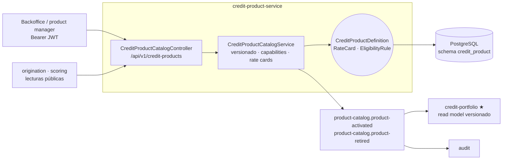
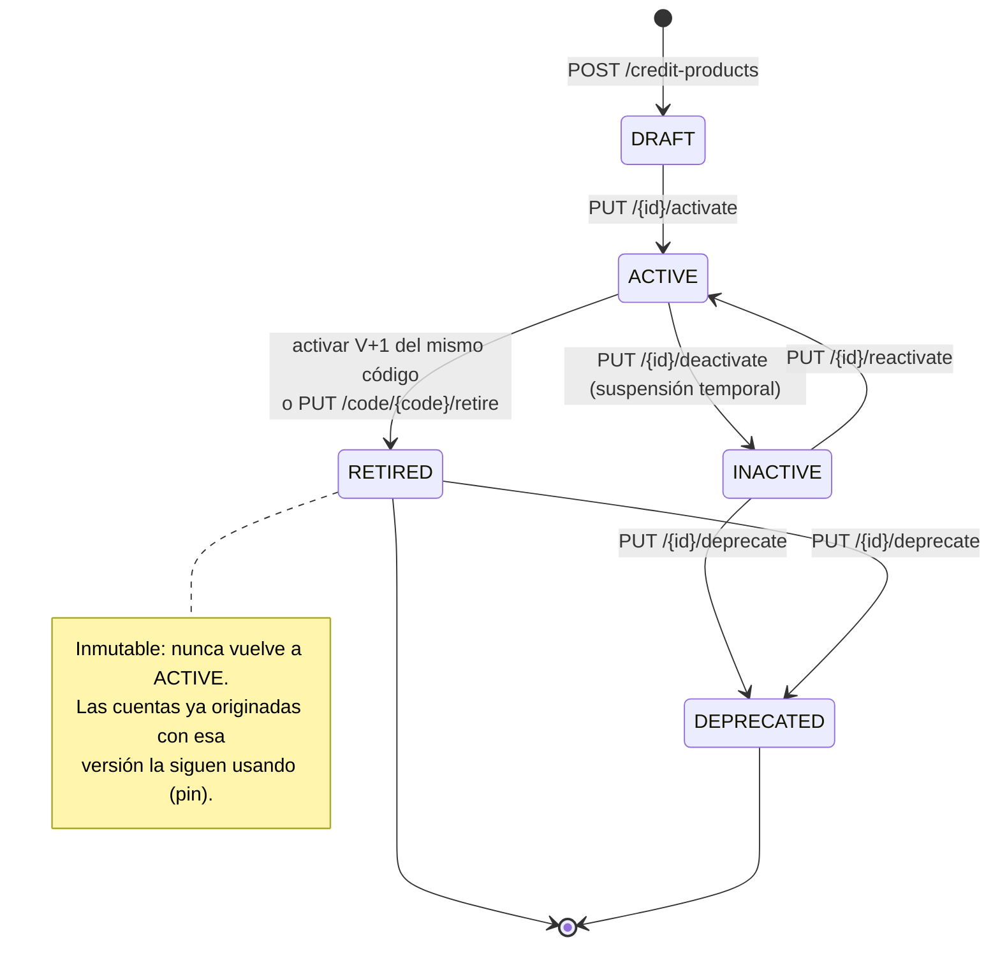
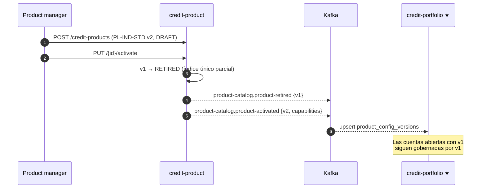

# credit-product-service (D4)

**Catálogo versionado de productos de crédito.** Define qué productos existen, cómo se comportan y
a qué segmento atienden. **No administra cuentas ni saldos** — eso es
[credit-portfolio-service](../credit-portfolio-service/README.md).

| | |
|---|---|
| **Puerto** | `8084` (bootRun) · `:8080` interno en Docker |
| **Schema** | `credit_product` |
| **Arquitectura** | Hexagonal + Spring Modulith |
| **Régimen Kafka** | Sólo produce (no consume eventos) |
| **Dominio** | [docs/dominios/04_credit_product_domain.md](../../docs/dominios/04_credit_product_domain.md) |

## Mapa del servicio



Es el único servicio de dominio que **se lee por REST desde otro servicio de dominio**: origination
necesita la definición viva para armar la oferta y calcular el CAT. Todo lo demás viaja por evento.

---

## Qué hace este servicio

| Responsabilidad | Detalle |
|---|---|
| **Catálogo versionado** | Cada productCode puede tener N versiones históricas; solo UNA ACTIVE a la vez |
| **Capabilities JSONB** | Matriz de capacidades por definición → governa el motor de credit-portfolio sin código |
| **Rate cards** | Precios por bandas (tier de riesgo, tramo de monto, plazo) — B2C, B2B, B2B2C |
| **Eligibility rules** | Restricciones por producto evaluadas en origination antes de admitir una aplicación |
| **Eventos Kafka** | Publica `product-catalog.product-activated` / `product-catalog.product-retired` |
| **Seguridad JWT** | GETs públicos (origination lee sin token); mutations requieren Bearer |

---

## Tipos de producto y audiencias

| ProductType | Behavior | Audiencia típica | DispositionType |
|---|---|---|---|
| `PERSONAL_LOAN` | INSTALLMENT | B2C | SELF_USE |
| `PAYROLL_LOAN` | INSTALLMENT | B2C | PAYROLL |
| `GROUP_LOAN` | INSTALLMENT | B2C | SELF_USE |
| `MICRO_LOAN` | INSTALLMENT | B2C | SELF_USE |
| `CREDIT_CARD` | REVOLVING | B2C | SELF_USE |
| `REVOLVING_LINE` | REVOLVING | B2C | SELF_USE |
| `DISTRIBUTOR_LINE` | REVOLVING | B2B2C | THIRD_PARTY_CREDIT |
| `SME_LOAN` | INSTALLMENT | **B2B** | SELF_USE |
| `BUSINESS_REVOLVING_LINE` | REVOLVING | **B2B** | SELF_USE |

**AmortizationType:** `FRENCH` · `GERMAN` · `BULLET` (solo INSTALLMENT)  
**PaymentFrequency:** `WEEKLY` · `BIWEEKLY` · `MONTHLY`  
**ApprovalFlow:** `AUTOMATIC` · `MANUAL` · `COMMITTEE`  
**TargetAudience:** `B2C` · `B2B2C` · `B2B`

---

## Capabilities JSONB

Cada definición lleva una matriz de capacidades que gobierna el motor de `credit-portfolio` sin cambios de código:

```json
{
  "hasAmortizationSchedule": true,
  "hasCreditLimit": false,
  "allowsMultipleDispositions": false,
  "dispositionType": "SELF_USE",
  "hasCutoffDate": false,
  "hasMinimumPayment": false,
  "allowsMultipleObligors": false,
  "commissionsEnabled": false,
  "requiresBeneficiaryPartyId": false
}
```

Si no se envían en el `POST`, se derivan automáticamente del `productType`. Se pueden sobrescribir para configuraciones no estándar.

---

## Rate cards — precios por banda

Permite tasas diferenciadas sin hardcodear por código. Cada fila aplica cuando **todos** los campos no nulos del registro coinciden con la solicitud. La fila más específica (mayor número de bandas definidas) gana.

```json
// Ejemplos de rate cards
[
  { "tierBand": "T1", "nominalRate": 0.28, "moratoriumRate": 0.50 },
  { "tierBand": "T2", "nominalRate": 0.32, "moratoriumRate": 0.55 },
  { "minAmount": 50000, "maxAmount": 500000, "nominalRate": 0.26, "moratoriumRate": 0.42 }
]
```

Si ningún rate card coincide, se usa la tasa plana `nominalRateAnnual` / `moratoriumRateAnnual` de la definición.

---

## Eligibility rules — restricciones por producto

```json
[
  { "ruleType": "REQUIRED_PARTY_TYPE", "stringValue": "BUSINESS", "errorCode": "ELIG_PARTY_TYPE" },
  { "ruleType": "MAX_DEBT_TO_INCOME_RATIO", "operator": "LTE", "thresholdValue": 0.50, "errorCode": "ELIG_DTI" },
  { "ruleType": "MIN_SCORE", "operator": "GTE", "thresholdValue": 300, "errorCode": "ELIG_SCORE" }
]
```

**Tipos disponibles:** `MIN_AGE` · `MAX_AGE` · `MIN_SCORE` · `MAX_EXISTING_ACTIVE_CREDITS` · `MIN_MONTHLY_INCOME` · `MAX_DEBT_TO_INCOME_RATIO` · `REQUIRED_PARTY_TYPE` · `MIN_SENIORITY_MONTHS` · `MIN_GROUP_MEMBERS` · `MAX_GROUP_MEMBERS`

---

## Amount step — montos en múltiplos limpios

Campo `amountStep` (entero, opcional) que define el incremento mínimo de monto o línea:

| Producto | `amountStep` | Montos disponibles |
|---|---|---|
| PERSONAL_LOAN | 1000 | $5k, $6k, $7k, …, $150k |
| PAYROLL_LOAN | 500 | $5k, $5.5k, $6k, …, $100k |
| GROUP_LOAN | 500 | $5k, $5.5k, $6k, …, $50k |
| REVOLVING_LINE | 1000 | líneas: $5k, $6k, …, $50k |
| CREDIT_CARD | 1000 | líneas: $3k, $4k, …, $80k |
| MICRO_LOAN | 500 | $500, $1k, $1.5k, …, $10k |
| DISTRIBUTOR_LINE | 5000 | líneas: $100k, $105k, …, $5M |
| SME_LOAN | 5000 | $50k, $55k, $60k, …, $5M |
| BUSINESS_REVOLVING_LINE | 10000 | líneas: $100k, $110k, …, $10M |

Si `amountStep` es null → sin restricción (acepta cualquier monto).

**Uso desde origination:** antes de presentar la oferta, validar con `isValidAmount(amount)` y redondear con `roundDownToStep(amount)`.

---

## Versionado (PD-01 / PD-02)

- `productCode` es la clave de negocio estable (ej. `PL-IND-STD`)
- `productVersion` incrementa con cada nueva definición del mismo código
- Solo puede haber **una versión ACTIVE por productCode** (índice único parcial `WHERE status='ACTIVE'`)
- Al activar V2 del mismo código, V1 pasa automáticamente a `RETIRED`
- Historial completo disponible en `GET /code/{code}/versions`

**Ciclo de vida de una definición:**



**Propagación de una versión nueva:**



---

## API REST

**Base:** `/api/v1/credit-products` · Swagger: `http://localhost:8084/swagger-ui.html`

### Seguridad

| Operación | Auth |
|---|---|
| `GET /**` | Público (origination, scoring leen sin token) |
| `POST` / `PUT` | Bearer JWT (ROLE_ADMIN — backoffice / product manager) |

### Endpoints

| Método | Path | Descripción |
|---|---|---|
| `POST` | `/` | Crear nueva versión (DRAFT) |
| `GET` | `/` | Listar versiones ACTIVE; filtros: `?productType=` `?targetAudience=` |
| `GET` | `/{id}` | Por UUID — incluye rate cards y eligibility rules |
| `GET` | `/code/{code}` | Versión ACTIVE de un productCode |
| `GET` | `/code/{code}/versions` | Historial de versiones (desc) |
| `GET` | `/{id}/rate-cards` | Rate cards de una definición |
| `GET` | `/{id}/eligibility-rules` | Eligibility rules de una definición |
| `PUT` | `/{id}/activate` | DRAFT → ACTIVE (retira versión ACTIVE anterior) |
| `PUT` | `/{id}/deactivate` | ACTIVE → INACTIVE |
| `PUT` | `/{id}/reactivate` | INACTIVE → ACTIVE |
| `PUT` | `/{id}/deprecate` | INACTIVE/RETIRED → DEPRECATED |
| `PUT` | `/code/{code}/retire` | Retira la versión ACTIVE del código |

### Request — crear producto

```json
{
  "productCode": "SME-LOAN-STD",
  "productType": "SME_LOAN",
  "name": "Crédito PYME Estándar",
  "targetAudience": "B2B",
  "currency": "MXN",
  "nominalRateAnnual": 0.2400,
  "moratoriumRateAnnual": 0.4000,
  "minTerm": 6, "maxTerm": 48, "defaultTerm": 24,
  "minAmount": 50000, "maxAmount": 5000000,
  "amortizationType": "FRENCH",
  "defaultPaymentFrequency": "MONTHLY",
  "allowedPaymentFrequencies": ["MONTHLY", "BIWEEKLY"],
  "minApprovalScore": 300,
  "defaultApprovalFlow": "COMMITTEE",
  "openingFeeRate": 0.0150,
  "prepaymentFeeRate": 0.0300,
  "eligiblePartyTypes": ["BUSINESS"],
  "requiredDocuments": [
    { "documentType": "TAX_RETURN", "mandatory": true },
    { "documentType": "BANK_STATEMENT_3M", "mandatory": true }
  ],
  "channelAvailabilities": ["BRANCH", "API_PARTNER"],
  "capabilities": null,
  "rateCards": [
    { "minAmount": 50000, "maxAmount": 500000, "nominalRate": 0.26, "moratoriumRate": 0.42 },
    { "minAmount": 500000.01, "maxAmount": 5000000, "nominalRate": 0.20, "moratoriumRate": 0.38 }
  ],
  "eligibilityRules": [
    { "ruleType": "REQUIRED_PARTY_TYPE", "stringValue": "BUSINESS", "errorCode": "ELIG_SME_PARTY" },
    { "ruleType": "MAX_DEBT_TO_INCOME_RATIO", "operator": "LTE", "thresholdValue": 0.50, "errorCode": "ELIG_SME_DTI" }
  ]
}
```

---

## Eventos Kafka

Este servicio **sólo produce**; no tiene ningún `@KafkaListener`.

| Tópico | Cuándo | Key | Consumidores verificados |
|---|---|---|---|
| `product-catalog.product-activated` | Al activar una versión | `productCode` | credit-portfolio, audit |
| `product-catalog.product-retired` | Al retirar la versión anterior | `productCode` | credit-portfolio, audit |

Payload `product-activated`:
```json
{
  "productDefinitionId": "uuid",
  "productCode": "PL-IND-STD",
  "productVersion": 2,
  "productType": "PERSONAL_LOAN",
  "behavior": "INSTALLMENT",
  "targetAudience": "B2C",
  "nominalRateAnnual": 0.30,
  "moratoriumRateAnnual": 0.52,
  "capabilities": { ... },
  "activatedAt": "2026-06-08T10:00:00Z"
}
```

---

## Guía de configuración por producto

Receta de configuración para los 4 grupos de producto soportados. Cada bloque indica el `productType`, el `behavior` que deriva, las **capabilities** que deben quedar fijas, y los campos que un product manager ajusta (tasa, montos, plazos, rate cards, reglas). Todos los productos comparten el mismo `POST /api/v1/credit-products` — lo que cambia es la combinación de campos.

> **Regla de oro:** el `behavior` (INSTALLMENT vs REVOLVING) determina qué campos aplican.
> - **INSTALLMENT** → usa `minTerm/maxTerm/defaultTerm` + `minAmount/maxAmount` + `amortizationType`. Los campos `*CreditLine` van **null**.
> - **REVOLVING** → usa `defaultCreditLine/minCreditLine/maxCreditLine`. Los campos `*Term`, `*Amount` y `amortizationType` van **null**.

---

### 1 · Tarjeta de Crédito — `CREDIT_CARD`

Revolvente B2C con línea asignada al activar, fecha de corte y pago mínimo. Sin amortización.

| Campo | Valor | Nota |
|---|---|---|
| `productType` | `CREDIT_CARD` | → behavior REVOLVING |
| `targetAudience` | `B2C` | persona física |
| `eligiblePartyTypes` | `["INDIVIDUAL"]` | |
| `defaultCreditLine` / `minCreditLine` / `maxCreditLine` | ej. 10000 / 3000 / 80000 | **obligatorio** en REVOLVING |
| `minTerm` / `maxTerm` / `minAmount` / `maxAmount` / `amortizationType` | `null` | no aplican |
| `defaultPaymentFrequency` | `MONTHLY` | estado de cuenta mensual |
| `defaultApprovalFlow` | `AUTOMATIC` | |
| **capabilities** | `hasCreditLimit:true`, `allowsMultipleDispositions:true`, `hasCutoffDate:true`, `hasMinimumPayment:true`, `hasAmortizationSchedule:false`, `dispositionType:"SELF_USE"` | matriz revolvente |

Documentos típicos: `INCOME_PROOF`, `ADDRESS_PROOF`. Canales: `WEB`, `MOBILE_APP`, `BRANCH`.
Seed de referencia: `CC-IND-STD-V1` ([008-seed-credit-card-micro-loan.sql](src/main/resources/db/changelog/creditproduct/008-seed-credit-card-micro-loan.sql)).

---

### 2 · Línea de Crédito — `REVOLVING_LINE` · `DISTRIBUTOR_LINE` · `BUSINESS_REVOLVING_LINE`

Las tres son revolventes; lo que cambia es **quién dispone** (`dispositionType`) y **a quién** (audiencia + beneficiario). Es la decisión clave de configuración:

| Variante | productType | Audiencia | dispositionType | requiresBeneficiaryPartyId | eligiblePartyTypes | Caso |
|---|---|---|---|---|---|---|
| **Personal (no-distributor)** | `REVOLVING_LINE` | `B2C` | `SELF_USE` | `false` | `["INDIVIDUAL"]` | El titular usa su propia línea |
| **Distribuidora (B2B2C)** | `DISTRIBUTOR_LINE` | `B2B2C` | `THIRD_PARTY_CREDIT` | **`true`** | `["DISTRIBUTOR"]` | El distribuidor es el obligor; los créditos fluyen a terceros beneficiarios |
| **Empresarial (B2B)** | `BUSINESS_REVOLVING_LINE` | `B2B` | `SELF_USE` | `false` | `["BUSINESS"]` | Empresa dispone su propia línea (capital de trabajo) |

Campos comunes a las tres (REVOLVING):
- `defaultCreditLine/minCreditLine/maxCreditLine` **obligatorios**; `*Term`, `*Amount`, `amortizationType` → `null`.
- `defaultPaymentFrequency: "MONTHLY"`.
- capabilities revolventes: `hasCreditLimit:true`, `allowsMultipleDispositions:true`, `hasCutoffDate:true`, `hasMinimumPayment:true`, `hasAmortizationSchedule:false`.

Diferencias de configuración por variante:

```jsonc
// B2C personal — RL-IND-STD-V1
{ "dispositionType": "SELF_USE", "requiresBeneficiaryPartyId": false }
// approvalFlow: AUTOMATIC · línea 5k–50k · sin eligibilityRules duras

// B2B2C distribuidora — DL-DIST-STD-V1
{ "dispositionType": "THIRD_PARTY_CREDIT", "requiresBeneficiaryPartyId": true, "commissionsEnabled": true }
// approvalFlow: COMMITTEE · línea 100k–5M · doc DISTRIBUTOR_AGREEMENT · canal API_PARTNER
// rateCards por monto: $100k–$1M=22%, $1M+=18%

// B2B empresarial — BRL-BUS-STD-V1
{ "dispositionType": "SELF_USE", "requiresBeneficiaryPartyId": false }
// approvalFlow: MANUAL · línea 100k–10M
// eligibilityRules: REQUIRED_PARTY_TYPE=BUSINESS, MAX_DTI LTE 0.60, MIN_SCORE GTE 350
// rateCards por tier: T1=16%, T2=18%, T3=22%
```

Seeds de referencia: `RL-IND-STD-V1` / `DL-DIST-STD-V1` ([006](src/main/resources/db/changelog/creditproduct/006-seed-initial-products.sql)) · `BRL-BUS-STD-V1` ([012](src/main/resources/db/changelog/creditproduct/012-seed-b2b-products.sql)).

---

### 3 · Crédito Personal — `PERSONAL_LOAN`

Plazo fijo B2C, amortización francesa, desembolso SPEI. Es el patrón base INSTALLMENT.

| Campo | Valor | Nota |
|---|---|---|
| `productType` | `PERSONAL_LOAN` | → behavior INSTALLMENT |
| `targetAudience` | `B2C` | |
| `eligiblePartyTypes` | `["INDIVIDUAL"]` | |
| `minAmount` / `maxAmount` | ej. 5000 / 150000 | **obligatorio** en INSTALLMENT |
| `minTerm` / `maxTerm` / `defaultTerm` | ej. 3 / 36 / 12 | en meses |
| `amortizationType` | `FRENCH` | cuotas iguales (o `GERMAN` / `BULLET`) |
| `*CreditLine` | `null` | no aplica |
| `defaultPaymentFrequency` | `MONTHLY` | + `allowedPaymentFrequencies: ["MONTHLY","BIWEEKLY"]` |
| `defaultApprovalFlow` | `AUTOMATIC` | |
| **capabilities** | `hasAmortizationSchedule:true`, `hasCreditLimit:false`, `allowsMultipleDispositions:false`, `dispositionType:"SELF_USE"` | matriz a plazo |

Rate cards por tier de riesgo: `T1=28%`, `T2=32%`, `T3=38%`. Documentos: `INCOME_PROOF`, `ADDRESS_PROOF`.
Seed de referencia: `PL-IND-STD-V1` ([006](src/main/resources/db/changelog/creditproduct/006-seed-initial-products.sql)).

> Variantes INSTALLMENT B2C que reusan este patrón cambiando `dispositionType`/frecuencia: `PAYROLL_LOAN` (dispositionType `PAYROLL`, BIWEEKLY, doc `PAYROLL_STUB`), `MICRO_LOAN` (montos bajos, WEEKLY), `GROUP_LOAN` (`allowsMultipleObligors:true`, GERMAN, reglas `MIN/MAX_GROUP_MEMBERS`).

---

### 4 · Crédito Empresarial — `SME_LOAN`

Préstamo a plazo B2B para PYMEs. Comité de crédito, tasas por tramo de monto, documentación fiscal.

| Campo | Valor | Nota |
|---|---|---|
| `productType` | `SME_LOAN` | → behavior INSTALLMENT |
| `targetAudience` | `B2B` | |
| `eligiblePartyTypes` | `["BUSINESS"]` | |
| `minAmount` / `maxAmount` | ej. 50000 / 5000000 | |
| `minTerm` / `maxTerm` / `defaultTerm` | ej. 6 / 48 / 24 | |
| `amortizationType` | `FRENCH` | |
| `defaultApprovalFlow` | `COMMITTEE` | montos altos → comité |
| `openingFeeRate` / `prepaymentFeeRate` | ej. 0.0150 / 0.0300 | |
| **capabilities** | `hasAmortizationSchedule:true`, `hasCreditLimit:false`, `dispositionType:"SELF_USE"` | igual a INSTALLMENT |
| **rateCards** (por tramo de monto) | $50k–$500k=26% · $500k–$2M=22% · $2M–$5M=18% | deals grandes pagan menos |
| **eligibilityRules** | `REQUIRED_PARTY_TYPE`=BUSINESS · `MAX_DEBT_TO_INCOME_RATIO` LTE 0.50 | límites duros B2B |

Documentos: `BANK_STATEMENT_3M`, `TAX_RETURN`, `BUSINESS_LICENSE`, `FINANCIAL_STATEMENTS`. Canales: `BRANCH`, `API_PARTNER`.
Seed de referencia: `SME-LOAN-STD-V1` ([012](src/main/resources/db/changelog/creditproduct/012-seed-b2b-products.sql)).

---

### Valores válidos (checklist al configurar)

| Campo | Valores permitidos |
|---|---|
| `productType` | `PERSONAL_LOAN` · `PAYROLL_LOAN` · `GROUP_LOAN` · `MICRO_LOAN` · `CREDIT_CARD` · `REVOLVING_LINE` · `DISTRIBUTOR_LINE` · `SME_LOAN` · `BUSINESS_REVOLVING_LINE` |
| `targetAudience` | `B2C` · `B2B2C` · `B2B` |
| `eligiblePartyTypes` | `INDIVIDUAL` · `BUSINESS` · `DISTRIBUTOR` · `GUARANTOR` · `BENEFICIARY` |
| `amortizationType` | `FRENCH` · `GERMAN` · `BULLET` · `null` (REVOLVING) |
| `defaultPaymentFrequency` / `allowedPaymentFrequencies` | `WEEKLY` · `BIWEEKLY` · `MONTHLY` |
| `defaultApprovalFlow` | `AUTOMATIC` · `MANUAL` · `COMMITTEE` |
| `dispositionType` (capability) | `SELF_USE` · `PAYROLL` · `THIRD_PARTY_CREDIT` |
| `nominalRateAnnual` / `moratoriumRateAnnual` | decimal `> 0` y `< 1` (0.32 = 32%) |
| `ruleType` | ver [Eligibility rules](#eligibility-rules--restricciones-por-producto) |

> `documentType` y `channelType` son texto libre (no hay CHECK en BD); usa los valores ya establecidos en los seeds para consistencia: docs (`INCOME_PROOF`, `ADDRESS_PROOF`, `PAYROLL_STUB`, `EMPLOYMENT_LETTER`, `DISTRIBUTOR_AGREEMENT`, `BANK_STATEMENT_3M`, `TAX_RETURN`, `BUSINESS_LICENSE`, `FINANCIAL_STATEMENTS`, `GROUP_CHARTER`, `INE`) y canales (`WEB`, `MOBILE_APP`, `BRANCH`, `API_PARTNER`).

---

## Productos seed (9 ACTIVE al arrancar)

| Código | Tipo | Audiencia | Tasa | Rate cards |
|---|---|---|---|---|
| `PL-IND-STD-V1` | PERSONAL_LOAN | B2C | 32% | T1=28%, T2=32%, T3=38% |
| `RL-IND-STD-V1` | REVOLVING_LINE | B2C | 38% | T1=32%, T2=38% |
| `PY-IND-STD-V1` | PAYROLL_LOAN | B2C | 22% | — |
| `DL-DIST-STD-V1` | DISTRIBUTOR_LINE | B2B2C | 20% | $100k–$1M=22%, $1M+=18% |
| `GL-IND-STD-V1` | GROUP_LOAN | B2C | 28% | — |
| `CC-IND-STD-V1` | CREDIT_CARD | B2C | 36% | — |
| `ML-IND-STD-V1` | MICRO_LOAN | B2C | 52% | — |
| `SME-LOAN-STD-V1` | SME_LOAN | **B2B** | 24% | $50k–$500k=26%, $500k–$2M=22%, $2M+=18% |
| `BRL-BUS-STD-V1` | BUSINESS_REVOLVING_LINE | **B2B** | 18% | T1=16%, T2=18%, T3=22% |

---

## Base de datos — schema `credit_product`

| Tabla | Descripción |
|---|---|
| `credit_product_definitions` | Tabla principal — una fila por versión de producto |
| `credit_product_eligible_party_types` | Party types permitidos por producto |
| `credit_product_required_documents` | Documentos requeridos + flag mandatory |
| `credit_product_channel_availability` | Canales disponibles |
| `credit_product_payment_frequencies` | Frecuencias de pago permitidas |
| `rate_cards` | Bandas de precio por (tier, monto, plazo) |
| `eligibility_rules` | Restricciones de elegibilidad configurables |

Liquibase gestiona las migraciones. Changelog master: `db/changelog/creditproduct/db.changelog-creditproduct.yaml`

---

## Variables de entorno

| Variable | Default | Requerido en prod |
|---|---|---|
| `JWT_SECRET` | *(vacío — mutations quedan sin auth)* | ✅ Base64 HS256 ≥ 256 bits |
| `KAFKA_BOOTSTRAP_SERVERS` | `localhost:9092` | ✅ |
| `SPRING_DATASOURCE_URL` | `jdbc:postgresql://localhost:5432/fintech` | ✅ |
| `SPRING_DATASOURCE_USERNAME` | `fintech` | ✅ |
| `SPRING_DATASOURCE_PASSWORD` | `fintech` | ✅ |
| `SERVER_PORT` | `8084` | — |
| `DB_POOL_SIZE` | `5` | — |

---

## Tests

| Clase | Tipo | Escenarios |
|---|---|---|
| `CreditProductCatalogServiceTest` | Unit — 30 tests | Capabilities por productType, versionado V1→V2, retire de anterior, RateCard.matches()/specificity(), EligibilityRule.evaluate(), filtros B2B/B2B2C |
| `CreditProductCatalogIT` | IT (Testcontainers + EmbeddedKafka) — 23 tests | 9 seeds ACTIVE, capabilities JSONB en BD, rate_cards por tier/monto, eligibility_rules, versionado E2E, 401 sin token, 404 |

```bash
./gradlew :credit-product-service:test
```

Los IT requieren Docker. Usan `@Testcontainers(disabledWithoutDocker = true)`.

---

## Ejecución local

```bash
docker compose up postgres kafka zookeeper -d
./gradlew :credit-product-service:bootRun   # → http://localhost:8084
```

### Docker

```bash
docker build --build-arg SERVICE=credit-product-service -t fintech/credit-product-service .
docker compose --profile credit-product-service up -d
```

---

## Relación con otros servicios

| Servicio | Cómo usa credit-product |
|---|---|
| `origination-service` | `GET /code/{productCode}` para armar la oferta — lee tasa, plazos, CAT input, documentos requeridos |
| `credit-portfolio-service` | Recibe snapshot de términos en `CreditProductCreationRequested` — nunca llama al catálogo en runtime |
| `scoring-service` | Usa `minApprovalScore` como referencia (la matriz real vive en `scoring_policies`) |

**Reintentos:** régimen por defecto de la plataforma. Ver
[README raíz §5.4](../../README.md#54-política-de-reintentos-y-dlt-kafka).
