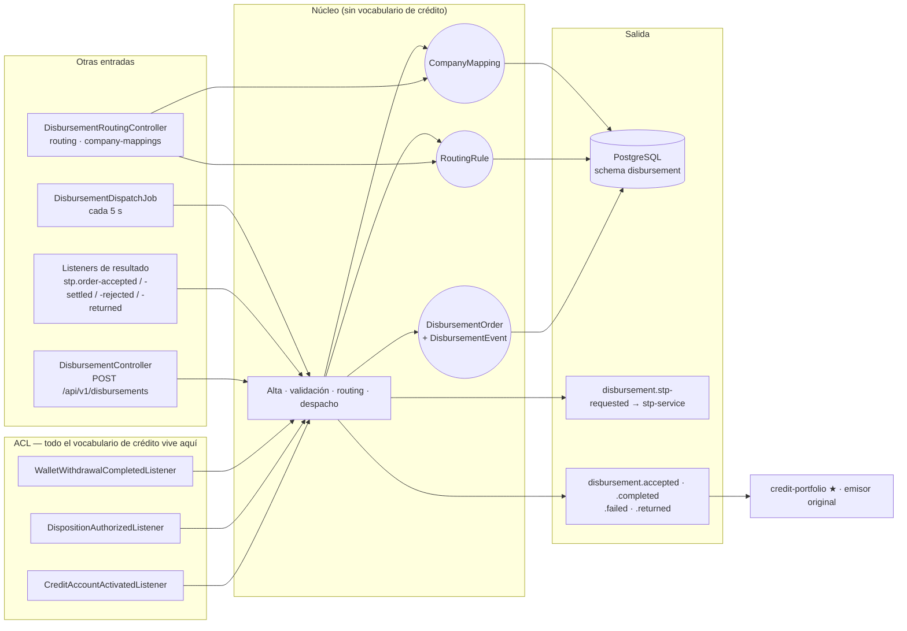
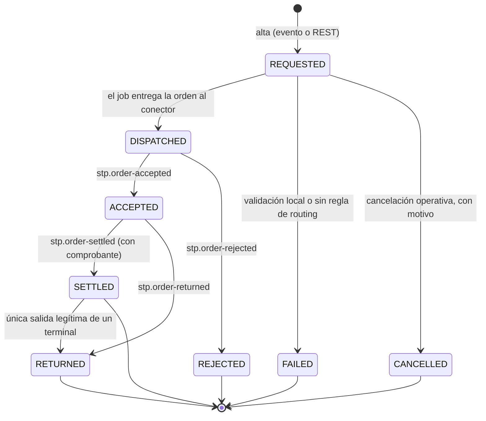
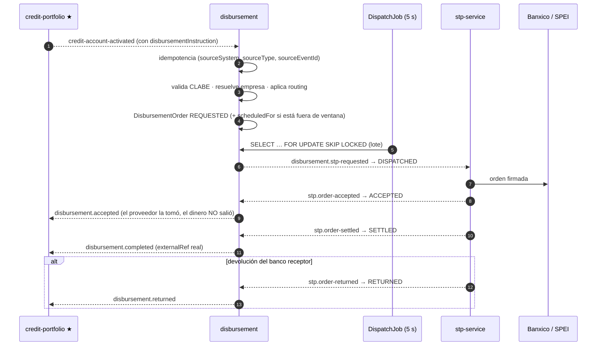
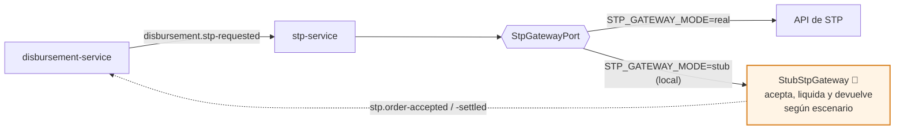

# disbursement-service (D11)

**Orquestación de pagos salientes** (*payouts*) multi-rail y multi-empresa. Decide **qué** hay que
pagar, **a quién**, por **qué rail** y con **qué proveedor**. Cómo se le habla a cada proveedor es
asunto de los conectores: este servicio no sabe qué es STP.

> **Servicio interno.** No recibe tráfico de internet y **no está publicado en el gateway**.

| | |
|---|---|
| **Puerto** | `8100` (bootRun) · `:8080` interno en Docker |
| **Schema** | `disbursement` · paquete `com.fintech.disbursement` |
| **Régimen Kafka** | **Backoff exponencial + DLT** — mueve dinero ([§5.4 raíz](../../README.md#54-política-de-reintentos-y-dlt-kafka)) |
| **Dominio** | [docs/dominios/10_disbursement_domain.md](../../docs/dominios/10_disbursement_domain.md) |

---

## Mapa del servicio



---

## Por qué existe separado del core de crédito

Porque se puede vender aparte, y eso no es una aspiración: es una restricción de diseño verificada
en CI.

`DisbursementOrder` **no tiene** `creditAccountId`, `dispositionId` ni `obligorPartyId`. La
procedencia viaja en tres campos opacos que el núcleo nunca interpreta y devuelve en eco:

| Campo | Qué guarda | Quién lo entiende |
|---|---|---|
| `sourceSystem` | `credit-portfolio`, `wallet`, `api` | Nadie aquí — es una etiqueta |
| `sourceReference` / `sourceEventId` | El identificador del emisor, como cadena | El emisor, cuando le vuelve en el evento |
| `sourceMetadata` (JSONB) | Contexto libre del emisor | El emisor |

Todo el vocabulario de crédito vive en **tres archivos** de
`infrastructure/adapter/in/messaging`. Bórralos y el servicio sigue funcionando por su API REST.

`DisbursementDecouplingTest` (ArchUnit) rompe la build si alguien mete un `Credit*`, `Disposition*`
o `Wallet*` fuera del ACL, si el dominio importa Spring, o si la aplicación importa un adaptador.

---

## Entradas

| Vía | Qué llega | Idempotencia |
|---|---|---|
| `credit-portfolio.credit-account-activated` | Hecho: se activó un crédito. Si trae bloque `disbursementInstruction`, hay algo que pagar | `dispositionId` |
| `credit-portfolio.disposition-authorized` | Disposición sobre una línea ya activa (camino de wallet) | `dispositionId` |
| `wallet.withdrawal-completed` | Retiro de saldo a favor | `withdrawalId` |
| `POST /api/v1/disbursements` | Alta directa — la puerta que no es Kafka | Cabecera `Idempotency-Key` |

Los tres topics de entrada son **configurables**: un comprador apunta el servicio a su propia
nomenclatura sin tocar código.

## Salidas

| Topic | Qué afirma |
|---|---|
| `disbursement.accepted` | El proveedor tomó la orden. **No** que el dinero salió |
| `disbursement.completed` | El dinero llegó, con comprobante |
| `disbursement.failed` | No va a llegar. Decidir por `failureCode`, no por el texto |
| `disbursement.returned` | Llegó y el banco receptor lo devolvió |

Los cuatro devuelven en eco `sourceSystem`, `sourceReference`, `sourceEventId` y `sourceMetadata`.

---

## Máquina de estados



Terminales: `SETTLED` · `REJECTED` · `RETURNED` · `FAILED` · `CANCELLED`.

Tres invariantes que el legado no tenía:

- **`ACCEPTED` no es dinero entregado.** Sólo `SETTLED` lo afirma, y sólo con evidencia del
  proveedor. El legado marcaba `COMPLETED` en cuanto STP respondía `200`.
- **Un estado terminal no se toca**, con una única excepción legítima: `SETTLED → RETURNED`.
  Negarla dejaría la orden mintiendo.
- **Toda transición escribe una fila** en `disbursement_events`. El estado de un pago no se
  reconstruye leyendo logs.

---

## API REST

Interna. No publicada en el gateway.

| Método | Ruta | Descripción |
|---|---|---|
| `POST` | `/api/v1/disbursements` | Alta directa — idempotente por cabecera `Idempotency-Key` |
| `GET` | `/api/v1/disbursements` · `/{disbursementId}` | Listado con filtros · detalle |
| `GET` | `/api/v1/disbursements/{disbursementId}/events` | Bitácora completa de transiciones |
| `POST` | `/api/v1/disbursements/{disbursementId}/cancel` | Cancelar (sólo desde `REQUESTED`, con motivo) |
| `POST` · `GET` | `/api/v1/disbursements/routing` | Alta y consulta de reglas de routing |
| `POST` | `/api/v1/disbursements/routing/{routingRuleId}/enabled` | Encender/apagar una regla sin desplegar |
| `POST` · `GET` | `/api/v1/disbursements/company-mappings` | Mapeo procedencia → empresa pagadora |

---

## Routing: cambiar de proveedor es un `INSERT`

`routing_rules` mapea *(empresa, rail, rango de monto) → proveedor*. Gana la de menor `priority`; a
igual prioridad, la específica de empresa sobre la genérica. `company_id` nulo = regla por defecto.

```bash
curl -X POST localhost:8100/api/v1/disbursements/routing \
  -H 'X-User-Id: ops' -H 'X-Roles: ADMIN' -H 'Content-Type: application/json' \
  -d '{"rail":"SPEI","provider":"STP","minAmount":0,"priority":100}'
```

Apagar un proveedor en un incidente es un `POST .../routing/{id}/enabled?enabled=false`. No hay
despliegue de por medio.

---

## Ventana operativa

Configurable por rail. Es **envolvente**: `start > end` significa que abre un día y cierra al
siguiente — para SPEI, la franja cerrada es el corte diario de Banxico. Fuera de ventana la orden
queda `REQUESTED` con `scheduledFor`; **no se rechaza**. El estado vive en la base de datos, así que
reiniciar un pod no cambia nada.

`start == end` significa 24 h (así se configura un rail sin corte).

---

## Despacho

Un job cada 5 s toma un lote con `SELECT ... FOR UPDATE SKIP LOCKED`. Varias réplicas corren a la
vez sin pisarse y **sin coordinador externo** — el legado resolvía esto con dos crons y cuatro
réplicas descoordinadas.

**La entrega ocurre fuera de la transacción**: una transacción corta reclama el lote, la entrega va
fuera, y cada fallo se registra en otra transacción corta. Hacerlo dentro mantendría los locks de
hasta 50 filas abiertos durante el round-trip al broker, con el resultado del conector —que llega en
milisegundos— compitiendo por escribir la misma fila. Para esa carrera además hay bloqueo optimista
(`@Version`): la escritura que llega tarde con datos viejos falla y se reintenta con datos frescos,
en vez de borrar en silencio el proveedor y el contador de intentos.

La entrega es **al menos una vez, a propósito**: si el proceso muere entre entregar y registrar el
resultado, se reenvía. Es correcto porque el conector es idempotente por `paymentRequestId` y lo
impone con una restricción única en su base, no con una promesa.

La idempotencia de entrada es la misma historia: `(sourceSystem, sourceType, sourceEventId)` es
único **en la base**, y si dos réplicas procesan el mismo evento a la vez, la que pierde devuelve la
orden que ya existe en lugar de mandar un desembolso legítimo al DLT.

Un rechazo transitorio del proveedor vuelve a la cola con backoff exponencial. Sólo lo terminal
termina.

---

### El camino completo de una orden



---

## Configuración

| Variable | Default | Para qué |
|---|---|---|
| `DISBURSEMENT_DISPATCH_ENABLED` | `true` | Apagarlo congela los pagos sin perder órdenes ni tumbar el servicio |
| `DISBURSEMENT_STP_TOPIC` | `disbursement.stp-requested` | Topic del conector STP |
| `DISBURSEMENT_TOPIC_*` | ver `application.yml` | Nomenclatura de entrada y de resultados |

---

## Dependencias externas y sus simuladores locales

disbursement **no habla con ningún externo**: su única salida de dinero es el tópico
`disbursement.stp-requested`, que consume [stp-service](../stp-service/README.md). Es ahí donde vive
el simulador de la red SPEI (`StubStpGateway`, activo con `STP_GATEWAY_MODE=stub`), de modo que en
local el ciclo completo `REQUESTED → SETTLED` corre **sin internet y sin webhooks**.



---

## Correr

```bash
./gradlew :disbursement-service:test          # dominio + ArchUnit
./gradlew :disbursement-service:bootRun
docker compose up disbursement-service stp-service
```

Levantar **sólo uno de los dos** tiene que funcionar: no hay `depends_on` entre ellos ni cliente
HTTP entre ellos. Es parte de la prueba de desacople.

---

## Sacarlo a otro repositorio

1. Copiar el módulo.
2. Borrar los tres listeners ACL y sus payloads.
3. Quitar sus tres `@Bean` de `KafkaConfig`.
4. Copiar `DomainException` (una clase, 25 líneas) en vez de depender de `:shared`.
5. Sustituir `JwtAuthenticationFilter` por el mecanismo de auth del comprador.

**Cero cambios en `domain/` y `application/`.**

---

Análisis completo, decisiones y plan: [`docs/ANALISIS_Y_PLAN_disbursement_stp.md`](../../docs/ANALISIS_Y_PLAN_disbursement_stp.md)
