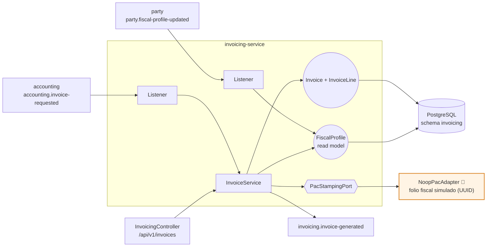
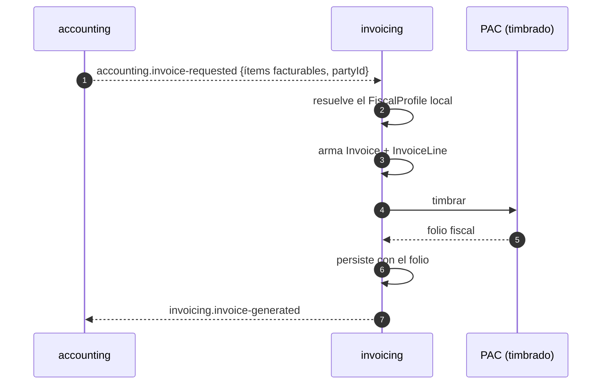

# invoicing-service (T4b)

**Facturación CFDI 4.0.** Genera la factura a partir de los ítems facturables que emite
[accounting](../accounting-service/README.md) y del **perfil fiscal** que mantiene
[party](../party-service/README.md). No calcula contabilidad: factura lo que accounting ya
determinó como facturable.

| | |
|---|---|
| **Puerto** | `8096` (bootRun) · `:8080` interno en Docker |
| **Schema** | `invoicing` |
| **Arquitectura** | Hexagonal + Spring Modulith |
| **Régimen Kafka** | Por defecto (sin DLT) |

---

## 1. Mapa del servicio



---

## 2. Dominio

| Agregado | Rol |
|---|---|
| `Invoice` | Encabezado y estado de la factura |
| `InvoiceLine` | Cada concepto o renglón |
| `FiscalProfile` | Datos fiscales del receptor (RFC, régimen, uso de CFDI), **proyectados desde party** |

El perfil fiscal es un read model: invoicing nunca llama a party por REST. Si el cliente cambia su
régimen, party publica el hecho y aquí se actualiza.

---

## 3. Flujo de una factura



---

## 4. Dependencias externas y sus simuladores locales

| Dependencia real | Puerto de salida | Adaptador | Comportamiento |
|---|---|---|---|
| PAC — Proveedor Autorizado de Certificación (timbrado ante el SAT) | `PacStampingPort` | `NoopPacAdapter` 🧪 | Simula la certificación asignando un folio fiscal (UUID) y registra `[STUB PAC]` en el log |

**Todo el timbrado es simulado hoy.** La factura se genera completa, con sus renglones y su receptor
fiscal; lo único que falta es la certificación real. El puerto está aislado para que integrar un PAC
sea añadir un adaptador, sin tocar el dominio.

---

## 5. API REST — `/api/v1/invoices`

| Método | Ruta | Descripción |
|---|---|---|
| `GET` | `/` | Búsqueda de facturas con filtros |
| `GET` | `/{invoiceId}` | Detalle de una factura |

---

## 6. Eventos Kafka

**Consume:** `accounting.invoice-requested` (dispara la generación) ·
`party.fiscal-profile-updated` (mantiene el perfil fiscal local).

**Produce:** `invoicing.invoice-generated` — *sin consumidor hoy*, queda como traza.

**Reintentos:** régimen por defecto, sin DLT.
Ver [README raíz §5.4](../../README.md#54-política-de-reintentos-y-dlt-kafka).

---

## 7. Persistencia y ejecución

Schema `invoicing`, 6 changesets Liquibase bajo `db/changelog/invoicing/`.

```bash
./gradlew :invoicing-service:test
docker compose up -d invoicing-service
```
