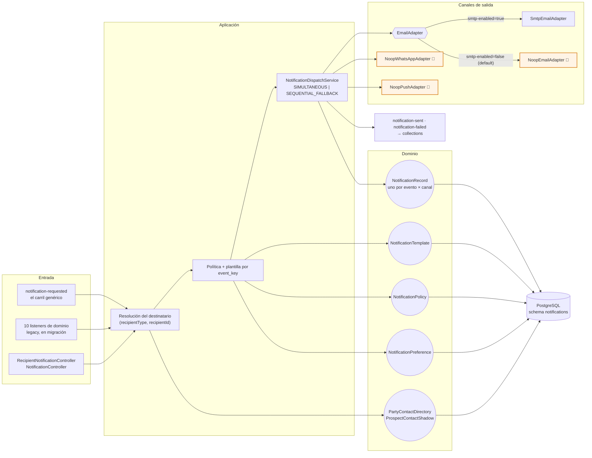

# notifications-service (T2)

Comunicaciones multicanal disparadas por eventos. Mantiene plantillas, políticas, preferencias e
historial con estado de lectura.

**El destinatario es una entidad abstracta:** este servicio no sabe si notifica a quien pide un
préstamo, a un asesor externo, a una distribuidora o a un empleado. Recibe un
`(recipientType, recipientId)` y **no ramifica sobre el tipo en ninguna parte**.

> **Invariante:** este servicio **nunca** tiene `@Scheduled` que revise cuentas. Todo disparo viene de un evento consumido — si hace falta recordar algo, el emisor publica el hecho (p.ej. `collections.pre-due-reminder-triggered`) y aquí se reacciona.

| | |
|---|---|
| **Puerto** | `8098` (bootRun) · `:8080` interno en Docker |
| **Schema** | `notifications` |
| **Arquitectura** | Hexagonal + Spring Modulith |
| **Régimen Kafka** | Por defecto (sin DLT) |
| **Dominio** | [docs/dominios/T2_notifications.md](../../docs/dominios/T2_notifications.md) · [plan de eventos](../../docs/NOTIFICATIONS_EVENT_PLAN.md) |

## Mapa del servicio

## Dominio

| Agregado | Rol |
|---|---|
| `NotificationRecord` | Notificación emitida (estado, canal, destinatario). |
| `NotificationTemplate` | Plantilla por tipo de evento. |
| `NotificationPolicy` | Qué evento dispara qué notificación. |
| `NotificationPreference` | Preferencias de contacto por party. |
| `PartyContactDirectory` / `ProspectContactShadow` | Read models de contacto (party / prospecto). |
| `CreditAccountProgress` / `ApplicationProspectLink` | Proyecciones para correlacionar avisos. |

## API REST — `/api/v1/notifications`

**Camino abstracto** — cualquier entidad, cualquier clave:

| Método | Ruta |
|---|---|
| `PUT` | `/recipients/{tipo}/{id}` — alta o actualización. Idempotente; un campo nulo **no borra**. |
| `POST` | `/` — `{recipientType, recipientId, eventKey, variables, channels?, sourceEventId?}` |
| `GET` | `/feed/{tipo}/{id}?unreadOnly=` — buzón + `unreadCount` |
| `PUT` | `/feed/{tipo}/{id}/read-all` |

**Camino del journey de crédito** (previo, sigue en uso):

| Método | Ruta |
|---|---|
| `GET` | `/history/{partyId}` · `/preferences/{partyId}` · `/policies` |
| `POST` | `/policies` |
| `PUT` | `/preferences/{partyId}` · `/{notificationId}/read` · `/read-all/{recipientId}` |

## Eventos Kafka

### El carril genérico — `notifications.notification-requested`

**Un solo tópico, el mismo contrato que el `POST`.** Síncrono para quien nos notifica desde fuera,
asíncrono para los hechos internos. Este servicio consume **uno** y no sabe nada de nadie: un aviso
nuevo se publica y ya, sin tocar este código.

Un destinatario no registrado se **descarta y no rebota**: reintentarlo no lo haría aparecer, y
dejar el mensaje rebotando bloquearía la partición para todos los avisos que sí tienen a quién
llegarle.

### Los diez listeners de dominio — legacy, en migración

**Consume:** `credit-portfolio.credit-account-activated`, `credit-portfolio.disposition-completed`, `credit-portfolio.installment-due`, `credit-portfolio.balance-updated`, `origination.prospect-created`, `origination.offer-presented`, `payments.payment-applied`, `collections.pre-due-reminder-triggered`.

**Produce:** `notifications.notification-sent`, `notifications.notification-failed` (traza/analítica).

**Reintentos:** régimen **por defecto** (sin DLT). Ver [README raíz §5.4](../../README.md#54-política-de-reintentos-y-dlt-kafka).

## Canales y sus adaptadores

`NotificationChannel`: `PUSH_NOTIFICATION` · `EMAIL` · `WHATSAPP` · `SMS` · `IVR_CALLBACK` · `IN_APP`.

`ChannelStrategy` decide cómo se usan cuando hay más de uno:

| Estrategia | Comportamiento |
|---|---|
| `SIMULTANEOUS` | Se envía por todos los canales disponibles a la vez (picos emocionales, NT-08) |
| `SEQUENTIAL_FALLBACK` | Se intentan en orden hasta que uno funcione |

Un despacho `SIMULTANEOUS` genera **varios `NotificationRecord`**, uno por `(evento, canal)`: así
un WhatsApp que falla y un correo que llega quedan distinguibles en el historial.

### Estado real de cada canal

| Canal | Adaptador | Estado |
|---|---|---|
| `EMAIL` | `SmtpEmailAdapter` (JavaMailSender) | **Real**, con cualquier proveedor SMTP. Se enciende con `fintech.notifications.email.smtp-enabled=true` + credenciales `SMTP_*` |
| `EMAIL` (default) | `NoopEmailAdapter` 🧪 | Escribe el mensaje completo en el log y devuelve éxito |
| `WHATSAPP` | `NoopWhatsAppAdapter` 🧪 | Confirma el envío al instante. Integración real: WhatsApp Cloud API de Meta |
| `PUSH_NOTIFICATION` | `NoopPushAdapter` 🧪 | Confirma el envío al instante. Integración real: FCM / APNs |
| `IN_APP` | Persistencia local (el *feed*) | **Real** — es la campana del backoffice y el buzón de la app |
| `SMS` · `IVR_CALLBACK` | — | Declarados en el enum, sin adaptador todavía |

Los `Noop*` devuelven **éxito**, no error: en local el flujo completo tiene que llegar a
`notification-sent` para que collections registre la constancia en el expediente del caso. Un
adaptador que fallara convertiría cada demo en una investigación de por qué no llegó el mensaje.

## Migraciones

Liquibase (13 changesets) bajo `db/changelog/notifications/`. La `012` abstrae el destinatario
y abre `event_key`; la `013` siembra las políticas y plantillas `IN_APP` del backoffice.

## Destinatario abstracto (2026-08-17)

**El notificador no sabe a quién notifica.** Un préstamo, un asesor externo, una distribuidora o un
empleado se notifican por el mismo camino: lo único que cambia es quién los registró.

| Método | Ruta | Qué hace |
|---|---|---|
| `PUT` | `/api/v1/notifications/recipients/{tipo}/{id}` | Alta o actualización. Idempotente. Un campo nulo **no borra**. |
| `POST` | `/api/v1/notifications` | `{recipientType, recipientId, eventKey, variables, channels?, sourceEventId?}` |
| `GET` | `/api/v1/notifications/feed/{tipo}/{id}?unreadOnly=` | Buzón + `unreadCount` |
| `PUT` | `/api/v1/notifications/feed/{tipo}/{id}/read-all` | Marcar leído |

**`recipientType` es texto libre y este servicio no ramifica sobre su valor en ninguna parte.** En
el momento en que lo hiciera volvería a acoplarse a los dominios que hoy existen y quedaría cerrado
ante los que no. Hay un test que recorre `PARTY`, `STAFF`, `ASESOR_EXTERNO` y `LO_QUE_SEA` y exige
comportamiento idéntico.

**El que envía controla qué manda y a dónde.** Los `channels` del emisor ganan sobre la política —
hay avisos que sólo tienen sentido dentro de una consola y no deben salir por WhatsApp aunque la
entidad tenga teléfono. Sin política y sin canales impuestos **no se manda nada**: elegir un canal
por defecto sería decidir por el emisor justo en lo que es suyo.

### Los tres acoplamientos que se quitaron

1. **`recipientId` era un `partyId`.** Ahora la llave es `(tipo, id)`: dos entidades de tipos
   distintos pueden compartir id sin ser la misma.
2. **El contacto se reconstruía con un join de tres pasos** —prospecto → solicitud → cuenta— que
   sólo tiene sentido para quien pide un préstamo. Ese mecanismo sigue vivo, pero ahora es **un
   productor más** del registro y no el modelo.
3. **`EventType` era un enum cerrado** y llaveaba políticas y plantillas: cada emisor nuevo obligaba
   a recompilar y redesplegar este servicio. Era el acoplamiento más caro, porque volvía «mandar un
   aviso» un cambio de código ajeno. Ahora la llave es `event_key`, texto. El enum sobrevive como
   catálogo del journey de crédito; una clave de otro emisor deja `event_type` en nulo en vez de
   inventarse uno.

## Estado: falta que alguien emita

El carril existe y está probado, pero **ningún servicio publica todavía**
`notifications.notification-requested`. Consecuencias visibles hoy:

- La campana del backoffice **funciona y está vacía**.
- Los **13 eventos** de la colocación B2B2C (`beneficiary.*`) no producen ningún aviso.
- El catálogo cubre **sólo al cliente directo B2C**: distribuidores y beneficiarias de crédito —los
  otros dos perfiles de la app— no tienen ni una notificación.

Análisis por perfil y orden sugerido en
[`docs/NOTIFICATIONS_EVENT_PLAN.md`](../../docs/NOTIFICATIONS_EVENT_PLAN.md) §6.

