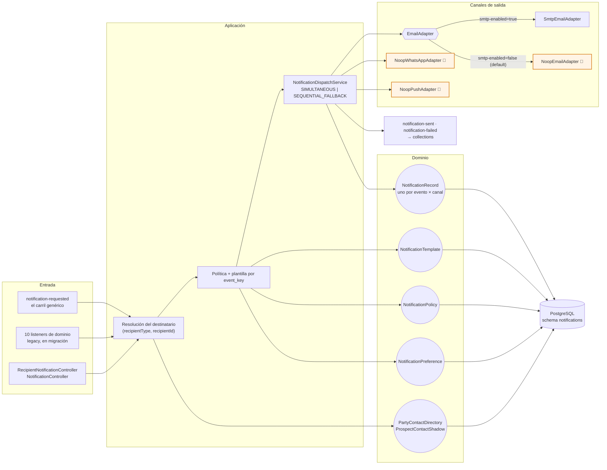

# notifications-service (T2)

Comunicaciones multicanal disparadas por eventos. Mantiene plantillas, políticas, preferencias e
historial con estado de lectura.

**El destinatario es una entidad abstracta:** este servicio no sabe si notifica a quien pide un
préstamo, a un asesor externo, a una distribuidora o a un empleado. Recibe un
`(recipientType, recipientId)` y **no ramifica sobre el tipo en ninguna parte**.

> **Invariante:** este servicio **nunca** tiene `@Scheduled` que revise cuentas. Todo disparo viene de un evento consumido — si hace falta recordar algo, el emisor publica el hecho (p.ej. `collections.pre-due-reminder-triggered`) y aquí se reacciona.

| | |
|---|---|
| **Puerto** | `8098` (bootRun) · `:8080` interno en Docker |
| **Schema** | `notifications` |
| **Arquitectura** | Hexagonal + Spring Modulith |
| **Régimen Kafka** | Por defecto (sin DLT) |
| **Dominio** | [docs/dominios/T2_notifications.md](../../docs/dominios/T2_notifications.md) · [plan de eventos](../../docs/NOTIFICATIONS_EVENT_PLAN.md) |

## Mapa del servicio



## Dominio

| Agregado | Rol |
|---|---|
| `NotificationRecord` | Notificación emitida (estado, canal, destinatario). |
| `NotificationTemplate` | Plantilla por tipo de evento. |
| `NotificationPolicy` | Qué evento dispara qué notificación. |
| `NotificationPreference` | Preferencias de contacto por party. |
| `PartyContactDirectory` / `ProspectContactShadow` | Read models de contacto (party / prospecto). |
| `CreditAccountProgress` / `ApplicationProspectLink` | Proyecciones para correlacionar avisos. |

## API REST — `/api/v1/notifications`

**Camino abstracto** — cualquier entidad, cualquier clave:

| Método | Ruta |
|---|---|
| `PUT` | `/recipients/{tipo}/{id}` — alta o actualización. Idempotente; un campo nulo **no borra**. |
| `POST` | `/` — `{recipientType, recipientId, eventKey, variables, channels?, sourceEventId?}` |
| `GET` | `/feed/{tipo}/{id}?unreadOnly=` — buzón + `unreadCount` |
| `PUT` | `/feed/{tipo}/{id}/read-all` |

**Camino del journey de crédito** (previo, sigue en uso):

| Método | Ruta |
|---|---|
| `GET` | `/history/{partyId}` · `/preferences/{partyId}` · `/policies` |
| `POST` | `/policies` |
| `PUT` | `/preferences/{partyId}` · `/{notificationId}/read` · `/read-all/{recipientId}` |

## Eventos Kafka

### Los doce tópicos que consume, y qué avisa cada uno

**Este servicio es un consumidor maestro:** se suscribe a los hechos que los dominios ya publican
por sus propias razones e **interpreta** cuáles merecen un aviso, para quién y con qué texto.
Ninguno de esos dominios sabe que existe una campana — no mencionan claves de evento, tipos de
destinatario ni canales.

Es lo que permite que el núcleo del negocio no dependa del notificador. Y lo que hace posible
consumir sin acoplarse al código ajeno: **cada payload se redeclara aquí**, no se importa
(`grep import com.fintech` sólo devuelve `notifications` y `shared`).

| Tópico | Qué hecho es | Qué se notifica | A quién |
|---|---|---|---|
| `origination.prospect-created` | entró un prospecto con su teléfono y correo | **nada** — arma la proyección de contacto | — |
| `origination.offer-presented` | se le presentó una oferta | `OFFER_PRESENTED` — «tienes una oferta» | prospecto |
| `credit-portfolio.credit-account-activated` | el crédito nació | `WELCOME_ACTIVATED` — bienvenida | titular |
| `credit-portfolio.disposition-completed` | salió el dinero | `DISBURSEMENT_COMPLETED` — «ya se depositó» | titular |
| `credit-portfolio.installment-due` | vence una cuota | `PAYMENT_REMINDER` o `PAYMENT_OVERDUE` según el DPD | titular |
| `credit-portfolio.balance-updated` | cambió el saldo | `INSTALLMENT_PAID` · `LOAN_SETTLED` si llegó a cero | titular |
| `payments.payment-applied` | se aplicó un pago | `INSTALLMENT_PAID` | titular |
| `collections.pre-due-reminder-triggered` | cobranza quiere recordar antes del vencimiento | `PAYMENT_REMINDER` | titular |
| `collections.dunning-requested` | cobranza pide gestionar | uno de los ocho `COLLECTION_*` según el tipo | titular |
| `collections.payment-thanks` | pagó tras la gestión | `COLLECTION_PAYMENT_THANKS` | titular |
| `party.executive-assigned` | un cliente pasó a ser de un ejecutivo | `STAFF_CLIENTES_ASIGNADOS` | **el ejecutivo** |
| `notifications.notification-requested` | alguien **pide** un aviso | el que traiga el mensaje | el que traiga |

**Produce:** `notifications.notification-sent`, `notifications.notification-failed` (traza y analítica).

**Reintentos:** régimen **por defecto** (sin DLT). Ver [README raíz §5.4](../../README.md#54-política-de-reintentos-y-dlt-kafka).

### El carril genérico — `notifications.notification-requested`

El único consumidor que no sabe nada de nadie, y **no sustituye a los otros once**: es la entrada
para lo que **no es un hecho de dominio** — el backoffice pidiendo un aviso, o un sistema externo.
Mismo contrato que el `POST`, en asíncrono.

Un destinatario no registrado se **descarta y no rebota**: reintentarlo no lo haría aparecer, y
dejar el mensaje rebotando bloquearía la partición para todos los avisos que sí tienen a quién
llegarle.

## Los quince `EventType`, y cuáles llegan a salir

Un aviso necesita **tres piezas**: que alguien consuma el hecho, que haya **política** (qué canal
y en qué orden) y que haya **plantilla** (qué dice, por canal). Sin política no se manda nada, y
sin plantilla tampoco — las dos por diseño: *«elegir un canal por defecto sería que el sistema
decida por el negocio»*.

Cruzar las tres columnas es lo que dice qué funciona de verdad:

| `EventType` | Política | Plantilla | Sale |
|---|---|---|---|
| `OFFER_PRESENTED` | ✅ ALTO · simultáneo | ✅ push · email · whatsapp | ✅ |
| `WELCOME_ACTIVATED` | ✅ ALTO · simultáneo | ✅ push · email · whatsapp | ✅ |
| `PAYMENT_REMINDER` | ✅ ALTO · cascada | ✅ push · whatsapp | ✅ |
| `PAYMENT_OVERDUE` | ✅ ALTO · cascada | ✅ push · email · whatsapp | ✅ |
| `DISBURSEMENT_COMPLETED` | ✅ ALTO · cascada | 🔴 **ninguna** | 🔴 no |
| `INSTALLMENT_PAID` | ✅ MEDIO · cascada | 🔴 **ninguna** | 🔴 no |
| `LOAN_SETTLED` | ✅ ALTO · simultáneo | 🔴 **ninguna** | 🔴 no |
| `COLLECTION_REMINDER` | 🔴 **ninguna** | 🔴 ninguna | 🔴 no |
| `COLLECTION_HOW_TO_PAY` | 🔴 **ninguna** | 🔴 ninguna | 🔴 no |
| `COLLECTION_OVERDUE_NOTICE` | 🔴 **ninguna** | 🔴 ninguna | 🔴 no |
| `COLLECTION_CREDIT_HISTORY` | 🔴 **ninguna** | 🔴 ninguna | 🔴 no |
| `COLLECTION_OFFER_HELP` | 🔴 **ninguna** | 🔴 ninguna | 🔴 no |
| `COLLECTION_PAYMENT_THANKS` | 🔴 **ninguna** | 🔴 ninguna | 🔴 no |
| `COLLECTION_AGREEMENT_OFFERED` | 🔴 **ninguna** | 🔴 ninguna | 🔴 no |
| `COLLECTION_AGREEMENT_EXECUTED` | 🔴 **ninguna** | 🔴 ninguna | 🔴 no |

Y las tres claves de backoffice, que no son `EventType` sino texto libre del carril genérico:

| Clave | Política | Plantilla | Emisor |
|---|---|---|---|
| `STAFF_CLIENTES_ASIGNADOS` | ✅ MEDIO · IN_APP | ✅ | ✅ `party.executive-assigned` |
| `STAFF_DOCUMENTOS_RECIBIDOS` | ✅ ALTO · IN_APP | ✅ | 🔴 **nadie lo emite** |
| `STAFF_SOLICITUD_RESUELTA` | ✅ MEDIO · IN_APP | ✅ | 🔴 **nadie lo emite** |

### 🔴 Lo que esto significa, dicho sin rodeos

**De quince tipos de evento, salen cuatro.** El resto se consume, se procesa y muere en un `WARN`:

```
No ACTIVE NotificationPolicy for eventType=… — skipping, not inventing a channel
No NotificationTemplate for eventType=… channel=… locale=es-MX
```

Los dos casos son deliberados —el sistema **no inventa** canal ni texto— pero el efecto es que
**toda la ruta de cobranza consume eventos y no notifica nada**: los ocho `COLLECTION_*` no tienen
política, así que `collections.dunning-requested` y `collections.payment-thanks` se leen y se
descartan.

Y hay tres con política y sin plantilla —`DISBURSEMENT_COMPLETED`, `INSTALLMENT_PAID`,
`LOAN_SETTLED`—: ahí el aviso llega hasta el último paso y se cae al buscar qué decir. **Es el
peor de los tres estados**, porque el log dice «falta plantilla» en un sitio donde todo lo demás
está bien y parece que funciona.

Cerrar esto es sembrar filas, no escribir código.

## Canales y sus adaptadores

`NotificationChannel`: `PUSH_NOTIFICATION` · `EMAIL` · `WHATSAPP` · `SMS` · `IVR_CALLBACK` · `IN_APP`.

`ChannelStrategy` decide cómo se usan cuando hay más de uno:

| Estrategia | Comportamiento |
|---|---|
| `SIMULTANEOUS` | Se envía por todos los canales disponibles a la vez (picos emocionales, NT-08) |
| `SEQUENTIAL_FALLBACK` | Se intentan en orden hasta que uno funcione |

Un despacho `SIMULTANEOUS` genera **varios `NotificationRecord`**, uno por `(evento, canal)`: así
un WhatsApp que falla y un correo que llega quedan distinguibles en el historial.

### Estado real de cada canal

| Canal | Adaptador | Estado |
|---|---|---|
| `EMAIL` | `SmtpEmailAdapter` (JavaMailSender) | **Real**, con cualquier proveedor SMTP. Se enciende con `fintech.notifications.email.smtp-enabled=true` + credenciales `SMTP_*` |
| `EMAIL` (default) | `NoopEmailAdapter` 🧪 | Escribe el mensaje completo en el log y devuelve éxito |
| `WHATSAPP` | `NoopWhatsAppAdapter` 🧪 | Confirma el envío al instante. Integración real: WhatsApp Cloud API de Meta |
| `PUSH_NOTIFICATION` | `NoopPushAdapter` 🧪 | Confirma el envío al instante. Integración real: FCM / APNs |
| `IN_APP` | Persistencia local (el *feed*) | **Real** — es la campana del backoffice y el buzón de la app |
| `SMS` · `IVR_CALLBACK` | — | Declarados en el enum, sin adaptador todavía |

Los `Noop*` devuelven **éxito**, no error: en local el flujo completo tiene que llegar a
`notification-sent` para que collections registre la constancia en el expediente del caso. Un
adaptador que fallara convertiría cada demo en una investigación de por qué no llegó el mensaje.

## Migraciones

Liquibase (13 changesets) bajo `db/changelog/notifications/`. La `012` abstrae el destinatario
y abre `event_key`; la `013` siembra las políticas y plantillas `IN_APP` del backoffice.

## Destinatario abstracto (2026-08-17)

**El notificador no sabe a quién notifica.** Un préstamo, un asesor externo, una distribuidora o un
empleado se notifican por el mismo camino: lo único que cambia es quién los registró.

| Método | Ruta | Qué hace |
|---|---|---|
| `PUT` | `/api/v1/notifications/recipients/{tipo}/{id}` | Alta o actualización. Idempotente. Un campo nulo **no borra**. |
| `POST` | `/api/v1/notifications` | `{recipientType, recipientId, eventKey, variables, channels?, sourceEventId?}` |
| `GET` | `/api/v1/notifications/feed/{tipo}/{id}?unreadOnly=` | Buzón + `unreadCount` |
| `PUT` | `/api/v1/notifications/feed/{tipo}/{id}/read-all` | Marcar leído |

**`recipientType` es texto libre y este servicio no ramifica sobre su valor en ninguna parte.** En
el momento en que lo hiciera volvería a acoplarse a los dominios que hoy existen y quedaría cerrado
ante los que no. Hay un test que recorre `PARTY`, `STAFF`, `ASESOR_EXTERNO` y `LO_QUE_SEA` y exige
comportamiento idéntico.

**El que envía controla qué manda y a dónde.** Los `channels` del emisor ganan sobre la política —
hay avisos que sólo tienen sentido dentro de una consola y no deben salir por WhatsApp aunque la
entidad tenga teléfono. Sin política y sin canales impuestos **no se manda nada**: elegir un canal
por defecto sería decidir por el emisor justo en lo que es suyo.

### Los tres acoplamientos que se quitaron

1. **`recipientId` era un `partyId`.** Ahora la llave es `(tipo, id)`: dos entidades de tipos
   distintos pueden compartir id sin ser la misma.
2. **El contacto se reconstruía con un join de tres pasos** —prospecto → solicitud → cuenta— que
   sólo tiene sentido para quien pide un préstamo. Ese mecanismo sigue vivo, pero ahora es **un
   productor más** del registro y no el modelo.
3. **`EventType` era un enum cerrado** y llaveaba políticas y plantillas: cada emisor nuevo obligaba
   a recompilar y redesplegar este servicio. Era el acoplamiento más caro, porque volvía «mandar un
   aviso» un cambio de código ajeno. Ahora la llave es `event_key`, texto. El enum sobrevive como
   catálogo del journey de crédito; una clave de otro emisor deja `event_type` en nulo en vez de
   inventarse uno.

## Estado: qué falta, medido

**El carril funciona. Lo que falta son emisores y filas.**

| | |
|---|---|
| Emisores del carril genérico | **1** — `party.executive-assigned` (el primero, 2026-08-31) |
| `EventType` que llegan a salir | **4 de 15** |
| Claves de backoffice con emisor | **1 de 3** |

Lo que sigue abierto, por orden de coste:

1. **Sembrar política y plantilla de los ocho `COLLECTION_*`.** Es la ruta de cobranza entera, ya
   consumida y procesada, muriendo en un `WARN`. Son filas, no código.
2. **Sembrar plantilla de `DISBURSEMENT_COMPLETED`, `INSTALLMENT_PAID` y `LOAN_SETTLED`.** Tienen
   política, así que el aviso llega hasta el final y se cae al buscar qué decir.
3. **Los dos emisores de backoffice que faltan.** `STAFF_DOCUMENTOS_RECIBIDOS` exige que
   origination guarde **quién** pidió los documentos —hoy sólo lo escribe en el log—;
   `STAFF_SOLICITUD_RESUELTA` exige resolver el ejecutivo del cliente en el emisor.
4. **Los 13 eventos de la colocación B2B2C** (`beneficiary.*`) no producen ningún aviso, y con
   ellos los otros dos perfiles de la app —distribuidor y beneficiaria— no tienen ni una
   notificación. El catálogo cubre **sólo al cliente directo B2C**.

### El riesgo de este diseño, y su mitigación

Consumir hechos ajenos redeclarando sus payloads deja este servicio atado al **esquema** de once
tópicos. Si un dominio renombra un campo, aquí se deja de poblar **en silencio**: el aviso sale,
con un hueco donde iba el dato, y nadie se entera.

Es la misma clase de defecto que costó una tarde con `DispositionAuthorizedEvent`, donde el
beneficiario viajaba anidado y el consumidor lo esperaba plano: los tres campos que deciden adónde
va el dinero llegaban nulos.

Hay **una** prueba de contrato hoy —`ContratoAsignacionDeEjecutivoTest`, del par
`party.executive-assigned`— y hacen falta once. Es el hueco que hace frágil un diseño que por lo
demás es el correcto.

Análisis por perfil y orden sugerido en
[`docs/NOTIFICATIONS_EVENT_PLAN.md`](../../docs/NOTIFICATIONS_EVENT_PLAN.md) §6.
