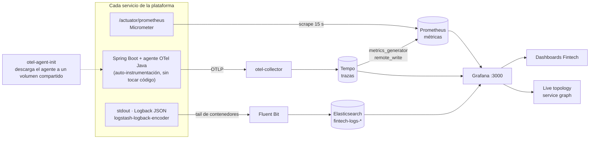

# observability-service (T7)

**Stack de observabilidad opt-in** del monorepo. Da a cada servicio las tres señales
—*traces*, *métricas*, *logs*— correlacionadas por `trace_id`, más dashboards en Grafana con un
**mapa de arquitectura** y una **topología en vivo** auto-descubierta.

No es un servicio de negocio: no tiene JVM propia, ni schema, ni API. Es un **perfil de Docker
Compose** (`--profile observability`) más los archivos de configuración de esta carpeta.

> Diseño completo y decisiones (OBS-01…): [`docs/dominios/T7_observability.md`](../../docs/dominios/T7_observability.md).

## Topología del stack



**Todo queda enlazado:** de una **métrica** se salta a la **traza** que la produjo (exemplars), y de
la traza a los **logs** de esa misma request por `trace_id`. Es lo que convierte tres herramientas
separadas en una sola investigación.

## 1. Qué incluye la solución

| Señal | Cómo se produce | Cómo se recolecta | Dónde se ve |
|-------|-----------------|-------------------|-------------|
| **Traces** | Agente **OpenTelemetry Java** (auto-instrumentación, sin tocar código) | `otel-collector` → **Tempo** | Grafana → *Explore* (Tempo) + **node graph** |
| **Métricas** | **Micrometer** + Spring Actuator (`/actuator/prometheus`) | **Prometheus** (scrape 15s) | Grafana → dashboards `Fintech` |
| **Logs** | **Logback JSON** (`logstash-logback-encoder`) a stdout | **Fluent Bit** (tail de contenedores) → **Elasticsearch** | Grafana → *Explore* (Elasticsearch) |

El **service graph** (quién llama a quién, con rate/latencia) lo genera Tempo con su
`metrics_generator` y lo escribe a Prometheus por `remote_write`; Grafana lo pinta en el panel
*Live topology*. Todo esto queda enlazado: **métrica → traza** (exemplars) y **traza → log**
(por `trace_id`).

Componentes (perfil `observability` en [`docker-compose.yml`](../../docker-compose.yml)):
`otel-collector`, `tempo`, `prometheus`, `grafana`, `elasticsearch`, `fluent-bit`
(+ `otel-agent-init`, que descarga el agente Java a un volumen compartido y corre **siempre**).

Archivos de config en esta carpeta:

```
observability/
├── otel-collector/otel-collector-config.yaml   # recibe OTLP, exporta a Tempo
├── tempo/tempo.yaml                             # trazas + service-graph → Prometheus
├── prometheus/prometheus.yml                    # ← REGISTRAS AQUÍ cada servicio (paso 5)
├── fluent-bit/{fluent-bit.conf,parsers.conf}    # logs de contenedores → índice fintech-logs-*
└── grafana/
    ├── provisioning/{datasources,dashboards}/   # datasources + provider (auto)
    └── dashboards/{service-overview,services-apm}.json
```

---

## 2. Levantar el stack

```bash
# stack de negocio + observabilidad (perfil opt-in)
docker compose --profile observability up -d --build

# solo negocio (sin observabilidad)
docker compose up -d --build
```

| Servicio | URL | Credenciales |
|----------|-----|--------------|
| Grafana | http://localhost:3000 | `admin` / `admin` |
| Prometheus | http://localhost:9090 | — |
| Elasticsearch | http://localhost:9200 | — |

> **Memoria:** el perfil añade ~3.1 GB. Se recomienda Docker Desktop en **16 GB** (ver cabecera
> de `docker-compose.yml`). Elasticsearch está fijado en 1536M tras un OOM real en verificación.

---

## 3. Incorporar un servicio — paso a paso

Un servicio Spring Boot del monorepo queda 100% observable con **5 pasos**. Los pasos 1–3 son en
el servicio; el 4 en `docker-compose.yml`; el 5 en `prometheus.yml`. (Traces y logs son
**automáticos** una vez hechos los pasos 1, 3 y 4 — no hay que instrumentar código.)

> Referencia viva: cualquier `*-service` ya migrado, p. ej. `payments-service`.

### Paso 1 — Dependencias (métricas)

En `<servicio>/build.gradle.kts`, dentro de `dependencies { … }`:

```kotlin
implementation("org.springframework.boot:spring-boot-starter-actuator")
implementation("io.micrometer:micrometer-registry-prometheus")
implementation("net.logstash.logback:logstash-logback-encoder:8.0")   // logs JSON (paso 3)
```

### Paso 2 — Exponer el endpoint de Prometheus

En `<servicio>/src/main/resources/application.yml`:

```yaml
management:
  endpoints:
    web:
      exposure:
        include: health,info,metrics,prometheus
  metrics:
    distribution:
      percentiles-histogram:
        http.server.requests: true      # habilita p50/p95/p99 (RED) en los dashboards
```

Verás las métricas en `http://<host>:<port>/actuator/prometheus`.

### Paso 3 — Logs JSON estructurados (correlación con trazas)

Crea `<servicio>/src/main/resources/logback-spring.xml` con una sola línea de include:

```xml
<?xml version="1.0" encoding="UTF-8"?>
<configuration>
    <include resource="logback-base.xml"/>
</configuration>
```

`logback-base.xml` vive en [`shared/`](../../shared/src/main/resources/logback-base.xml) y usa
`LogstashEncoder`, que emite todo el MDC como campos de primer nivel → trae `trace_id`/`span_id`
gratis (los inyecta el agente OTel). No hay que configurar nada más: Fluent Bit tailea el stdout
del contenedor y lo manda al índice `fintech-logs-*`.

### Paso 4 — Cablear el servicio en `docker-compose.yml`

Añade al bloque `environment` del servicio el **agente OTel** (anchor `*otel-agent`), el nombre
de servicio, el volumen del agente y la dependencia del init. Plantilla mínima:

```yaml
  mi-servicio:
    build:
      context: .
      dockerfile: Dockerfile
      args:
        SERVICE: mi-servicio                 # = nombre de carpeta / módulo Gradle
    image: fintech/mi-servicio:latest
    volumes:
      - otel-agent-vol:/otel:ro              # ← agente Java compartido (traces)
    environment:
      <<: *otel-agent                        # ← JAVA_TOOL_OPTIONS + endpoint OTLP + exporters
      OTEL_SERVICE_NAME: "mi-servicio"       # ← etiqueta del nodo en Tempo/node-graph
      SPRING_APPLICATION_NAME: "mi-servicio" # ← service_name en logs y métricas
      SPRING_PROFILES_ACTIVE: docker
      SERVER_PORT: 8080                       # todos escuchan 8080 dentro de la red docker
      POSTGRES_USER: ${POSTGRES_USER:-fintech}
      POSTGRES_PASSWORD: ${POSTGRES_PASSWORD:-fintech}
      KAFKA_BOOTSTRAP_SERVERS: kafka:9092
    <<: *app-mem                              # límite de memoria 512M/256M
    depends_on:
      postgres:
        condition: service_healthy
      kafka:
        condition: service_started
      otel-agent-init:                        # ← el jar del agente debe existir antes de arrancar
        condition: service_completed_successfully
    restart: on-failure
    networks:
      - fintech-network
```

Claves de por qué funciona:
- `otel-agent-init` descarga `opentelemetry-javaagent.jar` a `otel-agent-vol` **una vez**; cada
  servicio lo monta en `/otel:ro` y lo activa vía `JAVA_TOOL_OPTIONS` (del anchor `*otel-agent`).
- El anchor manda **solo trazas** por OTLP a `otel-collector:4317`
  (`OTEL_METRICS_EXPORTER=none`, `OTEL_LOGS_EXPORTER=none`: métricas y logs van por su propio
  canal, ver tabla del §1).

### Paso 5 — Registrar el scrape en Prometheus

`docker-compose` no tiene service-discovery, así que la lista es explícita. Añade un job al final
de [`observability/prometheus/prometheus.yml`](prometheus/prometheus.yml):

```yaml
  - job_name: mi-servicio                    # el job_name = label $service en los dashboards
    metrics_path: /actuator/prometheus
    static_configs:
      - targets: ["mi-servicio:8080"]        # <hostname docker>:8080
```

> El `job_name` debe coincidir con `OTEL_SERVICE_NAME`/`SPRING_APPLICATION_NAME` para que las
> tres señales queden bajo la misma etiqueta de servicio en Grafana.

### (Opcional) Aparecer en el mapa de arquitectura

Los dashboards funcionan sin tocar nada. Si además quieres que tu servicio salga con logo en el
panel **System architecture**, edita el SVG del panel `id: 8` en
[`observability/grafana/dashboards/services-apm.json`](grafana/dashboards/services-apm.json).
La **topología en vivo** (panel `id: 9`, node graph) sí es 100% automática: aparece en cuanto el
servicio emite su primera traza.

---

## 4. Verificar que quedó bien

```bash
docker compose --profile observability up -d --build mi-servicio

# 1) Métricas expuestas
curl -s localhost:9090/api/v1/targets | grep mi-servicio        # target UP en Prometheus
docker exec -it fintech-services-mi-servicio-1 \
  curl -s localhost:8080/actuator/prometheus | head             # métricas Micrometer

# 2) Trazas → genera tráfico y míralo
#    Grafana → Explore → datasource Tempo → Search → Service Name = mi-servicio
#    Grafana → dashboard "Fintech / APM Catalog" → panel "Live topology": tu nodo aparece

# 3) Logs en Elasticsearch (JSON con trace_id)
curl -s 'localhost:9200/fintech-logs-*/_search?q=service_name:mi-servicio&size=1' | jq .
```

Checklist:

- [ ] `build.gradle.kts` con actuator + micrometer-registry-prometheus + logstash-encoder
- [ ] `application.yml` expone `prometheus` y activa histogramas
- [ ] `logback-spring.xml` incluye `logback-base.xml`
- [ ] bloque en `docker-compose.yml` con `*otel-agent`, `OTEL_SERVICE_NAME`, volumen `otel-agent-vol:/otel:ro` y `depends_on: otel-agent-init`
- [ ] `job_name` + target `:8080` en `prometheus.yml`
- [ ] target **UP** en Prometheus, nodo visible en el node graph, logs en `fintech-logs-*`

---

## 5. Troubleshooting

| Síntoma | Causa probable | Fix |
|---------|----------------|-----|
| Target **DOWN** en Prometheus | falta el paso 1/2, o `SERVER_PORT` ≠ 8080 | expón `prometheus` y confirma que el contenedor escucha en 8080 |
| El servicio no aparece en el **node graph** | no llegó ninguna traza | genera tráfico; revisa que `otel-agent-init` terminó OK y `JAVA_TOOL_OPTIONS` está activo |
| Logs sin `trace_id` | logs en texto plano (no incluiste `logback-base.xml`) | añade el `logback-spring.xml` del paso 3 |
| Logs no llegan a Elasticsearch | ES caído por OOM (exit 137) | sube el límite de memoria de `elasticsearch` (hoy 1536M) |
| Panel *System architecture* en blanco | Grafana sanitiza el HTML | ya está `GF_PANELS_DISABLE_SANITIZE_HTML=true` (solo dev/localhost) |
