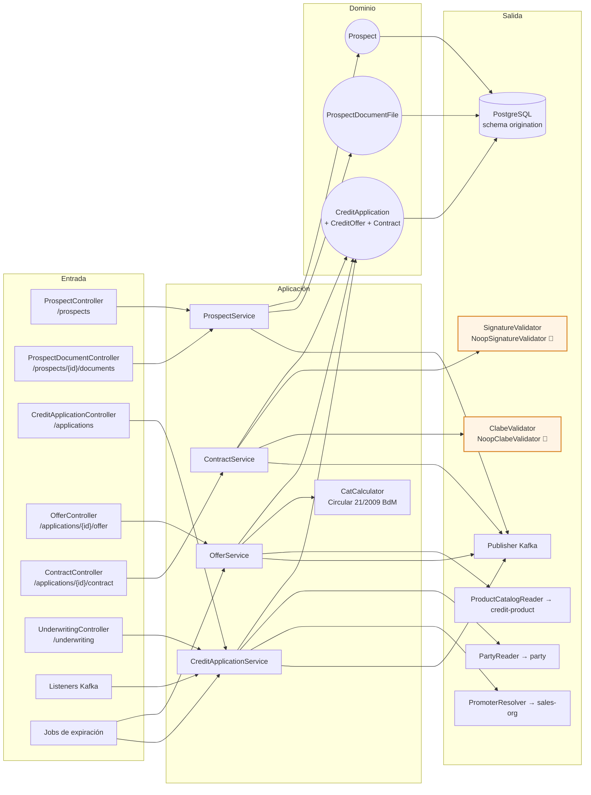
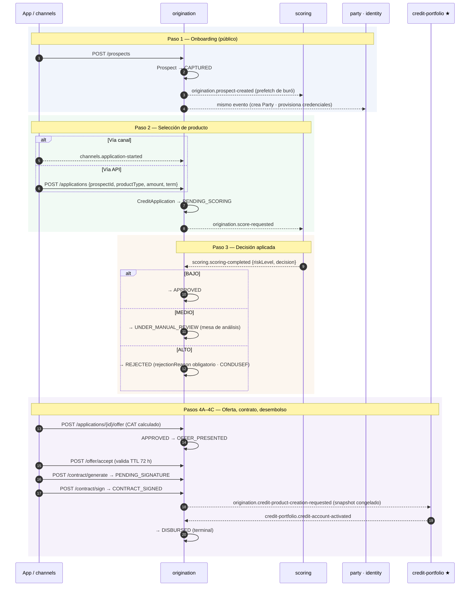
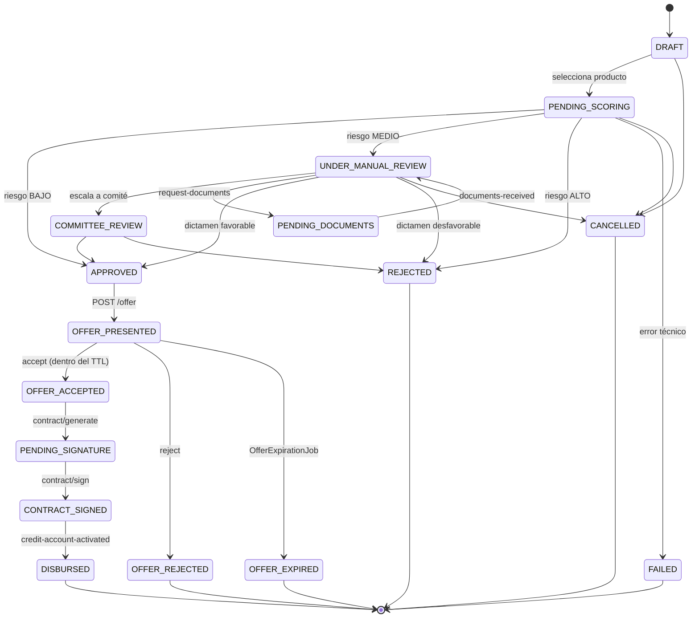
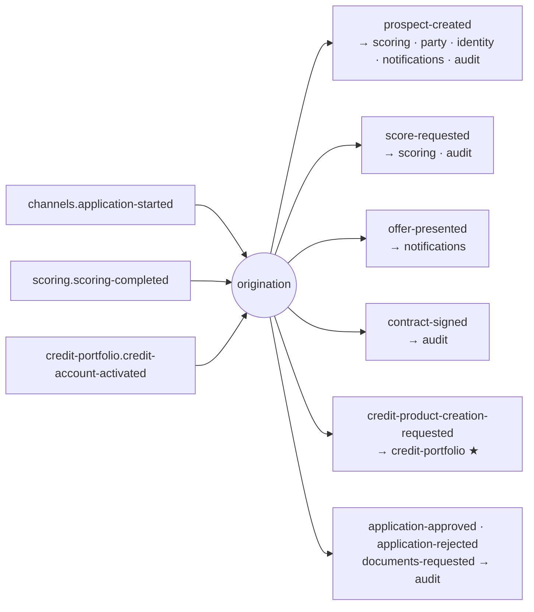

# origination-service (D3)

**Originación de crédito.** Dos subdominios dentro de un mismo bounded context:

1. **`application-intake`** — onboarding de la **persona** (`Prospect`): identidad, expediente,
   consentimientos. Sin elegir producto.
2. **`underwriting`** — ciclo completo de la **solicitud** (`CreditApplication`): producto →
   scoring → decisión → oferta → contrato → firma → desembolso.

> **Persona ≠ crédito** ([ADR-001](../../README.md#decisión-2--originación-persona--crédito)).
> Una persona se onboardea una vez y puede tener N solicitudes en el tiempo. El *prefetch* de buró
> ocurre en el onboarding; la evaluación de riesgo sólo al seleccionar un producto.

| | |
|---|---|
| **Puerto** | `8081` (bootRun) · `:8080` interno en Docker |
| **Schema** | `origination` |
| **Arquitectura** | Hexagonal + Spring Modulith |
| **Régimen Kafka** | Por defecto (sin DLT) |
| **Dominio** | [docs/dominios/03_credit_origination_domain.md](../../docs/dominios/03_credit_origination_domain.md) |

---

## 1. Mapa del servicio



🧪 = adaptador simulado. Ver [§6](#6-dependencias-externas-y-sus-simuladores-locales).

---

## 2. Flujo end-to-end



---

## 3. Máquina de estados — `CreditApplication`



Terminales (`ApplicationStatus.isTerminal()`): `DISBURSED`, `REJECTED`, `OFFER_REJECTED`,
`OFFER_EXPIRED`, `FAILED`, `CANCELLED`. `APPROVED` **no** es terminal: el flujo sigue a oferta.

### Invariantes vivas

| Regla | Qué garantiza |
|---|---|
| **OA-01** | Un estado terminal es inmutable |
| **OA-03** | Una sola solicitud activa por `(prospectId, productType)` — índice único parcial |
| **UW-05** | `REJECTED` exige `rejectionReason` (CONDUSEF) |
| **OM-02** | `offeredAmount ≤ maxAmount` del catálogo |
| **OM-04** | La oferta expira al pasar `validUntil` |
| **CM-04** | El contrato es inmutable después de la firma |
| **CM-06** | La CLABE se valida antes de firmar |

---

## 4. API REST

Base común: `/api/v1/origination` · Swagger local: `http://localhost:8081/swagger-ui.html`

### Prospect (*application-intake*)

| Método | Ruta | Auth | Descripción |
|---|---|---|---|
| `POST` | `/prospects` | Público | Onboarding de la persona → `prospect-created` |
| `GET` | `/prospects/{prospectId}` | Bearer | Detalle del prospecto |
| `GET` | `/prospects/lookup` | Bearer | Resolución por identificador (CURP/RFC/`partyId`) |

### Expediente — archivos y dictamen

| Método | Ruta | Descripción |
|---|---|---|
| `GET` | `/prospects/{prospectId}/documents` | Qué hay en el expediente **y en qué estado de dictamen**, sin descargarlo |
| `GET` | `/prospects/{prospectId}/documents/{documentType}/file` | Descargar los bytes |
| `PUT` | `/prospects/{prospectId}/documents/{documentType}/file` | Subir o reemplazar — **borra el dictamen previo** |
| `PUT` | `/prospects/{prospectId}/documents/{documentType}/review` | Dictaminar: `{decision, reviewedBy, rejectionReason?, verificationSource?}` |

### CreditApplication (*underwriting*)

| Método | Ruta | Descripción |
|---|---|---|
| `POST` | `/applications` | Selección de producto → `score-requested` |
| `GET` | `/applications` · `/applications/{applicationId}` | Listado por prospecto · detalle (incluye oferta y contrato) |
| `GET` | `/underwriting/applications` | **Bandeja del analista**: solicitudes en espera de decisión humana |
| `POST` | `/underwriting/applications/{id}/decision` | Dictamen manual → `APPROVED` / `REJECTED` |
| `POST` | `/underwriting/applications/{id}/request-documents` | → `PENDING_DOCUMENTS` + `documents-requested` |
| `POST` | `/underwriting/applications/{id}/documents-received` | Regresa a revisión |

### Oferta y contrato

| Método | Ruta | Descripción |
|---|---|---|
| `POST` | `/applications/{id}/offer` | Presentar oferta (CAT calculado) → `OFFER_PRESENTED` |
| `POST` | `/applications/{id}/offer/accept` · `/reject` | Aceptar (valida TTL) · rechazar |
| `POST` | `/applications/{id}/contract/generate` | → `PENDING_SIGNATURE`, folio `CTR-YYYYMM-XXXXXXXX` |
| `POST` | `/applications/{id}/contract/sign` | → `CONTRACT_SIGNED` + snapshot a credit-portfolio |

### Soporte (dev-only, `TEST_SUPPORT_ENABLED=true`)

| Método | Ruta | Para qué |
|---|---|---|
| `POST` | `/internal/test-support/applications/{id}/route-to-review` | Llevar una solicitud a revisión manual sin depender del score |

---

## 5. Snapshot `credit-product-creation-requested`

Al firmar, origination resuelve los términos finales contra el catálogo y los manda como
**snapshot congelado**. credit-portfolio crea la cuenta con esos términos y **nunca vuelve a llamar
al catálogo en runtime** — es lo que hace auditable un contrato años después.

```json
{
  "applicationId": "uuid",
  "contractNumber": "CTR-202606-ABCD1234",
  "obligorPartyId": "uuid",
  "productCode": "PL-IND-STD-V1",
  "productType": "PERSONAL_LOAN",
  "productBehavior": "INSTALLMENT",
  "approvedAmount": 50000.00,
  "approvedLine": null,
  "assignedTerm": 12,
  "nominalRate": 0.3200,
  "moratoriumRate": 0.5500,
  "amortizationType": "FRENCH",
  "openingFeeRate": 0.0100,
  "clabeAccount": "032180000118359719",
  "riskTier": "BAJO"
}
```

---

## 6. Dependencias externas y sus simuladores locales

| Dependencia | Puerto de salida | Adaptador | Comportamiento |
|---|---|---|---|
| credit-product-service | `ProductCatalogReader` | `RestClientProductCatalogAdapter` | **Real** — lee la definición para armar la oferta y calcular el CAT |
| party-service | `PartyReader` | `RestClientPartyAdapter` | **Real** — resuelve `partyId → prospectId` en el camino por canal |
| sales-org-service | `PromoterResolver` | `RestClientPromoterResolverAdapter` | **Real** — resuelve el código de promotor a unidad comercial |
| Proveedor de firma (NIP / biometría / e.firma) | `SignatureValidator` | `NoopSignatureValidator` 🧪 | Aprueba siempre |
| Validación de CLABE (SPEI / BANXICO) | `ClabeValidator` | `NoopClabeValidator` 🧪 | Sólo valida el formato (18 dígitos) |

Las tres primeras son las **únicas** llamadas REST salientes del servicio, y las tres son ACL:
traducen el modelo ajeno al propio en el borde. Nada de dominio se lee por REST — eso llega por evento.

---

## 7. Eventos Kafka



**Reintentos:** régimen por defecto (`DefaultErrorHandler`, sin DLT); consumidores idempotentes por
clave de evento. Deserialización tolerante (`USE_TYPE_INFO_HEADERS=false`,
`TRUSTED_PACKAGES=com.fintech.*`). Ver [README raíz §5.4](../../README.md#54-política-de-reintentos-y-dlt-kafka).

---

## 8. Jobs programados

| Job | Cron | Qué hace |
|---|---|---|
| `OfferExpirationJob` | `0 0 * * * *` (cada hora) | Ofertas con `validUntil` vencido → `OFFER_EXPIRED` |
| `DocumentsExpirationJob` | `0 30 * * * *` (cada hora) | Solicitudes estancadas en `PENDING_DOCUMENTS` |

---

## 9. Persistencia — schema `origination`

| Tabla | Contenido |
|---|---|
| `prospects` | Persona onboardeada: identidad, contacto, domicilio, consentimientos |
| `prospect_documents` | Declaración de los documentos esperados (cascada) |
| `prospect_document_files` | Los archivos entregados **con su dictamen** |
| `credit_applications` | Solicitud, con oferta y contrato como columnas embebidas |
| `event_publication` | Outbox de Spring Modulith |

**Columnas de `credit_applications`:**

| Grupo | Columnas |
|---|---|
| Scoring | `score_request_id`, `risk_level`, `decision`, `rejection_reason` |
| Oferta | `offer_product_code`, `offer_behavior`, `offer_amount`, `offer_line`, `offer_term`, `offer_nominal_rate`, `offer_moratorium_rate`, `offer_opening_fee_rate`, `offer_cat`, `offer_valid_until`, `offer_presented_at`, `offer_accepted_at` |
| Contrato | `contract_number`, `contract_signature_method`, `contract_clabe_account`, `contract_document_ref`, `contract_signed_at` |

15 changesets Liquibase bajo `db/changelog/origination/`.

---

## 10. Dictamen de documentos del expediente

`PUT /api/v1/origination/prospects/{prospectId}/documents/{documentType}/review`
→ `{decision: APPROVED|REJECTED, reviewedBy, rejectionReason?, verificationSource?}`

Hasta la migración `015` un documento sólo podía estar entregado o ausente: «revisado y aprobado» y
«recibido y nadie lo ha visto» eran el mismo estado, y el analista no tenía forma de saber qué le
faltaba **por hacer** contra qué le faltaba **por recibir**.

El dictamen vive en el **archivo** y no en la declaración: lo que se revisa es lo entregado, no lo
prometido — y así cubre también la prueba de vida, que sólo existe en `prospect_document_files`.

**Volver a subir un archivo borra el dictamen.** Conservarlo aprobaría a ciegas una foto que nadie
vio, que es justo el caso de quien vuelve a subir tras un rechazo.

Un rechazo **siempre lleva motivo** (regla del dominio y `CHECK` en la tabla): sin él, el solicitante
no sabe qué volver a subir y el siguiente analista no sabe qué revisó el anterior.

`verification_source` (`MANUAL` · `PROVIDER` · `PROVIDER_ESCALATED`) se guarda con el veredicto y no
se deduce de la configuración vigente: un expediente de hace seis meses tiene que poder decir quién
lo revisó *entonces*. Mientras no haya contrato con proveedor de KYC, **todo es `MANUAL`**.

---

## 11. Configuración

| Variable | Default | En producción |
|---|---|---|
| `SERVER_PORT` | `8081` | `8080` en Docker |
| `JWT_SECRET` | — | Obligatorio, compartido con identity |
| `KAFKA_BOOTSTRAP_SERVERS` | `localhost:9092` | Obligatorio |
| `SPRING_DATASOURCE_URL` | `jdbc:postgresql://localhost:5432/fintech` | Obligatorio |
| `CREDIT_PRODUCT_SERVICE_URL` | `http://localhost:8084` | Nombre de servicio en Docker |
| `PARTY_SERVICE_URL` | `http://localhost:8083` | Nombre de servicio en Docker |
| `SALES_ORG_SERVICE_URL` | `http://localhost:8100` | Nombre de servicio en Docker |
| `ORIGINATION_PROSPECT_EXPIRY_DAYS` | `30` | — |
| `TEST_SUPPORT_ENABLED` | `false` | **Debe quedar en `false`** |

---

## 12. Tests y ejecución local

| Clase | Tipo | Cubre |
|---|---|---|
| `ProspectServiceTest` · `ProspectControllerTest` | Unit · `@WebMvcTest` | Registro, unicidad, aviso de privacidad, consentimientos |
| `ProspectRegistrationAcceptanceTest` | Testcontainers | Criterios de aceptación + contrato Kafka |
| `CreditApplicationServiceTest` · `…ControllerTest` | Unit · `@WebMvcTest` | Alta, `score-requested`, OA-03, decisiones |
| `CreditApplicationAcceptanceTest` | Testcontainers | Flujo E2E + auth |
| `ScoringDecisionFlowIT` | Testcontainers + Kafka | scoring → transición |
| `OfferServiceTest` · `OfferControllerTest` | Unit · `@WebMvcTest` | present/accept/reject, OM-02 / OM-04 |
| `ContractServiceTest` · `ContractControllerTest` | Unit · `@WebMvcTest` | generate/sign + validación de CLABE |
| `ContractToPortfolioFlowIT` | Testcontainers + Kafka | Firma → snapshot completo a credit-portfolio |
| `CatCalculatorTest` | Unit | CAT en FRENCH y revolvente, casos borde |

```bash
./gradlew :origination-service:test

docker compose up -d postgres kafka zookeeper
./gradlew :origination-service:bootRun    # → http://localhost:8081
```

| Recurso | URL local |
|---|---|
| Swagger UI | `http://localhost:8081/swagger-ui.html` |
| OpenAPI JSON | `http://localhost:8081/v3/api-docs` |
| Health | `http://localhost:8081/actuator/health` |
