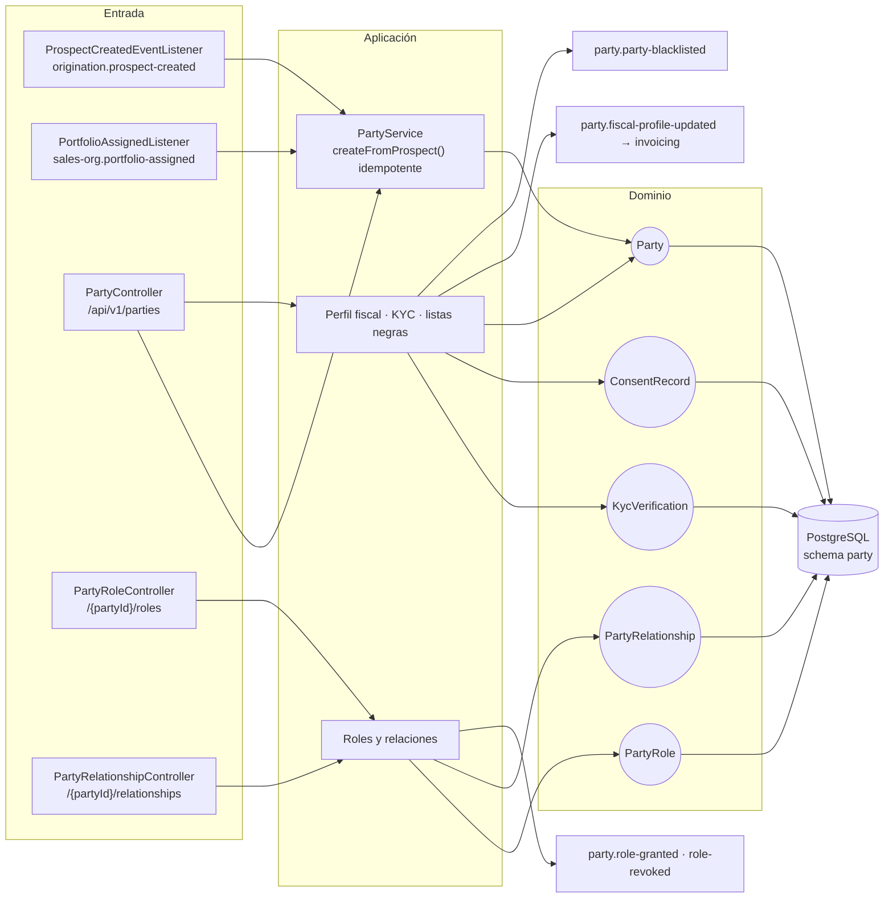
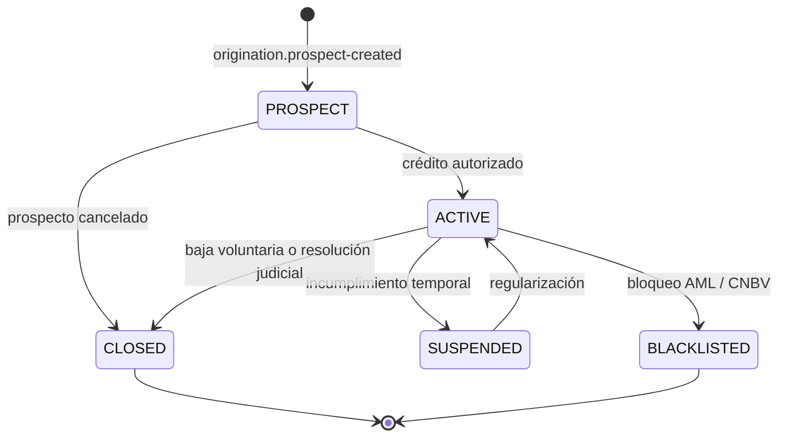
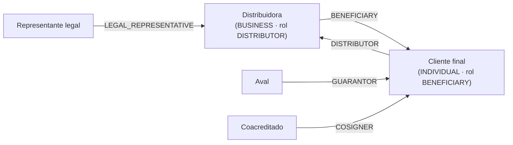

# party-service (D0)

**El sujeto de crédito.** Crea y mantiene el `Party` — la raíz de todo lo demás: cada crédito,
contrato y obligación referencia un `partyId`.

El Party nace solo, cuando origination publica `origination.prospect-created`. Entra en `PROSPECT` y
avanza a `ACTIVE` cuando se autoriza un crédito. La creación es **idempotente**: el mismo
`prospectId` dos veces devuelve el Party existente, no uno nuevo.

| | |
|---|---|
| **Puerto** | `8083` (bootRun) · `:8080` interno en Docker |
| **Schema** | `party` |
| **Arquitectura** | Hexagonal + Spring Modulith |
| **Régimen Kafka** | Por defecto (sin DLT) |
| **Dominio** | [docs/dominios/00_party_domain.md](../../docs/dominios/00_party_domain.md) |

---

---

## Arquitectura

El servicio sigue **arquitectura hexagonal** (Ports & Adapters):



---

## Flujo de creación de Party

### Flujo 1 — Prospect creado (origination)

```
origination-service  ──► Kafka topic: origination.prospect-created
                            key: prospectId
                            payload: ProspectCreatedPayload (campos de identidad)
                                   │
party-service                      ▼
  ProspectCreatedEventListener.onProspectCreated(payload)
         │
         ▼
  PartyService.createFromProspect(payload)
         │
         ├─ existsByProspectId(prospectId)?
         │       YES ──► retorna Party existente (idempotencia)
         │       NO  ──► Party.create(...)
         │                    │
         │                    ▼
         └──────────► party.parties (PostgreSQL)

  → Party creado con status = PROSPECT
```

### Flujo 2 — Evento duplicado (reintento de origination)

```
  Si origination re-publica el evento para el mismo prospecto,
  el listener recibe un segundo evento con el mismo prospectId.

  PartyService.createFromProspect():
    existsByProspectId(prospectId) → true → skip, retorna existente
    → no se crea duplicado
    → log: "Party already exists for prospectId=... — skipping"
```

### Máquina de estados del Party



> En esta fase solo se implementa el estado `PROSPECT`. Las transiciones las gestionarán futuros servicios de autorización crediticia y administración.

---

## Roles y relaciones (I-03)

`PartyType` dice **qué es** el party (`INDIVIDUAL` / `BUSINESS`). `PartyRoleType` dice **qué hace**,
y es aditivo: un party sigue siendo individual o moral y gana o pierde roles con el tiempo.

| `PartyRoleType` | Significado |
|---|---|
| `DISTRIBUTOR` | Coloca crédito B2B2C: sus beneficiarios reciben crédito a través de él |
| `GUARANTOR` | Avala el crédito de otro |
| `BENEFICIARY` | Recibe el beneficio de un crédito colocado por un distribuidor |

Las relaciones se leen siempre en una dirección — *`partyId` **tiene como** `relationshipType` a
`relatedPartyId`*:



**Una relación se cierra, no se borra.** Quién avalaba, o a quién se le colocó un crédito, es un
hecho con fecha: borrarlo dejaría créditos pasados sin explicación.

---

## Kafka consumer

**Topic:** `origination.prospect-created`
**Group ID:** `party-service`
**Offset reset:** `earliest`
**Serialización:** JSON (`@JsonIgnoreProperties(ignoreUnknown=true)` — tolerante a campos nuevos)

### Campos consumidos del evento

```json
{
  "prospectId":       "b4e7f8a9-...",
  "prospectType":     "INDIVIDUAL",
  "firstName":        "Juan",
  "lastName1":        "García",
  "lastName2":        "López",
  "curp":             "GARJ900101HDFXXX01",
  "rfc":              "GARJ900101XXX",
  "dateOfBirth":      "1990-01-01",
  "eventId":          "uuid-string"
}
```

> Los campos de dirección, consentimiento y otros son ignorados (`@JsonIgnoreProperties`).
> Los datos de scoring (`riskLevel`, `totalScore`) llegan vía `scoring.scoring-completed` en un flujo posterior.
> El `Party` no guarda producto — el producto se elige después en una `CreditApplication` (persona ≠ crédito, ADR-001).

---

## Correr localmente

**Prerequisitos:** Java 21, Docker.

```bash
# Desde la raíz del monorepo

# 1. Infraestructura (PostgreSQL + Kafka)
docker compose up postgres kafka zookeeper -d

# 2. origination-service (publica el evento que dispara party-service)
docker compose --profile origination-service up -d

# 3. party-service
./gradlew :party-service:bootRun
```

Inicia en `http://localhost:8083`.
Swagger UI: `http://localhost:8083/swagger-ui.html`

### Con Docker (imagen completa)

```bash
docker build --build-arg SERVICE=party-service -t fintech/party-service .
docker compose --profile party-service up
```

---

## Variables de entorno

| Variable | Default | Requerido | Descripción |
|---|---|---|---|
| `KAFKA_BOOTSTRAP_SERVERS` | `localhost:9092` | Sí (prod) | Brokers Kafka |
| `SPRING_DATASOURCE_URL` | `jdbc:postgresql://localhost:5432/fintech` | No | URL JDBC de PostgreSQL |
| `SPRING_DATASOURCE_USERNAME` | `fintech` | No | |
| `SPRING_DATASOURCE_PASSWORD` | `fintech` | No | |
| `SERVER_PORT` | `8083` | No | Puerto HTTP |
| `PARTY_PORT` | `8083` | No | Puerto expuesto en Docker Compose |

---

## Endpoints

### Party — `/api/v1/parties`

| Método | Ruta | Descripción |
|---|---|---|
| `GET` | `/` | Búsqueda paginada, con filtros |
| `GET` | `/{partyId}` | Ficha del party |
| `GET` | `/by-prospect/{prospectId}` | Resolución por el `prospectId` de originación |
| `GET` | `/batch` | Resolución en lote por ids — evita el N+1 desde los BFF |
| `PUT` | `/{partyId}/executive` | Asignar ejecutivo |
| `PUT` | `/{partyId}/kyc-status` | Actualizar estado de KYC |
| `GET` | `/{partyId}/kyc-verifications` | Historial de verificaciones |
| `PUT` | `/{partyId}/fiscal-profile` | Perfil fiscal → `party.fiscal-profile-updated` |
| `POST` | `/{partyId}/blacklist` | Bloqueo AML/CNBV → `party.party-blacklisted` |

### Roles — `/api/v1/parties/{partyId}/roles`

| Método | Ruta | Descripción |
|---|---|---|
| `GET` · `POST` | `/` | Roles del party · otorgar |
| `DELETE` | `/{roleType}` | Revocar |

### Relaciones — `/api/v1/parties/{partyId}/relationships`

| Método | Ruta | Descripción |
|---|---|---|
| `GET` | `/` · `/incoming` | Relaciones salientes · entrantes |
| `POST` | `/` | Crear relación |
| `DELETE` | `/{relationshipId}` | Cerrar la relación (no se borra el hecho) |

### GET `/api/v1/parties/{partyId}` — Response 200

```json
{
  "partyId":          "f8a9b0c1-...",
  "prospectId":       "b4e7f8a9-...",
  "evaluationId":     null,
  "partyType":        "INDIVIDUAL",
  "status":           "PROSPECT",
  "firstName":        "Juan",
  "lastName1":        "García",
  "lastName2":        "López",
  "curp":             "GARJ900101HDFXXX01",
  "rfc":              "GARJ900101XXX",
  "dateOfBirth":      "1990-01-01",
  "riskLevel":        null,
  "totalScore":       null,
  "createdAt":        "2026-05-19T18:00:01Z"
}
```

**Response 404:**
```json
{
  "type":   "https://fintech.com/errors/PARTY_NOT_FOUND",
  "status": 404,
  "detail": "Party not found: f8a9b0c1-..."
}
```

---

## Base de datos

Schema PostgreSQL: **`party`**. Liquibase (YAML) gestiona las migraciones automáticamente al arrancar.

### `party.parties`

| Columna | Tipo | Descripción |
|---|---|---|
| `party_id` | UUID PK | Generado al crear |
| `prospect_id` | UUID UNIQUE | Referencia a origination-service (sin FK cross-service) |
| `evaluation_id` | UUID nullable | Evaluación de scoring que autorizó. Null en PROSPECT. |
| `party_type` | VARCHAR(20) | `INDIVIDUAL \| BUSINESS` — inmutable |
| `status` | VARCHAR(20) | `PROSPECT \| ACTIVE \| SUSPENDED \| BLACKLISTED \| CLOSED` — default `PROSPECT` |
| `first_name` | VARCHAR(100) | Nombre(s) |
| `last_name1` | VARCHAR(100) | Apellido paterno |
| `last_name2` | VARCHAR(100) | Apellido materno. Nullable. |
| `curp` | CHAR(18) UNIQUE | CURP del sujeto |
| `rfc` | VARCHAR(13) | RFC. Nullable. |
| `date_of_birth` | DATE | Fecha de nacimiento |
| `risk_level` | VARCHAR(10) nullable | Nivel de riesgo asignado por scoring. Null en PROSPECT. |
| `total_score` | INTEGER nullable | Score final del evaluador. Null en PROSPECT. |
| `created_at` | TIMESTAMPTZ | Inmutable — momento de creación |

**Constraints:**

| Nombre | Tipo | Definición |
|---|---|---|
| `pk_parties` | PRIMARY | `party_id` |
| `uq_parties_prospect_id` | UNIQUE | `prospect_id` |
| `uq_parties_curp` | UNIQUE | `curp` |
| `ck_party_type` | CHECK | `party_type IN ('INDIVIDUAL','BUSINESS')` |
| `ck_party_status` | CHECK | `status IN ('PROSPECT','ACTIVE','SUSPENDED','BLACKLISTED','CLOSED')` |
| `ck_risk_level` | CHECK | `risk_level IS NULL OR risk_level IN ('BAJO','MEDIO','ALTO')` |

**Índices:**

| Índice | Columna | Propósito |
|---|---|---|
| `idx_parties_created_at` | `created_at` | Ordenar por fecha |
| `idx_parties_curp` | `curp` | Búsqueda por CURP |

---

## Tests

| Clase | Tipo | Descripción |
|---|---|---|
| `PartyServiceTest` | Unit (Mockito) | Creación de PROSPECT, idempotencia, `findById`, `findByProspectId`. Verifica que `evaluationId`/`riskLevel`/`totalScore` son `null` al crear. |
| `ScoringApprovedEventListenerTest` | Unit (Mockito) | Delegación de `ProspectCreatedEventListener` al servicio, propagación de excepciones |

```bash
./gradlew :party-service:test
```

**Resultado actual:** 6 tests · 0 fallos · 0 skipped

---

## Swagger / OpenAPI

| Recurso | URL |
|---|---|
| Swagger UI | `http://localhost:8083/swagger-ui.html` |
| OpenAPI JSON | `http://localhost:8083/v3/api-docs` |
| Actuator health | `http://localhost:8083/actuator/health` |


---

## Eventos Kafka

**Consume:** `origination.prospect-created` (crea el Party) · `sales-org.portfolio-assigned` (sella
el ejecutivo que atiende al cliente).

**Produce:**

| Tópico | Consumidores |
|---|---|
| `party.fiscal-profile-updated` | invoicing |
| `party.executive-assigned` | notifications — le avisa al ejecutivo que el cliente es suyo |
| `party.party-blacklisted` · `party.role-granted` · `party.role-revoked` | *sin consumidor hoy* — traza |

`party.executive-assigned` es un **hecho**, no una petición de aviso: lleva las dos identidades y
sus nombres, y no menciona claves de evento, tipos de destinatario ni canales. Ese vocabulario es
del notificador, y meterlo aquí acoplaría el núcleo del negocio a un canal. Quien quiera reaccionar
se suscribe — hoy notifications; mañana auditoría, la estructura comercial o comisiones, sin que
party se entere.

Lleva los **nombres** además de los ids a propósito: quien reaccione necesita decir *quién* y *a
quién*, y obligarle a consultar party para eso le añadiría una dependencia síncrona a cambio de dos
cadenas que en el momento de publicar ya están en la mano.

La clave del mensaje es el **ejecutivo**, no el cliente: quien consuma esto agrupa por ejecutivo
—su cartera, su bandeja, su aviso— y así todo lo suyo cae en la misma partición y en orden.

Se publica **después** de guardar y sin atarlo al resultado: si la publicación falla, el cliente ya
quedó asignado, que es lo que importa. Un hecho no publicado se nota mucho menos que una asignación
perdida.

**Reintentos:** régimen por defecto, sin DLT.
Ver [README raíz §5.4](../../README.md#54-política-de-reintentos-y-dlt-kafka).
