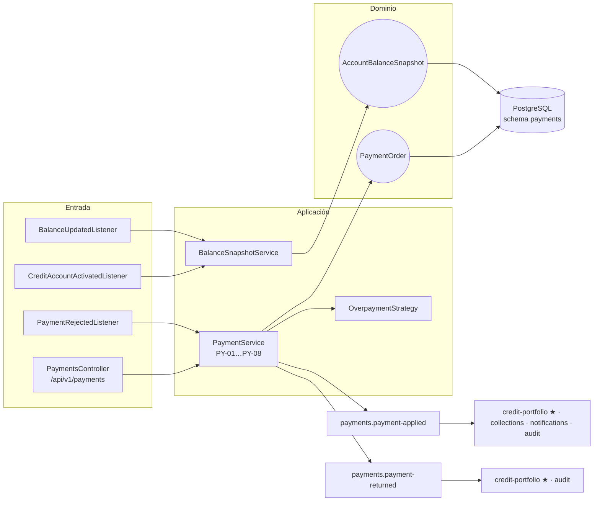
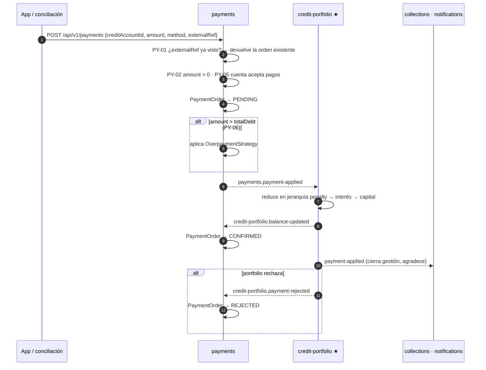
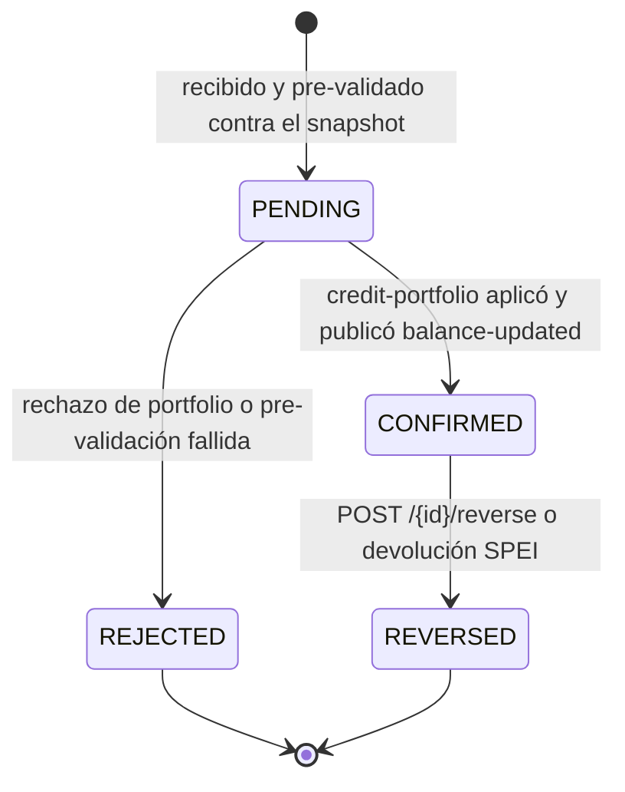
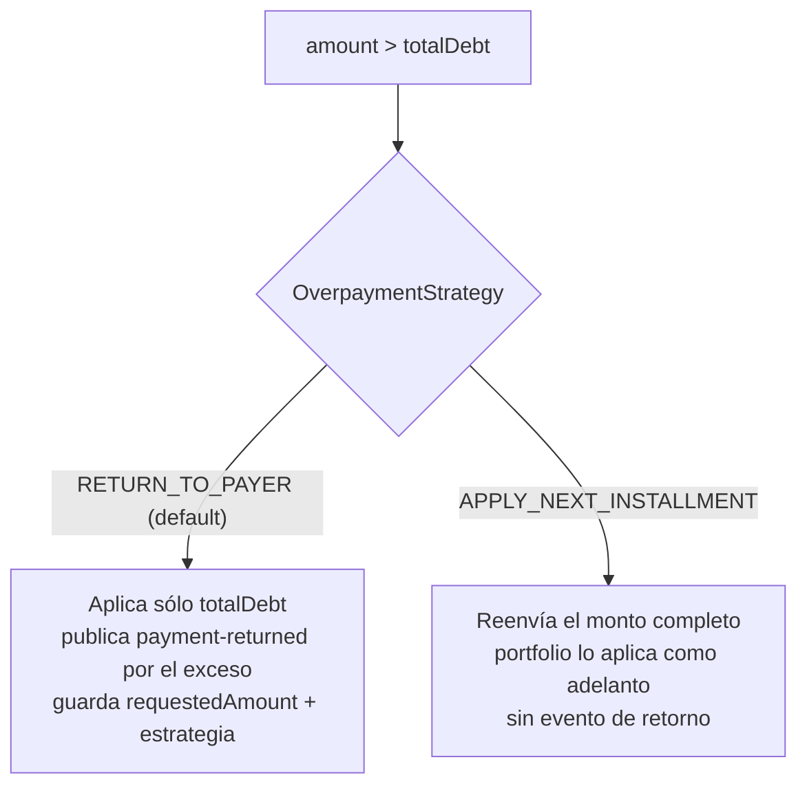
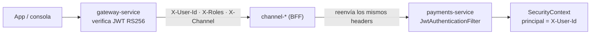

# payments-service (D6)

**Recepción y aplicación de pagos** sobre cuentas de crédito activas. Registra el pago recibido por
cualquier vía (SPEI, CoDi, domiciliación, ventanilla, tarjeta, traspaso interno), lo pre-valida
contra su proyección de saldo y publica el hecho para que
[credit-portfolio](../credit-portfolio-service/README.md) lo aplique a la fuente de verdad.

**No escribe saldos.** Igual que charges, es la mitad "calcula" del patrón de ADR-001: el pago se
confirma cuando portfolio responde, no cuando payments lo recibe.

| | |
|---|---|
| **Puerto** | `8089` (bootRun) · `:8080` interno en Docker |
| **Schema** | `payments` |
| **Auth** | **Header-trust** — no valida JWT (ver §5) |
| **Régimen Kafka** | Por defecto (sin DLT) |
| **Dominio** | [docs/dominios/06_payments_domain.md](../../docs/dominios/06_payments_domain.md) |

---

## 1. Mapa del servicio



---

## 2. Ciclo de un pago





---

## 3. Reglas de negocio

| ID | Regla | Detalle |
|---|---|---|
| **PY-01** | Idempotencia | `externalRef` con índice único. La segunda llamada con el mismo ref devuelve la orden existente, no una nueva |
| **PY-02** | Monto positivo | `amount > 0`, validado antes de tocar el saldo |
| **PY-05** | Cuenta que acepta pagos | `WRITTEN_OFF` y `CLOSED` rechazan; `ACTIVE` y `SUSPENDED` aceptan |
| **PY-06** | Excedente | `amount > totalDebt` dispara la `OverpaymentStrategy` configurada |
| **PY-07** | Ventanilla no reversible | `PaymentMethod.allowsReversal()` es `false` para `VENTANILLA` — el efectivo ya salió del mostrador |
| **PY-08** | Ventana de reversión | `reversal-window-hours` (default 72 h); fuera de ella, excepción |

**`PaymentMethod`:** `SPEI` · `CODI` · `DOMICILIACION` · `VENTANILLA` · `TARJETA` · `INTERNAL_TRANSFER`.

### Excedente (PY-06)



```yaml
app:
  payments:
    reversal-window-hours: 72
    overpayment-strategy: RETURN_TO_PAYER   # o APPLY_NEXT_INSTALLMENT
```

---

## 4. API REST

**Base:** `/api/v1/payments`

| Método | Ruta | Descripción |
|---|---|---|
| `POST` | `/` | Registrar un pago (idempotente por `externalRef`) |
| `GET` | `/{paymentOrderId}` | Detalle de la orden |
| `GET` | `/accounts/{creditAccountId}` | Pagos de una cuenta |
| `GET` | `/accounts/{creditAccountId}/balance` | Snapshot de saldo que ve payments |
| `POST` | `/{paymentOrderId}/reverse` | Reversar (respeta PY-07 y PY-08) |

---

## 5. Autenticación — modelo *header-trust*



| Archivo | Responsabilidad |
|---|---|
| `JwtAuthenticationFilter.java` | Lee `X-User-Id` y `X-Roles`; sin llave secreta |
| `PaymentsProperties.java` | No tiene campo `jwtSecret` |
| `application.yml` | No define `jwt-secret` ni `JWT_SECRET` |

---

## 6. Eventos Kafka

**Consume:** `credit-portfolio.credit-account-activated` (inicializa snapshot) ·
`credit-portfolio.balance-updated` (mantiene snapshot, confirma órdenes) ·
`credit-portfolio.payment-rejected`.

**Produce:** `payments.payment-applied` (→ credit-portfolio, collections, notifications, audit) ·
`payments.payment-returned` (→ credit-portfolio, audit).

**Reintentos:** régimen por defecto, sin DLT.
Ver [README raíz §5.4](../../README.md#54-política-de-reintentos-y-dlt-kafka).

---

## 7. Persistencia — schema `payments`

5 changesets Liquibase bajo `db/changelog/payments/`. Tablas: `payment_orders`,
`account_balance_snapshots`.

```yaml
spring:
  liquibase:
    default-schema: payments
    liquibase-schema: public     # DATABASECHANGELOG fuera del schema del dominio
```

---

## 8. Configuración

| Variable | Default | Nota |
|---|---|---|
| `SERVER_PORT` | `8089` | `8080` en Docker |
| `POSTGRES_USER` / `POSTGRES_PASSWORD` | `fintech` / `fintech` | |
| `KAFKA_BOOTSTRAP_SERVERS` | `localhost:9092` | |
| `SPRING_PROFILES_ACTIVE` | — | `docker` en Compose |

Sin `JWT_SECRET`: el modelo es header-trust.

---

## 9. Tests y ejecución local

| Clase | Cubre |
|---|---|
| `PaymentServiceTest` | Alta válida, excedente en ambas estrategias, idempotencia, sin snapshot, rechazo por `eventId`, reversa, `WRITTEN_OFF`/`CLOSED`, ventana expirada, `VENTANILLA` |
| `BalanceSnapshotServiceTest` | Init, idempotencia, upsert, `canAcceptPayment`, `isAccountActive` |
| `PaymentsControllerTest` | `401` sin identidad, alta, consulta de saldo, `404`, reversa |

```bash
./gradlew :payments-service:test

docker compose up -d                  # plataforma completa
docker compose up -d payments-service # sólo este (requiere postgres, kafka, credit-portfolio)
```
