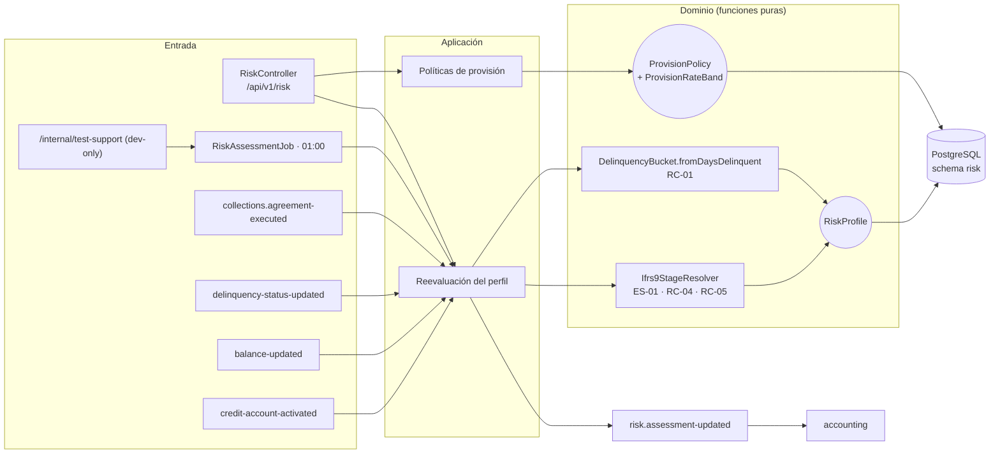
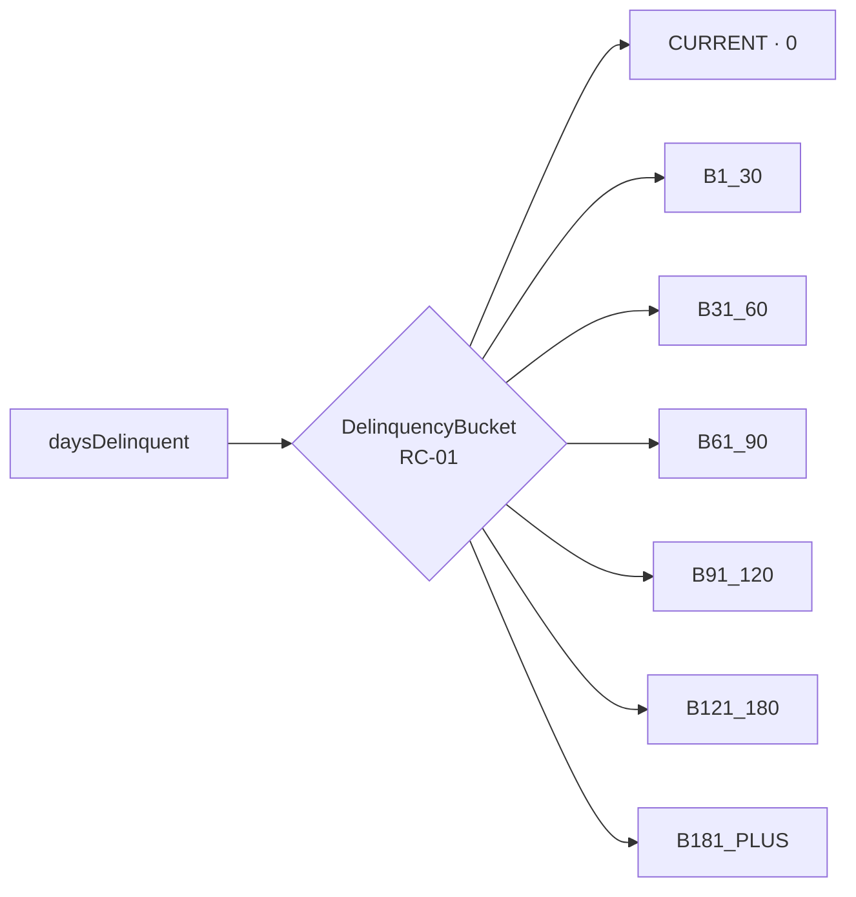
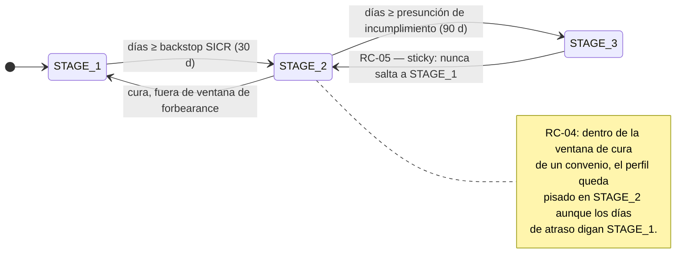
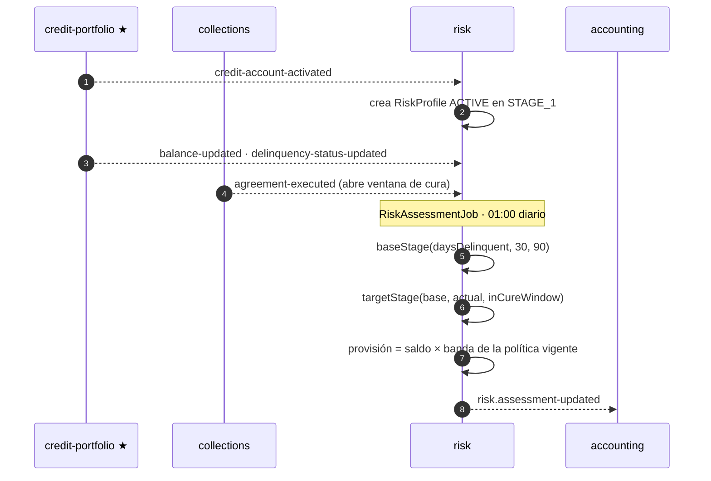

# risk-service (D9)

**Riesgo de la cuenta viva** — distinto de [scoring](../scoring-service/README.md), que evalúa a la
persona *antes* de originar. risk mantiene el **perfil IFRS-9 por cuenta** (etapa 1/2/3, bucket de
atraso, provisión) a partir de la actividad de cartera, administra las **políticas de provisión**
por tipo de producto y publica la valuación para contabilidad.

| | |
|---|---|
| **Puerto** | `8094` (bootRun) · `:8080` interno en Docker |
| **Schema** | `risk` |
| **Arquitectura** | Hexagonal + Spring Modulith |
| **Régimen Kafka** | Por defecto (sin DLT) |
| **Dominio** | [docs/dominios/09_risk_domain.md](../../docs/dominios/09_risk_domain.md) |

---

## 1. Mapa del servicio



---

## 2. Modelo IFRS-9

| Agregado | Rol |
|---|---|
| `RiskProfile` | Perfil por `creditAccountId`: etapa, bucket, provisión. `ACTIVE` se recalcula cada noche; `CLOSED` congela el `provisionAmount` (**RC-06**) |
| `ProvisionPolicy` | Política por tipo de producto — `DRAFT` · `ACTIVE` · `DEPRECATED` |
| `ProvisionRateBand` | Tasa de pérdida esperada por tramo de atraso dentro de una política |

### Etapas y buckets





| Etapa | Significado | Pérdida esperada |
|---|---|---|
| `STAGE_1` | *Performing* | ECL 12 meses |
| `STAGE_2` | SICR — aumento significativo del riesgo | ECL *lifetime*, backstop 30 d |
| `STAGE_3` | Deteriorado / incumplimiento | ECL *lifetime*, presunción rebatible 90 d |

`Ifrs9StageResolver` y `DelinquencyBucket` son **funciones puras**, sin persistencia ni efectos:
trivialmente testeables y **deliberadamente duplicadas** con collections en vez de acoplar ambos
servicios por un evento `bucket-computed` compartido (ver §Decisiones del documento de dominio).

---

## 3. Cómo se reevalúa un perfil



---

## 4. API REST — `/api/v1/risk`

| Método | Ruta | Descripción |
|---|---|---|
| `GET` | `/accounts` | Perfiles con filtros y paginación (sin exigir `partyId`) |
| `GET` | `/accounts/batch?ids=` | Hidrata varias cuentas en **una** consulta — mata el N+1 del BFF |
| `GET` | `/accounts/{creditAccountId}` | Perfil de una cuenta |
| `GET` | `/provisions/summary` | Provisión agregada de la cartera |
| `GET` | `/provision-policies` · `/provision-policies/{productType}` | Políticas vigentes |
| `POST` | `/provision-policies` | Alta de política |

### Soporte (dev-only, `TEST_SUPPORT_ENABLED=true`)

| Método | Ruta | Para qué |
|---|---|---|
| `POST` | `/internal/test-support/run-risk-assessment` | Correr la reevaluación sin esperar a la 01:00 |

---

## 5. Eventos Kafka

**Consume:** `credit-portfolio.credit-account-activated` · `credit-portfolio.balance-updated` ·
`credit-portfolio.delinquency-status-updated` · `collections.agreement-executed`.

**Produce:** `risk.assessment-updated` (→ accounting).

**Reintentos:** régimen por defecto, sin DLT.
Ver [README raíz §5.4](../../README.md#54-política-de-reintentos-y-dlt-kafka).

---

## 6. Jobs programados

| Job | Cron | Qué hace |
|---|---|---|
| `RiskAssessmentJob` | `0 0 1 * * *` | Reevalúa todos los perfiles `ACTIVE` y publica la valuación |

---

## 7. Persistencia y ejecución

Schema `risk`, 7 changesets Liquibase bajo `db/changelog/risk/`. Tablas: `risk_profiles`,
`provision_policies`, `provision_rate_bands`.

```bash
./gradlew :risk-service:test
docker compose up -d risk-service
```
