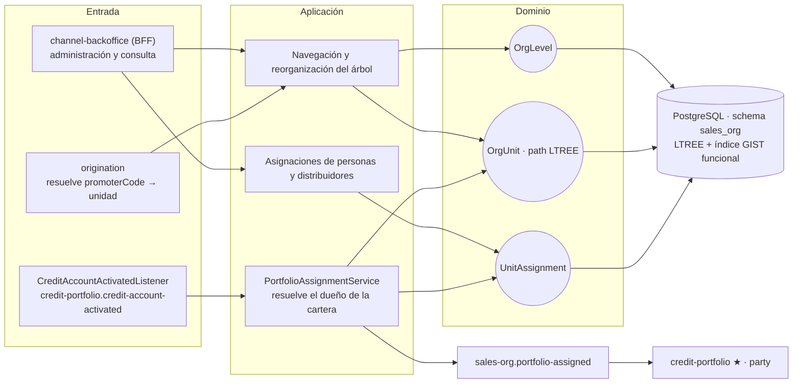
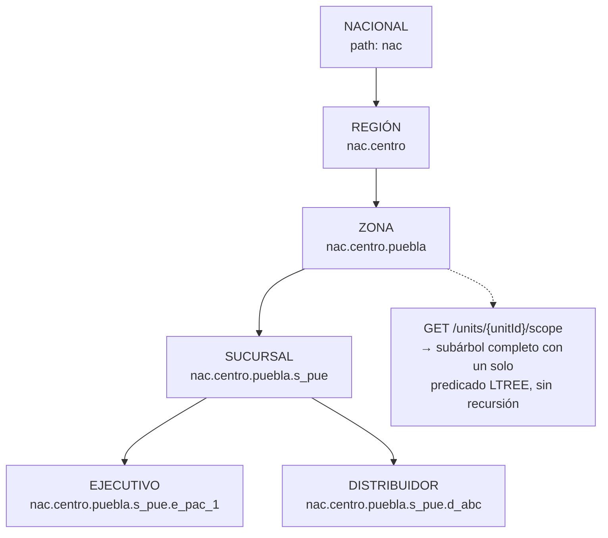
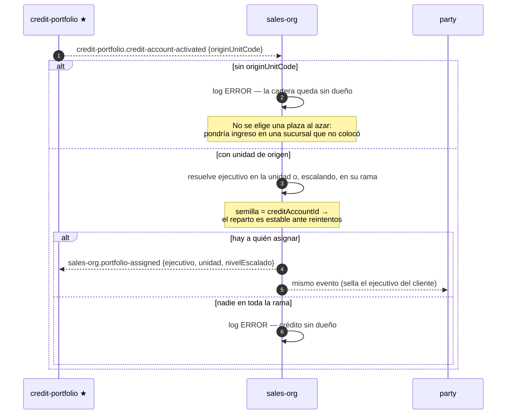

# sales-org-service (D10)

**Estructura de la red comercial.** Modela la jerarquía como **nodos con niveles configurables**
—NACIONAL → REGIÓN → ZONA → SUCURSAL → EJECUTIVO → DISTRIBUIDOR— y responde la pregunta operativa
que la cuelga todo: **quién puede ver a quién**. El árbol se recorre con Postgres **LTREE**
(columna `TEXT` + índice GIST funcional sobre `path::ltree`), de modo que un subárbol se consulta
sin recursión aplicativa.

Además **asigna la cartera**: cuando un crédito se activa, resuelve qué ejecutivo de qué sucursal
queda como dueño de esa relación.

| | |
|---|---|
| **Puerto** | `8100` (bootRun) · `:8080` interno en Docker |
| **Schema** | `sales_org` |
| **Arquitectura** | Hexagonal + Spring Modulith |
| **Régimen Kafka** | Por defecto (sin DLT) |

---

## 1. Mapa del servicio



---

## 2. Dominio

| Agregado | Rol |
|---|---|
| `OrgLevel` | Nivel configurable de la jerarquía (orden, nombre) — **los niveles son datos, no un enum** |
| `OrgUnit` | Nodo del árbol, con su `path` LTREE y su `code` de negocio |
| `UnitAssignment` | Asignación de una persona o distribuidor a una unidad, **con historial** |

`AssigneeType`: `STAFF` (por `staffUserId`) · `DISTRIBUTOR` (por `partyId`) — la misma tabla sirve
a ambos, que es lo que permite habilitar distribuidores sin migración estructural.



Mover una rama (`PUT /units/{unitId}/parent`) **recalcula los paths** de todo el subárbol: el
alcance se mantiene correcto sin tocar las asignaciones.

---

## 3. Asignación de cartera



Reprocesar el evento **no mueve la cartera de manos**: la semilla del reparto es el id del crédito,
no un contador ni un azar.

---

## 4. API REST — `/api/v1/sales-org`

### Niveles

| Método | Ruta | Descripción |
|---|---|---|
| `GET` · `POST` | `/levels` | Catálogo de niveles de la jerarquía |

### Unidades — `/units`

| Método | Ruta | Descripción |
|---|---|---|
| `GET` · `POST` | `/units` | Listado y alta |
| `GET` | `/units/{unitId}` · `/children` · `/subtree` | Navegación del árbol |
| `GET` | `/units/{unitId}/scope` | Alcance: el subárbol que esa unidad puede ver |
| `GET` | `/units/{unitId}/executives` · `/distributors` | Hojas por tipo |
| `PUT` | `/units/{unitId}/parent` | Reorganizar: mueve la rama y recalcula paths |
| `GET` · `PUT` | `/units/by-code/{code}/vat-rate` | Tasa de IVA de la unidad |

### Asignaciones

| Método | Ruta | Descripción |
|---|---|---|
| `POST` · `GET` | `/units/{unitId}/assignments` | Asignar y listar |
| `GET` | `/assignments/{assigneeType}/{assigneeId}/current` · `/history` | Asignación vigente e histórica |
| `DELETE` | `/assignments/{assigneeType}/{assigneeId}` | Desasignar |

### Distribuidores

| Método | Ruta | Descripción |
|---|---|---|
| `GET` | `/distributors/by-code/{code}` | Resolver un distribuidor por código |

---

## 5. Eventos Kafka

**Consume:** `credit-portfolio.credit-account-activated`.

**Produce:** `sales-org.portfolio-assigned` → credit-portfolio, party.

**Reintentos:** régimen por defecto, sin DLT.
Ver [README raíz §5.4](../../README.md#54-política-de-reintentos-y-dlt-kafka).

---

## 6. Persistencia y ejecución

Schema `sales_org`, 8 changesets Liquibase bajo `db/changelog/sales-org/`, incluida la extensión
LTREE y el índice GIST funcional.

> El `path` es una columna `TEXT` con índice **GIST funcional** sobre `path::ltree`, no una columna
> `ltree` nativa: así Hibernate mapea el campo sin un tipo custom y la consulta de subárbol sigue
> usando el índice.

```bash
./gradlew :sales-org-service:test
docker compose up -d sales-org-service
```
