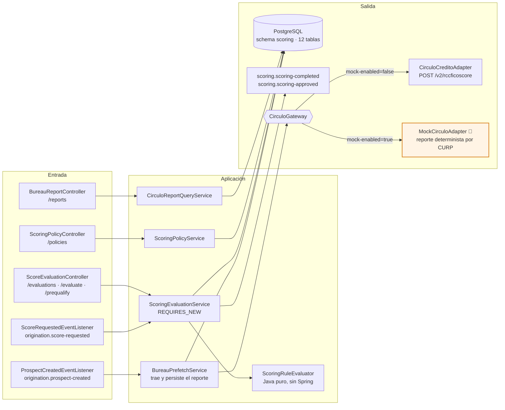
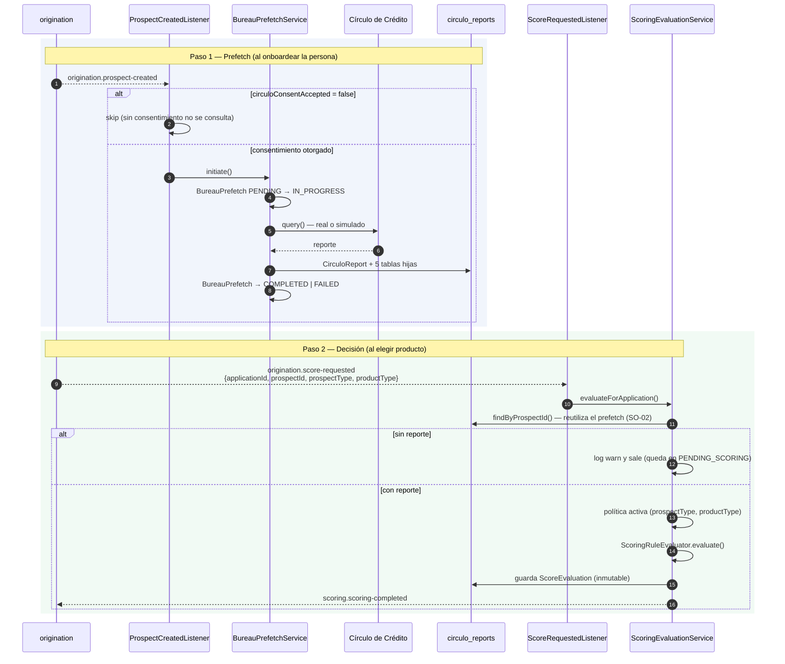
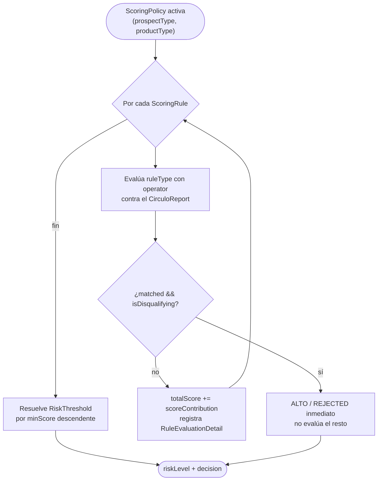
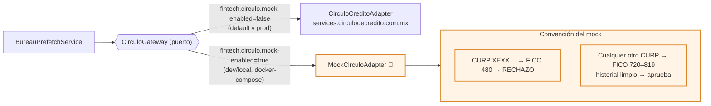
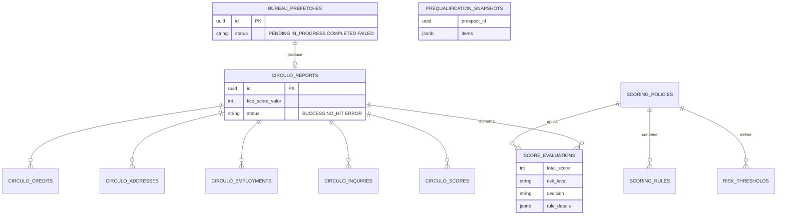

# scoring-service (D2)

**Evaluación de riesgo crediticio.** Consulta el historial del prospecto en **Círculo de Crédito**,
aplica una política de reglas configurable por `(prospectType, productType)` y publica la decisión.

| Decisión | Nivel | Significado |
|---|---|---|
| `AUTO_APPROVED` | `BAJO` | El score supera el umbral del producto |
| `MANUAL_REVIEW` | `MEDIO` | Va a mesa de análisis |
| `REJECTED` | `ALTO` | No alcanza el mínimo, o una regla descalificante se cumplió |

El evento se publica **siempre**, para las tres decisiones, y lleva el `applicationId`. Los
consumidores deciden qué hacer con cada resultado — scoring no conoce el flujo de originación.

> **El trigger está partido en dos** (ADR-001 Fase D): `origination.prospect-created` sólo dispara
> el **prefetch** del buró, sin evaluar. La **evaluación** llega con `origination.score-requested`,
> cuando la persona ya eligió producto, y reutiliza el reporte pre-cargado.

| | |
|---|---|
| **Puerto** | `8082` (bootRun) · `:8080` interno en Docker |
| **Schema** | `scoring` |
| **Arquitectura** | Hexagonal + Spring Modulith |
| **Régimen Kafka** | Por defecto (sin DLT) |
| **Dominio** | [docs/dominios/02_scoring_domain.md](../../docs/dominios/02_scoring_domain.md) |

---

## 1. Mapa del servicio



---

## 2. Flujo en dos pasos



> La evaluación corre en `REQUIRES_NEW`: si falla, el reporte ya persistido **no** se revierte; si
> falla la publicación a Kafka, la `ScoreEvaluation` guardada **no** se revierte. Preferimos un
> hueco de publicación reintentable a perder la consulta al buró, que cuesta dinero y deja huella.

---

## 3. Motor de reglas



### Tipos de regla (`RuleType`)

| Tipo | Dato evaluado | Config extra |
|---|---|---|
| `FICO_THRESHOLD` | `circulo_reports.fico_score_valor` | — |
| `MORA_CHECK` | `MAX(circulo_credits.peor_atraso)` | `creditType` (`null` = todos) |
| `CREDIT_COUNT` | `COUNT(circulo_credits)` | `creditType` |
| `BALANCE_CHECK` | `SUM(circulo_credits.saldo_vencido)` | `creditType` |
| `INQUIRY_COUNT` | `COUNT(circulo_inquiries)` en ventana | `periodMonths` |

Operadores (`RuleOperator`): `GT` · `GTE` · `LT` · `LTE` · `EQ`.

Una regla con `isDisqualifying=true` que se cumple corta la evaluación: `ALTO / REJECTED` sin mirar
el resto. Los tres niveles de umbral deben cubrir todo el rango de score (el `ALTO` es el catch-all
con `minScore` muy negativo).

### Política semilla (migración `007`) — `INDIVIDUAL / PERSONAL_LOAN`

| Regla | Tipo | CreditType | Op | Umbral | Puntos | Descalifica |
|---|---|---|---|---|---|---|
| Mora > 90 días | `MORA_CHECK` | todos | `GT` | 90 | −500 | **sí** |
| FICO ≥ 750 | `FICO_THRESHOLD` | — | `GTE` | 750 | +200 | no |
| FICO ≥ 700 | `FICO_THRESHOLD` | — | `GTE` | 700 | +100 | no |
| FICO ≥ 650 | `FICO_THRESHOLD` | — | `GTE` | 650 | +50 | no |
| Máx. 3 tarjetas | `CREDIT_COUNT` | `TC` | `LTE` | 3 | +50 | no |
| Máx. 5 consultas/12 m | `INQUIRY_COUNT` | — | `LTE` | 5 | +30 | no |

Umbrales: `BAJO ≥ 200 → AUTO_APPROVED` · `MEDIO ≥ 100 → MANUAL_REVIEW` · `ALTO ≥ −9999 → REJECTED`.

---

## 4. Dependencias externas y sus simuladores locales



| Dependencia real | Adaptador | Se elige con | Nota |
|---|---|---|---|
| Círculo de Crédito — `POST /v2/rccficoscore` | `CirculoCreditoAdapter` | `fintech.circulo.mock-enabled=false` | Default del servicio. `CIRCULO_CREDITO_BASE_URL` apunta al **sandbox** |
| Simulador local | `MockCirculoAdapter` 🧪 | `SCORING_CIRCULO_MOCK_ENABLED=true` | Activado en `docker-compose.yml` para poder correr el journey completo sin internet |

**Por qué existe el mock:** el sandbox de Círculo rechaza con `400` los CURP sintéticos que usan las
semillas de demo, así que sin él el ciclo de crédito no arranca en local. El adaptador es
determinista (deriva el FICO del hash del CURP), loguea `WARN` en cada llamada y **no debe
activarse en producción**. El historial que devuelve está limpio a propósito: así la decisión la
determina puramente la banda de FICO de la política, sin ruido de mora.

---

## 5. API REST

Swagger local: `http://localhost:8082/swagger-ui.html`

### Políticas — `/api/v1/scoring/policies`

| Método | Ruta | Descripción |
|---|---|---|
| `GET` | `/` | Políticas activas |
| `GET` | `/rule-types` | Catálogo de `RuleType` y operadores (lo consume el backoffice) |
| `GET` | `/{policyId}` | Detalle |
| `POST` | `/` | Crear política — desactiva la anterior del mismo `(prospectType, productType)` |
| `DELETE` | `/{policyId}` | Desactivar |

### Evaluaciones — `/api/v1/scoring`

| Método | Ruta | Descripción |
|---|---|---|
| `GET` | `/evaluations/{prospectId}/latest` | Última evaluación del prospecto |
| `POST` | `/evaluate/{prospectId}` | Re-evaluar a mano con el reporte ya consultado |
| `POST` | `/prequalify/{prospectId}` | Precalificación: qué productos alcanza hoy (`PrequalificationSnapshot`) |

### Reportes de buró — `/api/v1/scoring/reports`

| Método | Ruta | Descripción |
|---|---|---|
| `GET` | `/by-prospect/{prospectId}` | Reporte crudo de Círculo, para la mesa de análisis |

<details>
<summary><code>POST /api/v1/scoring/policies</code> — cuerpo</summary>

```json
{
  "prospectType": "INDIVIDUAL",
  "productTypeIntent": "PERSONAL_LOAN",
  "name": "Política FICO Premium",
  "description": "Bandas FICO con verificación de mora",
  "rules": [
    { "ruleType": "MORA_CHECK", "operator": "GT", "thresholdValue": 90,
      "scoreContribution": -500, "isDisqualifying": true,
      "description": "Mora > 90 días → rechazo inmediato" },
    { "ruleType": "FICO_THRESHOLD", "operator": "GTE", "thresholdValue": 750,
      "scoreContribution": 200, "isDisqualifying": false }
  ],
  "thresholds": [
    { "riskLevel": "BAJO",  "minScore": 200,   "decision": "AUTO_APPROVED" },
    { "riskLevel": "MEDIO", "minScore": 100,   "decision": "MANUAL_REVIEW" },
    { "riskLevel": "ALTO",  "minScore": -9999, "decision": "REJECTED" }
  ]
}
```
</details>

---

## 6. Eventos Kafka

**Consume:** `origination.prospect-created` (prefetch, no evalúa) · `origination.score-requested` (decide).

**Produce:** `scoring.scoring-completed` (→ origination, audit) · `scoring.scoring-approved` (→ audit).

```json
{
  "eventId": "uuid",
  "occurredOn": "2026-06-05T18:00:00Z",
  "applicationId": "a1b2c3d4-…",
  "evaluationId": "c4d5e6f7-…",
  "prospectId": "b4e7f8a9-…",
  "reportId": "d5e6f7a8-…",
  "prefetchId": "e6f7a8b9-…",
  "prospectType": "INDIVIDUAL",
  "productTypeIntent": "PERSONAL_LOAN",
  "totalScore": 350,
  "riskLevel": "BAJO",
  "decision": "AUTO_APPROVED",
  "evaluatedAt": "2026-06-05T17:59:58Z"
}
```

> `applicationId` viene poblado cuando la evaluación nació de `score-requested`; es `null` en
> re-evaluaciones manuales por REST. `productTypeIntent` conserva ese nombre en el evento por
> compatibilidad, pero corresponde al `productType` de la solicitud.

**Reintentos:** régimen por defecto, sin DLT. Ver [README raíz §5.4](../../README.md#54-política-de-reintentos-y-dlt-kafka).

---

## 7. Persistencia — schema `scoring`



12 entidades, 13 changesets Liquibase (YAML + SQL) bajo `db/changelog/scoring/`.

---

## 8. Configuración

| Variable | Default | Nota |
|---|---|---|
| `SERVER_PORT` | `8082` | `8080` en Docker |
| `CIRCULO_CREDITO_BASE_URL` | `https://services.circulodecredito.com.mx/sandbox` | Sandbox por default |
| `CIRCULO_CREDITO_API_KEY` | *(clave de sandbox)* | **Obligatorio en producción** — nunca usar el default |
| `SCORING_CIRCULO_MOCK_ENABLED` | `false` (`true` en docker-compose) | 🧪 **Nunca en producción** |
| `KAFKA_BOOTSTRAP_SERVERS` | `localhost:9092` | |
| `SPRING_DATASOURCE_URL` | `jdbc:postgresql://localhost:5432/fintech` | |

---

## 9. Tests y ejecución local

| Clase | Tipo | Cubre |
|---|---|---|
| `ScoringRuleEvaluatorTest` | Unit (Java puro) | Cada `RuleType`, bandas FICO aditivas, descalificantes, nulos |
| `ScoringEvaluationServiceTest` | Unit | Sin política → skip; las tres decisiones publican evento |
| `BureauPrefetchServiceTest` | Unit | Reporte OK / ERROR; fallo de scoring no rompe el prefetch |
| `ProspectCreatedEventListenerTest` | Unit | Consentimiento sí/no, propagación de `prospectType` |
| `CirculoCreditoAdapterTest` | Unit | `null` → NO_HIT, excepción → ERROR, sanitización de acentos |
| `CirculoCreditoAdapterIT` | **WireMock** | Mapeo SUCCESS, colecciones hijas, `204` → NO_HIT, `500` → ERROR, conexión rechazada |

> `CirculoCreditoAdapterIT` usa **WireMock** para simular el buró a nivel HTTP: es el otro
> simulador del servicio, y prueba el adaptador *real* contra respuestas controladas —
> complementario al `MockCirculoAdapter`, que sustituye el adaptador entero en runtime.

```bash
./gradlew :scoring-service:test

docker compose up -d postgres kafka zookeeper
./gradlew :scoring-service:bootRun     # → http://localhost:8082
```
