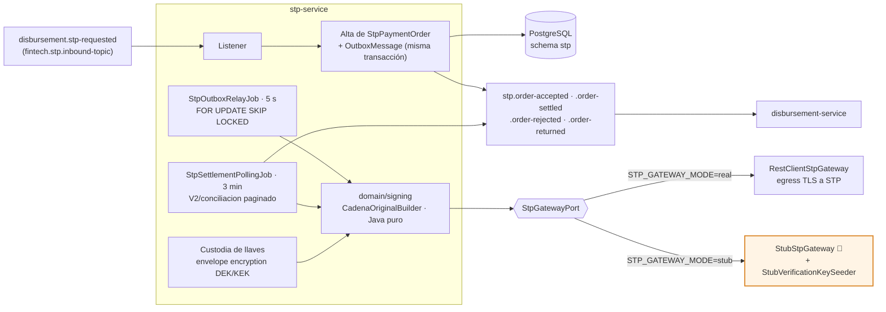
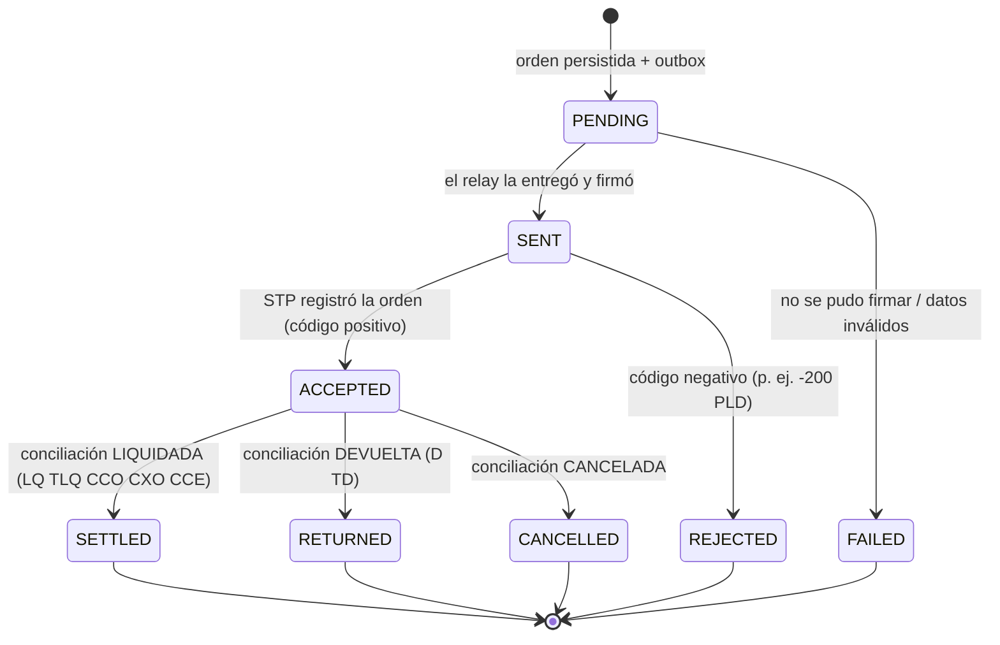
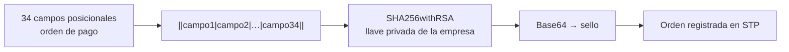
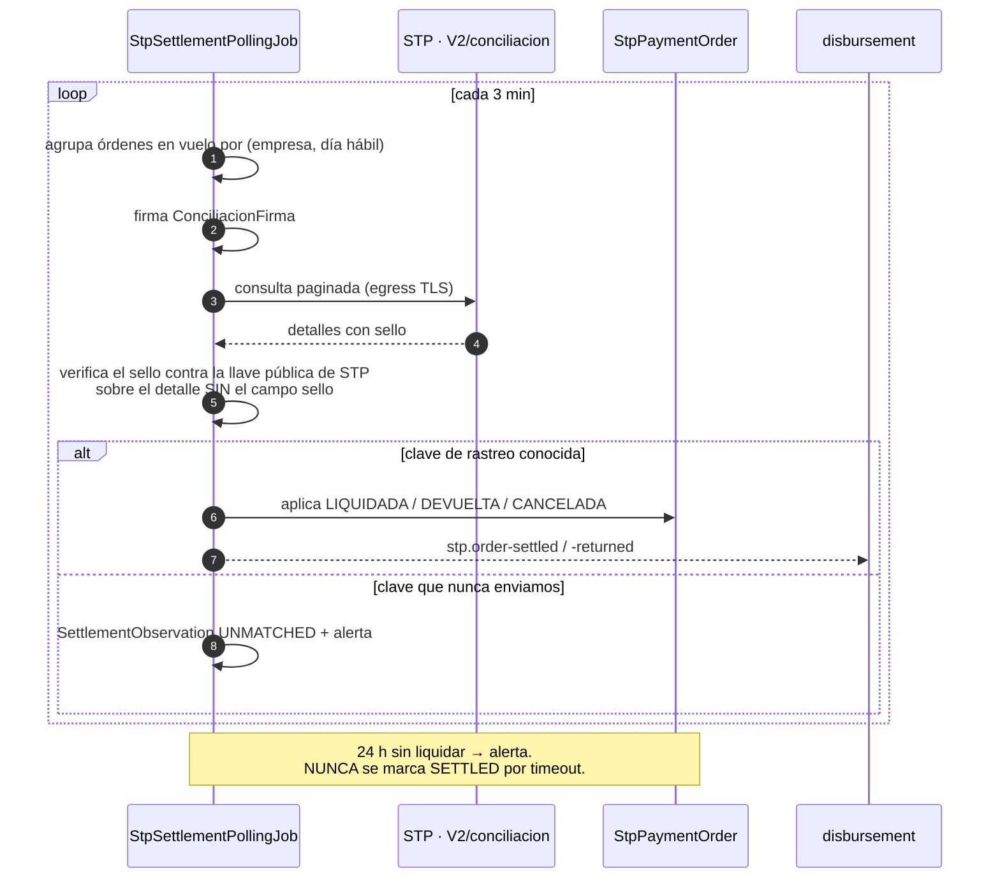
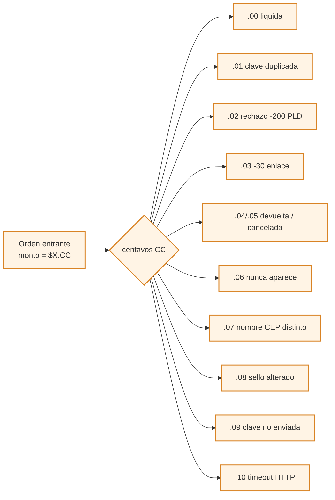

# stp-service (D12) — conector SPEI

**Anti-corruption layer con STP**, el proveedor de dispersión SPEI. Traduce órdenes de pago
genéricas al protocolo de STP: arma la cadena original, la firma con la llave de la empresa,
registra la orden y **consulta activamente** su liquidación.

> **Servicio interno, sin exposición a internet.** STP nunca llama a la plataforma. La única
> dirección hacia afuera es *egress* TLS iniciado por este servicio. **No hay webhooks**, no hay
> puerto abierto, no hay superficie de ingreso que proteger.

| | |
|---|---|
| **Puerto** | `8101` (bootRun) · `:8080` interno en Docker |
| **Schema** | `stp` · paquete `com.fintech.stp` |
| **Régimen Kafka** | **Backoff exponencial + DLT** — mueve dinero ([§5.4 raíz](../../README.md#54-política-de-reintentos-y-dlt-kafka)) |
| **Dominio** | [docs/dominios/11_stp_connector_domain.md](../../docs/dominios/11_stp_connector_domain.md) |

---

## Mapa del servicio



### Ciclo de una orden



`SENT` y `ACCEPTED` son los estados **en vuelo** (`isInFlight()`): los que el poller sigue
consultando. Todo lo demás es terminal.

---

## Qué NO sabe

No sabe qué es un desembolso, ni un crédito, ni una disposición. Consume una **orden de pago SPEI**
de un topic configurable (`fintech.stp.inbound-topic`) y publica el resultado. Puede extraerse a
otro repositorio **sin borrar un solo archivo**; lo verifica `StpDecouplingTest`.

---

## La firma — la pieza de mayor riesgo

`CadenaOriginalBuilder` construye la cadena posicional que STP firma. Es la parte donde un error de
un carácter significa que ningún pago sale, y por eso vive en `domain/signing` como **Java puro**:
sin Spring, sin JPA, probable sin levantar un contexto.



Para consulta de saldo son **3 campos**, y para conciliación **3** — mismo constructor, distinta
plantilla posicional.

Decisiones que no son negociables y están cubiertas por pruebas de vector dorado:

- **34 campos** para orden de pago, 3 para saldo y 3 para conciliación, en orden posicional exacto.
- Montos con `DecimalFormat("0.00")` y `Locale.ROOT` — el legado dependía del locale de la JVM.
- Fechas `yyyyMMdd`. Nulos → cadena vacía, nunca `"null"`.
- `nombreBeneficiario` se **trunca a 40 al construir la orden**, y se guarda el valor truncado
  aparte del completo. El legado firmaba el truncado y guardaba el completo, lo que después rompía
  la comparación contra el nombre del CEP.

## Bugs del legado que quedan cerrados

| | Qué pasaba | Qué lo cierra |
|---|---|---|
| **B1** | `-200` (`RECHAZO_POR_PLD`) pasaba como éxito porque el código comprobaba `length() == 4` | `BanxicoResponseCode.isAccepted()` usa el signo |
| **B7** | Nombre firmado truncado vs. nombre guardado completo | Se persisten los dos: `beneficiary_name` y `beneficiary_name_sent` |
| **B8** | Mapeo de estados incompleto (`TLQ`, `CCO`, `CXO`, `CCE`, `TD`, `TCL`) | `StpOrderStatusCode`, única fuente de verdad |

---

## Confirmación de liquidación: consulta, no webhook

Sin exposición a internet, la liquidación se confirma **preguntando**: un poller agrupa las órdenes
en vuelo por `(empresa, día hábil)`, firma una `ConciliacionFirma` y pagina `V2/conciliacion`.

Esto elimina toda la superficie de ingreso y hace gratis la autenticación del canal: somos nosotros
quienes abrimos la conexión TLS contra un host conocido.

Reglas que se aplican a cada observación:

- El **sello entrante se verifica** contra la llave pública de STP, sobre el detalle **sin el campo
  `sello`** — verificar contra un payload que contiene su propia firma es imposible por construcción.
- Una clave de rastreo que nunca enviamos entra como `UNMATCHED` y alerta. No se ignora.
- A las 24 h sin liquidar se alerta. **Nunca** se marca `SETTLED` por timeout.




---

### Punto abierto, dicho sin adornos

**La cadena exacta que STP firma en la respuesta de conciliación no está confirmada contra su
especificación.** Lo que hay implementado verifica contra el detalle serializado sin el `sello`, que
es una hipótesis razonable — probablemente STP firme una cadena posicional, como en el resto de su
API.

Por eso la política por defecto es `WARN`: se intenta verificar, y si falla (o no hay llave
registrada) la observación queda marcada `SIGNATURE_UNVERIFIED` y **el cambio de estado sí se
aplica**. La alternativa —bloquear contra una suposición— sería peor: dinero que ya salió del banco y
que este servicio nunca confirmaría.

**Antes de producción hay que pedirle a STP la especificación de ese sello, ajustar la cadena y
pasar la política a `ENFORCE`.** Es el único punto del diseño que depende de información que no
estaba en el repositorio legado.

---

## Custodia de llaves — multi-empresa desde el día uno

Cada empresa tiene su cuenta ordenante, su prefijo de clave de rastreo y su llave de firma. Las
llaves privadas se guardan con **envelope encryption**: una DEK AES-256-GCM por llave, cifrada con
una KEK que **nunca vive en la base de datos ni en el repositorio** (`STP_KEK_<id>`, gestor de
secretos en producción).

`StpCompanyKey` tiene un `toString()` deliberadamente pobre: ningún log accidental puede filtrar
material criptográfico.

---

## Stub para ambientes bajos

En local, CI y ambientes bajos no se habla con STP — pero el sustituto **no es un `return true`**.

**El stub devuelve lo que se le envió**, más lo único que sólo el banco puede saber (`estado`,
`tsLiquidacion`, `urlCEP`, `nombreCep`, `sello`). Y firma de verdad, con su propio par de llaves:
así la orden saliente ejercita `CadenaOriginalBuilder` completo y la observación entrante ejercita
la verificación de sello. Si alguien rompe la firma, revienta en local, no en producción.

Su llave pública se registra sola al arrancar como llave `VERIFICATION` de cada empresa
(`StubVerificationKeySeeder`). Sin ese paso el stub no serviría de nada: la verificación fallaría
siempre y ninguna orden llegaría nunca a liquidada en local.



Once escenarios deterministas **por los centavos del monto**:

| Centavos | Escenario | Qué ejercita |
|---|---|---|
| `.00` | Liquida | Camino feliz |
| `.01` | Clave de rastreo duplicada | Éxito idempotente, no error |
| `.02` | `-200` PLD | El bug B1 — debe terminar en rechazo |
| `.03` | `-30` enlace en consultas | Reintento, no rechazo terminal |
| `.04` / `.05` | Devolución / cancelación | Cierre por camino no feliz |
| `.06` | Nunca aparece | Alerta a 24 h, y **nunca** `SETTLED` |
| `.07` | Nombre del CEP distinto | Comparación de nombres |
| `.08` | Sello alterado | Verificación de firma |
| `.09` | Clave que nunca enviamos | `UNMATCHED` + alerta |
| `.10` | Timeout HTTP | Reintento desde el outbox |

> **Guarda de arranque:** el stub sólo arranca con perfiles de ambiente bajo
> (`local`, `dev`, `test`, `ci`, `docker`, `qa`, `staging`). Cualquier otro perfil —o ninguno—
> impide el arranque. Es lista blanca y no lista negra a propósito: el compose de este repo levanta
> con perfil `docker`, así que una lista negra de "prod" no habría protegido de promover ese mismo
> compose a producción. Un stub de
> pagos silenciosamente activo en producción es la peor clase de incidente: todo se ve verde y no
> sale un peso.

---

## Outbox transaccional

**Nunca** se llama a STP dentro de la transacción que persiste la orden. El relay toma lotes con
`FOR UPDATE SKIP LOCKED` y firma fuera de la transacción de persistencia. El legado tapaba la misma
carrera publicando todo con dos minutos de retardo programado.

Un `CLAVE_RASTREO_DUPLICADA` se trata como **éxito idempotente**, no como error: es exactamente la
respuesta que da STP cuando ya recibió la orden, y tratarla como fallo provocaría una doble
dispersión.

---

## API REST (operación interna)

No está publicada en el gateway: se consume desde la red interna, con el mismo modelo
*header-trust* del resto de servicios internos.

| Método | Ruta | Descripción |
|---|---|---|
| `GET` | `/api/v1/stp/payment-orders` | Órdenes, con filtros de operación |
| `GET` | `/api/v1/stp/payment-orders/{paymentRequestId}` | Detalle de una orden y su bitácora |
| `GET` | `/api/v1/stp/settlement-observations` | Observaciones de conciliación (incluidas las `UNMATCHED`) |
| `POST` | `/api/v1/stp/poll` | Forzar una vuelta del poller |

### Administración de empresas y llaves — `/api/v1/stp/companies`

| Método | Ruta | Descripción |
|---|---|---|
| `POST` · `GET` | `/` | Alta y listado de empresas |
| `POST` | `/{companyId}/ordering-accounts` | Cuenta ordenante de la empresa |
| `POST` · `GET` · `DELETE` | `/{companyId}/keys` · `/keys/{keyId}` | Custodia de llaves de firma y verificación |

---

## Configuración

| Variable | Default | Para qué |
|---|---|---|
| `STP_GATEWAY_MODE` | `stub` | `real` sólo en producción |
| `STP_INBOUND_TOPIC` | `disbursement.stp-requested` | Topic de entrada, configurable a propósito |
| `STP_CURRENT_KEK_ID` + `STP_KEK_<ID>` | `local` | Custodia de llaves. El material nunca se commitea |
| `STP_ACCOUNT_HASH_SALT` | — | Salt del HMAC con que se enmascara la cuenta antes de persistirla |
| `STP_POLLING_ENABLED` | `true` | Apagar el poller no pierde órdenes: quedan en vuelo |
| `STP_SIGNATURE_POLICY` | `WARN` | `ENFORCE` \| `WARN` \| `OFF` — ver abajo |

Generar una KEK: `openssl rand -base64 32`.

---

## Correr

```bash
./gradlew :stp-service:test          # firma (vectores dorados) + dominio + ArchUnit
./gradlew :stp-service:bootRun
docker compose up stp-service
```

---

## Sacarlo a otro repositorio

1. Copiar el módulo.
2. Apuntar `fintech.stp.inbound-topic` al topic del comprador.
3. Copiar `DomainException` en vez de depender de `:shared`.
4. Sustituir `JwtAuthenticationFilter` por el mecanismo de auth del comprador.

**Cero archivos borrados.**

---

Análisis completo, decisiones y plan: [`docs/ANALISIS_Y_PLAN_disbursement_stp.md`](../../docs/ANALISIS_Y_PLAN_disbursement_stp.md)
