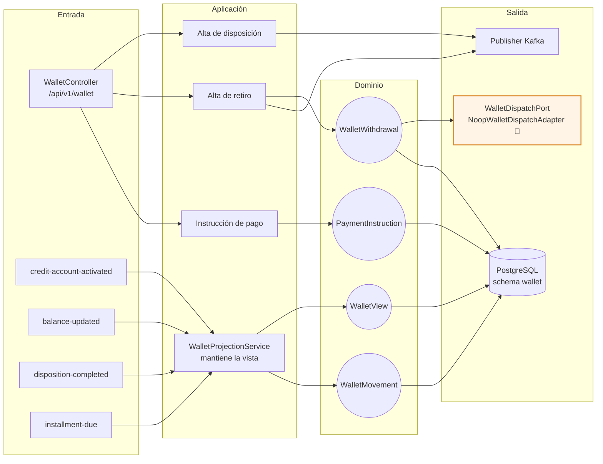
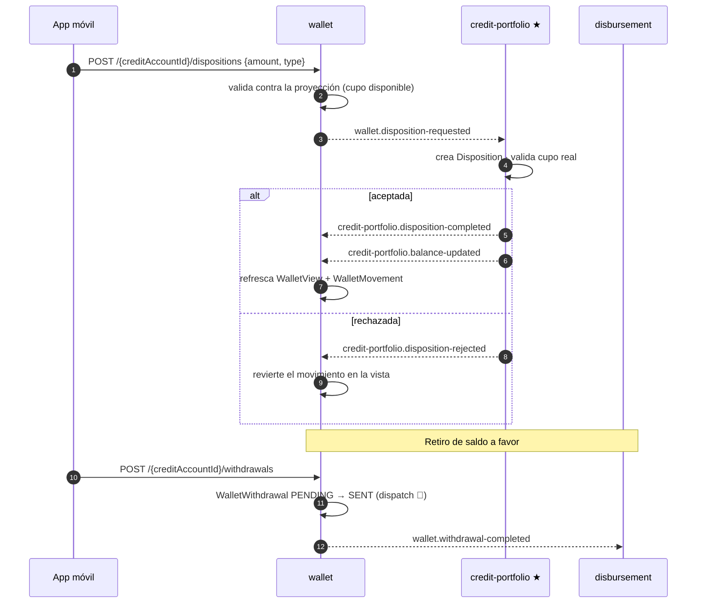
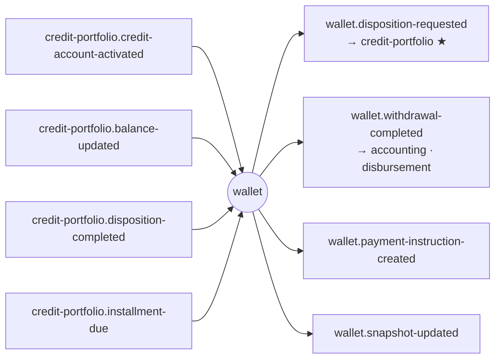

# wallet-service (D7)

**Monedero del cliente sobre una línea revolvente.** Dos cosas: una **proyección de saldo** para que
la app pinte la pantalla sin consultar cartera, y el **origen de las solicitudes** que salen de ahí
—disposiciones (uso propio o pago a terceros), retiros de saldo a favor e instrucciones de pago—.

**No es la fuente de verdad de los saldos.** Esa es
[credit-portfolio](../credit-portfolio-service/README.md). wallet es un read model más las
solicitudes que dispara.

| | |
|---|---|
| **Puerto** | `8092` (bootRun) · `:8080` interno en Docker |
| **Schema** | `wallet` |
| **Arquitectura** | Hexagonal + Spring Modulith |
| **Régimen Kafka** | Por defecto (sin DLT) |
| **Dominio** | [docs/dominios/07_wallet_domain.md](../../docs/dominios/07_wallet_domain.md) |

---

## 1. Mapa del servicio



---

## 2. Dominio

| Agregado | Rol | Estados |
|---|---|---|
| `WalletView` | Proyección del saldo por `creditAccountId`, alimentada por `balance-updated` | — |
| `WalletMovement` | Cada movimiento del monedero | — |
| `WalletWithdrawal` | Retiro del saldo a favor a una cuenta del cliente | `PENDING` → `SENT` \| `FAILED` |
| `PaymentInstruction` | Instrucción de pago creada desde el monedero | `PENDING` → `SENT` \| `CANCELLED` \| `EXPIRED` |

`PaymentType`: `MINIMUM` · `TOTAL` · `PARTIAL` · `SETTLEMENT`.
`PaymentMethod`: `SPEI` · `CODI` · `DOMICILIACION` · `VENTANILLA` · `TARJETA`.

> Si llega un `balance-updated` de una cuenta que wallet no conoce, se crea una `WalletView` mínima
> en vez de descartar el evento: un saldo visible que se corrige es mejor que un monedero vacío sin
> explicación.

---

## 3. Flujo de una disposición



> El camino `THIRD_PARTY_CREDIT` de la disposición **hoy se liquida en credit-portfolio** con el
> stub SPEI. Su ruta definitiva por disbursement (vía `credit-portfolio.disposition-authorized`) es
> el entregable **2B.2**: disbursement ya consume ese tópico, pero credit-portfolio todavía no lo
> emite. Ver [README raíz §5.3](../../README.md#53-catálogo-de-eventos-kafka-productor--consumidores-verificados).

---

## 4. API REST — `/api/v1/wallet`

| Método | Ruta | Descripción |
|---|---|---|
| `GET` | `/{creditAccountId}` | Saldo proyectado del monedero |
| `GET` | `/{creditAccountId}/movements` | Movimientos |
| `GET` | `/summary` | Agregado de monederos (tablero) |
| `POST` | `/{creditAccountId}/dispositions` | Disposición (`SELF_USE` / `THIRD_PARTY_CREDIT`) |
| `POST` | `/{creditAccountId}/withdrawals` | Retiro de saldo a favor |
| `POST` | `/{creditAccountId}/payment-instructions` | Instrucción de pago |

---

## 5. Dependencias externas y sus simuladores locales

| Dependencia real | Puerto de salida | Adaptador | Comportamiento |
|---|---|---|---|
| SPEI / CoDi (retiro a cuenta del cliente) | `WalletDispatchPort` | `NoopWalletDispatchAdapter` 🧪 | Confirma el retiro al instante con la referencia `WALLET-WD-STUB-XXXXXXXX` |

Es el mismo patrón que `NoopSpeiDispatchAdapter` en credit-portfolio: un puerto real con un
adaptador de mentira, para que el día que exista el rail sólo cambie el `@Component`.

---

## 6. Eventos Kafka



`payment-instruction-created` y `snapshot-updated` **no tienen consumidor hoy**: quedan como traza
para analítica y para el día que la app los necesite.

**Reintentos:** régimen por defecto, sin DLT.
Ver [README raíz §5.4](../../README.md#54-política-de-reintentos-y-dlt-kafka).

---

## 7. Persistencia y ejecución

Schema `wallet`, 7 changesets Liquibase bajo `db/changelog/wallet/`.

```bash
./gradlew :wallet-service:test
docker compose up -d wallet-service
```
